# API Architecture

> **Purpose:** Define the API architecture and design standards for Vaeloom
> **Status:** ✅ Upgraded to enterprise quality
> **Canonical source:** [`/Docs/Vaeloom-Complete-Documentation.md#132-api-structure`](../../Docs/Vaeloom-Complete-Documentation.md#132-api-structure)

## Request Lifecycle

```mermaid
sequenceDiagram
    participant C as 📱 Client
    participant GW as 🛡️ API Gateway
    participant M as 🔗 Middleware Stack
    participant H as 🎯 Route Handler
    participant AI as 🤖 AI Service
    participant DB as 💾 Database

    C->>GW: HTTPS Request<br/>api.Vaeloom.dev/v1/...
    GW->>GW: SSL termination<br/>Rate limiting check
    GW->>M: Forward to middleware

    Note over M: 1. Logger — structured request logging
    M->>M: Log: method, path, client_ip, timestamp

    Note over M: 2. Auth — JWT validation
    M->>M: Validate Bearer token<br/>Check expiry, signature
    alt Invalid token
        M-->>C: 401 Unauthorized
    end

    Note over M: 3. Permission Engine — scope check
    M->>M: Check required scopes<br/>vs user permissions
    alt Insufficient scope
        M-->>C: 403 Forbidden
    end

    Note over M: 4. Rate Limiter — token bucket
    M->>M: Consume token<br/>Check burst allowance
    alt Over limit
        M-->>C: 429 Too Many Requests<br/>+ Retry-After header
    end

    Note over M: 5. Validation — input schema
    M->>M: Validate body/params/query<br/>class-validator decorators
    alt Invalid input
        M-->>C: 400 Validation Error
    end

    M->>H: Route to handler

    alt CRUD Operation
        H->>DB: Query / write data
        DB-->>H: Result
        H-->>C: 200 JSON Response
    else Agent Request
        H->>AI: gRPC call<br/>with context + query
        AI-->>H: Agent response
        H-->>C: 200 JSON Response<br/>+ agent reasoning
    end

    H->>H: Publish event to bus<br/>(document.ingested, etc.)

```



> **Diagram:** Every API request flows through 5 middleware layers before reaching the handler. **Logger** captures structured request data. **Auth** validates the JWT. **Permission Engine** checks scope. **Rate Limiter** applies token bucket algorithm. **Validation** checks input schemas. After middleware, requests route to either a CRUD handler (queries database) or an agent request (gRPC to ai-service). Every handled request publishes an event.

---

## API Design

REST-first, resource-oriented design.

## Base URL

```text
https://api.Vaeloom.dev/v1/
```

## Resource Structure

```text
/workspaces/{workspace_id}/
├── documents
│   ├── /{id}
│   └── /{id}/versions
├── resume
│   └── /variants
├── applications
│   └── /{id}
├── connectors
│   └── /{id}
├── memory
│   ├── /graph
│   ├── /entities/{id}
│   └── /search
├── schedule
│   └── /events
└── chat
    └── /messages
```

## Common Patterns

| Pattern | Convention |
|---------|------------|
| List | `GET /resource?page=1&limit=20&sort=field:asc` |
| Get | `GET /resource/{id}` |
| Create | `POST /resource` |
| Update | `PATCH /resource/{id}` |
| Delete | `DELETE /resource/{id}` |
| Action | `POST /resource/{id}/action` |

## Error Response Format

```json
{
  "error": {
    "code": "NOT_FOUND",
    "message": "Document not found",
    "details": { "document_id": "doc_abc" }
  }
}
```

## Common Mistakes

| Mistake | Consequence |
|---------|-------------|
| Middleware ordering errors | Placing auth after rate limiting wastes resources authenticating requests that will be rejected — logger must always be first, validation last |
| Returning stack traces in error responses | Production error responses must never expose internal details — use structured error codes and log the full error server-side |
| Mixing CRUD and agent endpoints at the same path | REST endpoints (resource CRUD) and agent endpoints (AI inference) have different latency profiles and error semantics — keep them separate |
| Skipping event publishing on failures | Events should be published even for failed requests — monitoring needs error signals to detect systemic issues |

## Best Practices

| Practice | Why |
|----------|-----|
| Keep middleware stack order consistent: Logger → Auth → Permission → Rate Limit → Validation | Each middleware depends on the previous — auth must run before permission, rate limiting before validation (reject early, validate cheap work last) |
| Always include X-Request-Id in responses | Trace IDs are essential for debugging distributed requests — include them in every response and every log entry |
| Separate public and internal endpoints | Public API prefixes with /v1/ and internal service endpoints with /internal/ to apply different auth and rate limiting policies |
| Publish events for all state changes | Every create, update, or delete should publish an event — consumers (AI agents, analytics, notifications) depend on this stream |

## Security

| Concern | Mitigation |
|---------|------------|
| Skipping middleware layers | An API gateway or load balancer misconfiguration could route traffic around the middleware stack — enforce middleware ordering at the framework level, not by convention |
| Rate limit bypass via header manipulation | If rate limiting keys off a client-controlled header (like `X-Forwarded-For`), an attacker can bypass limits — rate limit by authenticated user_id, never by IP-derived headers alone |
| Auth middleware failure allowing unauthenticated requests | An unhandled exception in auth middleware should deny the request, not fall through — configure NestJS global guards to deny-by-default on errors |

## Performance

| Concern | Mitigation |
|---------|------------|
| Middleware latency accumulation | Each middleware adds processing time — the 5-layer stack adds 10-50ms per request. Monitor per-middleware latency to identify bottlenecks |
| Serialization overhead for JSON responses | Large nested JSON responses (agent reasoning traces, paginated lists) can take 100ms+ to serialize — use streaming or selective field serialization for heavy responses |
| Connection pool exhaustion under load | If each agent request holds a DB connection while waiting for an LLM response (500ms-5s), pools deplete quickly — use async non-blocking patterns and separate read/write pools |

## Goals

- Provide a consistent, REST-first API design that all services and clients can rely on
- Ensure every request passes through a complete security and validation middleware stack
- Maintain sub-200ms response times for CRUD resources under normal load
- Enable observability through structured logging, request tracing, and event publishing
- Support versioned API evolution without breaking existing clients

## Scope

**In Scope:**

- RESTful resource endpoints under /v1/ for documents, resumes, applications, connectors, memory, schedule, and chat
- 5-layer middleware stack covering logging, auth, permission, rate limiting, and validation
- Structured error response format with error codes, messages, and detail objects
- Standard pagination, sorting, and filtering on list endpoints
- Event publishing for all state-changing operations
- Internal gRPC endpoints for AI service communication

**Out of Scope:**

- WebSocket or Server-Sent Events for real-time streaming
- GraphQL or other query-language API layers
- Client SDK generation or API client libraries
- Third-party OAuth flow handling (delegated to auth provider)
- Batch or bulk operation endpoints

## Functional Requirements

| ID | Requirement | Priority |
|----|-------------|----------|
| FR-001 | API shall support standard CRUD operations on all resource types | Critical |
| FR-002 | API shall enforce JWT authentication on all protected endpoints | Critical |
| FR-003 | API shall validate request bodies against defined schemas | Critical |
| FR-004 | API shall return structured error responses with error codes | High |
| FR-005 | API shall publish events for all create, update, and delete operations | High |
| FR-006 | API shall support pagination with page, limit, and sort parameters | High |
| FR-007 | API shall include X-Request-Id in every response for tracing | Medium |
| FR-008 | API shall support PATCH partial updates on mutable resources | Medium |

## Non-Functional Requirements

| ID | Requirement | Target | Measurement |
|----|-------------|--------|-------------|
| NFR-001 | API response time shall not exceed 200ms for p95 | p95 < 200ms | Request latency percentile |
| NFR-002 | API uptime shall be 99.95% excluding planned maintenance | 99.95% | Monthly uptime calculation |
| NFR-003 | API shall handle 1000 requests per second | 1000 RPS | Load test throughput |
| NFR-004 | Middleware stack overhead shall not exceed 50ms | < 50ms aggregate | Per-middleware span timing |
| NFR-005 | API shall return error responses within 50ms for rejected requests | < 50ms | Fast-fail latency percentile |
| NFR-006 | API documentation shall be auto-generated and always current | OpenAPI 3.1 spec | Spec validation in CI |

## Components

| Component | Responsibility | Technology | Scale Strategy |
|-----------|---------------|------------|----------------|
| API Gateway | SSL termination, initial rate limiting, request routing | Cloudflare / ALB | Horizontal edge scaling |
| Middleware Stack | Logging, auth, permissions, rate limiting, validation | NestJS Guards | Stateless, horizontal scale |
| Resource Handlers | CRUD logic for each resource domain | NestJS Controllers + Services | Horizontal with connection pool |
| Event Publisher | State-change event dispatch | Redis/BullMQ | Redis Cluster for high throughput |
| gRPC Client | Internal calls to ai-service | @grpc/grpc-js | Persistent connection pool |
| Health Check | Liveness and readiness probes | NestJS Terminus | Included in every instance |

## Data Flow

1. **Request Reception** — HTTPS request arrives at API Gateway which terminates SSL, applies WAF rules, and forwards to a healthy NestJS instance
2. **Middleware Execution** — Request passes through 5-layer stack: Logger captures structured data, Auth validates JWT, Permission Engine checks scopes, Rate Limiter consumes token, Validation checks input schema
3. **Handler Processing** — Router dispatches to resource handler; CRUD handlers use TypeORM to query PostgreSQL; agent handlers call ai-service via gRPC
4. **Event Emission** — After successful processing, handler publishes a domain event to Redis event bus with resource type, action, and metadata
5. **Response Delivery** — Handler serializes response as JSON with appropriate HTTP status, includes X-Request-Id and Cache-Control headers, and returns to client

## Scalability

| Dimension | Current Limit | 10x Strategy | 100x Strategy |
|-----------|---------------|--------------|---------------|
| Request throughput | 1000 RPS | 10000 RPS with auto-scaling API instances | 100000 RPS with global load balancing |
| Concurrent connections | 500 simultaneous | 5000 with connection pooling | 50000 with HTTP/2 multiplexing |
| Middleware processing | 50ms per request | Profile and optimize heavy middleware | Move auth/permission to sidecar |
| Event publishing | 1000 events/sec | 10000 events/sec with Redis Cluster | 100000 events/sec with Kafka |
| Response serialization | 10ms per response | Stream large responses, field selection | Binary serialization (protobuf over HTTP) |

## Error Handling

| Error Scenario | Detection | Mitigation | Recovery |
|----------------|-----------|------------|----------|
| Invalid JWT token | JWT decode exception or signature mismatch | Return 401 with structured error | Client must re-authenticate and retry |
| Insufficient permissions | Permission Engine scope check fails | Return 403 with scopes required | Client requests elevated permissions |
| Rate limit exceeded | Token bucket empty for user | Return 429 with Retry-After header | Client waits and retries with backoff |
| Request body validation failure | class-validator constraint violations | Return 400 with field-level errors | Client fixes payload and retries |
| Upstream service unavailable | gRPC connection error or timeout | Return 503 with retry hint | Queue request or display degraded UI |
| Internal server error | Unhandled exception in handler | Return 500, log full error server-side | Engineering team investigates via Sentry |

## Monitoring

| Metric | Alert Threshold | Severity | Dashboard |
|--------|----------------|----------|-----------|
| p95 endpoint latency | > 500ms for 5 minutes | Critical | API Performance Overview |
| HTTP 5xx rate | > 1% of requests for 5 minutes | Critical | API Error Dashboard |
| HTTP 4xx rate | > 10% of requests for 5 minutes | Warning | Client Error Dashboard |
| Middleware per-layer latency | Any layer > 30ms for 5 minutes | Warning | Middleware Profiling |
| Event publishing success rate | < 99% for 5 minutes | Warning | Event Bus Dashboard |
| Requests without X-Request-Id | > 0 for 5 minutes | Info | API Standards Compliance |

## Configuration

| Variable | Purpose | Default | Required |
|----------|---------|---------|----------|
| API_PORT | HTTP listen port | 3000 | Yes |
| API_PREFIX | Global route prefix | /v1 | Yes |
| JWT_ISSUER | Expected JWT issuer claim | <https://auth.Vaeloom.dev> | Yes |
| JWT_AUDIENCE | Expected JWT audience claim | api.Vaeloom.dev | Yes |
| RATE_LIMIT_MAX | Max requests per window per user | 100 | No |
| RATE_LIMIT_WINDOW | Window duration in seconds | 60 | No |
| CORS_ORIGINS | Comma-separated allowed origins | <http://localhost:3000> | No |
| REQUEST_TIMEOUT | Max request processing time in ms | 30000 | No |
| LOG_BODY | Whether to log request bodies | false | No |

## Risks

| Risk | Likelihood | Impact | Mitigation |
|------|------------|--------|------------|
| Middleware ordering misconfiguration causing security bypass | Low | Critical | Framework-level enforcement, integration tests for security |
| API versioning causing client breakage | Medium | High | Maintain backward-compatible versions for 6 months |
| Rate limit bypass via header spoofing | Low | Medium | Key rate limiting on authenticated user_id, not client IP |
| Event publishing failures causing data loss | Medium | Medium | Queue events locally if Redis unavailable, retry on reconnect |
| OpenAPI spec drift from implementation | Medium | Low | Generate spec from code, validate in CI |

## Limitations

| Limitation | Impact | Workaround | Future Resolution |
|------------|--------|------------|-------------------|
| No batch operation endpoints | Clients must make N requests for N operations | Parallel HTTP requests from client | Add batch POST /batch endpoint |
| No server-side event streaming | Clients must poll for status updates | Client-side polling with backoff | Add SSE or WebSocket support |
| No response compression by default | Larger payload sizes over network | Enable gzip at ALB level | Native compression middleware |
| No API version negotiation | Clients hardcode version in URL | URL-based versioning (/v1/...) | Header-based content negotiation |

## Examples

```typescript
// Vaeloom API client initialization
import { VaeloomClient } from '@vaeloom/sdk';

const client = new VaeloomClient({
  baseURL: 'https://api.Vaeloom.ai/v1',
  apiKey: process.env.Vaeloom_API_KEY,
});
```

```python
# Async API request with Vaeloom backend
import httpx

async with httpx.AsyncClient(base_url="https://api.Vaeloom.ai/v1") as client:
    resp = await client.get("/workspaces", headers={"X-API-Key": "..."})
    print(resp.json())
```

```bash
# Curl example calling Vaeloom API
curl -X GET "https://api.Vaeloom.ai/v1/workspaces" \
  -H "X-API-Key: $Vaeloom_API_KEY" \
  -H "Content-Type: application/json"
```

## Future Improvements

| Improvement | Priority | Complexity | Timeline |
|-------------|----------|------------|----------|
| WebSocket support for real-time updates | High | Medium | Q3 2026 |
| Batch operation endpoints for bulk workflows | Medium | Low | Q2 2026 |
| GraphQL federation for flexible queries | Medium | High | Q1 2027 |
| API client SDK generation (TypeScript, Python) | Medium | Low | Q3 2026 |
| Server-Sent Events for streaming agent responses | Low | Medium | Q4 2026 |

## Related Documents

- [REST Standards.md](./REST-Standards.md)
- [Backend Architecture.md](./Backend-Architecture.md)
- [`/Docs/Vaeloom-Complete-Documentation.md#132-api-structure`](../../Docs/Vaeloom-Complete-Documentation.md#132-api-structure)
