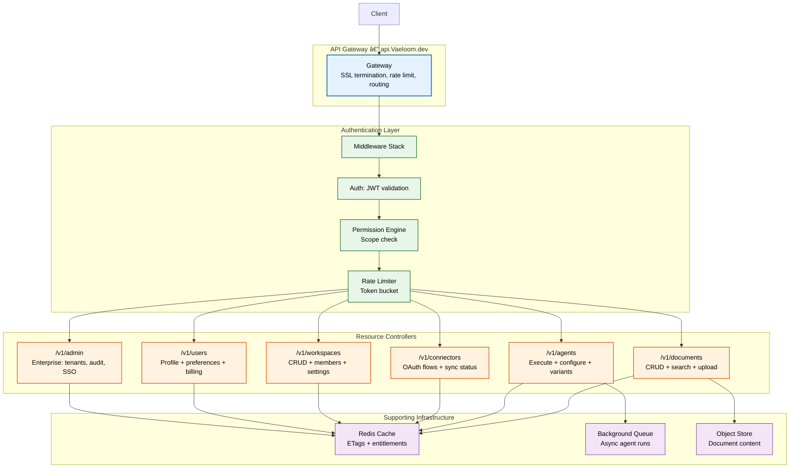
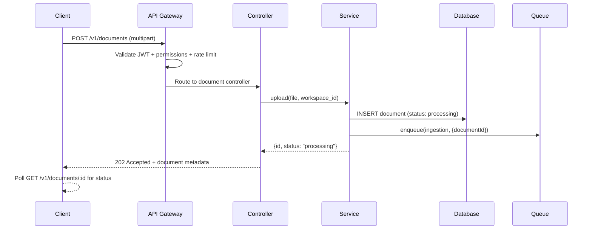

# API Reference

> **Purpose:** Complete OpenAPI 3.1 structured reference for all Vaeloom API endpoints, authentication, error handling, and rate limits
> **Status:** 🆕 New
> **Owner:** Backend Team
> **Last Updated:** 2026-07-13

## Overview

The Vaeloom API follows RESTful conventions over HTTPS at `https://api.Vaeloom.dev/v1`. All endpoints are documented in an OpenAPI 3.1 specification available at `/.well-known/openapi.json` for tooling integration (Postman, Insomnia, SDK generation).

This reference covers all resources: Documents, Agents, Connectors, Workspaces, Users, and Admin. Every endpoint requires authentication via Bearer JWT, with scoped access based on the Permission Engine.

## API Architecture



## Authentication

All endpoints require a Bearer JWT in the `Authorization` header:

```http
Authorization: Bearer <token>
```

### Token Types

| Token | Lifetime | Use Case |
|-------|----------|----------|
| Access Token | 15 minutes | Standard API requests |
| Refresh Token | 7 days | Obtain new access tokens |
| API Key | Configurable (30d–1yr) | Automated / CI integrations |
| Enterprise JWT (SAML) | Per-session | SAML/OIDC federated login |

### Token Scopes

```typescript
// Scopes follow the pattern: {resource}:{action}
const scopes = {
  'documents:read':       'Read documents',
  'documents:write':      'Create/update documents',
  'documents:delete':     'Delete documents',
  'agents:execute':       'Run agent actions',
  'agents:configure':     'Modify agent settings',
  'connectors:manage':    'Add/remove connectors',
  'workspaces:admin':     'Manage workspace settings',
  'admin:tenants':        'Manage enterprise tenants',
  'admin:audit':          'Read audit logs',
}
```

## Endpoint Reference

### Documents

```http
GET    /v1/documents                     # List documents (paginated)
POST   /v1/documents                     # Upload document
GET    /v1/documents/:id                 # Get document metadata
PUT    /v1/documents/:id                 # Update document metadata
DELETE /v1/documents/:id                 # Delete document (soft)
GET    /v1/documents/:id/content         # Download document content
POST   /v1/documents/:id/search          # Search within document
```

**List documents:**

```http
GET /v1/documents?workspace=ws_abc123&limit=20&cursor=next_cursor_xyz
```

```json
// Response
{
  "data": [
    {
      "id": "doc_abc123",
      "name": "resume_john_doe.pdf",
      "type": "application/pdf",
      "size": 245760,
      "status": "processed",
      "workspace_id": "ws_abc123",
      "created_at": "2026-07-13T10:00:00Z",
      "updated_at": "2026-07-13T10:05:00Z"
    }
  ],
  "pagination": {
    "next_cursor": "next_cursor_xyz",
    "has_more": true
  }
}
```

**Upload document:**

```http
POST /v1/documents
Content-Type: multipart/form-data

// Form fields:
// file: binary
// workspace_id: "ws_abc123"
```

```json
// Response (202 Accepted)
{
  "id": "doc_abc124",
  "status": "processing",
  "estimated_completion_ms": 2500
}
```

### Agents

```http
GET    /v1/agents                         # List available agents
GET    /v1/agents/:id                     # Get agent configuration
PUT    /v1/agents/:id                     # Update agent configuration
POST   /v1/agents/:id/execute            # Execute agent action
GET    /v1/agents/:id/runs               # List run history
GET    /v1/agents/runs/:run_id           # Get run result
```

**Execute agent:**

```http
POST /v1/agents/agent_resume/execute
Content-Type: application/json

{
  "workspace_id": "ws_abc123",
  "input": {
    "document_id": "doc_abc123",
    "job_description": "Senior software engineer at Acme Corp..."
  },
  "variant": "professional"
}
```

```json
// Response (202 Accepted)
{
  "run_id": "run_xyz789",
  "status": "queued",
  "estimated_completion_ms": 15000
}
```

**Get run result (poll):**

```json
// Response — GET /v1/agents/runs/run_xyz789
{
  "run_id": "run_xyz789",
  "status": "completed",
  "result": {
    "tailored_resume_url": "https://storage.Vaeloom.dev/...",
    "summary": "Resume optimized for Senior Software Engineer at Acme Corp. Added keywords: Kubernetes, distributed systems, team leadership.",
    "match_score": 87
  },
  "execution_ms": 12450,
  "created_at": "2026-07-13T10:00:00Z"
}
```

### Connectors

```http
GET    /v1/connectors                     # List connected integrations
POST   /v1/connectors                     # Initiate OAuth connection
DELETE /v1/connectors/:id                 # Disconnect integration
POST   /v1/connectors/:id/sync           # Trigger manual sync
GET    /v1/connectors/:id/status          # Get sync status
```

### Workspaces

```http
GET    /v1/workspaces                     # List user's workspaces
POST   /v1/workspaces                     # Create workspace
GET    /v1/workspaces/:id                 # Get workspace details
PUT    /v1/workspaces/:id                 # Update workspace
DELETE /v1/workspaces/:id                 # Delete workspace
POST   /v1/workspaces/:id/members        # Invite member
DELETE /v1/workspaces/:id/members/:uid   # Remove member
```

### Users

```http
GET    /v1/users/me                       # Current user profile
PUT    /v1/users/me                       # Update profile
GET    /v1/users/me/billing              # Billing info
PUT    /v1/users/me/preferences          # User preferences
```

### Enterprise Admin

```http
GET    /v1/admin/tenants                  # List enterprise tenants
POST   /v1/admin/tenants                  # Create tenant
GET    /v1/admin/tenants/:id              # Tenant details
PUT    /v1/admin/tenants/:id              # Update tenant config
GET    /v1/admin/audit-logs               # Query audit logs
POST   /v1/admin/audit-logs/export        # Export audit logs
```

## Error Handling

```json
// Standard error response
{
  "error": {
    "code": "rate_limit_exceeded",
    "message": "Too many requests. Please wait before retrying.",
    "details": {
      "retry_after_seconds": 30,
      "limit": 100,
      "window_seconds": 60
    },
    "request_id": "req_abc123"
  }
}
```

| Status | Error Code | Description |
|--------|-----------|-------------|
| 400 | `validation_error` | Invalid request body or parameters |
| 401 | `unauthorized` | Missing or invalid authentication |
| 403 | `forbidden` | Insufficient permissions for the resource |
| 404 | `not_found` | Resource does not exist |
| 409 | `conflict` | Resource conflict (e.g., duplicate name) |
| 422 | `unprocessable_entity` | Business logic violation |
| 429 | `rate_limit_exceeded` | Too many requests |
| 500 | `internal_error` | Unexpected server error |

## Rate Limits

| Tier | Requests/min (burst) | Concurrency | Scope |
|------|---------------------|-------------|-------|
| Free | 60 (10) | 5 | Per user |
| Pro | 300 (50) | 20 | Per user |
| Enterprise | 1000 (200) | 100 | Per tenant |
| API Key | Configurable | As configured | Per key |

## Best Practices

| Practice | Rationale |
|----------|----------|
| Use cursor-based pagination | Cursor pagination remains stable when new items are inserted — unlike offset pagination which can skip/duplicate results |
| Implement exponential backoff | Retry 429 responses with `Retry-After` header; use jitter to avoid thundering herd |
| Send `Idempotency-Key` for mutation requests | Prevents duplicate agent runs and document uploads on network retry |
| Use conditional requests with ETags | Cache document metadata and agent configurations client-side; saves bandwidth and reduces server load |

## Common Mistakes

| Mistake | Consequence | Fix |
|---------|-------------|-----|
| Polling for agent results too aggressively | Rate limit consumption increases; UI appears sluggish | Use WebSocket streaming or webhooks for agent results; poll at most every 3s |
| Ignoring pagination cursors | Results truncated at default 20-item page; missing data in bulk operations | Always iterate using the `next_cursor` field until `has_more` is false |
| Caching authenticated responses without `Authorization` key in cache key | User A sees User B's documents | Include user ID and Authorization hash in cache key; never cache across users |
| Sending full document body in search request | Increased latency and bandwidth; document body already known server-side | Send only `document_id` for existing documents; search endpoint uses stored content |

## Security Considerations

| Concern | Mitigation |
|---------|-----------|
| JWT token theft | Short-lived access tokens (15m); refresh tokens stored in HTTP-only secure cookies; revoked on password change |
| API key exposure | Keys scoped to minimal required permissions; can be rotated independently; logged on every use |
| IDOR (Insecure Direct Object Reference) | Every resource ID validated against user's workspace membership server-side; no user/workspace ID in client can access resources outside their scope |
| Uploaded file validation | File type verified via magic bytes (not extension); size limits enforced; malware scanning via ClamAV |
| Rate limit bypass | Rate limits enforced at gateway (per IP, per user, per API key); distributed Redis-backed token bucket |

## Performance Considerations

| Concern | Mitigation |
|---------|-----------|
| Slow document processing | Document upload returns 202 immediately; processing happens asynchronously; webhook notifies on completion |
| Heavy search payloads | Search results paginated; full-text search uses indexed content (Elasticsearch), not raw document parsing |
| Large file downloads | Direct-to-S3 presigned URLs for document content; API never proxies file bytes |
| Agent execution latency | Agent runs queued and executed on dedicated workers; result polling via WebSocket push; timeout at 5 minutes |
| Connection pooling | GraphQL Apollo Server connection pooling to PostgreSQL (max 20); connection acquisition <5ms |

---

## Goals

1. **Standardize API access** — Provide a single, consistent RESTful interface for all Vaeloom clients (web app, mobile, AI agents, third-party integrations)
2. **Enable self-service integration** — Document every endpoint with request/response schemas so external developers and AI agents can integrate without source code access
3. **Define security and rate-limit boundaries** — Specify auth requirements, scope permissions, and rate limits so clients know exactly how to interact safely
4. **Support OpenAPI 3.1 tooling** — Expose a machine-readable spec at `/.well-known/openapi.json` for automated SDK generation, Postman collections, and API gateway validation

---

## Scope

### In Scope

- All REST endpoints under `https://api.Vaeloom.dev/v1/` covering Documents, Agents, Connectors, Workspaces, Users, and Admin
- Authentication via Bearer JWT with scope-based access control
- Rate limiting tiered by subscription plan (Free, Pro, Enterprise)
- Error responses with structured error codes and request IDs
- Pagination, filtering, and sorting standards

### Out of Scope

- WebSocket endpoints for real-time agent streaming (separate specification)
- Internal RPC endpoints between microservices
- GraphQL schema (evaluated as future addition)
- Deprecated version 0.x endpoints (removed in v1 launch)

---

## Functional Requirements

| ID | Requirement | Priority |
|----|-------------|----------|
| F-001 | API SHALL support cursor-based pagination for list endpoints with `cursor` and `limit` parameters | P0 |
| F-002 | API SHALL return structured error responses with `error.code`, `error.message`, and `error.details` | P0 |
| F-003 | API SHALL validate all mutation requests against a JSON Schema before processing | P0 |
| F-004 | API SHALL return `202 Accepted` for asynchronous operations (document upload, agent execution) | P0 |
| F-005 | API SHALL support `Idempotency-Key` header for at-least-once delivery guarantees | P1 |
| F-006 | API SHALL expose an OpenAPI 3.1 specification at `/.well-known/openapi.json` | P1 |

---

## Non-Functional Requirements

| ID | Requirement | Target |
|----|-------------|--------|
| NF-001 | API response time (p95) | < 200ms for read endpoints, < 5s for async operations |
| NF-002 | API availability | 99.9% uptime (excluding planned maintenance) |
| NF-003 | Rate limit accuracy | Within 5% of configured limit under burst conditions |
| NF-004 | JSON response serialization | < 50ms for responses up to 100KB |
| NF-005 | API Gateway connection pool | > 1000 concurrent connections per gateway node |

---

## Workflows

1. **Document Upload Flow:** Client POSTs file → API returns 202 with document ID → Ingestion queue processes OCR/extraction → Webhook notifies on completion → Document status becomes `processed`
2. **Agent Execution Flow:** Client POSTs agent execution with input → API returns 202 with run ID → Agent queued on dedicated worker → Worker executes agent logic → Result stored → Client polls or receives WebSocket push with result
3. **Connector Sync Flow:** Client triggers sync → API enqueues sync job → Worker fetches external data → Data is deduplicated and classified → Memory Agent extracts entities → Sync status updated

---

## Sequence Diagrams


> **Diagram:** Document upload flow — API Gateway validates auth/permissions, controller delegates to service, service persists with `processing` status, enqueues async ingestion, returns 202 immediately.

---

## Data Flow

```text
1. Client sends HTTPS request to api.Vaeloom.dev/v1/{resource}
2. API Gateway terminates SSL and extracts client IP
3. Gateway validates Bearer JWT, extracts user_id and workspace_id
4. Gateway checks Permission Engine for requested scope
5. Gateway applies token bucket rate limit based on subscription tier
6. Request routed to appropriate resource controller
7. Controller validates request body (class-validator)
8. Service layer executes business logic (CRUD, agent execution, etc.)
9. Response serialized as JSON with standard envelope
10. Rate limit headers attached (X-RateLimit-Limit, X-RateLimit-Remaining)
11. All errors caught by global exception filter → structured error response
```

---

## APIs

| Resource | Base Path | Available Endpoints |
|----------|-----------|---------------------|
| Documents | `/v1/documents` | List, Create, Get, Update, Delete, Download Content, Search |
| Agents | `/v1/agents` | List, Get, Update, Execute, List Runs, Get Run Result |
| Connectors | `/v1/connectors` | List, Create (OAuth), Delete, Trigger Sync, Get Status |
| Workspaces | `/v1/workspaces` | List, Create, Get, Update, Delete, Manage Members |
| Users | `/v1/users` | Get Profile, Update Profile, Billing, Preferences |
| Admin | `/v1/admin` | Tenants CRUD, Audit Logs Query, Audit Logs Export |

---

## Database

| Table | API Relevance | Key Fields Queried by API |
|-------|---------------|---------------------------|
| `documents` | All document CRUD and search endpoints | id, workspace_id, path, type, status, raw_storage_key |
| `agent_runs` | Agent execution and status polling | id, agent_id, workspace_id, status, result (jsonb), created_at |
| `connectors` | Connector management and sync endpoints | id, workspace_id, type, scopes, status, last_synced_at |
| `workspaces` | Workspace CRUD and membership | id, user_id, name, created_at |
| `users` | User profile and preferences | id, email, auth_provider, preferences (jsonb) |

---

## Scalability

| Dimension | Current Limit | 10x Strategy | 100x Strategy |
|-----------|---------------|--------------|---------------|
| Concurrent API requests | 500 per gateway node | Horizontal scaling with auto-scaling groups | Multi-region active-active deployment |
| Document upload throughput | 50 MB/s per gateway | Direct-to-S3 presigned URLs bypass API | Edge upload acceleration with CDN |
| API response caching | Per-endpoint ETags | Redis shared cache for document metadata | CDN caching with cache tags per workspace |
| Endpoint count | 35 endpoints | Modular controller loading per domain | GraphQL federation gateway |

---

## Monitoring

| Metric | Alert Threshold | Severity | Dashboard |
|--------|-----------------|----------|-----------|
| P95 response time | > 500ms | Warning | API Gateway > Response Times |
| P99 response time | > 2s | Critical | API Gateway > Response Times |
| Error rate (5xx) | > 1% | Critical | API Gateway > Error Rates |
| 429 rate limit hits | > 100/min per user | Info | API Gateway > Rate Limiting |
| Gateway CPU | > 80% | Warning | API Gateway > Resources |
| Active connections | > 90% of max | Critical | API Gateway > Connections |

---

## Deployment

| Environment | Method | Trigger | Verification |
|-------------|--------|---------|--------------|
| Development | Docker Compose with hot reload | Git push to feature branch | `make test-api` passes full suite |
| Staging | Kubernetes deployment (2 replicas) | PR merged to main | Canary 10% traffic for 5 min, verify no error increase |
| Production | Kubernetes deployment (4+ replicas) | Tagged release via CI/CD | Blue-green deployment with automated rollback on 5xx spike |

---

## Configuration

| Variable | Purpose | Default | Required |
|----------|---------|---------|----------|
| `API_PORT` | HTTP listen port | 3000 | Yes |
| `API_RATE_LIMIT_DEFAULT` | Default rate limit (req/min) | 60 | Yes |
| `API_RATE_LIMIT_BURST` | Burst limit multiplier | 3x | No |
| `API_BODY_SIZE_LIMIT` | Max request body size | 10MB | Yes |
| `API_REQUEST_TIMEOUT` | Request timeout | 30000 (ms) | Yes |
| `API_CORS_ORIGINS` | Allowed CORS origins | * (dev only) | Yes |

---

## Limitations

| Limitation | Impact | Workaround | Future Resolution |
|------------|--------|------------|-------------------|
| Pagination limited to 100 items per page | Large bulk operations require multiple requests | Use cursor-based pagination with `has_more` flag | Increase per-page limit with configurable max |
| File upload limited to 10MB via API | Large documents (videos, datasets) cannot be uploaded | Use direct-to-S3 presigned URL upload for files > 10MB | Implement multipart upload for files up to 5GB |
| No WebSocket native support in API spec | Real-time agent streaming not supported | Poll GET /v1/agents/runs/:id endpoint | Add WebSocket gateway for real-time updates |

---

## Examples

```typescript
// List all documents in a workspace
const documents = await Vaeloom.documents.list({
  workspaceId: 'ws_abc123',
  limit: 50,
  offset: 0,
});

for (const doc of documents) {
  console.log(doc.title, doc.status);
}
```

```python
# Upload a document to Vaeloom
from Vaeloom import Client

client = Client(api_key="...")
doc = client.documents.upload(
    workspace_id="ws_abc123",
    file_path="./resume.pdf",
    metadata={"source": "email"},
)
print(doc.id, doc.status)
```

```bash
# Create a new workspace
curl -X POST "https://api.Vaeloom.ai/v1/workspaces" \
  -H "X-API-Key: $Vaeloom_API_KEY" \
  -H "Content-Type: application/json" \
  -d '{"name": "Q3 Hiring", "settings": {"auto_organize": true}}'
```

## Future Improvements

| Improvement | Priority | Complexity | Timeline |
|-------------|----------|------------|----------|
| WebSocket support for real-time agent streaming | High | Medium | Q4 2026 |
| OpenAPI 3.1 specification auto-generation from TypeScript types | High | Low | Q3 2026 |
| API versioning with sunset headers and migration guides | Medium | Medium | Q4 2026 |
| GraphQL gateway for public plugin SDK | Low | High | Q1 2027 |
| Self-service API key management portal | Medium | Low | Q3 2026 |

---

## Related Documents

- [API Architecture.md](./API-Architecture.md)
- [Authentication.md](./Authentication.md)
- [Authorization.md](./Authorization.md)
- [Rate Limiting.md](./Rate-Limiting.md)
- [REST Standards.md](./REST-Standards.md)
