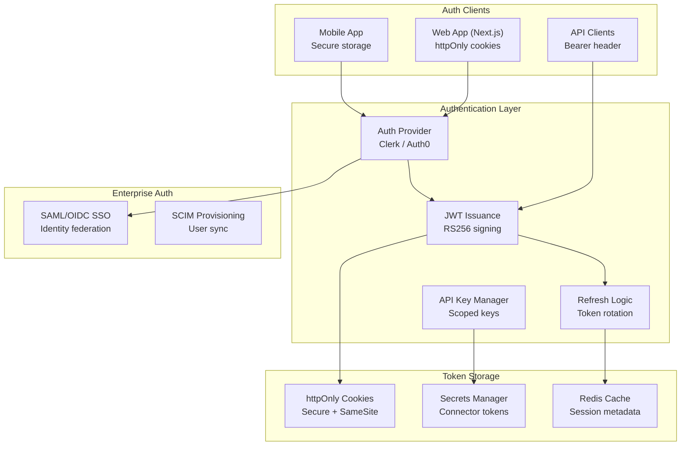

# Authentication

> **Purpose:** Define the authentication strategy for Vaeloom
> **Canonical source:** [`/Docs/06-Vaeloom-Enterprise-Paper.md#191-authentication--access`](../../Docs/06-Vaeloom-Enterprise-Paper.md#191-authentication--access)

## Auth Strategy

| Environment | Method | Provider |
|-------------|--------|----------|
| MVP | Email/password + OAuth | Managed auth provider (Clerk/Auth0) |
| Enterprise | + SAML/OIDC SSO | Same provider, enterprise tier |

## Auth Flows

### Login & API Call Flow

The following sequence diagram shows the complete authentication flow — from user login through OAuth, JWT issuance, to an authenticated API call with automatic token refresh:

```mermaid
sequenceDiagram
    participant User as "👤 User"
    participant Web as "🌐 Web App<br/>Next.js"
    participant Auth as "🔐 Auth Provider<br/>Clerk / Auth0"
    participant API as "⚙️ API Service<br/>NestJS"
    participant Sec as "🔑 Secrets Manager"

    %% ── LOGIN PHASE ──
    User->>Web: Click "Sign in with Google"
    Web->>Auth: Redirect to OAuth consent
    Auth->>User: Google login page
    User->>Auth: Approve permissions
    Auth->>Web: Authorization code
    Web->>Auth: Exchange code for tokens
    Auth-->>Web: ID Token + Access Token + Refresh Token
    Web->>Web: Store tokens (httpOnly cookies)
    Web-->>User: Redirect to dashboard

    Note over Web,Auth: Session established (24h access + 30d refresh)

    %% ── API CALL PHASE ──
    User->>Web: Request dashboard data
    Web->>API: GET /api/dashboard<br/>Authorization: Bearer JWT
    API->>API: Validate JWT signature + expiry
    API->>API: Extract user ID & claims from JWT payload
    API->>API: Check Permission Engine (ABAC)
    API-->>Web: 200 OK + dashboard data
    Web-->>User: Render dashboard

    Note over Web,API: Permission Engine evaluates Subject × Resource × Action × Context

    %% ── TOKEN REFRESH PHASE ──
    Web->>API: GET /api/documents<br/>Authorization: Bearer EXPIRED_JWT
    API-->>Web: 401 Unauthorized
    Web->>Auth: POST /oauth/token (refresh_token)
    Auth-->>Web: New Access Token
    Web->>API: GET /api/documents (retry)<br/>Authorization: Bearer NEW_JWT
    API-->>Web: 200 OK + documents
    Web-->>User: Show documents

    %% ── CONNECTOR OAUTH PHASE ──
    User->>Web: "Connect Gmail"
    Web->>API: POST /connectors/gmail/auth
    API->>Auth: Initiate OAuth with Gmail scopes
    Auth-->>Web: Redirect to Gmail consent
    User->>Auth: Approve Gmail scopes<br/>(read-only)
    Auth-->>API: OAuth tokens for Gmail
    API->>Sec: Store encrypted tokens
    API-->>Web: Gmail connected
    Web-->>User: ✅ Gmail connected

    Note over API,Sec: Connector tokens stored in Secrets Manager, never in DB
```



### Flow Descriptions

| Flow | Step-by-Step | Key Detail |
|------|-------------|------------|
| **Login** | Redirect → Consent → Code → Token Exchange → Session | OAuth PKCE flow; tokens stored in httpOnly cookies |
| **API Call** | JWT in Authorization header → Validate → Permission Check → Response | `workspace_id` extracted from JWT, never from request body |
| **Token Refresh** | 401 → Refresh endpoint → New JWT → Retry | Refresh token rotation; old token invalidated on use |
| **Connector OAuth** | UI trigger → Initiate → User consent → Token storage | Scoped per-connector tokens; read-only by default |

## Session Management

| Type | Duration | Storage | Rotation |
|------|----------|---------|----------|
| Access token (JWT) | 24 hours | HTTP-only cookie, `SameSite=Strict` | None (short-lived) |
| Refresh token | 30 days | Secure, httpOnly cookie | Rotated on each use |
| API key | Custom | Header `Authorization: Bearer <key>` | Manual revoke |
| Connector OAuth token | Varies per provider | Secrets Manager (encrypted) | Per-provider refresh |

## Security Considerations

| Concern | Mitigation |
|---------|------------|
| Passwords | Never stored — delegated entirely to auth provider |
| OAuth tokens | Stored in Secrets Manager, never in DB or logs |
| Session hijacking | httpOnly + Secure + SameSite cookies; short-lived JWTs |
| Token leakage | Bearer tokens never in URL params; only in headers |
| Cross-tenant access | `workspace_id` extracted from JWT, never from request body |
| Privilege escalation | Session rotated on role/permission change |
| Brute force | Rate limiting on all auth endpoints |

## Common Mistakes

| Mistake | Consequence |
|---------|-------------|
| Storing JWTs in localStorage | Accessible to XSS attacks — use httpOnly, Secure, SameSite cookies for web clients |
| Not rotating refresh tokens | A leaked refresh token gives permanent access — rotate on each use and invalidate the previous one |
| Extracting workspace_id from request body | A user could send another workspace's ID — workspace_id must come from the JWT claims, never from user input |
| Skipping rate limiting on auth endpoints | Login endpoints without rate limiting are vulnerable to brute force attacks — apply strict per-IP and per-account limits |

## Best Practices

| Practice | Why |
|----------|-----|
| Use OAuth PKCE flow for SPA clients | The authorization code with PKCE prevents authorization code interception attacks — never use implicit flow |
| Short-lived access tokens, longer-lived refresh tokens | 24h access + 30d refresh with rotation limits the blast radius of a leaked token |
| Issue a new session on role/permission changes | Old tokens with stale permissions must be invalidated — force re-login on privilege changes |
| Log all authentication events | Successful logins, failed attempts, and token refreshes should all be logged for security auditing |

## Performance

| Concern | Mitigation |
|---------|------------|
| JWT verification latency on every request | Asymmetric key (RS256) verification is 10-100x slower than symmetric (HS256) — cache the JWKS response and verify with the local public key to avoid network calls per request |
| Token refresh creating write contention | Every token refresh triggers a DB write to rotate the refresh token — batch rotations during quiet hours and use Redis for refresh token storage to reduce DB load |
| Session lookup on every API call | If session state is stored in the database, every API call incurs a 2-5ms query — cache session metadata in Redis with a short TTL to eliminate this round trip |

---

## Goals

1. **Seamless user authentication** — Provide a frictionless login experience via OAuth (Google, Microsoft, GitHub) with automatic token refresh
2. **Multi-environment auth strategy** — Support email/password + OAuth for MVP and SAML/OIDC SSO for enterprise tenants
3. **Secure session management** — Ensure tokens are stored with httpOnly cookies, rotated on use, and revoked on permission changes
4. **Audit-ready authentication** — Log every login, token refresh, and failed attempt for security analysis

---

## Scope

### In Scope

- User login via OAuth providers (Google, Microsoft, GitHub) with PKCE flow
- JWT access token (24h) + refresh token (30d with rotation) session management
- API key authentication for automated/CI integrations
- Enterprise SAML/OIDC SSO integration (Phase 7)
- Connector OAuth token lifecycle (scoped, encrypted storage)

### Out of Scope

- Password management (delegated entirely to auth provider)
- Multi-factor authentication (planned for enterprise phase)
- Biometric authentication (device-level, handled by client)
- Custom identity provider hosting

---

## Functional Requirements

| ID | Requirement | Priority |
|----|-------------|----------|
| F-001 | System SHALL authenticate users via OAuth 2.0 with PKCE flow | P0 |
| F-002 | System SHALL issue JWT access tokens with 24h expiry and refresh tokens with 30d expiry | P0 |
| F-003 | System SHALL support Bearer token authentication via `Authorization` header | P0 |
| F-004 | System SHALL rotate refresh tokens on each use, invalidating the previous token | P0 |
| F-005 | System SHALL support API key authentication with configurable expiry (30d–1yr) | P1 |
| F-006 | System SHALL integrate with SAML/OIDC SSO providers for enterprise tenants | P2 |

---

## Non-Functional Requirements

| ID | Requirement | Target |
|----|-------------|--------|
| NF-001 | JWT verification time | < 5ms p95 (RS256 with cached JWKS) |
| NF-002 | Token refresh latency | < 200ms p95 |
| NF-003 | Auth provider availability | 99.9% uptime (Clerk/Auth0 SLA) |
| NF-004 | Session invalidation propagation | < 30 seconds across all API nodes |
| NF-005 | Login flow completion time | < 3 seconds p95 (including OAuth redirect) |

---

## Architecture



> **Diagram:** Authentication architecture — Web and mobile clients authenticate via Clerk/Auth0 with OAuth; API clients use JWT access tokens. Enterprise layer adds SAML/OIDC SSO and SCIM provisioning. Tokens stored in httpOnly cookies (web), secure storage (mobile), or Secrets Manager (connector tokens). Session metadata cached in Redis for fast lookup.

---

## Components

| Component | Technology | Responsibility |
|-----------|------------|----------------|
| Auth Provider | Clerk / Auth0 | OAuth flows, user identity, session management |
| JWT Service | NestJS + jsonwebtoken | Token issuance, RS256 signing, JWKS caching |
| Refresh Service | NestJS + Redis | Token rotation, invalidation, refresh grant |
| API Key Manager | NestJS + PostgreSQL | Key generation, scope assignment, rotation |
| Enterprise SSO | SAML/OIDC library | Identity federation, SCIM provisioning |
| Secrets Manager | AWS Secrets Manager / HashiCorp Vault | Encrypted storage of connector OAuth tokens |

---

## Data Flow

```text
1. User initiates login via OAuth (Google, Microsoft, GitHub)
2. Auth provider redirects to OAuth consent screen
3. User authorizes; auth provider returns authorization code
4. Web app exchanges code for ID token + access token + refresh token
5. Auth provider returns tokens; web app stores in httpOnly cookies
6. For API calls: JWT extracted from cookie, attached as Bearer header
7. API validates JWT signature (cached JWKS), extracts user_id + workspace_id
8. Permission Engine evaluates scope against requested resource
9. On 401: refresh flow triggered — refresh token exchanged for new access token
10. On password change / permission change: all sessions invalidated
```

---

## APIs

| Endpoint | Method | Description |
|----------|--------|-------------|
| `/v1/auth/login` | POST | Initiate OAuth login (returns redirect URL) |
| `/v1/auth/callback` | GET | OAuth callback handler (exchanges code for tokens) |
| `/v1/auth/refresh` | POST | Refresh access token using refresh token |
| `/v1/auth/logout` | POST | Invalidate current session |
| `/v1/auth/api-keys` | POST | Generate new API key |
| `/v1/auth/api-keys` | GET | List user's API keys |
| `/v1/auth/api-keys/:id` | DELETE | Revoke an API key |

---

## Database

| Table | Purpose | Key Columns |
|-------|---------|-------------|
| `sessions` | Active session metadata | id, user_id, refresh_token_hash, expires_at, created_at |
| `refresh_tokens` | Refresh token rotation chain | id, user_id, token_hash, previous_token_hash, expires_at, rotated_at |
| `api_keys` | Scoped API keys | id, user_id, key_hash, name, scopes[], expires_at, last_used_at |
| `connector_tokens` | Encrypted OAuth tokens for connectors | id, connector_id, encrypted_token, token_type, expires_at |

---

## Scalability

| Dimension | Current Limit | 10x Strategy | 100x Strategy |
|-----------|---------------|--------------|---------------|
| Concurrent logins | 100/s | Auth provider auto-scales (Clerk/Auth0 managed) | Multi-region auth provider deployment |
| Active sessions | 100K | Redis cluster with 3 nodes | Redis cluster with read replicas per region |
| API key operations | 1K/s | PostgreSQL read replicas for key validation | Local key cache with periodic sync |
| Token refresh rate | 500/s | Refresh token rotation in Redis (no DB write) | Distributed refresh with idempotency keys |

---

## Error Handling

| Scenario | Detection | Mitigation | Recovery |
|----------|-----------|------------|----------|
| Expired JWT | 401 response from API | Client triggers refresh flow automatically | New access token issued; request retried |
| Invalid refresh token | Refresh endpoint returns 400 | Clear all client-side tokens; redirect to login | User re-authenticates |
| Auth provider outage | Token validation fails with 5xx | Fallback to cached JWKS keys | Retry with backoff; alert on-call if down > 30s |
| Token replay (stolen token) | Same token used from different IP/location | Force session invalidation; notify user | User re-authenticates; audit log reviewed |

---

## Monitoring

| Metric | Alert Threshold | Severity | Dashboard |
|--------|-----------------|----------|-----------|
| Login success rate | < 95% | Critical | Auth > Login Success Rate |
| Token refresh failure rate | > 5% | Warning | Auth > Token Refresh |
| Auth provider latency | > 1s p95 | Warning | Auth > Provider Latency |
| Session creation rate | > 1000/min | Info | Auth > Session Volume |
| Failed login attempts per user | > 10 in 5 min | Warning | Auth > Brute Force Detection |
| API key usage by key | > 1000 req/min per key | Info | Auth > API Key Usage |

---

## Deployment

| Environment | Method | Trigger | Verification |
|-------------|--------|---------|--------------|
| Development | Clerk dev environment + local JWT service | Git push | Login flow works with test OAuth app |
| Staging | Clerk staging environment + deployed API | PR merged to main | Automated auth test suite passes (login → call → refresh → logout) |
| Production | Clerk production (multi-region) + auto-scaled API | Tagged release via CI/CD | Canary: 10% traffic verify login success rate > 99% |

---

## Configuration

| Variable | Purpose | Default | Required |
|----------|---------|---------|----------|
| `AUTH_JWT_SECRET` | RS256 private key for signing | — | Yes (production) |
| `AUTH_JWT_EXPIRY` | Access token lifetime | 24h | Yes |
| `AUTH_REFRESH_EXPIRY` | Refresh token lifetime | 30d | Yes |
| `AUTH_API_KEY_MAX_AGE` | Max API key validity | 365d | No |
| `AUTH_SESSION_CACHE_TTL` | Redis cache TTL for session data | 300s | No |
| `AUTH_PROVIDER_URL` | Clerk/Auth0 tenant URL | — | Yes |

---

## Limitations

| Limitation | Impact | Workaround | Future Resolution |
|------------|--------|------------|-------------------|
| No MFA support in MVP | Accounts protected only by OAuth provider security | Rely on auth provider's built-in MFA if available | Add TOTP/WebAuthn MFA in enterprise phase |
| Session invalidation is eventual (up to 30s) | Revoked user retains access briefly | Set short JWT expiry (24h) and cache TTL | Add WebSocket push for immediate invalidation |
| No SCIM provisioning in MVP | Enterprise user provisioning is manual | Admin can invite users via workspace UI | Add SCIM 2.0 for automated user provisioning |
| Connector tokens stored per-provider schema | Token refresh logic varies by provider | Abstract token refresh behind common interface | Standardize OAuth token storage with provider-agnostic schema |

---

## Examples

```typescript
// Authenticate with API key
import { VaeloomAuth } from '@vaeloom/auth';

const auth = new VaeloomAuth();
const token = await auth.loginWithApiKey({
  apiKey: process.env.Vaeloom_API_KEY,
});
```

```python
# OAuth 2.0 token exchange
from Vaeloom.auth import OAuthClient

oauth = OAuthClient(
    client_id="...",
    client_secret="...",
    token_url="https://auth.Vaeloom.ai/oauth/token",
)
token = oauth.get_token(scope="workspace:read documents:write")
```

```bash
# Get access token using client credentials
curl -X POST "https://auth.Vaeloom.ai/oauth/token" \
  -H "Content-Type: application/x-www-form-urlencoded" \
  -d "grant_type=client_credentials&client_id=$CLIENT_ID&client_secret=$CLIENT_SECRET"
```

## Future Improvements

| Improvement | Priority | Complexity | Timeline |
|-------------|----------|------------|----------|
| Multi-factor authentication (TOTP, WebAuthn) | High | Medium | Q1 2027 |
| SCIM 2.0 user provisioning for enterprise | High | Medium | Q4 2026 |
| Session management dashboard (view active sessions, force logout) | Medium | Low | Q3 2026 |
| Biometric authentication for mobile clients | Low | Medium | Q2 2027 |
| Passwordless magic link login | Medium | Low | Q3 2026 |

---

## Related Documents

- [Authorization.md](./Authorization.md)
- [Security Architecture](../Security/Security-Architecture.md)
- [`/Docs/06-Vaeloom-Enterprise-Paper.md#191-authentication--access`](../../Docs/06-Vaeloom-Enterprise-Paper.md#191-authentication--access)
