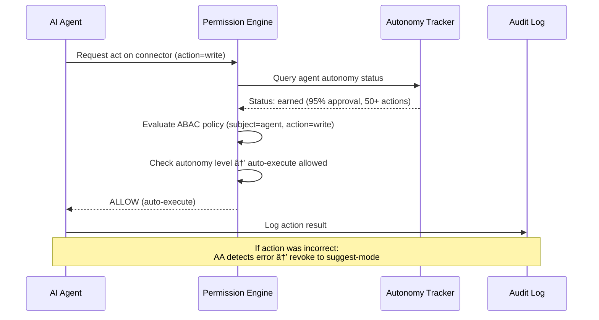

# Authorization

> **Purpose:** Define the authorization model for Vaeloom
> **Canonical source:** [`/Docs/06-Vaeloom-Enterprise-Paper.md#193-permission-engine`](../../Docs/06-Vaeloom-Enterprise-Paper.md#193-permission-engine)

## Authorization Architecture

```mermaid
graph TD
    classDef layer fill:#e3f2fd,stroke:#1565c0,color:#000,stroke-width:2px
    classDef level fill:#e8f5e9,stroke:#2e7d32,color:#000,stroke-width:1.5px
    classDef autonomy fill:#fff3e0,stroke:#e65100,color:#000,stroke-width:1.5px

    subgraph PermissionEngine["🛡️ Permission Engine (ABAC)"]
        direction TB
        P1["Subject (who)<br/>User ID · Agent name · Role"]
        P2["Resource (what)<br/>Document · Memory · Connector"]
        P3["Action (how)<br/>Read · Write · Act · Delete"]
        P4["Context (when/where)<br/>Time · IP · Workspace"]
    end

    subgraph Levels["📊 Permission Levels"]
        L1["Read-only<br/>Can view data"]
        L2["Suggest<br/>Can propose changes"]
        L3["Act<br/>Can execute autonomously"]
        L4["Full<br/>Can do anything within scope"]
    end

    subgraph Hierarchy["🔗 Permission Hierarchy"]
        H1["User → Workspace → Connectors<br/>→ Permissions per (Connector × Agent × Action)"]
    end

    subgraph Autonomy["🤖 Agent Autonomy Model"]
        A1["Default: Suggest-mode<br/>Propose → User approves"]
        A2["Earned: Auto-execute<br/>95%+ approval over 50 actions"]
        A3["Revoked: Return to suggest<br/>Single incorrect autonomous action"]
    end

    PermissionEngine --> Levels --> Hierarchy --> Autonomy

    class P1,P2,P3,P4 layer
    class L1,L2,L3,L4 level
    class H1 hierarchy
    class A1,A2,A3 autonomy
```



> **Diagram:** Authorization model — **Permission Engine** evaluates 4 ABAC attributes (Subject, Resource, Action, Context) → **4 permission levels** (Read → Suggest → Act → Full) → **hierarchy** (User→Workspace→Connector→Perm) → **agent autonomy model** (Default suggest → Earned auto-execute → Revoked on error).

---

## Authorization Model

Vaeloom uses a **Permission Engine** that implements **Attribute-Based Access Control (ABAC)** under the hood (see [`ABAC.md`](./ABAC.md) for the detailed policy model). Every request — user or agent — is evaluated against four attribute categories:

| Attribute Category | Description | Examples |
|-------------------|-------------|---------|
| Subject (who) | User/Agent identity and role | User ID, Agent name, role claims |
| Resource (what) | Resource type, owner, workspace | Document, memory record, connector scope |
| Action (how) | Operation being performed | Read, Write, Act, Delete |
| Context (when/where) | Environment and conditions | Time of day, IP range, workspace membership |

## Permission Levels

| Level | Meaning | Examples |
|-------|---------|---------|
| Read-only | Can view data | ATS Agent reading resume |
| Suggest | Can propose changes | Organization Agent proposing file moves |
| Act | Can execute autonomously | Scheduler Agent creating reminders |
| Full | Can do anything within scope | Memory Agent writing to knowledge graph |

## Permission Hierarchy

```text
User → Workspace → Connectors → Permissions per (Connector × Agent × Action)
```

## Agent Autonomy Model

| Stage | Behavior | Threshold |
|-------|----------|-----------|
| Default | Suggest-mode — propose, user approves | None |
| Earned | Auto-execute for proven action types | 95%+ approval over 50 actions |
| Revoked | Return to suggest-mode | Single incorrect autonomous action |

## Common Mistakes

| Mistake | Consequence |
|---------|-------------|
| Applying authorization only at the API layer | Authorization must also be enforced at the data layer — an RPC call from a compromised service bypasses API-level checks |
| Permission levels that are too broad | "Full" access to a connector scope may include actions the agent shouldn't take — each permission level should have a specific allowed action list |
| Caching authorization decisions too aggressively | User roles or permissions can change — cached decisions lead to stale authorization for minutes after an admin revokes access |
| Mixing ABAC and RBAC without a clear bridge | ABAC (attribute evaluation) and RBAC (role assignment) serve different purposes — define how roles map to attribute conditions explicitly |

## Best Practices

| Practice | Why |
|----------|-----|
| Enforce authorization at every layer | API gateway, service layer, and data access layer must each perform their own authorization check — defense in depth |
| Use the principle of least privilege | Every agent and user starts with the minimum permissions needed — escalate only when a demonstrated need exists |
| Log every authorization decision | Denied requests are critical for debugging access issues and detecting potential attacks |
| Test the authorization matrix with every deployment | A permission matrix covering all (Subject, Resource, Action, Context) combinations should be part of CI/CD |

## Security

| Concern | Mitigation |
|---------|------------|
| Authorization bypass via internal RPC | If the Permission Engine is enforced only at the API gateway, internal RPC calls between services bypass authorization — enforce the engine at every service boundary |
| Permission escalation through context manipulation | An attacker who controls a context attribute (e.g., claiming a different workspace_id) can escalate privileges — workspace_id must come from the JWT, not the request body |
| Stale authorization decisions due to caching | Cached permission decisions may serve stale results minutes after an admin revokes a user's access — cache with short TTLs and invalidate on permission changes |

## Performance

| Concern | Mitigation |
|---------|------------|
| Permission evaluation on every request | Evaluating ABAC policies involves fetching attributes from multiple sources — cache evaluated permissions per (user, resource, action) for the duration of the request |
| Policy rule explosion slowing evaluation | Hundreds of ABAC rules evaluated linearly slow every request — compile policies into a decision tree keyed by (action, resource_type) for O(1) matching |
| Attribute fetch latency from distributed sources | Fetching subject attributes from the auth provider and resource attributes from the resource service adds network hops — batch attribute fetches in a single round trip |

---

## Goals

1. **Unified authorization model** — Provide a single Permission Engine that governs all access decisions for both human users and AI agents
2. **Least-privilege by default** — Every subject starts with minimum permissions; escalate only when need is demonstrated via the autonomy model
3. **Agent-safe autonomy** — Allow agents to earn auto-execute privileges through proven reliability, with instant revocation on error
4. **Auditable decision trail** — Every authorization decision, whether allowed or denied, must be logged with full context

---

## Scope

### In Scope

- ABAC-based permission evaluation for all resource types (documents, memory, connectors, agents)
- Four permission levels: Read-only, Suggest, Act, Full
- Agent autonomy model with earned auto-execute and instant revocation
- Permission hierarchy: User → Workspace → Connector → Permissions per (Connector × Agent × Action)
- Integration with Permission Engine for policy evaluation

### Out of Scope

- User and role management (handled by auth provider and RBAC layer)
- Authentication token issuance and session management
- Network-level access policies (firewall, IP allow-lists)
- Rate limiting and API quotas

---

## Functional Requirements

| ID | Requirement | Priority |
|----|-------------|----------|
| F-001 | System SHALL evaluate authorization using 4 attribute categories: Subject, Resource, Action, Context | P0 |
| F-002 | System SHALL support 4 permission levels: Read-only, Suggest, Act, Full | P0 |
| F-003 | System SHALL enforce agent autonomy model with suggest → auto-execute → revoke lifecycle | P0 |
| F-004 | System SHALL evaluate permissions at every service boundary (API, RPC, event bus) | P0 |
| F-005 | System SHALL support permission hierarchy: User → Workspace → Connector → (Connector × Agent × Action) | P1 |

---

## Non-Functional Requirements

| ID | Requirement | Target |
|----|-------------|--------|
| NF-001 | Authorization evaluation latency | < 15ms p95 including attribute fetch |
| NF-002 | Authorization cache hit ratio | > 90% for repeated access patterns |
| NF-003 | Autonomy model accuracy | < 1% false auto-execute decisions |
| NF-004 | Authorization log retention | 90 days in hot storage, 1 year in archive |
| NF-005 | Policy propagation delay | < 30 seconds across all API nodes |

---

## Sequence Diagrams



> **Diagram:** Authorization with autonomy — Agent requests `act` permission; Permission Engine checks autonomy tracker, evaluates ABAC policy, and allows auto-execute for earned agents. Errors trigger automatic revocation to suggest-mode.

---

## Data Flow

```text
1. Request arrives at any service boundary with subject identity
2. Service calls Permission Engine with (subject, resource_id, action, context)
3. PE checks autonomy tracker for agent subjects (earned/revoked status)
4. PE fetches subject attributes from auth provider
5. PE fetches resource attributes from resource service
6. PE evaluates ABAC policies against all attributes + autonomy status
7. If autonomous agent with earned status and action matches: auto-allow
8. If suggest-mode agent: allow only read/suggest actions, queue for user approval
9. Decision returned to service with expiry TTL
10. Every decision logged to audit trail with full context
```

---

## APIs

| Endpoint | Method | Description |
|----------|--------|-------------|
| `/v1/permissions/evaluate` | POST | Evaluate authorization for a single (subject, resource, action) tuple |
| `/v1/permissions/levels` | GET | List all permission levels and their capabilities |
| `/v1/permissions/hierarchy` | GET | Get permission hierarchy for a workspace |
| `/v1/permissions/autonomy` | GET | Query agent autonomy status (suggest/earned/revoked) |
| `/v1/permissions/autonomy` | PUT | Update agent autonomy configuration (workspace admin) |

---

## Database

| Table | Purpose | Key Columns |
|-------|---------|-------------|
| `permission_assignments` | Explicit permission grants per (subject, resource_scope, level) | id, subject_id, scope_type (workspace/connector), scope_id, permission_level, granted_by, expires_at |
| `autonomy_tracker` | Agent autonomy state machine | id, agent_id, workspace_id, status (suggest/earned/revoked), approval_count, total_actions, last_action_at |
| `autonomy_votes` | User approval/disapproval history for agent suggestions | id, action_id, voter_id, decision (approve/deny), voted_at |
| `authorization_audit` | Append-only authorization decision log | id, subject_id, resource_id, action, decision, context_snapshot (jsonb), evaluated_at |

---

## Scalability

| Dimension | Current Limit | 10x Strategy | 100x Strategy |
|-----------|---------------|--------------|---------------|
| Permission evaluations | 1,000/s per node | Horizontal scaling with stateless PE nodes | Local permission cache with Redis-backed invalidation |
| Autonomy tracker entries | 10K agents | Shard autonomy data by agent_id | Autonomous agent registry with lazy loading |
| Authorization audit volume | 500K decisions/day | Partition audit log by date | Archive to cold storage after 90 days |
| Permission level granularity | 4 levels | Add resource-type-specific sub-levels | Dynamic permission level framework |

---

## Error Handling

| Scenario | Detection | Mitigation | Recovery |
|----------|-----------|------------|----------|
| Permission Engine unavailable | Request returns 5xx or timeout | Fall back to cached permission decision (stale-by-5min) | Retry with backoff; alert on-call |
| Ambiguous permission levels (subject has multiple) | Subject assigned to two levels with conflicting scope | Resolve to least-privileged level automatically | Log conflict; admin reviews assignment |
| Autonomy tracker inconsistency | Approval count vs. total actions mismatch | Recalculate from autonomy_votes table | Background job reconciles nightly |
| Attribute source failure | Auth provider or resource service timeout | Use cached attributes if available; deny if attributes missing | Alert; re-evaluate when source recovers |

---

## Monitoring

| Metric | Alert Threshold | Severity | Dashboard |
|--------|-----------------|----------|-----------|
| Authorization decision latency | > 15ms p95 | Warning | Authorization > Latency |
| Autonomy revocation rate | > 5% of auto-execute actions | Warning | Authorization > Autonomy |
| Denied requests rate | > 10% of total | Info | Authorization > Decisions |
| Permission cache hit ratio | < 85% | Warning | Authorization > Cache |
| Unresolved permission conflicts | > 0 | Critical | Authorization > Conflicts |

---

## Deployment

| Environment | Method | Trigger | Verification |
|-------------|--------|---------|--------------|
| Development | Permission Engine as NestJS module | Git push | Unit tests pass for all permission levels |
| Staging | Deployed with API service | PR merged to main | Integration tests: all (subject, resource, action) combinations |
| Production | Distributed PE nodes (4+ replicas) | Tagged release via CI/CD | Canary: verify decision parity against known test matrix |

---

## Configuration

| Variable | Purpose | Default | Required |
|----------|---------|---------|----------|
| `AUTHZ_EVALUATION_TIMEOUT` | Max time for permission evaluation | 1000ms | Yes |
| `AUTHZ_CACHE_TTL` | Cached permission decision TTL | 300s | Yes |
| `AUTHZ_AUTONOMY_APPROVAL_THRESHOLD` | Approval % for earned autonomy | 0.95 | Yes |
| `AUTHZ_AUTONOMY_MIN_ACTIONS` | Minimum actions before earning auto-execute | 50 | Yes |
| `AUTHZ_AUDIT_RETENTION_DAYS` | Audit log retention in hot storage | 90 | No |

---

## Limitations

| Limitation | Impact | Workaround | Future Resolution |
|------------|--------|------------|-------------------|
| Permission levels are not resource-type-specific | "Full" access to documents means same level as "Full" to connectors | Define per-resource-type allowed action lists | Add resource-type-aware sub-levels |
| Autonomy is a binary state (earned/not) | Graduated trust levels not supported | Use action-type-based earned status (read earned ≠ write earned) | Continuous trust scoring with graduated autonomy |
| No cross-workspace authorization | Users with multiple workspaces have separate permission contexts | User switches workspace explicitly in UI | Add workspace-context delegation |
| Authorization not enforced at data layer for direct DB access | Internal tools or scripts bypass permission checks | Use database roles matching service identity | Enforce RLS with permission context propagation |

---

## Examples

```typescript
// Check user permissions on a resource
import { authorize } from '@vaeloom/auth';

const isAuthorized = await authorize({
  userId: 'user_42',
  resourceId: 'doc_99',
  action: 'delete',
});
```

```python
# Assign a role to a user
from Vaeloom.access_control import RoleManager

rm = RoleManager()
rm.assign_role(user_id="user_42", role="editor", scope="workspace:ws_abc123")
```

```bash
# List permissions for a user
curl -X GET "https://api.Vaeloom.ai/v1/users/user_42/permissions" \
  -H "X-API-Key: $Vaeloom_API_KEY"
```

## Future Improvements

| Improvement | Priority | Complexity | Timeline |
|-------------|----------|------------|----------|
| Resource-type-aware permission sub-levels | High | Medium | Q1 2027 |
| Continuous trust scoring for agent autonomy | Medium | High | Q2 2027 |
| Cross-workspace permission delegation | Medium | Medium | Q4 2026 |
| Data-layer authorization enforcement via RLS | High | Medium | Q3 2026 |
| Permission simulation sandbox for admins | Low | Low | Q4 2026 |

---

## Related Documents

- [Authentication.md](./Authentication.md)
- [RBAC.md](./RBAC.md)
- [`/Docs/06-Vaeloom-Enterprise-Paper.md#193-permission-engine`](../../Docs/06-Vaeloom-Enterprise-Paper.md#193-permission-engine)
