# Backend Architecture

> **Purpose:** Define the backend architecture for Vaeloom
> **Status:** ✅ Upgraded to enterprise quality
> **Owner:** Backend Team
> **Last Updated:** 2026-07-13
> **Canonical source:** [`/Docs/Vaeloom-Complete-Documentation.md#43-backend`](../../Docs/Vaeloom-Complete-Documentation.md#43-backend)

## Architecture Overview

```mermaid
graph TD
    classDef front fill:#e3f2fd,stroke:#1565c0,color:#000,stroke-width:2px
    classDef api fill:#e8f5e9,stroke:#2e7d32,color:#000,stroke-width:1.5px
    classDef ai fill:#fff3e0,stroke:#e65100,color:#000,stroke-width:1.5px
    classDef infra fill:#f3e5f5,stroke:#6a1b9a,color:#000,stroke-width:1.5px
    classDef mw fill:#ffebee,stroke:#c62828,color:#000,stroke-width:1px

    subgraph Frontend["🌐 Frontend"]
        WEB["Next.js App<br/>SSR + Client"]
    end

    subgraph Backend["⚙️ apps/api — NestJS"]
        direction TB
        B1["Router<br/>Resource endpoints"]

        subgraph Middleware["🔗 Middleware Stack (order)"]
            direction TB
            M1["1. Logger<br/>Structured request logging"]
            M2["2. Auth<br/>JWT validation + session"]
            M3["3. Permission Engine<br/>Scope checking"]
            M4["4. Rate Limiter<br/>Token bucket / user"]
            M5["5. Validation<br/>class-validator schemas"]
        end

        B2["CRUD Handlers<br/>Documents, resumes,\napplications, connectors"]
        B3["Event Publisher<br/>All actions → Event Bus"]
    end

    subgraph AIService["🧠 apps/ai-service — FastAPI"]
        A1["Agent Runtime<br/>Memory, RAG, tools"]
        A2["Model Router<br/>Haiku / Sonnet / GPT-4o"]
    end

    subgraph Data["💾 Data Layer"]
        PG["( PostgreSQL<br/>+ AGE + pgvector )"]
        REDIS["( Redis<br/>Cache + Queue )"]
        EVENTS["📨 Event Bus<br/>Redis → Kafka"]
    end

    WEB -->|REST HTTPS| B1
    B1 --> M1 --> M2 --> M3 --> M4 --> M5
    M5 --> B2 & B3
    B2 -->|gRPC internal| A1
    A1 --> A2
    B2 --> PG & REDIS
    A1 --> PG & REDIS
    B3 --> EVENTS
    EVENTS -.->|async triggers| A1

    class WEB front
    class B1,B2,B3 api
    class M1,M2,M3,M4,M5 mw
    class A1,A2 ai
    class PG,REDIS,EVENTS infra

```



> **Diagram:** The backend splits into two services communicating over internal gRPC. **apps/api** (NestJS) runs a 5-layer middleware stack — Logger → Auth → Permission → Rate Limit → Validation — before routing to CRUD handlers or gRPC calls to the AI service. **apps/ai-service** (FastAPI) runs the agent runtime and model router. Both services share PostgreSQL, Redis, and the event bus. Events published by api can asynchronously trigger AI service actions.

---

The backend consists of two services communicating over an internal RPC boundary:

| Service | Technology | Responsibility |
|---------|------------|---------------|
| `apps/api` | NestJS + TypeScript | Auth, CRUD, permissions, event publishing |
| `apps/ai-service` | FastAPI + Python | Agents, memory, RAG, model routing |

## Service Communication

```text
Frontend → apps/api (REST) → apps/ai-service (Internal RPC)
                                ↓
                          PostgreSQL + Redis + Claude API
```

## Request Lifecycle

```text
1. HTTP Request → API Gateway
2. Auth Middleware (JWT validation)
3. Permission Engine (check scope, agent, action)
4. Route to handler (CRUD or agent request)
5. If agent → RPC call to ai-service
6. Response → client
7. Event published to event bus
```

## Middleware Stack

| Middleware | Order | Purpose |
|------------|-------|---------|
| Logger | 1 | Structured request logging |
| Auth | 2 | JWT validation, session |
| Permission | 3 | Scope checking |
| Rate Limit | 4 | Per-user rate limiting |
| Validation | 5 | Input schema validation |

## Common Mistakes

| Mistake | Consequence |
|---------|-------------|
| Tight coupling between api and ai-service | Direct HTTP calls between the two services create synchronization dependencies — changes to ai-service can break api without warning |
| Letting the middleware stack grow unchecked | Adding middleware for "one-off" concerns creates a bloated pipeline — every request pays the latency cost of all middleware, even irrelevant ones |
| Using the database as a message queue | Polling the database for new work creates contention and misses — use Redis/BullMQ for queues, PostgreSQL for data |
| Ignoring the event bus until it's critical | Events like "document.ingested" are consumed by multiple agents — skipping events from the start means retrofitting them later at high cost |

## Best Practices

| Practice | Why |
|----------|-----|
| Communicate between services via a well-defined gRPC contract | Internal RPC with protobuf schemas gives type safety and versioning — REST between internal services adds unnecessary overhead |
| Keep the middleware stack lean and ordered | Only add middleware that applies to every request — endpoint-specific logic belongs in guards or interceptors, not the global middleware stack |
| Use the event bus for cross-service communication | API publishes events → AI service subscribes — this decouples the services and allows multiple consumers without API changes |
| Separate read and write workloads | Commands (writes) and queries (reads) have different scaling requirements — separate them early to avoid contention |

## Security

| Concern | Mitigation |
|---------|------------|
| Unauthenticated gRPC calls between api and ai-service | Without mutual TLS or service mesh auth, any compromised container can call ai-service directly — enforce mTLS between backend services and use short-lived service tokens |
| Event bus injection attacks | If events published by api are consumed by ai-service without validation, an attacker can inject malicious events via compromised API endpoints — validate event payloads at every consumer |
| Data layer access without authorization | Backend services accessing PostgreSQL or Redis directly bypass the Permission Engine — enforce row-level security and separate service accounts per service |

## Performance

| Concern | Mitigation |
|---------|------------|
| gRPC serialization overhead for small payloads | gRPC with protobuf adds serialization cost that can exceed the payload size for simple CRUD responses — use REST for read-heavy workloads and reserve gRPC for streaming agent responses |
| Database connection pool contention between services | Both api and ai-service share the same PostgreSQL pool — if ai-service holds connections during LLM calls (500ms+), api starves. Use separate pools with dedicated connection limits |
| Service communication latency under load | Internal RPC between api and ai-service adds 5-20ms per call — batch multiple agent requests into a single RPC call when possible and use persistent gRPC connections |

## Goals

- Establish a modular two-service architecture (apps/api and apps/ai-service) that enables independent scaling and deployment
- Maintain sub-200ms p95 response time for CRUD operations through optimized middleware and database access
- Achieve 99.95% uptime through redundant service instances and automated failover
- Enable asynchronous event-driven communication between services to decouple concerns
- Provide a consistent middleware stack that enforces security, validation, and observability for every request

## Scope

**In Scope:**
- NestJS-based REST API service for auth, CRUD, permissions, and event publishing
- FastAPI-based AI service for agent runtime, RAG, and model routing
- Internal gRPC communication between api and ai-service
- 5-layer middleware stack (Logger, Auth, Permission, Rate Limiter, Validation)
- Redis-backed event bus for asynchronous cross-service communication
- PostgreSQL data layer shared between both services

**Out of Scope:**
- Frontend application logic and UI rendering
- Third-party connector implementations (Gmail, GitHub, Slack)
- Database migration tooling and schema design
- Client-side caching and offline support
- Multi-region active-active deployment

## Functional Requirements

| ID | Requirement | Priority |
|----|-------------|----------|
| FR-001 | System shall validate JWT tokens on every authenticated request | Critical |
| FR-002 | System shall enforce permission scopes before executing any operation | Critical |
| FR-003 | System shall rate-limit requests per user using token bucket algorithm | High |
| FR-004 | System shall publish an event for every state-changing operation | High |
| FR-005 | System shall route agent requests from api to ai-service via gRPC | High |
| FR-006 | System shall log structured request data including method, path, and duration | Medium |
| FR-007 | System shall validate input payloads against class-validator schemas | Medium |
| FR-008 | System shall support paginated list endpoints with sort and filter parameters | Medium |

## Non-Functional Requirements

| ID | Requirement | Target | Measurement |
|----|-------------|--------|-------------|
| NFR-001 | API response time for CRUD endpoints shall not exceed 200ms | p95 < 200ms | Request latency percentile |
| NFR-002 | API service shall remain available 99.95% of uptime | 99.95% uptime | Monthly uptime percentage |
| NFR-003 | Middleware stack shall not add more than 50ms overhead per request | < 50ms | Span timing per middleware |
| NFR-004 | Event publishing latency shall not exceed 100ms | p99 < 100ms | Event bus write latency |
| NFR-005 | gRPC call between api and ai-service shall complete within 50ms | p95 < 50ms | gRPC request duration |
| NFR-006 | System shall handle 1000 concurrent authenticated users | Latency p95 < 500ms | Load test with 1000 concurrent users |

## Components

| Component | Responsibility | Technology | Scale Strategy |
|-----------|---------------|------------|----------------|
| API Router | Resource endpoint routing, HTTP handling | NestJS + Express | Horizontal scale via load balancer |
| Middleware Stack | Logging, auth, permissions, rate limiting, validation | NestJS Guards + Interceptors | Stateless — scales horizontally |
| CRUD Handlers | Document, resume, application, connector operations | NestJS Services + TypeORM | Horizontal with connection pooling |
| Event Publisher | Publish all actions to event bus | Redis/BullMQ | Cluster Redis for higher throughput |
| gRPC Client | Internal RPC to ai-service | @grpc/grpc-js | Connection pooling with keepalive |
| AI Service Stub | gRPC server for agent requests | FastAPI + grpcio | Horizontal with session affinity |

## Data Flow

1. **Client Request** — Frontend sends HTTPS request to api.Vaeloom.dev/v1/... with JWT Bearer token in Authorization header
2. **Middleware Processing** — Request passes through Logger (structured capture), Auth (JWT validation), Permission (scope check), Rate Limiter (token consumption), Validation (schema check) in fixed order
3. **Handler Routing** — NestJS router matches URI to handler; CRUD requests query PostgreSQL via TypeORM; agent requests initiate gRPC call to ai-service
4. **Event Publication** — Handler publishes a domain event to the Redis event bus after successful processing (e.g., document.ingested, application.submitted)
5. **Response Assembly** — Handler serializes response as JSON, adds X-Request-Id header, and returns HTTP status 200/201 with payload or error envelope

## Scalability

| Dimension | Current Limit | 10x Strategy | 100x Strategy |
|-----------|---------------|--------------|---------------|
| API instances | 6 Fly.io instances | 20 ECS tasks with auto-scaling | 100+ Kubernetes pods with HPA |
| PostgreSQL connections | 25 connections per service | 100 connections with PgBouncer | 400 connections with read replicas + PgBouncer |
| Redis throughput | 10K events/sec | 50K events/sec with Redis Cluster | 500K events/sec with Redis Cluster + sharding |
| gRPC throughput | 500 req/s per instance | 5000 req/s with connection pooling | 50000 req/s with gRPC load balancing |
| Event backlog | 1000 events in queue | 10000 events with increased memory | 100000 events with Kafka migration |

## Error Handling

| Error Scenario | Detection | Mitigation | Recovery |
|----------------|-----------|------------|----------|
| gRPC connection failure to ai-service | Health check timeout, gRPC status UNAVAILABLE | Return 503 to client, queue request for retry | Reconnect with exponential backoff, alert if >3 failures |
| Database connection pool exhaustion | Connection timeout, pool exhausted metric | Reject non-critical requests, throttle incoming traffic | Scale connection pool, add read replica |
| Event bus write failure | Redis write timeout or connection refused | Log locally, store event in fallback Redis list | Retry on reconnection, drain backlog |
| Auth token validation failure | JWT decode exception, expired claim | Return 401 to client, log failed attempt | Client must refresh token and retry |
| Middleware configuration error | Startup probe failure, middleware init error | Deny all requests, return 500 | Pod restart, configuration validation |

## Monitoring

| Metric | Alert Threshold | Severity | Dashboard |
|--------|----------------|----------|-----------|
| p95 request latency | > 500ms for 5 minutes | Critical | API Performance Dashboard |
| Error rate (5xx) | > 1% of requests over 5 minutes | Critical | API Error Dashboard |
| gRPC call latency | > 100ms for 5 minutes | Warning | Service Communication Dashboard |
| Database connection pool usage | > 80% for 5 minutes | Warning | Database Pool Dashboard |
| Event bus queue depth | > 1000 unprocessed events | Warning | Event Bus Dashboard |
| Middleware per-layer latency | Any layer > 50ms for 5 minutes | Info | Middleware Profiling Dashboard |

## Configuration

| Variable | Purpose | Default | Required |
|----------|---------|---------|----------|
| PORT | HTTP server listen port | 3000 | Yes |
| DATABASE_URL | PostgreSQL connection string | postgresql://localhost:5432/Vaeloom | Yes |
| REDIS_URL | Redis connection string | redis://localhost:6379 | Yes |
| JWT_SECRET | Token signing secret | — | Yes |
| RATE_LIMIT_MAX | Max requests per user per window | 100 | No |
| RATE_LIMIT_WINDOW | Rate limit window in seconds | 60 | No |
| LOG_LEVEL | Structured logging verbosity | info | No |
| GRPC_AI_SERVICE_URL | ai-service gRPC endpoint | localhost:50051 | Yes |
| CORS_ORIGINS | Allowed CORS origins | http://localhost:3000 | No |

## Risks

| Risk | Likelihood | Impact | Mitigation |
|------|------------|--------|------------|
| Tight coupling between api and ai-service via gRPC contract changes | Medium | High | Version protobuf schemas, maintain backward compatibility |
| Database connection pool contention between services | Medium | High | Dedicated pools per service with separate connection limits |
| Event bus becoming single point of failure | Low | Critical | Redis Cluster with sentinel failover, fallback local queue |
| Middleware stack latency growth | Medium | Medium | Per-layer latency monitoring, periodic optimization sprints |
| Secrets leak via CI/CD pipeline | Low | Critical | Temporary credentials, secrets manager, audit logging |

## Limitations

| Limitation | Impact | Workaround | Future Resolution |
|------------|--------|------------|-------------------|
| Single-region deployment | Latency for non-US users, no regional failover | CDN for static assets | Multi-region active-active deployment |
| Shared PostgreSQL between services | Contention under high load, no independent scaling | Separate connection pools | Service-specific read replicas |
| gRPC without streaming for large responses | Memory pressure on large agent responses | Paginate responses | Implement gRPC server streaming |
| No message persistence beyond Redis | Events lost if Redis goes down before consumption | Fallback log file per instance | Migrate to Kafka for durable event storage |

## Examples

```typescript
// Microservice-to-microservice communication via event bus
import { EventBus } from '@vaeloom/events';

const bus = new EventBus();
await bus.publish('document.processed', {
  documentId: 'doc_99',
  status: 'completed',
});
```

```python
# Subscribe to an event stream
from Vaeloom.events import EventStream

stream = EventStream("document.*")
for event in stream.subscribe():
    print(f"Received: {event.type} \u2192 {event.data}")
```

```yaml
# Docker Compose for local Vaeloom backend
services:
  api-gateway:
    image: Vaeloom/api-gateway:latest
    ports:
      - "8080:8080"
    environment:
      - REDIS_URL=redis://redis:6379
      - DATABASE_URL=postgres://Vaeloom:pass@db:5432/Vaeloom
```

## Future Improvements

| Improvement | Priority | Complexity | Timeline |
|-------------|----------|------------|----------|
| Migrate to Kafka for durable event streaming | High | High | Q4 2026 |
| Multi-region active-active deployment | High | High | Q1 2027 |
| Service-specific database read replicas | Medium | Medium | Q3 2026 |
| gRPC server streaming for agent responses | Medium | Low | Q2 2026 |
| Circuit breaker pattern for gRPC calls | Medium | Low | Q2 2026 |
| GraphQL federation for complex queries | Low | High | Q1 2027 |

## Related Documents

- [API Architecture.md](./API-Architecture.md)
- [Authentication.md](./Authentication.md)
- [`/Docs/Vaeloom-Complete-Documentation.md#43-backend`](../../Docs/Vaeloom-Complete-Documentation.md#43-backend)
