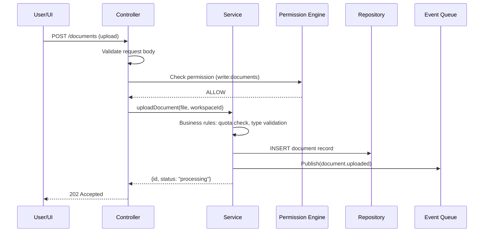

# Business Logic

> **Purpose:** Define the business logic layer architecture for Vaeloom
> **Status:** 🆕 New

## Business Logic Architecture

```mermaid
graph TD
    classDef layer fill:#e3f2fd,stroke:#1565c0,color:#000,stroke-width:2px
    classDef module fill:#e8f5e9,stroke:#2e7d32,color:#000,stroke-width:1.5px
    classDef pattern fill:#fff3e0,stroke:#e65100,color:#000,stroke-width:1.5px

    subgraph Layers["📐 Layer Architecture"]
        L1["Controller<br/>Route handling"]
        L2["Service<br/>Business logic"]
        L3["Repository<br/>Data access"]
    end

    subgraph Modules["📦 Business Logic Modules"]
        M1["DocumentService<br/>upload() · organize() · archive()"]
        M2["MemoryService<br/>extract() · merge() · search()"]
        M3["ResumeService<br/>build() · variant() · gapCheck()"]
        M4["ApplicationService<br/>shortlist() · tailor() · submit()"]
        M5["ConnectorService<br/>connect() · sync() · refresh()"]
    end

    subgraph Locations["📍 Logic Locations"]
        X1["Agent workflows: apps/ai-service/agents/"]
        X2["CRUD ops: apps/api/src/services/"]
        X3["Permission checks: apps/api/src/permissions/"]
        X4["Event handling: apps/api/src/events/"]
    end

    subgraph Patterns["🔄 Business Logic Patterns"]
        P1["Propose-then-execute<br/>File organization approval"]
        P2["Event-driven<br/>Async document ingestion"]
        P3["Saga<br/>Multi-step job application"]
        P4["Observer<br/>Memory update notifications"]
    end

    L1 --> L2 --> L3
    L2 --> M1 & M2 & M3 & M4 & M5
    L2 --> X1 & X2 & X3 & X4
    L2 --> P1 & P2 & P3 & P4

    class L1,L2,L3 layer
    class M1,M2,M3,M4,M5 module
    class X1,X2,X3,X4 locations
    class P1,P2,P3,P4 pattern
```



> **Diagram:** Business logic architecture — **3-layer pattern** (Controller→Service→Repository), **5 service modules** (Document, Memory, Resume, Application, Connector), **4 logic locations** (agents, CRUD, permissions, events), **4 patterns** (propose-then-execute, event-driven, saga, observer).

---

## Layer Architecture

```text
Controller (route handling) → Service (business logic) → Repository (data access)
```

## Business Logic Location

| Logic Type | Location | Rationale |
|------------|----------|-----------|
| Agent workflows | `apps/ai-service/agents/` | AI-specific, Python ecosystem |
| CRUD operations | `apps/api/src/services/` | Standard business logic |
| Permission checks | `apps/api/src/permissions/` | Permission Engine |
| Event handling | `apps/api/src/events/` | Event bus consumers |

## Key Business Logic Modules

| Module | Responsibility | Key Functions |
|--------|---------------|---------------|
| DocumentService | File management, versioning | `upload()`, `organize()`, `archive()` |
| MemoryService | Knowledge graph operations | `extract()`, `merge()`, `search()` |
| ResumeService | Resume generation | `build()`, `variant()`, `gapCheck()` |
| ApplicationService | Job application flow | `shortlist()`, `tailor()`, `submit()` |
| ConnectorService | External system integration | `connect()`, `sync()`, `refresh()` |

## Business Logic Patterns

| Pattern | Use Case | Example |
|---------|----------|---------|
| Propose-then-execute | User approval required | File organization |
| Event-driven | Async processing | Document ingestion |
| Saga | Multi-step transactions | Job application flow |
| Observer | Agent coordination | Memory update notifications |

## Common Mistakes

| Mistake | Consequence |
|---------|-------------|
| Putting business logic in controllers | Controllers should only handle HTTP concerns (routing, status codes) — logic in controllers is untestable and leaks into API layer |
| Anemic service layers with logic distributed across handlers | If services are just thin wrappers around repositories, the business rules end up scattered across event handlers and cron jobs |
| Mixing CRUD and agent workflow logic | CRUD operations are synchronous and deterministic — agent workflows involve LLM calls with variable latency — keep them in separate service modules |
| Skipping the repository layer | Direct database access from services makes it impossible to switch databases or add caching without rewriting business logic |

## Best Practices

| Practice | Why |
|----------|-----|
| Strict layering: Controller → Service → Repository | Each layer has one responsibility — controllers handle HTTP, services contain rules, repositories manage data access |
| Use the propose-then-execute pattern for agent workflows | AI actions that modify state should propose first, execute after user approval — prevents unintended consequences from inaccurate LLM outputs |
| Keep event handling as thin wrappers | Event handlers should validate the event and delegate to the appropriate service — no business logic in event consumers |
| Write service methods that return domain objects, not DTOs | Services should return entities/models — let controllers or serializers transform them into API responses |

## Security

| Concern | Mitigation |
|---------|------------|
| Business logic bypass via direct repository access | If a controller or event handler directly calls the repository, it bypasses all business rules in the service layer — enforce that only services can access repositories through dependency injection patterns |
| Unauthorized service method invocation | Internal services exposed without proper authorization let an attacker call sensitive operations (e.g., `archiveAll()` on a connector) — every service method must check permissions before executing |
| Data leakage through service error messages | A service that returns detailed error messages ("Document not found in workspace X") leaks workspace existence — always return generic error responses, log details server-side |

## Performance

| Concern | Mitigation |
|---------|------------|
| Service methods that are too granular | A UI action that triggers 15 separate service calls (fetch, validate, update, notify, log) creates N+1 latency — batch related operations into a single service method with a transaction |
| Transaction scope holding locks too long | Long-running service methods wrapped in a single DB transaction hold row locks for seconds — split read operations outside the transaction and keep write transactions under 100ms |
| Event handler overhead from synchronous publishing | A service that publishes events synchronously after every write operation adds latency for every HTTP request — use `fire-and-forget` event patterns or queue the event for async publishing |

---

## Goals

1. **Clean separation of concerns** — Enforce strict layering (Controller → Service → Repository) so each layer has a single, testable responsibility
2. **Domain logic centralization** — Keep all Vaeloom business rules (document processing, memory extraction, resume generation) in dedicated service modules, not scattered across controllers or event handlers
3. **Pattern-driven complex workflows** — Use proven patterns (propose-then-execute, saga, event-driven) for multi-step operations involving AI agents and external services
4. **Testability** — Ensure every service method can be unit-tested without HTTP or database dependencies

---

## Scope

### In Scope

- Service layer implementation for DocumentService, MemoryService, ResumeService, ApplicationService, ConnectorService
- Controller → Service → Repository layering for all CRUD operations
- Business logic patterns: propose-then-execute, event-driven, saga, observer
- Permissions integration with Permission Engine at the service boundary
- Event publishing from service layer for async side effects

### Out of Scope

- HTTP routing and status code handling (controller layer)
- Database schema design and optimization (repository layer)
- AI agent prompt engineering and model selection
- Infrastructure concerns (queues, workers, caching)

---

## Functional Requirements

| ID | Requirement | Priority |
|----|-------------|----------|
| F-001 | System SHALL enforce Controller → Service → Repository layering — repositories accessible only through services | P0 |
| F-002 | System SHALL implement propose-then-execute pattern for all agent-initiated state mutations | P0 |
| F-003 | System SHALL dispatch events asynchronously after service method completion | P1 |
| F-004 | System SHALL implement saga pattern for multi-step job application workflow | P1 |
| F-005 | System SHALL validate permissions at the start of every service method | P0 |

---

## Non-Functional Requirements

| ID | Requirement | Target |
|----|-------------|--------|
| NF-001 | Service method execution (non-agent) | < 100ms p95 |
| NF-002 | Transaction duration for write operations | < 200ms |
| NF-003 | Event publication latency (service → queue) | < 50ms |
| NF-004 | Service layer test coverage | > 90% |
| NF-005 | Propose → execute approval turnaround | < 5s for user decision |

---

## Sequence Diagrams



> **Diagram:** Service layer in action — Controller validates and checks permissions, Service applies business rules and persists, Repository handles data access, and Service publishes events asynchronously.

---

## Data Flow

```text
1. HTTP request arrives at Controller
2. Controller validates request body (class-validator)
3. Controller checks permissions via Permission Engine
4. Controller calls Service method with validated DTO
5. Service applies business rules (quotas, uniqueness, state transitions)
6. Service calls Repository for data access
7. Service publishes domain events to event queue (fire-and-forget)
8. Service returns domain object to Controller
9. Controller transforms domain object to API response DTO
10. Controller returns HTTP response with appropriate status code
```

---

## APIs

| Endpoint | Service Module | Description |
|----------|----------------|-------------|
| `/v1/documents/*` | DocumentService | Upload, organize, archive, search documents |
| `/v1/memory/*` | MemoryService | Extract, merge, search knowledge graph |
| `/v1/resumes/*` | ResumeService | Build, variant generation, gap analysis |
| `/v1/applications/*` | ApplicationService | Shortlist, tailor, submit job applications |
| `/v1/connectors/*` | ConnectorService | Connect, sync, refresh external services |

---

## Configuration

| Variable | Purpose | Default | Required |
|----------|---------|---------|----------|
| `SERVICE_QUOTA_DEFAULT_STORAGE_MB` | Default workspace storage quota | 500 | Yes |
| `SERVICE_MAX_DOCUMENT_SIZE_MB` | Max document upload size | 10 | Yes |
| `SERVICE_APPROVAL_TIMEOUT` | Max time to wait for propose approval | 300s | Yes |
| `SERVICE_EVENT_PUBLISH_TIMEOUT` | Timeout for async event publishing | 500ms | No |
| `SERVICE_TRANSACTION_TIMEOUT` | Max transaction duration | 500ms | Yes |

---

## Scalability

| Dimension | Current Limit | 10x Strategy | 100x Strategy |
|-----------|---------------|--------------|---------------|
| Service instances | 2 replicas | Auto-scaled based on CPU/memory | Service-per-module (DocumentService dedicated cluster) |
| Transaction throughput | 500 tps | Read replicas for read-only service methods | Eventual consistency for non-critical writes |
| Event publishing | 1000 events/s | Event batching per service method | Dedicated event publishing workers |
| Approval queue | 500 pending proposals | Redis-backed approval queue with TTL | Distributed approval queue per workspace |

---

## Error Handling

| Scenario | Detection | Mitigation | Recovery |
|----------|-----------|------------|----------|
| Service method timeout | Execution exceeds configured timeout | Return 503 to client; log full context | Background retry with same parameters |
| Transaction deadlock | PostgreSQL deadlock detected | Retry transaction up to 3 times with backoff | Log deadlock details for index optimization |
| Business rule violation (quota exceeded) | Validation check in service | Return 422 with specific error code | User upgrades plan or frees resources |
| Permission check failure at service boundary | Permission Engine denies | Return 403 to caller | Log attempted access for audit |

---

## Monitoring

| Metric | Alert Threshold | Severity | Dashboard |
|--------|-----------------|----------|-----------|
| Service method execution time | > 200ms p95 | Warning | Services > Execution Time |
| Transaction failure rate | > 2% | Critical | Services > Transactions |
| Approval queue depth | > 100 | Warning | Services > Approvals |
| Event publication failure rate | > 1% | Critical | Services > Events |
| Quota utilization per workspace | > 80% | Info | Services > Quotas |

---

## Limitations

| Limitation | Impact | Workaround | Future Resolution |
|------------|--------|------------|-------------------|
| Synchronous service methods for agent workflows | Agent operations (LLM calls) block the service thread | Offload agent work to queue immediately; return 202 | Async-first service interface with WebSocket result push |
| Single-transaction boundary per service call | Multi-step workflows cannot be rolled back atomically | Use saga pattern with compensating transactions | Distributed transaction coordinator |
| No service-level caching | Repeated identical service calls hit the database | Add service-level in-memory cache for read-heavy methods | Automatic cache layer with invalidation on write |

---

## Examples

```typescript
// Document processing workflow
import { Workflow } from '@vaeloom/workflow';

const workflow = new Workflow('document_processing');
workflow.addStep('extract_text', { service: 'extractor' });
workflow.addStep('classify', { service: 'classifier' });
workflow.addStep('embed', { service: 'embedder' });

const result = await workflow.execute({ documentId: 'doc_99' });
```

```python
# Define a business rule for auto-tagging
from Vaeloom.rules import RuleEngine

engine = RuleEngine()
engine.add_rule(
    name="auto_tag_resume",
    condition="doc.type == 'resume' AND doc.content contains 'Python'",
    action="tag.add('python', 'resume')",
)
engine.run(document_id="doc_99")
```

```bash
# List active business rules
Vaeloom rules list --workspace ws_abc123 --enabled
```

## Future Improvements

| Improvement | Priority | Complexity | Timeline |
|-------------|----------|------------|----------|
| Async-first service interface for agent workflows | High | Medium | Q4 2026 |
| Distributed transaction coordinator for multi-step sagas | Medium | High | Q1 2027 |
| Service-level automatic caching with write-through invalidation | Medium | Medium | Q3 2026 |
| Service mesh integration for inter-service communication | Low | High | Q2 2027 |

---

## Related Documents

- [Backend Architecture.md](./Backend-Architecture.md)
- [`Architecture/Event-Architecture.md`](../Architecture/Event-Architecture.md)
- [`AI/AI-Agents.md`](../AI/AI-Agents.md)
