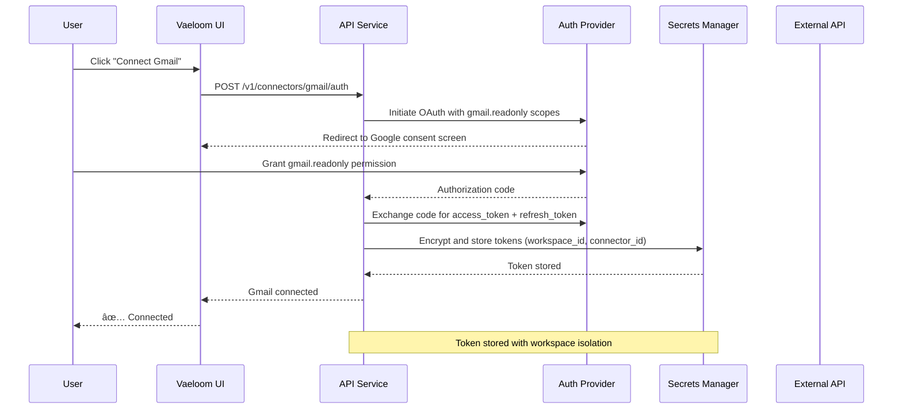

# Connectors

> **Purpose:** Define the connector architecture for external service integration — OAuth token lifecycle, sync scheduling, rate limiting, and error recovery
> **Status:** 🆕 New
> **Owner:** Backend Team
> **Last Updated:** 2026-07-12

---

## Overview

Connectors are the bridge between Vaeloom and external services (Gmail, Google Calendar, GitHub, Slack, etc.). Each connector manages its own OAuth credentials, sync schedule, and data transformation pipeline. This document covers the two critical lifecycle paths: **OAuth token management** and **data sync execution**.

## Connector Sync & Token Lifecycle

```mermaid
graph TD
    %% ─── Class Definitions ───
    classDef auth fill:#e3f2fd,stroke:#1565c0,color:#000,stroke-width:1.5px
    classDef sync fill:#e8f5e9,stroke:#2e7d32,color:#000,stroke-width:1.5px
    classDef refresh fill:#fff3e0,stroke:#e65100,color:#000,stroke-width:1.5px
    classDef process fill:#c8e6c9,stroke:#1b5e20,color:#000,stroke-width:2px
    classDef health fill:#f3e5f5,stroke:#6a1b9a,color:#000,stroke-width:1px,stroke-dasharray: 5 3

    %% ─── Phase 1: OAuth Authorization ───
    subgraph Auth["🔐 1. OAuth Authorization"]
        direction TB
        A1["User clicks<br/>\"Connect Service\""] --> A2["Redirect to provider<br/>OAuth consent screen"]
        A2 --> A3["User grants scopes<br/>(e.g. gmail.readonly)"]
        A3 --> A4["Provider returns<br/>authorization code"]
        A4 --> A5["Exchange code for<br/>access_token + refresh_token<br/>+ expires_in"]
        A5 --> A6["Encrypt & store tokens<br/>in Secrets Manager<br/>(workspace_id, connector_id)"]
    end

    %% ─── Phase 2: Token Refresh ───
    subgraph Refresh["🔄 2. Token Refresh"]
        direction TB
        R1{"Access token<br/>expired / expiring?"}
        R1 -->|No| R2["✅ Token valid<br/>proceed with sync"]
        R1 -->|Yes| R3["Request new access_token<br/>using refresh_token"]
        R3 --> R4{"Refresh succeeded?"}
        R4 -->|Yes| R5["Update stored access_token<br/>+ new expires_in<br/>reset retry counter"]
        R4 -->|No| R6{"Retries left?<br/>max 2"}
        R6 -->|Yes| R7["Wait 5s backoff<br/>retry refresh"]
        R7 --> R3
        R6 -->|No| R8["❌ Token revoked / expired<br/>Mark connector as degraded"]
        R8 --> R9["Notify user:<br/>\"Re-connect service\" "]
    end

    %% ─── Phase 3: Sync Execution ───
    subgraph Sync["📥 3. Sync Execution"]
        direction TB
        S1["Sync triggered<br/>cron / manual / webhook"] --> S2["Load connector config<br/>+ stored tokens"]
        S2 --> S3["Decrypt tokens<br/>attach to API client"]
        S3 --> S4["Call external API<br/>(list messages / events)"]
        S4 --> S5{"Rate limited?<br/>(429 / 403)"}
        S5 -->|No| S6["Process response<br/>paginate if more"]
        S5 -->|Yes| S7["Parse Retry-After header<br/>backoff: 30s --> 2m --> 5m"]
        S7 --> S8{"Retries left?<br/>max 3"}
        S8 -->|Yes| S9["Wait & retry request"]
        S9 --> S4
        S8 -->|No| S10["Abort sync run<br/>mark as rate_limited"]
    end

    %% ─── Phase 4: Data Processing ───
    subgraph Process["⚙️ 4. Data Processing"]
        direction TB
        S6 --> P1["Enqueue items for<br/>classification pipeline"]
        P1 --> P2["Deduplicate by<br/>external_id + workspace_id"]
        P2 --> P3["Classify: email / event /<br/>notification / thread"]
        P3 --> P4["Extract entities<br/>--> Memory Agent"]
        P4 --> P5{"More pages?"}
        P5 -->|Yes| S4
        P5 -->|No| P6["✅ Sync complete<br/>update last_sync_at<br/>record item count"]
    end

    %% ─── Phase 5: Health & Monitoring ───
    subgraph Health["📈 5. Health & Monitoring"]
        direction TB
        H1["Emit metrics:<br/>sync_duration, items_processed,<br/>errors, rate_limits"] --> H2["Push to<br/>Prometheus / CloudWatch"]
        H3["Structured logs:<br/>connector_id, attempt,<br/>error, page_token"] --> H4["Ship to<br/>ELK / Loki"]
        H5["Alert triggers:<br/>degraded > 24h,<br/>sync failures > 5"] --> H6["PagerDuty / Slack<br/>notification"]
    end

    %% ─── Cross-cutting connections ───
    A6 -.-> R1
    R2 -.-> S1
    R5 -.-> S1
    R8 -.-> H5
    S10 -.-> H5
    P6 -.-> H1
    S10 -.-> H1
    R8 -.-> H3

    %% ─── Apply styles ───
    class A1,A2,A3,A4,A5,A6 auth
    class R1,R2,R3,R4,R5,R6,R7,R8,R9 refresh
    class S1,S2,S3,S4,S5,S6,S7,S8,S9,S10 sync
    class P1,P2,P3,P4,P5,P6 process
    class H1,H2,H3,H4,H5,H6 health
```

> **Diagram:** The connector lifecycle spans five phases. **OAuth Authorization** (🔐) obtains tokens via the OAuth consent flow. **Token Refresh** (🔄) transparently refreshes expired tokens with up to 2 retries before degrading. **Sync Execution** (📥) fetches data from the external API with rate-limit handling (3 retries, respecting `Retry-After`). **Data Processing** (⚙️) deduplicates, classifies, and enqueues items for the memory pipeline. **Health & Monitoring** (📈) collects metrics and alerts on prolonged degradation.

---

## Connector Types

| Connector | Scopes | Sync Frequency | Rate Limit | Auth Type |
|-----------|--------|----------------|------------|-----------|
| Gmail | `gmail.readonly` | Every 6h (daily scan), real-time (push) | 250 quota units/user/s | OAuth 2.0 |
| Google Calendar | `calendar.readonly` | Every 12h | 60 requests/min | OAuth 2.0 |
| GitHub | `repo, notifications` | Every 6h | 5,000 requests/h | OAuth 2.0 (PAT fallback) |
| Slack | `channels:history, users:read` | Every 6h, real-time (RTM) | 1 req/s per workspace | OAuth 2.0 |
| Outlook | `Mail.Read` | Every 6h | 10,000 requests/h | OAuth 2.0 (MSAL) |

## Token Storage

| Field | Storage | Encryption |
|-------|---------|------------|
| `access_token` | Secrets Manager | AES-256-GCM at rest, TLS in transit |
| `refresh_token` | Secrets Manager | AES-256-GCM at rest, never exposed to client |
| `expires_at` | PostgreSQL (connector row) | Plain (used for expiry checks) |
| `scopes` | PostgreSQL (connector row) | Plain |

## Error Handling

| Error | Action | Recovery |
|-------|--------|----------|
| `401 Unauthorized` | Attempt token refresh | Auto — refresh succeeds |
| `400 invalid_grant` | Mark connector degraded | Manual — user re-authorizes |
| `429 Too Many Requests` | Backoff with `Retry-After` | Auto — next sync cycle |
| `5xx Server Error` | Retry up to 3 times | Auto — exponential backoff |
| Network timeout | Retry up to 2 times | Auto — immediate retry |

## Common Mistakes

| Mistake | Consequence |
|---------|-------------|
| Storing refresh tokens in the database instead of a secrets manager | A database breach exposes long-lived credentials that can regenerate access tokens indefinitely |
| Ignoring the Retry-After header on rate limit responses | Retrying immediately after a 429 compounds the rate limit violation — respect Retry-After and back off |
| Not handling token revocation events | Providers can revoke tokens at any time (user revokes access, password change) — without handling this, connectors silently fail |
| Using the same OAuth scopes for all connectors | Each connector should request the minimum scopes needed — Gmail only needs `gmail.readonly`, not calendar or contacts scopes |

## Best Practices

| Practice | Why |
|----------|-----|
| Store tokens in a secrets manager with encryption at rest | Secrets managers provide encryption, access auditing, and automatic rotation — never store tokens in application code or database rows |
| Implement exponential backoff with Retry-After respect | External APIs have unpredictable load — respecting Retry-After headers and backing off exponentially prevents connector bans |
| Mark connectors as degraded after repeated failures | A connector that has failed 3 consecutive syncs should be surfaced to the user — silent failures erode trust in the system |
| Log every sync attempt with connector_id and page_token | Debugging connector failures without per-request tracing is nearly impossible — structured logs are essential for connector reliability |

## Security

| Concern | Mitigation |
|---------|------------|
| Token leakage in request logs | OAuth tokens passed in URLs or logged as part of request headers can be captured in log aggregation systems — sanitize all log output to redact `access_token` and `refresh_token` values |
| OAuth redirect URI validation bypass | If the redirect URI accepts wildcards or open redirects, an attacker can intercept the authorization code — validate redirect URIs against an allow-list with exact path matching |
| Token scope escalation | A connector with `gmail.readonly` scope requesting `gmail.modify`-level access could escalate if the token is reused — each connector must use a token scoped only to its declared permissions |

## Performance

| Concern | Mitigation |
|---------|------------|
| Token refresh latency stalling sync | If every sync starts with a token refresh (2-3 network round trips), sync duration doubles — check token expiry locally before attempting refresh and batch multiple connector refreshes |
| Sync pagination with high item counts | External APIs with 10K+ items (GitHub notifications, Gmail threads) can take minutes to paginate through — use parallel page fetching when the API supports it and set a max items per sync |
| Rate limit backoff increasing total sync time | Aggressive rate limit backoff (30s→2m→5m) on a connector with many items can push sync beyond the schedule window — distribute connector syncs across the window to avoid overlapping |

---

## Goals

1. **Reliable external data ingestion** — Connect Vaeloom to external services (Gmail, Calendar, GitHub, Slack) with automatic sync, retry, and error recovery
2. **Secure credential management** — Store OAuth tokens in Secrets Manager with encryption at rest; never expose tokens to application code or logs
3. **Transparent sync lifecycle** — Surface connector health, last sync time, and error states to users so they trust the integration
4. **Graceful degradation** — Mark connectors as degraded after repeated failures instead of silently breaking; notify users to re-authorize

---

## Scope

### In Scope

- OAuth 2.0 authorization flow for Gmail, Google Calendar, GitHub, Slack, Outlook
- Token lifecycle management (issue, refresh, revoke, rotate)
- Scheduled sync via cron jobs with configurable frequency
- Real-time sync via webhook/push where supported (Gmail push, Slack RTM)
- Data deduplication and classification pipeline for synced items
- Health monitoring and degraded-state notification

### Out of Scope

- Custom connector SDK for third-party developers (planned for Phase 7)
- Reverse sync (writing data back to external services)
- Connector marketplace or discovery
- Webhook receiver infrastructure (handled by event gateway)

---

## Functional Requirements

| ID | Requirement | Priority |
|----|-------------|----------|
| F-001 | System SHALL support OAuth 2.0 authorization code flow with PKCE for all connectors | P0 |
| F-002 | System SHALL store OAuth tokens encrypted in Secrets Manager (AES-256-GCM) | P0 |
| F-003 | System SHALL auto-refresh expired tokens transparently during sync | P0 |
| F-004 | System SHALL respect `Retry-After` headers on rate limit (429) responses | P0 |
| F-005 | System SHALL mark connector as degraded after 3 consecutive sync failures | P1 |
| F-006 | System SHALL support both scheduled (cron) and manual sync triggers | P1 |

---

## Non-Functional Requirements

| ID | Requirement | Target |
|----|-------------|--------|
| NF-001 | Token refresh latency | < 500ms (including provider round trip) |
| NF-002 | Sync execution per connector | < 5 minutes for < 1000 items |
| NF-003 | Data deduplication accuracy | 100% (same external_id + workspace_id = same record) |
| NF-004 | Connector health check interval | Every 6 hours |
| NF-005 | Token refresh success rate | > 99.5% |

---

## Sequence Diagrams



> **Diagram:** Connector OAuth flow — User initiates connection via UI, API orchestrates OAuth consent with the external provider, receives tokens, encrypts them, and stores in Secrets Manager scoped to workspace.

---

## Data Flow

```text
1. User initiates connector connection via UI → API receives OAuth request
2. API redirects user to external OAuth consent screen with scoped permissions
3. User grants permission; external provider returns authorization code to API callback
4. API exchanges authorization code for access_token + refresh_token + expires_in
5. API encrypts tokens with AES-256-GCM and stores in Secrets Manager keyed by (workspace_id, connector_id)
6. Cron trigger or manual request initiates sync:
   a. Load connector config and check token expiry
   b. If expired, refresh token transparently (up to 2 retries)
   c. Call external API with valid access token
   d. Handle pagination (iterate until no more pages or max items reached)
   e. If rate limited: respect Retry-After, backoff up to 3 retries
   f. Deduplicate items by (external_id, workspace_id)
   g. Classify items (email/event/notification/thread)
   h. Enqueue for entity extraction pipeline
7. On success: update last_sync_at, record item count, emit metrics
8. On failure: log error, decrement retry count, mark degraded if exhausted
```

---

## APIs

| Endpoint | Method | Description |
|----------|--------|-------------|
| `/v1/connectors` | GET | List all connectors for a workspace |
| `/v1/connectors` | POST | Initiate OAuth connection flow |
| `/v1/connectors/:id` | DELETE | Disconnect and revoke tokens |
| `/v1/connectors/:id/sync` | POST | Trigger manual sync |
| `/v1/connectors/:id/status` | GET | Get sync status and health |
| `/v1/connectors/:id/tokens` | POST | Refresh stored tokens manually |

---

## Database

| Table | Purpose | Key Columns |
|-------|---------|-------------|
| `connectors` | Connector configuration and sync state | id, workspace_id, type, scopes, status (active/degraded/revoked), last_sync_at, last_error, item_count |
| `connector_sync_runs` | Sync execution history | id, connector_id, status, items_processed, errors, started_at, completed_at |
| `connector_tokens_metadata` | Token metadata (tokens stored in Secrets Manager) | id, connector_id, token_type (oauth/api_key), expires_at, token_key (reference to SM) |
| `synced_items` | Deduplication tracking | id, connector_id, external_id, workspace_id, item_type, classification, synced_at |

---

## Scalability

| Dimension | Current Limit | 10x Strategy | 100x Strategy |
|-----------|---------------|--------------|---------------|
| Concurrent connector syncs | 5 per workspace | Stagger sync schedules to avoid overlapping | Dedicated sync worker pool per connector type |
| Stored tokens per workspace | 10 connectors | Secrets Manager scales to 100K secrets | Hierarchical token storage with workspace prefix |
| Synced items per day | 100K | Bulk insert with dedup (ON CONFLICT DO NOTHING) | Partition synced_items table by connector_id |
| Sync frequency | 6h default | Configurable per-connector sync interval | Event-driven sync via webhook push |

---

## Error Handling

| Scenario | Detection | Mitigation | Recovery |
|----------|-----------|------------|----------|
| Token expired on sync start | API returns 401 on first request | Attempt transparent token refresh (up to 2 retries) | If refresh fails → mark connector degraded; notify user to re-authorize |
| Rate limit (429) | External API returns 429 | Parse Retry-After header; backoff 30s → 2m → 5m | After max retries → abort sync; retry next cycle |
| External API unavailable (5xx) | 500/503 response | Retry up to 3 times with exponential backoff (5s, 15s, 45s) | After max retries → skip sync cycle; alert if consecutive > 3 |
| Network timeout | Request exceeds 30s timeout | Retry up to 2 times | Mark as degraded after 3 consecutive timeouts |
| Token revoked by user | Refresh returns 400 invalid_grant | Mark connector as revoked; notify user | User must re-authorize via OAuth flow |

---

## Monitoring

| Metric | Alert Threshold | Severity | Dashboard |
|--------|-----------------|----------|-----------|
| Sync failure rate per connector | > 20% of recent 10 syncs | Warning | Connectors > Failure Rate |
| Token refresh failures | > 5% of refresh attempts | Critical | Connectors > Tokens |
| Connector in degraded state > 24h | Any connector degraded > 24h | Warning | Connectors > Health |
| Sync duration > schedule interval | Sync time > 80% of interval | Warning | Connectors > Duration |
| Items synced per day | < 50% of daily average | Info | Connectors > Volume |
| Rate limit hits per connector | > 10 per sync | Info | Connectors > Rate Limits |

---

## Deployment

| Environment | Method | Trigger | Verification |
|-------------|--------|---------|--------------|
| Development | Docker Compose with mock external APIs | Git push to feature branch | Integration tests: OAuth flow + sync + token refresh |
| Staging | Deployed with worker pool (1 replica per connector type) | PR merged to main | End-to-end test: connect Gmail → sync → verify items in DB |
| Production | Auto-scaled worker pool (2-4 replicas per type) | Tagged release via CI/CD | Canary: verify sync success rate > 98% for 5 min |

---

## Configuration

| Variable | Purpose | Default | Required |
|----------|---------|---------|----------|
| `CONNECTOR_SYNC_INTERVAL_HOURS` | Default sync interval | 6 | Yes |
| `CONNECTOR_TOKEN_REFRESH_RETRIES` | Max token refresh attempts | 2 | Yes |
| `CONNECTOR_SYNC_RETRIES` | Max sync retries per cycle | 3 | Yes |
| `CONNECTOR_MAX_ITEMS_PER_SYNC` | Max items to process per sync | 5000 | No |
| `CONNECTOR_DEGRADED_THRESHOLD` | Consecutive failures before degraded | 3 | Yes |
| `CONNECTOR_SYNC_TIMEOUT` | Per-request timeout for external API calls | 30000ms | Yes |

---

## Limitations

| Limitation | Impact | Workaround | Future Resolution |
|------------|--------|------------|-------------------|
| No real-time sync for most connectors | Data is stale up to 6 hours between syncs | Webhook/push support for Gmail; manual sync button | Implement webhook receivers for all major connectors |
| No reverse sync (Vaeloom → External) | Cannot push data to external services | Manual export feature | Add bidirectional sync for supported connectors |
| OAuth only — no API key or service account auth | Headless connectors (CI/CD) require user context | API key alternative for read-only GitHub access | Support service account authentication for enterprise |

---

## Examples

```typescript
// Configure a Google Drive connector
import { Connector } from '@vaeloom/connectors';

const driveConnector = new Connector('google_drive', {
  clientId: process.env.GOOGLE_CLIENT_ID,
  clientSecret: process.env.GOOGLE_CLIENT_SECRET,
  folderId: '1abc...',
});

await driveConnector.sync();
```

```python
# Trigger a connector sync via API
from Vaeloom import Client

client = Client()
sync = client.connectors.trigger_sync(
    connector_id="conn_42",
    full_refresh=True,
)
print(f"Sync {sync.id} started \u2014 {sync.files_queued} files queued")
```

```bash
# List available connectors
Vaeloom connectors list --workspace ws_abc123
Vaeloom connectors sync --id conn_42 --full-refresh
```

## Future Improvements

| Improvement | Priority | Complexity | Timeline |
|-------------|----------|------------|----------|
| Webhook receivers for real-time sync (Gmail push, Slack RTM) | High | Medium | Q4 2026 |
| Bidirectional sync for calendar events | Medium | High | Q1 2027 |
| Custom connector SDK for third-party developers | Low | High | Q2 2027 |
| Service account authentication for headless connectors | Medium | Medium | Q4 2026 |
| Connector health dashboard with per-connector metrics | Low | Low | Q3 2026 |

---

## Related Documents

- [`Authentication.md`](./Authentication.md) — OAuth flow details
- [`Authorization.md`](./Authorization.md) — Permission model
- [`Cron-Jobs.md`](./Cron-Jobs.md) — Sync scheduling
- [`Workers.md`](./Workers.md) — Async processing
- [`Security/Security-Architecture.md`](../Security/Security-Architecture.md)
- [`DevOps/Monitoring.md`](../DevOps/Monitoring.md)
