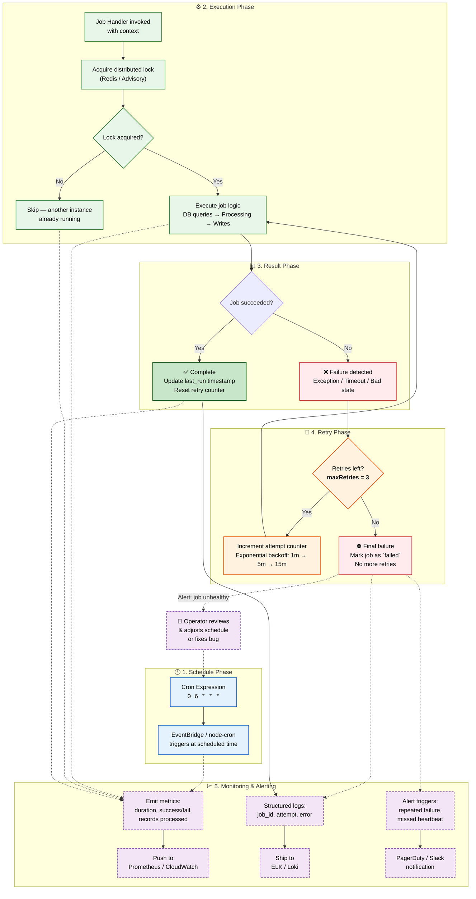
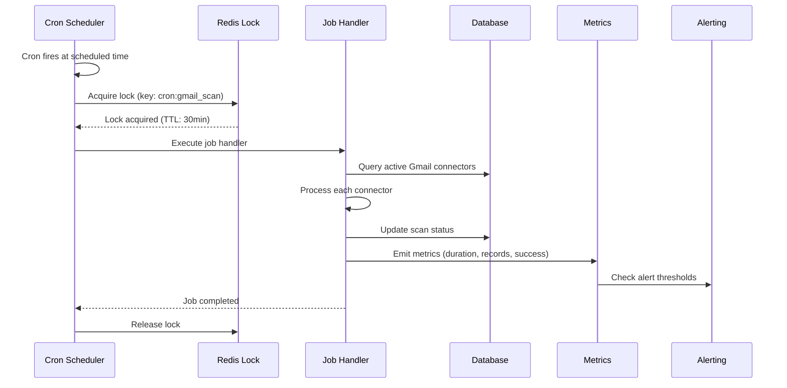

# Cron Jobs

> **Purpose:** Define scheduled job (cron) architecture for Meridian
> **Status:** 🆕 New

## Lifecycle Overview



> **Diagram:** The cron job lifecycle flows through five stages — Schedule → Execute → Result → Retry → Monitor. Failed jobs retry up to 3 times with exponential backoff before escalating to pager alerts. All stages emit metrics and structured logs for observability.

---

## Scheduled Jobs

| Job | Schedule | Description |
|-----|----------|-------------|
| `gmail_daily_scan` | Daily at 6 AM user's timezone | Full inbox classification |
| `memory_consolidation` | Weekly (Sunday 2 AM) | Compress/archive old memories |
| `reflection_pass` | Weekly (Sunday 3 AM) | High-level pattern detection |
| `connector_health_check` | Every 6 hours | Verify all connector tokens |
| `backup_database` | Daily at 1 AM | Full database backup |
| `analytics_aggregation` | Daily at 4 AM | Aggregate usage metrics |

## Job Implementation

```typescript
// apps/api/src/cron/gmail-scan.cron.ts
@Cron('0 6 * * *', { timeZone: 'user' })
async handleGmailDailyScan() {
  // Get all active Gmail connectors
  const connectors = await this.connectorService.getByType('gmail');
  
  // Queue scans for each
  for (const connector of connectors) {
    await this.gmailQueue.add({
      connectorId: connector.id,
      workspaceId: connector.workspaceId,
      type: 'daily_scan'
    });
  }
}
```

## Cron Technology

| Environment | Technology | Notes |
|-------------|------------|-------|
| MVP | Managed cron (bull-board + node-cron) | Simple, co-located with API |
| Enterprise | EventBridge / AWS Scheduler | Separate from application code |

## Failure Handling

| Failure | Action |
|---------|--------|
| Missed schedule | Run on next available interval |
| Job fails | Retry up to 3 times, then skip |
| Connector down | Skip, log, mark degraded |
| Prolonged failure | Alert engineering team |

## Common Mistakes

| Mistake | Consequence |
|---------|-------------|
| Jobs that are not idempotent | If a cron job runs twice (missed heartbeat, manual retry), duplicate data or actions occur — every job must produce the same result regardless of how many times it runs |
| Missing distributed locks in multi-instance deployments | Without a distributed lock, every API instance runs the same cron job simultaneously — duplicate work, database contention, rate limit spikes |
| Not setting a timeout on job execution | A job that hangs (external API timeout, infinite loop) blocks the cron scheduler and subsequent jobs never run |
| Jobs that run longer than their schedule interval | A 6-hour job scheduled every hour creates an ever-growing backlog of overlapping executions — monitor job duration against schedule |

## Best Practices

| Practice | Why |
|----------|-----|
| Acquire a distributed lock before executing | Use Redis or advisory locks to ensure only one instance executes the job — other instances skip with a log entry |
| Set an explicit timeout for every job | Jobs that exceed their timeout should be killed and logged as failed — prevents hung jobs from blocking the scheduler |
| Use dead letter queues for persistently failing jobs | After 3 retries, move the job to a dead letter queue for manual review — don't let jobs retry indefinitely |
| Monitor job duration vs. schedule interval | A job duration approaching its schedule interval signals that the job needs optimization or more workers |

## Security

| Concern | Mitigation |
|---------|------------|
| Insecure job payloads with user-supplied data | A cron job that reads user-supplied data from the database and executes it without validation can be exploited — sanitize all job payloads and never execute dynamic code from user data |
| Unauthorized job triggering via API | If cron job endpoints are exposed without authentication, an attacker can trigger expensive jobs (e.g., backup, full re-sync) on demand — protect trigger endpoints with admin-only access |
| Credentials hardcoded in job configuration | Cron jobs that connect to external services often embed API keys or passwords in configuration — use a secrets manager and reference secrets by key, never by value |

## Performance

| Concern | Mitigation |
|---------|------------|
| Overlapping job execution causing resource spikes | If a job scheduled every 5 minutes takes 6 minutes, multiple instances overlap and compound database load — monitor job duration vs. interval and tune concurrency to prevent stacking |
| Scheduled jobs all firing at the same minute | Cron expressions like `0 * * * *` (top of every hour) cause all hourly jobs to execute simultaneously — stagger job schedules by distributing across the hour, not the minute boundary |
| Database lock contention during maintenance jobs | Jobs that rewrite large tables (consolidation, backup) hold table locks that block user-facing queries — schedule destructive jobs during lowest traffic windows and use lock-free operations where possible |

---

## Goals

1. **Reliable scheduled execution** — Run maintenance and data-processing jobs on time, every time, with distributed locking to prevent duplicate execution
2. **Graceful failure handling** — Retry failed jobs up to 3 times with exponential backoff before escalating to pager alerts
3. **Observable job health** — Emit metrics for every job execution (duration, success/fail, records processed) and alert on prolonged failures
4. **Idempotent job design** — Every job must produce the same result regardless of how many times it runs, enabling safe manual retries

---

## Scope

### In Scope

- Scheduled jobs: gmail daily scan, memory consolidation, reflection pass, connector health check, database backup, analytics aggregation
- Distributed locking via Redis to prevent concurrent execution across multiple API instances
- Retry policy (max 3 retries, exponential backoff) with dead letter after exhaustion
- Job metrics and structured logging for observability

### Out of Scope

- Ad-hoc job execution (triggered by user action — handled by queue system)
- Real-time job scheduling (sub-second precision — not required for maintenance tasks)
- Complex workflow orchestration (DAGs, dependencies — use separate workflow engine if needed)

---

## Functional Requirements

| ID | Requirement | Priority |
|----|-------------|----------|
| F-001 | System SHALL support cron expression scheduling for time-based job triggers | P0 |
| F-002 | System SHALL acquire a distributed lock before job execution to prevent duplicate runs | P0 |
| F-003 | System SHALL retry failed jobs up to 3 times with exponential backoff (1m → 5m → 15m) | P0 |
| F-004 | System SHALL emit metrics (duration, success/fail, records processed) for every job execution | P0 |
| F-005 | System SHALL support per-job timeout configuration | P1 |
| F-006 | System SHALL move persistently failing jobs to a dead letter queue for manual review | P1 |

---

## Non-Functional Requirements

| ID | Requirement | Target |
|----|-------------|--------|
| NF-001 | Job scheduling accuracy | ±1 second of configured cron time |
| NF-002 | Lock acquisition overhead | < 5ms |
| NF-003 | Job execution monitoring latency | < 10s from completion to metric emission |
| NF-004 | Concurrent job limit per environment | 10 simultaneous jobs |
| NF-005 | Max job duration | 4 hours (configurable per job) |

---

## Sequence Diagrams


> **Diagram:** Cron job execution — Scheduler triggers at cron time, acquires Redis lock to prevent duplicate execution, runs job handler with database operations, emits metrics for observability, then releases the lock.

---

## Data Flow

```text
1. Cron scheduler (node-cron / EventBridge) fires at configured cron expression
2. Job handler acquires distributed lock keyed by job name (e.g., `cron:gmail_scan`)
3. If lock already held by another instance, job skips with log entry
4. Job handler executes business logic:
   a. Query relevant data (active connectors, pending memory records)
   b. Process in batches (to avoid memory exhaustion)
   c. Update database with job results
   d. For connector jobs: enqueue individual connector syncs
5. After completion:
   a. Release distributed lock
   b. Emit metrics (duration, records_processed, errors, success/fail)
   c. Write structured log with job_id, attempt, and summary
6. On failure: increment attempt counter; if < 3 retries, re-enqueue with exponential backoff delay
7. If max retries exceeded: mark job as failed in database, alert on-call via PagerDuty/Slack
```

---

## APIs

| Endpoint | Method | Description |
|----------|--------|-------------|
| `/v1/admin/cron-jobs` | GET | List all cron jobs with last run time and status |
| `/v1/admin/cron-jobs/:name/trigger` | POST | Manually trigger a specific cron job |
| `/v1/admin/cron-jobs/:name/status` | GET | Get detailed status and run history for a job |
| `/v1/admin/cron-jobs/dead-letter` | GET | View dead-lettered jobs requiring manual intervention |

---

## Database

| Table | Purpose | Key Columns |
|-------|---------|-------------|
| `cron_job_registry` | Cron job definitions and schedule metadata | id, name, cron_expression, enabled, timeout_seconds, last_run_at, last_status |
| `cron_job_runs` | Execution history for each cron job | id, job_name, started_at, completed_at, status, attempt_number, records_processed, error_message |
| `cron_job_locks` | Distributed lock records for concurrency control | lock_key, holder, acquired_at, ttl_seconds |

---

## Scalability

| Dimension | Current Limit | 10x Strategy | 100x Strategy |
|-----------|---------------|--------------|---------------|
| Concurrent cron jobs | 10 simultaneous | Stagger cron schedules to avoid overlap | Dedicated cron scheduler service with worker pool |
| Job run history | 30 days of history | Partition cron_job_runs by month | Archive history > 90 days to cold storage |
| Lock contention | Low (< 1% collision) | Use Redis with automatic lock expiry | Distributed lock manager (etcd / ZooKeeper) |

---

## Error Handling

| Scenario | Detection | Mitigation | Recovery |
|----------|-----------|------------|----------|
| Job timeout exceeded | Execution exceeds configured timeout | Force-kill job handler; mark as failed | Retry up to 3 times with backoff |
| Distributed lock lost | Lock TTL expiry during execution | Job continues execution but may be duplicated | Make job handlers idempotent |
| External dependency unavailable | API/database connection failure | Retry with backoff (1m → 5m → 15m) | Skip if dependency down > 3 attempts |
| Concurrent job overlap | Lock acquisition failed | Skip execution; log "another instance running" | Next scheduled run will execute normally |

---

## Monitoring

| Metric | Alert Threshold | Severity | Dashboard |
|--------|-----------------|----------|-----------|
| Job execution duration | > 80% of scheduled interval | Warning | Cron Jobs > Duration |
| Job failure rate (rolling 24h) | > 10% | Critical | Cron Jobs > Failures |
| Missed job heartbeats | Any expected job not run within 5 min of schedule | Critical | Cron Jobs > Heartbeat |
| Dead-lettered jobs | > 0 | Warning | Cron Jobs > Dead Letter |
| Lock acquisition failures | > 10% of attempts | Warning | Cron Jobs > Locks |

---

## Deployment

| Environment | Method | Trigger | Verification |
|-------------|--------|---------|--------------|
| Development | node-cron in API process | Git push | Unit tests: job handler logic |
| Staging | CronJob CRD (Kubernetes) | PR merged to main | Smoke test: run each job manually in staging |
| Production | EventBridge / AWS Scheduler (enterprise) | Tagged release via CI/CD | Verify each job runs within 5 min of schedule window |

---

## Configuration

| Variable | Purpose | Default | Required |
|----------|---------|---------|----------|
| `CRON_LOCK_TTL` | Distributed lock TTL | 1800 (30 min) | Yes |
| `CRON_JOB_TIMEOUT` | Default job execution timeout | 3600 (1 hour) | No |
| `CRON_MAX_RETRIES` | Max retries per job | 3 | Yes |
| `CRON_RETRY_BACKOFF_BASE` | Base backoff multiplier (minutes) | 1 | Yes |
| `CRON_DEAD_LETTER_ENABLED` | Enable dead letter queue | true | No |
| `CRON_HISTORY_RETENTION_DAYS` | Job run history retention | 30 | No |

---

## Limitations

| Limitation | Impact | Workaround | Future Resolution |
|------------|--------|------------|-------------------|
| No job dependency/chaining support | Jobs that depend on each other (backup → verify) must be managed externally | Run sequential jobs in a single handler | Add workflow orchestration with DAG support |
| No dynamic cron expression updates | Changing a job schedule requires code deploy | Use environment variable for schedule | Support runtime schedule updates via admin API |
| Single-region cron scheduling | Jobs run in one region; regional outage stops all jobs | Multi-region EventBridge rules | Distributed cron with regional failover |

---

## Examples

```typescript
// Schedule a recurring cron job
import { Cron } from '@meridian/scheduler';

const job = Cron.create({
  name: 'nightly-backup',
  schedule: '0 2 * * *',      // every day at 2 AM
  task: 'backup.run',
  args: { workspaceId: 'ws_abc123' },
});
```

```python
# List all active cron jobs
from meridian import Client

client = Client()
jobs = client.cron.list(status="active")
for j in jobs:
    print(f"{j.name} \u2192 {j.schedule} (next: {j.next_run})")
```

```bash
# Trigger a cron job manually
curl -X POST "https://api.meridian.ai/v1/cron/job_42/trigger" \
  -H "X-API-Key: $MERIDIAN_API_KEY"
```

## Future Improvements

| Improvement | Priority | Complexity | Timeline |
|-------------|----------|------------|----------|
| Job dependency graph with DAG execution | High | High | Q1 2027 |
| Runtime schedule updates via admin API | Medium | Low | Q3 2026 |
| Multi-region cron scheduling with failover | Medium | High | Q2 2027 |
| Job execution history viewer UI | Low | Medium | Q3 2026 |
| Custom job retry policies per job type | Low | Low | Q4 2026 |

---

## Related Documents

- [Workers.md](./Workers.md)
- [`Operations/Maintenance.md`](../Operations/Maintenance.md)
- [`DevOps/Monitoring.md`](../DevOps/Monitoring.md)
