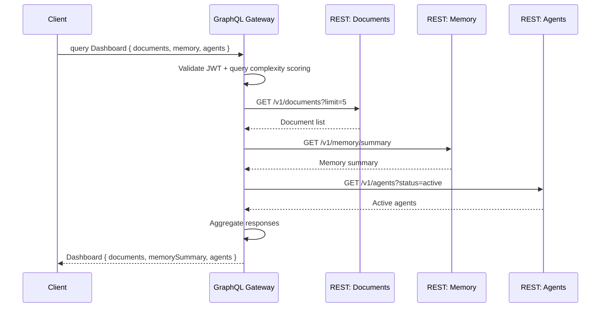

# GraphQL

> **Purpose:** Define GraphQL strategy for Vaeloom — when and why we'd use it
> **Status:** 🆕 New — REST is primary; GraphQL evaluated for specific use cases

## GraphQL Strategy

```mermaid
graph TD
    classDef primary fill:#e3f2fd,stroke:#1565c0,color:#000,stroke-width:2px
    classDef graphql fill:#e8f5e9,stroke:#2e7d32,color:#000,stroke-width:1.5px
    classDef decision fill:#fff3e0,stroke:#e65100,color:#000,stroke-width:1.5px

    subgraph Primary[\"âš¡ Primary: REST API\"]\n        P1[\"All MVP endpoints are REST<br/>Workspaces, Documents, Resume,<br/>Applications, Memory, Chat\"]\n        P2[\"Resource-oriented: POST/GET/PATCH/DELETE\"]\n        P3[\"Simple, cacheable, tool-friendly<br/>for AI agents using function calling\"]\n    end

    subgraph GraphQL[\"🔷 GraphQL (When Needed)\"]\n        G1[\"Dashboard aggregation<br/>Single query for 8+ widgets<br/>with different data sources\"]\n        G2[\"Knowledge graph exploration<br/>Nested entity + relationship queries<br/>Variable depth traversal\"]\n        G3[\"Public API / third-party integrations<br/>Flexible querying for plugin SDK\"]\n    end

    subgraph Decision[\"📊 Decision Framework\"]\n        D1[\"Data sources: 1-2 → REST<br/>3+ → GraphQL\"]\n        D2[\"Query pattern: Fixed → REST<br/>Variable/exploratory → GraphQL\"]\n        D3[\"Client: Internal SPA → REST<br/>External plugins → GraphQL\"]\n        D4[\"Performance: REST with multiple<br/>roundtrips → GraphQL batching\"]\n    end

    Primary --> Decision
    GraphQL --> Decision

    class P1,P2,P3 primary
    class G1,G2,G3 graphql
    class D1,D2,D3,D4 decision
```

> **Diagram:** GraphQL strategy — **REST is primary** for all MVP endpoints (workspaces, documents, resume, applications, memory, chat). **GraphQL considered** for dashboard aggregation (8+ data sources), knowledge graph exploration (nested entity queries), and public API/plugin SDK. **Decision framework** guides when to choose each: 1-2 data sources → REST, 3+ → GraphQL; fixed patterns → REST, exploratory → GraphQL.

---

## Primary API: REST

Vaeloom's primary API is REST. All MVP endpoints follow REST conventions (see [`REST-Standards.md`](./REST-Standards.md)):

- Resource-oriented URLs: `/workspaces/{id}/documents`
- Standard HTTP methods: GET, POST, PATCH, DELETE
- Pagination, filtering, sorting via query params
- HTTP status codes for errors
- Bearer token authentication

REST is preferred for MVP because:

- Simple to implement and debug
- Easy for AI agents to consume via function calling
- Cacheable at CDN level
- Well-understood by all client types

## When to Consider GraphQL

| Scenario | Recommended Approach | Rationale |
|----------|---------------------|-----------|
| Dashboard (8+ widgets, different sources) | GraphQL | Single query replaces 8 REST calls |
| Knowledge graph traversal | GraphQL | Variable depth, nested entity queries |
| Public plugin SDK | GraphQL | Clients need flexible querying |
| Standard CRUD (documents, users) | REST | Simple, cacheable, sufficient |
| Agent tool calls | REST | Function calling works best with fixed endpoints |

## GraphQL Integration (Future)

If GraphQL is adopted:

- **Library:** Apollo Server (Node.js) or Strawberry GraphQL (Python)
- **Layer:** Standalone GraphQL gateway that delegates to REST services
- **Auth:** Same JWT-based authentication as REST
- **Rate limiting:** Per-query complexity scoring, not per-endpoint
- **Caching:** Use Apollo's cache control directives and CDN caching

```typescript
// apps/api/src/graphql/schema.ts (future)
import { gql } from 'apollo-server-express';

export const typeDefs = gql`
  type Query {
    dashboard(workspaceId: ID!): Dashboard
    memoryGraph(workspaceId: ID!, depth: Int): GraphNode
    search(workspaceId: ID!, query: String!): SearchResults
  }

  type Dashboard {
    memoryHealth: MemoryHealth
    activeApplications: [Application]
    upcomingDeadlines: [Deadline]
    recentActivity: [Activity]
    suggestions: [Suggestion]
  }
`;
```

## Implementation Order

| Phase | API Strategy |
|-------|-------------|
| MVP (0-6) | REST only |
| V2 | Evaluate GraphQL for dashboard + memory graph |
| Enterprise | Full GraphQL gateway for public SDK |

## Common Mistakes

| Mistake | Consequence |
|---------|-------------|
| Adding GraphQL before REST is proven | GraphQL adds schema management, resolver complexity, and caching challenges — start with REST for MVP and add GraphQL only when the need is validated |
| Using GraphQL for everything | Standard CRUD (documents, users, connectors) is simpler and more cacheable with REST — GraphQL adds unnecessary complexity for fixed query patterns |
| Not implementing query complexity analysis | A malicious or careless client can request deeply nested queries that exhaust database connections and LLM credits — limit query depth and cost |
| Skipping CDN caching for GraphQL | GraphQL POST requests are not cacheable by default — use persisted queries or Apollo's cache control directives to enable CDN caching |

## Best Practices

| Practice | Why |
|----------|-----|
| Keep REST as primary; evaluate GraphQL per use case | Dashboard aggregation (8+ data sources) and knowledge graph traversal (nested entity queries) are good GraphQL candidates — standard CRUD stays REST |
| Implement query complexity scoring | Assign a cost to each field and reject queries that exceed a complexity budget — prevents abusive queries before they hit the database |
| Use persisted queries for production | Persisted queries (stored server-side, referenced by hash) prevent arbitrary query execution and make responses CDN-cacheable |
| Delegate GraphQL to a gateway layer | A standalone GraphQL gateway that delegates to REST microservices avoids coupling client query patterns to internal service architecture |

## Security

| Concern | Mitigation |
|---------|------------|
| Malicious query depth attacks | A deeply nested query (`user → posts → comments → user → ...`) can exhaust database connections — limit query depth to 5 levels and use query complexity analysis to reject expensive queries before execution |
| Unauthorized field access through introspection | GraphQL introspection exposes the entire schema, including internal fields and deprecated mutations — disable introspection in production or restrict it to authenticated admins |
| Data leakage through error messages | GraphQL errors often include stack traces and partial data — configure the error formatter to return only safe messages in production and log full errors server-side |

## Performance

| Concern | Mitigation |
|---------|------------|
| N+1 resolver problem causing excessive DB queries | A resolver that fetches a user's documents, then each document's comments individually creates N+1 database queries — use DataLoader to batch and cache per-request database fetches |
| Query complexity and depth limiting response time | A query requesting all dashboard widgets with nested relationships can take seconds to resolve — set query complexity budgets and timeouts per resolver to prevent runaway queries |
| Serialization overhead for deeply nested GraphQL responses | GraphQL responses with 5+ levels of nesting can take 100ms+ to serialize — use response caching at the gateway layer and limit response depth at the schema level |

---

## Goals

1. **Evaluate GraphQL pragmatically** — Keep REST as the primary API; adopt GraphQL only when it solves a concrete problem (dashboard aggregation, knowledge graph traversal, public SDK)
2. **Avoid premature adoption** — Do not introduce GraphQL complexity before MVP validates the need
3. **Defensible migration path** — If GraphQL is adopted, layer it as a standalone gateway that delegates to existing REST services

---

## Scope

### In Scope

- Evaluation criteria for when to adopt GraphQL (data source count, query pattern, client type)
- Migration strategy: standalone GraphQL gateway that delegates to REST microservices
- Query complexity scoring to prevent abusive queries
- Persisted queries for production CDN caching

### Out of Scope

- GraphQL implementation before V2 (MVP uses REST exclusively)
- Replacing existing REST endpoints with GraphQL resolvers
- Subscriptions or real-time GraphQL (separate WebSocket spec)
- Federated GraphQL schema across multiple services

---

## Functional Requirements

| ID | Requirement | Priority |
|----|-------------|----------|
| F-001 | GraphQL SHALL be implemented as a standalone gateway layer, not a replacement for REST controllers | P1 |
| F-002 | GraphQL SHALL re-use existing REST authentication (JWT Bearer tokens) | P1 |
| F-003 | GraphQL SHALL implement query complexity scoring based on field cost model | P1 |
| F-004 | GraphQL SHALL support persisted queries for CDN-cacheable responses | P2 |
| F-005 | GraphQL SHALL expose dashboard aggregation, memory graph traversal, and public search queries | P2 |

---

## Non-Functional Requirements

| ID | Requirement | Target |
|----|-------------|--------|
| NF-001 | GraphQL query response time (typical dashboard query) | < 500ms p95 |
| NF-002 | Query complexity budget per request | 1000 cost units |
| NF-003 | Max query depth | 5 levels |
| NF-004 | Gateway-to-REST delegation latency | < 50ms per delegation |
| NF-005 | Persisted query cache hit ratio | > 90% for production queries |

---

## Sequence Diagrams


> **Diagram:** GraphQL gateway delegates to REST services — Dashboard query fans out to 3 REST endpoints (documents, memory, agents), aggregates results, and returns a single response. JWT auth and query complexity are checked at the gateway level.

---

## Data Flow

```text
1. Client sends GraphQL query to /graphql endpoint
2. Gateway authenticates via Bearer JWT (same as REST)
3. Gateway validates query against schema and applies complexity scoring
4. Gateway checks persisted query cache for known query hashes
5. For non-cached queries: parse, validate, and execute resolvers
6. Resolvers delegate to REST microservices via internal HTTP calls
7. DataLoader batches and caches per-request database/resource fetches
8. Responses aggregated into GraphQL response shape
9. Cache control directives applied for CDN caching of common queries
10. Response returned to client with query cost in extensions metadata
```

---

## APIs

| Endpoint | Method | Description |
|----------|--------|-------------|
| `/graphql` | POST | Execute GraphQL query (query or mutation) |
| `/graphql` | GET | Execute persisted query by hash |
| `/graphql/schema` | GET | Download GraphQL schema SDL (admin only in production) |
| `/graphql/persisted` | POST | Register a persisted query hash |

---

## Database

| Table | Purpose | Key Columns |
|-------|---------|-------------|
| `graphql_persisted_queries` | Registered persisted query hashes | id, hash, query_text, created_by, created_at |
| `graphql_query_log` | Query execution log (for cost analysis) | id, query_hash, cost, duration_ms, client_ip, executed_at |

---

## Scalability

| Dimension | Current Limit | 10x Strategy | 100x Strategy |
|-----------|---------------|--------------|---------------|
| Query complexity budget | 1000 units per query | Per-tenant complexity budgets | Dynamic complexity based on tenant tier |
| Persisted query throughput | 10K queries/s | CDN-cached persisted queries | Edge worker query execution |
| Gateway instances | 2 replicas | Auto-scaled based on query volume | Multi-region active-active gateways |

---

## Error Handling

| Scenario | Detection | Mitigation | Recovery |
|----------|-----------|------------|----------|
| Query exceeds complexity budget | Cost calculation > budget | Reject query with COMPLEXITY_LIMIT_EXCEEDED error | Client simplifies query or uses persisted query |
| REST delegation failure | Downstream service returns 5xx | Return partial data with errors extension | Retry with backoff on transient failures |
| Invalid persisted query hash | Hash not found in registry | Return error; client resends full query | Register query hash via /persisted endpoint |
| Deeply nested query | Nesting > 5 levels | Truncate at max depth; return warning | Client reduces query depth |

---

## Monitoring

| Metric | Alert Threshold | Severity | Dashboard |
|--------|-----------------|----------|-----------|
| Query response time (p95) | > 500ms | Warning | GraphQL > Response Times |
| Query cost > 500 units | > 10% of queries | Info | GraphQL > Query Costs |
| Persisted query cache miss ratio | > 20% | Warning | GraphQL > Cache |
| Error rate (5xx from delegated REST) | > 2% | Critical | GraphQL > Errors |
| Max query depth violations | > 5/day | Info | GraphQL > Depth Violations |

---

## Deployment

| Environment | Method | Trigger | Verification |
|-------------|--------|---------|--------------|
| Development | GraphQL gateway in Docker Compose (disabled by default) | Feature flag enabled | GraphQL test suite passes |
| Staging | Gateway deployed alongside REST services | Feature flag enabled for staging | Dashboard query returns all 8+ widgets |
| Production | Gateway deployed behind API Gateway | Feature flag for specific tenants | Canary: compare GraphQL dashboard vs. REST dashboard parity |

---

## Configuration

| Variable | Purpose | Default | Required |
|----------|---------|---------|----------|
| `GRAPHQL_ENABLED` | Enable GraphQL gateway | false | Yes |
| `GRAPHQL_COMPLEXITY_BUDGET` | Max query complexity | 1000 | Yes |
| `GRAPHQL_MAX_DEPTH` | Max query nesting depth | 5 | Yes |
| `GRAPHQL_REST_DELEGATION_TIMEOUT` | Timeout for REST calls | 5000ms | Yes |
| `GRAPHQL_PERSISTED_ONLY` | Only allow persisted queries | false | No |

---

## Limitations

| Limitation | Impact | Workaround | Future Resolution |
|------------|--------|------------|-------------------|
| No subscription support | Real-time agent updates not available via GraphQL | Use REST WebSocket endpoint for agent streaming | Add GraphQL subscriptions with WebSocket |
| REST delegation adds latency per resolver | Each resolver adds 50ms+ for internal REST call | Use DataLoader for batching | Migrate high-traffic resolvers to direct DB access |
| Schema is tightly coupled to REST API shape | REST changes may break GraphQL schema | Version REST API before GraphQL schema | Use schema-first design with REST as implementation detail |

---

## Examples

```typescript
// GraphQL query for workspace documents
const query = `
  query GetWorkspaceDocuments($workspaceId: ID!) {
    workspace(id: $workspaceId) {
      documents(first: 10) {
        edges { node { id title status } }
      }
    }
  }
`;

const data = await Vaeloom.graphql(query, { workspaceId: 'ws_abc123' });
```

```python
# Execute a GraphQL mutation
from Vaeloom import Client

client = Client()
mutation = """
mutation UpdateDocument($id: ID!, $title: String!) {
  updateDocument(id: $id, input: { title: $title }) { id title }
}
"""
result = client.graphql.execute(mutation, {"id": "doc_99", "title": "New Name"})
```

```bash
# Introspect the GraphQL schema
curl -X POST "https://api.Vaeloom.ai/graphql" \
  -H "X-API-Key: $Vaeloom_API_KEY" \
  -d '{"query": "{ __schema { types { name } } }"}'
```

## Future Improvements

| Improvement | Priority | Complexity | Timeline |
|-------------|----------|------------|----------|
| GraphQL subscriptions for real-time agent streaming | High | Medium | Q1 2027 |
| Direct DB access resolvers for high-traffic queries | Medium | Medium | Q2 2027 |
| Schema-first design decoupled from REST API | Low | High | Q2 2027 |
| Public GraphQL SDK with API key authentication | Medium | Medium | Q4 2026 |

---

## Related Documents

- [REST Standards.md](./REST-Standards.md)
- [API Architecture.md](./API-Architecture.md)
- [Backend Architecture.md](./Backend-Architecture.md)
