# Module Specifications

> **Purpose:** Define every module within apps/api (NestJS) and apps/ai-service (FastAPI), their responsibilities, dependencies, interfaces, and ownership boundaries
> **Status:** 🆕 New
> **Owner:** Architecture Team
> **Version:** 1.0
> **Last Updated:** 2026-07-16
> **Dependencies:** [`API-Architecture.md`](./API-Architecture.md), [`Service-Contracts.md`](./Service-Contracts.md), [`Backend-Architecture.md`](./Backend-Architecture.md), [`../Architecture/C4-Architecture.md`](../Architecture/C4-Architecture.md)
> **Implementation Status:** 📋 Spec Only

## Overview

Each backend service is organized into modules — cohesive units of code that own a bounded domain, expose a public interface, and have explicit dependencies on other modules. This document specifies every module, its responsibility, its public interface (what other modules can call), its dependencies (what it calls), and the communication pattern (direct call, event, or shared kernel). Clear module boundaries prevent coupling, enable independent testing, and allow teams to work in parallel.

## Goals

- Define every module in apps/api and apps/ai-service
- Specify module responsibilities and public interfaces
- Map inter-module dependencies and communication patterns
- Establish module ownership boundaries
- Enable parallel team development

## Scope

### In Scope

- apps/api modules (NestJS)
- apps/ai-service modules (FastAPI)
- Module dependency graph
- Communication patterns
- Ownership boundaries

### Out of Scope

- Detailed implementation of each module — see individual feature docs
- Database schema per module — see [`../Database/Schema.md`](../Database/Schema.md)

## Architecture

```mermaid
graph TD
    classDef api_mod fill:#e3f2fd,stroke:#1565c0,color:#000,stroke-width:2px
    classDef ai_mod fill:#e8f5e9,stroke:#2e7d32,color:#000,stroke-width:2px
    classDef shared fill:#fff3e0,stroke:#e65100,color:#000,stroke-width:1.5px
    classDef rpc fill:#f3e5f5,stroke:#6a1b9a,color:#000,stroke-width:1px

    subgraph API["apps/api (NestJS)"]
        AUTH["AuthModule"]:::api_mod
        USERS["UsersModule"]:::api_mod
        DOCS["DocumentsModule"]:::api_mod
        WORK["WorkspacesModule"]:::api_mod
        PERM["PermissionsModule"]:::api_mod
        TENANT["TenantsModule"]:::api_mod
        CONN["ConnectorsModule"]:::api_mod
        BILL["BillingModule"]:::api_mod
        SEARCH["SearchModule"]:::api_mod
        NOTIFY["NotificationsModule"]:::api_mod
        ANALYTICS["AnalyticsModule"]:::api_mod
    end

    subgraph AI["apps/ai-service (FastAPI)"]
        HARNESS["AgentModule<br/>(Harness + Orchestrator)"]:::ai_mod
        MEM["MemoryModule<br/>(Graph + Vector + Long-term)"]:::ai_mod
        RAG["RAGModule<br/>(Retrieval + Reranking)"]:::ai_mod
        INFER["InferenceModule<br/>(Model Gateway)"]:::ai_mod
        EVAL["EvalModule"]:::ai_mod
        INGEST["IngestionModule<br/>(Parse + Extract + Embed)"]:::ai_mod
        MCP["MCPModule<br/>(Connector Tools)"]:::ai_mod
        GUARD["GuardrailsModule"]:::ai_mod
    end

    subgraph SHARED["Shared Kernel"]
        TYPES["Shared Types<br/>(Protobuf + TypeScript)"]:::shared
        EVENTS["Event Types<br/>(CloudEvents schema)"]:::shared
    end

    API -->|"gRPC"| AI
    API --> SHARED
    AI --> SHARED
    AUTH -.->|"direct"| PERM & TENANT
    DOCS -->|"event"| INGEST
    SEARCH -->|"gRPC"| RAG
```

> **Diagram:** Module dependency graph. Arrows show dependencies (direct call = solid, event = labeled). Shared types and events are in the shared kernel. Cross-service communication is via gRPC.

## apps/api Modules (NestJS)

| Module | Responsibility | Public Interface | Dependencies | Communication |
|--------|----------------|-----------------|-------------|---------------|
| **AuthModule** | JWT validation, session management, OAuth flows, MFA | `validateToken()`, `createSession()`, `refreshSession()` | PermissionsModule, TenantsModule | Direct call |
| **UsersModule** | User profile CRUD, preferences, onboarding | `getUser()`, `updateProfile()`, `deleteUser()` | AuthModule | Direct call |
| **DocumentsModule** | Document upload, metadata CRUD, raw file management | `upload()`, `getMetadata()`, `deleteDocument()`, `listDocuments()` | AuthModule, PermissionsModule, WorkspacesModule | Direct + event (document.uploaded) |
| **WorkspacesModule** | Workspace CRUD, sharing, member management | `createWorkspace()`, `addMember()`, `listWorkspaces()` | AuthModule, PermissionsModule | Direct call |
| **PermissionsModule** | RBAC + ABAC evaluation, permission checks | `checkPermission()`, `grantRole()`, `revokeRole()` | AuthModule, TenantsModule | Direct call |
| **TenantsModule** | Tenant provisioning, isolation config, status management | `createTenant()`, `suspendTenant()`, `getTenant()` | AuthModule | Direct call |
| **ConnectorsModule** | OAuth flow management, connector config, sync status | `connectGmail()`, `connectGitHub()`, `getSyncStatus()` | AuthModule, PermissionsModule | Direct + event (connector.synced) |
| **BillingModule** | Subscription management, usage metering, Stripe integration | `getSubscription()`, `getUsage()`, `createCheckoutSession()` | AuthModule, TenantsModule | Direct call |
| **SearchModule** | Full-text + vector search proxy to AI service | `search()`, `suggest()` | AuthModule, PermissionsModule | gRPC (to RAGModule) |
| **NotificationsModule** | Email, in-app, push notifications | `send()`, `markRead()`, `listNotifications()` | AuthModule, UsersModule | Direct + event (notification.created) |
| **AnalyticsModule** | Usage analytics, feature adoption, tenant-level reporting | `getUsageSummary()`, `getAdoptionMetrics()` | AuthModule, TenantsModule | Direct call (read-only) |

## apps/ai-service Modules (FastAPI)

| Module | Responsibility | Public Interface | Dependencies | Communication |
|--------|----------------|-----------------|-------------|---------------|
| **AgentModule** | Shared agentic loop, orchestrator, request routing | `executeTask()`, `routeRequest()`, `assemblePlan()` | MemoryModule, RAGModule, MCPModule, GuardrailsModule, InferenceModule | Direct call |
| **MemoryModule** | Knowledge graph (AGE), vector store (pgvector), long-term memory | `readMemory()`, `writeMemory()`, `searchGraph()`, `searchVector()` | None (data layer only) | Direct call |
| **RAGModule** | Hybrid retrieval (vector + keyword + graph), reranking | `retrieve()`, `rerank()`, `buildContext()` | MemoryModule | Direct call |
| **InferenceModule** | Model gateway, prompt building, token counting, fallback | `infer()`, `buildPrompt()`, `countTokens()`, `selectModel()` | GuardrailsModule | Direct call (to LLM APIs) |
| **EvalModule** | Golden dataset testing, evaluation runner, CI integration | `runEval()`, `getEvalResults()`, `registerGoldenSet()` | AgentModule, InferenceModule | Direct call |
| **IngestionModule** | File parsing, entity extraction, chunking, embedding | `parse()`, `extractEntities()`, `chunk()`, `embed()` | MemoryModule, InferenceModule | Direct call + event (document.parsed, document.embedded) |
| **MCPModule** | MCP connector tools (Gmail, GitHub, Drive, Slack) | `listTools()`, `executeTool()`, `getConnectorStatus()` | GuardrailsModule | Direct call (to external APIs) |
| **GuardrailsModule** | Input validation, injection defense, output QA, safety check | `validateInput()`, `checkOutput()`, `scanForPII()` | None (pure logic) | Direct call |

## Communication Patterns

| Pattern | When to Use | Example |
|---------|-----------|---------|
| **Direct call** | Synchronous request-response within same service | `PermissionsModule.checkPermission()` called by any API controller |
| **Event (async)** | Fire-and-forget or fan-out scenarios | `DocumentsModule` emits `document.uploaded` → `IngestionModule` picks it up |
| **gRPC (cross-service)** | Synchronous request-response between API and AI services | `SearchModule` calls `RAGModule.retrieve()` via gRPC |
| **Shared kernel** | Shared types, enums, event schemas | Protobuf definitions, CloudEvents types |

## Module Ownership

| Module | Owning Team | PR Review Required From |
|--------|-------------|------------------------|
| AuthModule, PermissionsModule, TenantsModule | Security Team | Architecture Team (for cross-cutting changes) |
| DocumentsModule, WorkspacesModule, SearchModule | Core Platform Team | AI Team (for search integration) |
| AgentModule, MemoryModule, RAGModule, InferenceModule | AI Team | Architecture Team |
| IngestionModule, MCPModule, GuardrailsModule | AI Platform Team | Security Team (for guardrails) |
| BillingModule, AnalyticsModule, NotificationsModule | Product Engineering Team | Finance (for billing), Data (for analytics) |

## Security

| Concern | Mitigation |
|---------|-----------|
| Module bypass (controller calling data layer directly) | Architecture lint: controllers may only call module public interfaces |
| Circular dependencies | Dependency graph validated in CI; circular dep = build failure |
| Module loading malicious code | Module isolation; no dynamic imports from user-controlled paths |
| Cross-module PII leak | PII fields encrypted at boundary; modules must declare which PII they handle |

## Best Practices

| # | Practice | Rationale |
|---|----------|-----------|
| 1 | Every module has a single public interface (index.ts) | Prevents internal module details from leaking |
| 2 | Modules communicate via events, not direct calls, when possible | Events decouple modules and enable independent scaling |
| 3 | Circular dependencies are build failures | Prevents spaghetti coupling that makes the codebase unmaintainable |
| 4 | Module ownership is documented and enforced | Clear ownership prevents "everyone owns / nobody owns" drift |

## Future Improvements

| Improvement | Priority | Complexity | Timeline |
|-------------|----------|------------|----------|
| Module dependency visualization in docs portal | Medium | Low | Q4 2026 |
| Automated circular dependency detection in CI | High | Low | Q3 2026 |
| Per-module test isolation | Medium | Medium | Q1 2027 |

## Related Documents

- [`API-Architecture.md`](./API-Architecture.md) — API-level architecture
- [`Service-Contracts.md`](./Service-Contracts.md) — cross-service RPC contracts
- [`Backend-Architecture.md`](./Backend-Architecture.md) — backend overview
- [`../Architecture/C4-Architecture.md`](../Architecture/C4-Architecture.md) — C4 component views
- [`../AI/AI-Agents.md`](../AI/AI-Agents.md) — agent architecture
