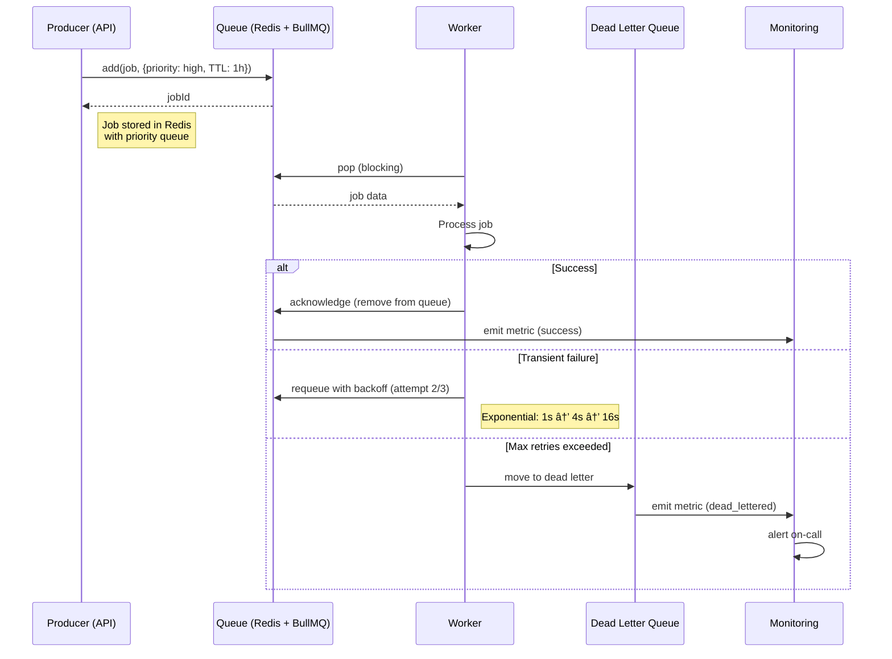

# Queue (Backend)

> **Purpose:** Define queue usage patterns for the Backend API service
> **Status:** 🆕 New — complements the infra-level Queue Architecture

## Queue Architecture

```mermaid
graph TD
    classDef source fill:#e3f2fd,stroke:#1565c0,color:#000,stroke-width:2px
    classDef queue fill:#e8f5e9,stroke:#2e7d32,color:#000,stroke-width:1.5px
    classDef worker fill:#fff3e0,stroke:#e65100,color:#000,stroke-width:1.5px
    classDef monitor fill:#f3e5f5,stroke:#6a1b9a,color:#000,stroke-width:1px

    subgraph Sources[\"📤 Queue Producers\"]\n        S1[\"API Controllers<br/>Document uploads,<br/>application submissions\"]\n        S2[\"Connector Syncs<br/>Gmail, GitHub,<br/>calendar imports\"]\n        S3[\"Cron Scheduler<br/>Daily scans,<br/>weekly consolidation\"]\n        S4[\"Agent Runtime<br/>Memory extraction,<br/>organization proposals\"]\n    end

    subgraph Queues[\"🗄️ Queue Types\"]\n        Q1[\"ingestion<br/>Priority: High<br/>Parser + OCR + extraction\"]\n        Q2[\"memory_extraction<br/>Priority: High<br/>Entity + graph updates\"]\n        Q3[\"organization<br/>Priority: Medium<br/>File organization proposals\"]\n        Q4[\"gmail_scan<br/>Priority: Medium<br/>Email classification\"]\n        Q5[\"resume_generation<br/>Priority: Low<br/>Variant generation\"]\n        Q6[\"job_search<br/>Priority: Low<br/>Background opportunity radar\"]\n    end

    subgraph Workers[\"⚙️ Worker Pool\"]\n        W1[\"Ingestion Worker x3<br/>Parse → OCR → Extract\"]\n        W2[\"Memory Worker x2<br/>Entity extraction → Graph\"]\n        W3[\"Organization Worker x2<br/>Proposal generation\"]\n        W4[\"Gmail Worker x1<br/>Email scan → Classify\"]\n        W5[\"Resume Worker x1<br/>Variant generation\"]\n        W6[\"Job Search Worker x1<br/>Opportunity matching\"]\n    end

    S1 & S2 & S3 & S4 --> Q1 & Q2 & Q3 & Q4 & Q5 & Q6\n    Q1 --> W1\n    Q2 --> W2\n    Q3 --> W3\n    Q4 --> W4\n    Q5 --> W5\n    Q6 --> W6

    class S1,S2,S3,S4 source\n    class Q1,Q2,Q3,Q4,Q5,Q6 queue\n    class W1,W2,W3,W4,W5,W6 worker
```

> **Diagram:** Backend queue architecture — **4 producer types** (API controllers, connector syncs, cron scheduler, agent runtime) enqueue jobs into **6 priority-tiered queues** (ingestion high → job search low). **6 worker pools** with different concurrency levels consume from their respective queues.

---

## Queue Technology

| Environment | Technology | Rationale |
|-------------|------------|-----------|
| Development | Redis + BullMQ (in Docker) | Same as production, lightweight |
| Staging | Redis + BullMQ | Matches production config |
| Production | Redis + BullMQ | Simple to operate, already needed for cache |

See [`Architecture/Queue.md`](../Architecture/Queue.md) for the infra-level queue architecture and enterprise migration path (Kafka).

## Job Lifecycle

Every job follows the lifecycle defined in [`Workers.md`](./Workers.md): **Enqueue → Process → Retry (max 3) → Dead Letter**.

```typescript
// apps/api/src/queues/job.processor.ts
@Processor('ingestion')
export class IngestionProcessor {
  @Process({ concurrency: 3 })
  async process(job: Job<Payload>) {
    try {
      await this.service.process(job.data);
      return { success: true };
    } catch (error) {
      if (job.attemptsMade < 3) {
        throw error; // BullMQ retries with backoff
      }
      // Move to dead letter after 3 failures
      await this.deadLetterService.add(job);
    }
  }
}
```

## Queue Configuration

| Queue | Concurrency | Max Retries | Backoff | TTL | Dead Letter Threshold |
|-------|-------------|-------------|---------|-----|----------------------|
| `ingestion` | 3 | 3 | Exponential (1s/4s/16s) | 1 hour | > 3 failures |
| `memory_extraction` | 2 | 3 | Exponential | 30 min | > 3 failures |
| `organization` | 2 | 2 | Linear (30s/5m) | 1 hour | > 2 failures |
| `gmail_scan` | 1 | 3 | Exponential | 2 hours | > 3 failures |
| `resume_generation` | 1 | 2 | Linear | 30 min | > 2 failures |
| `job_search` | 1 | 1 | None | 1 hour | > 1 failure |

## Adding a New Queue

To add a new queue:

1. **Define queue** in `apps/api/src/queues/`
2. **Configure** concurrency, retries, backoff, TTL
3. **Create worker** in `apps/api/src/workers/`
4. **Register** in the worker module
5. **Add metrics** to monitoring dashboard
6. **Update** this document with the new queue

## Queue Monitoring

| Metric | Warning | Critical |
|--------|---------|----------|
| Queue depth | > 500 | > 1000 |
| Oldest pending job | > 5 min | > 15 min |
| Failure rate | > 5% | > 10% |
| Worker saturation | > 70% | > 90% |

## Common Mistakes

| Mistake | Consequence |
|---------|-------------|
| Jobs without TTL that accumulate in the queue | A stalled producer that keeps enqueuing jobs without a TTL causes queue depth to grow indefinitely — memory pressure, delayed processing of real jobs |
| Non-idempotent job handlers | If a job is retried (worker crash, network blip) and the handler doesn't check if work was already done, you get duplicate entities, emails, or applications |
| Poison pills that never go to dead letter | A job that always fails (invalid payload, bug in handler) without progressing to dead letter retries forever — wasted compute, obscured real failures |
| Setting concurrency higher than available resources | 100 concurrent workers with 1 database connection pool kills performance — tune concurrency to match downstream capacity |

## Best Practices

| Practice | Rationale |
|----------|-----------|
| Idempotent handlers | Same payload enqueued twice = same result |
| Small payloads (< 1KB) | Store large data in S3, reference by key |
| Always set TTL | Stale jobs should expire, not linger |
| Log every state transition | Essential for debugging and performance analysis |
| Exponential backoff | Avoid thundering herd on retry |

## Security

| Concern | Mitigation |
|---------|------------|
| Unauthorized queue access allowing job injection | If the queue API is exposed without authentication, an attacker can enqueue malicious jobs — restrict queue management to internal services and authenticate all queue operations |
| Payload tampering in transit | Jobs containing sensitive data (user IDs, connector tokens) sent without encryption can be intercepted — encrypt job payloads at the producer and decrypt at the consumer for sensitive queues |
| Poison pill injection via malformed job payloads | A job payload that doesn't match the expected schema can crash the worker — validate every job against a schema before enqueuing and reject jobs that don't match at the consumer level |

## Performance

| Concern | Mitigation |
|---------|------------|
| Queue depth growing faster than consumption | A spike of 10K ingestion jobs with only 3 workers creates hours of backlog — monitor queue depth-to-consumption ratio and auto-scale workers when depth exceeds 5x concurrency |
| Job serialization and deserialization overhead | Large job payloads (100KB+) serialize/deserialize on every enqueue and dequeue — store large payloads in object storage and pass only the reference key in the job |
| Job batching inefficiency | Processing 100 individual jobs with the same handler takes 100x the overhead of processing them as a batch — implement batch job processing for high-volume queues like email classification |

---

## Goals

1. **Reliable async processing** — Decouple time-consuming operations (document ingestion, memory extraction, connector sync) from API request/response cycle using durable queues
2. **Priority-aware execution** — Process high-priority jobs (document ingestion, memory extraction) before low-priority jobs (resume generation, job search)
3. **Graceful failure handling** — Retry transient failures with exponential backoff; dead-letter persistently failing jobs for manual review
4. **Observable queue health** — Monitor queue depth, oldest pending job, failure rate, and worker saturation

---

## Scope

### In Scope

- 6 queue types: ingestion (high), memory_extraction (high), organization (medium), gmail_scan (medium), resume_generation (low), job_search (low)
- Configurable per-queue concurrency, max retries, backoff strategy, and TTL
- Dead letter queue for jobs exceeding max retries
- Queue monitoring metrics (depth, age, failure rate, worker saturation)

### Out of Scope

- Cross-datacenter queue replication (handled by Redis replication)
- Complex workflow orchestration with DAG dependencies
- Real-time message streaming (use WebSocket or event bus)
- Message persistence beyond TTL (jobs expire and are auto-removed)

---

## Functional Requirements

| ID | Requirement | Priority |
|----|-------------|----------|
| F-001 | System SHALL support priority-tiered queues with configurable concurrency per queue | P0 |
| F-002 | System SHALL retry failed jobs with exponential backoff up to configured max retries | P0 |
| F-003 | System SHALL move jobs exceeding max retries to a dead letter queue | P0 |
| F-004 | System SHALL enforce job TTL — expired jobs are automatically removed | P0 |
| F-005 | System SHALL emit queue depth, job age, and failure rate metrics | P0 |
| F-006 | System SHALL support job cancellation by job ID | P1 |

---

## Non-Functional Requirements

| ID | Requirement | Target |
|----|-------------|--------|
| NF-001 | Job enqueue latency | < 10ms p95 |
| NF-002 | Job dequeue latency | < 5ms p95 |
| NF-003 | Queue throughput (all queues combined) | > 500 jobs/s |
| NF-004 | Dead letter detection latency | < 30s after max retries |
| NF-005 | Job loss rate | 0% (acknowledgment ensures delivery) |

---

## Sequence Diagrams


> **Diagram:** Job lifecycle — Producer enqueues job with priority and TTL. Worker pops, processes, and acknowledges on success or requeues on transient failure. After max retries, job moves to dead letter queue and triggers alert.

---

## Data Flow

```text
1. Producer (API controller, cron scheduler, agent runtime, connector sync) creates job payload (< 1KB)
2. Job enqueued to appropriate queue with metadata: priority, TTL, retry config
3. BullMQ stores job in Redis sorted set by priority and enqueue time
4. Worker polls queue (blocking pop) — worker selected based on queue subscription
5. Worker executes job handler:
   a. Validate job payload against schema
   b. Execute business logic (document processing, memory extraction)
   c. On success: acknowledge job → removed from queue
   d. On error: check attempt count
6. If attempts < max retries: job requeued with exponential backoff delay
7. If attempts >= max retries: job moved to dead letter queue
8. Dead letter jobs logged and alert triggered for manual review
9. Queue metrics (depth, age, failure rate) emitted to monitoring system every 60s
```

---

## APIs

| Endpoint | Method | Description |
|----------|--------|-------------|
| `/v1/admin/queues` | GET | List all queues with depth, pending, and processing counts |
| `/v1/admin/queues/:name/jobs` | GET | List jobs in a queue (paginated, filterable by status) |
| `/v1/admin/queues/:name/jobs/:id` | GET | Get job details and execution history |
| `/v1/admin/queues/:name/jobs/:id/cancel` | POST | Cancel a pending job |
| `/v1/admin/queues/dead-letter` | GET | List dead-lettered jobs requiring manual review |
| `/v1/admin/queues/dead-letter/:id/retry` | POST | Re-enqueue a dead-lettered job |

---

## Database

| Table | Purpose | Key Columns |
|-------|---------|-------------|
| `job_status` | Persistent job status tracking (audit trail) | id, job_id, queue_name, status (pending/processing/completed/failed/dead_lettered), attempts, created_at, updated_at |
| `dead_letter_jobs` | Archived dead-lettered job payloads | id, original_queue, payload (jsonb), error_message, attempts, failed_at |

---

## Scalability

| Dimension | Current Limit | 10x Strategy | 100x Strategy |
|-----------|---------------|--------------|---------------|
| Queue depth | 10K per queue | Redis cluster with key sharding | Migrate to Kafka for persistent event log |
| Worker concurrency | 10 total workers | Auto-scale workers based on queue depth | Worker pool per queue type with dedicated scaling |
| Job retention in Redis | 1 hour TTL | Extend TTL; archive completed jobs to DB | Stream all job events to data warehouse |
| Dead letter queue | 1000 jobs | Dead letter with automatic cleanup after 30 days | Dead letter with manual resolution workflow |

---

## Error Handling

| Scenario | Detection | Mitigation | Recovery |
|----------|-----------|------------|----------|
| Worker crash during processing | Heartbeat timeout detected | Job marked as stalled; reassigned to another worker | Automatic reassignment; worker restarts with backoff |
| Job payload validation failure | Schema validation fails at worker start | Move directly to dead letter (no retry) | Developer fixes producer to emit valid payloads |
| Redis cluster failure | Queue read/write operations fail | Circuit breaker for producers; buffer in local memory | Redis reconnects with automatic failover |
| Poison pill (always failing job) | Job fails on every attempt | Move to dead letter after max retries; alert triggered | Dead letter reviewed manually; payload corrected or dropped |

---

## Monitoring

| Metric | Alert Threshold | Severity | Dashboard |
|--------|-----------------|----------|-----------|
| Queue depth | > 1000 | Warning | Queues > Depth |
| Oldest pending job | > 15 min | Critical | Queues > Age |
| Failure rate per queue | > 10% | Critical | Queues > Failures |
| Worker saturation | > 90% | Warning | Queues > Workers |
| Dead letter job count | > 10 | Warning | Queues > Dead Letter |
| Job processing rate | < 50% of enqueue rate | Critical | Queues > Throughput |

---

## Deployment

| Environment | Method | Trigger | Verification |
|-------------|--------|---------|--------------|
| Development | BullMQ with Redis in Docker (single instance) | Git push | Unit tests with in-memory queue mock |
| Staging | BullMQ with Redis cluster (3 nodes) | PR merged to main | Integration tests: enqueue → process → acknowledge |
| Production | BullMQ with Redis cluster (6 nodes) | Tagged release via CI/CD | Canary: verify queue depth doesn't grow > 100 after deploy |

---

## Configuration

| Variable | Purpose | Default | Required |
|----------|---------|---------|----------|
| `QUEUE_REDIS_HOST` | Redis host for queue storage | localhost | Yes |
| `QUEUE_REDIS_PORT` | Redis port | 6379 | Yes |
| `QUEUE_DEFAULT_TTL` | Default job TTL | 3600 (1h) | No |
| `QUEUE_DEFAULT_RETRIES` | Default max retries per job | 3 | No |
| `QUEUE_METRICS_INTERVAL` | Metrics emission interval | 60000ms | No |
| `QUEUE_DEAD_LETTER_ENABLED` | Enable dead letter queue | true | No |

---

## Limitations

| Limitation | Impact | Workaround | Future Resolution |
|------------|--------|------------|-------------------|
| No message ordering guarantees | Jobs may be processed out of FIFO order | Use priority field for relative ordering | Implement FIFO queues for ordered processing |
| Redis memory-bound queue depth | Queue limited to available Redis memory | Set aggressive TTL; archive completed jobs | Migrate to Kafka for unlimited retention |
| No cross-region queue replication | Regional Redis failure loses in-flight jobs | Redis cluster with cross-region replication | Multi-region active-active queue with Kafka MirrorMaker |

---

## Examples

```typescript
// Enqueue a message for async processing
import { Queue } from '@vaeloom/queue';

const queue = new Queue('document_processing');
await queue.enqueue({
  type: 'ocr_extraction',
  payload: { documentId: 'doc_99' },
  priority: 'high',
});
```

```python
# Process messages from a queue
from Vaeloom.queue import Worker

worker = Worker("document_processing", max_concurrency=10)

@worker.handler("ocr_extraction")
def handle_ocr(event):
    print(f"Processing OCR for {event.payload['documentId']}")

worker.start()
```

```bash
# Monitor queue depth
Vaeloom queue stats --name document_processing
Vaeloom queue purge --name document_processing --force
```

## Future Improvements

| Improvement | Priority | Complexity | Timeline |
|-------------|----------|------------|----------|
| FIFO queues for ordered processing (ingestion pipeline) | High | Medium | Q4 2026 |
| Kafka migration for unlimited retention and replay | Medium | High | Q2 2027 |
| Dead letter queue management UI | Low | Medium | Q3 2026 |
| Dynamic worker auto-scaling based on queue depth | Medium | Medium | Q4 2026 |
| Job batching for high-volume queues (email classification) | Low | Medium | Q3 2026 |

---

## Related Documents

- [Workers.md](./Workers.md)
- [Cron Jobs.md](./Cron-Jobs.md)
- [`Architecture/Queue.md`](../Architecture/Queue.md)
- [`DevOps/Monitoring.md`](../DevOps/Monitoring.md)
