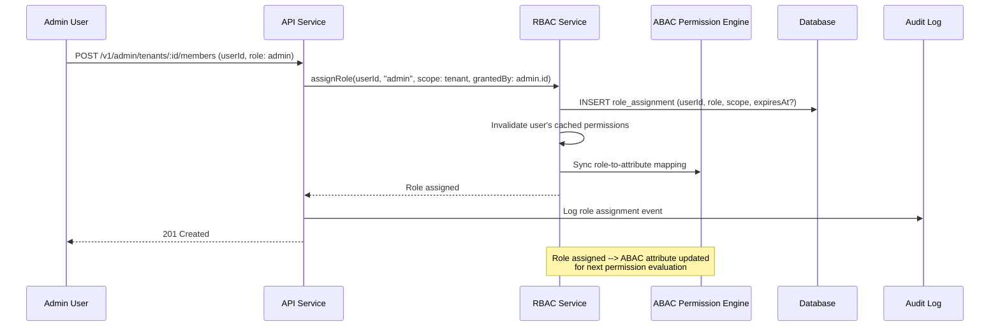

# Role-Based Access Control (RBAC)

> **Purpose:** Define RBAC model for Vaeloom (Enterprise)
> **Status:** 🆕 New

## RBAC Architecture

```mermaid
graph TD
    classDef owner fill:#e3f2fd,stroke:#1565c0,color:#000,stroke-width:2px
    classDef admin fill:#e8f5e9,stroke:#2e7d32,color:#000,stroke-width:1.5px
    classDef member fill:#fff3e0,stroke:#e65100,color:#000,stroke-width:1.5px
    classDef viewer fill:#f3e5f5,stroke:#6a1b9a,color:#000,stroke-width:1px
    classDef support fill:#ffebee,stroke:#c62828,color:#000,stroke-width:1px

    subgraph Roles["👤 RBAC Roles (Enterprise)"]
        direction TB
        RO["owner<br/>Full control · Own workspace"]
        RA["admin<br/>User mgmt, settings, billing · Tenant"]
        RM["member<br/>Standard features · Workspace"]
        RV["viewer<br/>Read-only · Workspace"]
        RS["support<br/>Audit, connectors, troubleshooting · Tenant"]
    end

    subgraph Matrix["📋 Permission Matrix"]
        direction TB
        M1["Documents: Owner CRUD --> Viewer Read"]
        M2["Connectors: Owner CRUD --> Viewer Read"]
        M3["Settings: Owner CRUD --> Admin CRUD --> Member Read"]
        M4["Users: Owner+Admin CRUD --> Member Read"]
        M5["Billing: Owner CRUD --> Admin Read"]
        M6["Audit logs: Owner+Admin Read --> Support Read"]
        M7["Agents: Owner Full --> Member Use"]
    end

    subgraph Assignment["📝 Role Assignment Schema"]
        AS1["userId: string<br/>role: owner|admin|member|viewer|support<br/>scope: workspace|tenant<br/>grantedBy: string<br/>grantedAt: Date<br/>expiresAt?: Date"]
    end

    Roles --> Matrix --> Assignment

    class RO owner
    class RA admin
    class RM member
    class RV viewer
    class RS support
    class M1,M2,M3,M4,M5,M6,M7 matrix
    class AS1 assignment
```



> **Diagram:** RBAC architecture — **5 roles** (owner→support) with scope, **permission matrix** across 7 resource types (Documents→Agents), **role assignment schema** with userId, role, scope, grant info, and optional expiry.

---

## RBAC Model

RBAC is an **enterprise feature** (Phase 7). MVP uses per-workspace scoping with per-agent autonomy.

## Roles

| Role | Permissions | Scope |
|------|-------------|-------|
| `owner` | Full control | Own workspace |
| `admin` | User management, settings, billing | Enterprise tenant |
| `member` | Standard feature access | Assigned workspace |
| `viewer` | Read-only access | Assigned workspace |
| `support` | Audit log, connector status, basic troubleshooting | Tenant-scoped |

## Permission Matrix

| Resource | Owner | Admin | Member | Viewer | Support |
|----------|-------|-------|--------|--------|---------|
| Documents | CRUD | CRUD | CRUD | Read | Read |
| Connectors | CRUD | CRUD | CRUD | Read | Read |
| Settings | CRUD | CRUD | Read | — | — |
| Users | CRUD | CRUD | Read | — | — |
| Billing | CRUD | Read | — | — | — |
| Audit logs | Read | Read | Own actions | — | Read |
| Agents | Full | Configure | Use | Use | Read |

## Role Assignment

```typescript
interface RoleAssignment {
  userId: string;
  role: 'owner' | 'admin' | 'member' | 'viewer' | 'support';
  scope: 'workspace' | 'tenant';
  grantedBy: string;
  grantedAt: Date;
  expiresAt?: Date;
}
```

## Common Mistakes

| Mistake | Consequence |
|---------|-------------|
| Role explosion — creating too many granular roles | 20+ roles with subtle differences become impossible to manage and audit — users end up with incorrect role assignments |
| Using roles for both authentication and authorization | Roles should define access levels, not identity — mixing identity ("is a student") with access ("can edit documents") creates fragile permission models |
| Granting roles without expiry | Temporary collaborators or interns keep access indefinitely — every role assignment should have an optional expiry date |
| Assigning roles at the wrong scope | A workspace-level "admin" role should not grant tenant-level billing access — role scope (workspace vs. tenant) must be explicit in the schema |

## Best Practices

| Practice | Why |
|----------|-----|
| Keep roles to 5-7 at most | A small set of clearly defined roles (owner, admin, member, viewer, support) is easier to audit and maintain than dozens of granular roles |
| Use attribute-based conditions within roles | Instead of creating a "read-only admin" role, use the ABAC layer to add context conditions to the existing admin role |
| Assign the minimum role needed | A user who only needs to view documents gets "viewer," not "member" — escalations should be requested and approved, not assumed |
| Audit role assignments regularly | Automated reports of users with admin or owner roles should be reviewed monthly — stale privileged access is a security risk |

## Security

| Concern | Mitigation |
|---------|------------|
| Role escalation through transitive group membership | A user who is a "viewer" in an organization but a "member" of a sub-group could inherit permissions from the more permissive role — flatten role resolution to the least privileged assignment when roles conflict |
| Permission matrix drift over time | As new resources and actions are added (e.g., a new "export" action), only the owner role may be updated — add new actions to all appropriate roles in the matrix before deployment |
| Stale role assignments persisting after user offboarding | A terminated user with active role assignments retains access until their session expires — integrate role deactivation with the identity provider and invalidate sessions on role revocation |

## Performance

| Concern | Mitigation |
|---------|------------|
| Role lookup latency with inheritance chains | Resolving a user's effective permissions across role groups and inheritance chains requires multiple DB queries — cache resolved role assignments per user with a TTL of 5-15 minutes |
| Permission matrix evaluation at scale | Computing a user's permissions across the full matrix (7 resource types × 5 roles) on every request adds latency — pre-compute and cache the effective permission set on login and role change |
| Role listing overhead for admin UIs | An admin dashboard that lists all users with their resolved roles fetches N×M rows — use a denormalized role-view materialized query or Redis cache for admin-facing role lists |

---

## Goals

1. **Enterprise-grade access control** — Provide role-based access control as an enterprise feature (Phase 7) that works alongside the ABAC permission engine
2. **Clear role hierarchy** — Define 5 distinct roles (owner, admin, member, viewer, support) with explicit permission matrices per resource type
3. **Scope-aware assignments** — Support both workspace-scoped and tenant-scoped role assignments with optional expiry
4. **Least-privilege enforcement** — Roles start with minimum permissions; assignments include optional expiry dates

---

## Scope

### In Scope

- 5 RBAC roles: owner, admin, member, viewer, support
- Permission matrix covering 7 resource types (documents, connectors, settings, users, billing, audit logs, agents)
- Role assignment schema with userId, role, scope (workspace/tenant), grant metadata, and optional expiry
- Integration with ABAC engine for attribute-based conditions within roles

### Out of Scope

- RBAC for non-enterprise tiers (MVP uses per-workspace scoping with per-agent autonomy only)
- Hierarchical role inheritance across organizations (simple flat role model)
- Dynamic role creation (roles are fixed at 5)
- Role-based SSO group mapping (planned for enterprise SAML integration)

---

## Functional Requirements

| ID | Requirement | Priority |
|----|-------------|----------|
| F-001 | System SHALL support 5 roles: owner, admin, member, viewer, support | P0 |
| F-002 | System SHALL enforce permission matrix across 7 resource types with CRUD-level granularity | P0 |
| F-003 | System SHALL support workspace-scoped and tenant-scoped role assignments | P0 |
| F-004 | System SHALL support optional expiry dates on role assignments | P0 |
| F-005 | System SHALL resolve role conflicts (multiple assignments) to least privileged | P1 |
| F-006 | System SHALL integrate with ABAC for attribute-based conditions within roles | P1 |

---

## Non-Functional Requirements

| ID | Requirement | Target |
|----|-------------|--------|
| NF-001 | Role evaluation latency | < 10ms p95 |
| NF-002 | Role assignment cache TTL | 5-15 minutes |
| NF-003 | Permission matrix update propagation | < 30 seconds across all nodes |
| NF-004 | Role audit trail completeness | 100% of role assignments and revocations logged |
| NF-005 | Max role assignments per user | 10 (prevents assignment explosion) |

---

## Sequence Diagrams



> **Diagram:** RBAC role assignment — Admin assigns "admin" role to a user; RBAC service persists the assignment, invalidates the user's permission cache, syncs with ABAC for attribute mapping, and logs the event.

---

## Data Flow

```text
1. Admin initiates role assignment via admin API
2. RBAC service validates: granter has 'admin' or 'owner' role at same or higher scope
3. Role assignment persisted with userId, role, scope, grantedBy, grantedAt, expiresAt
4. User's cached permission set invalidated (Redis key deleted)
5. ABAC Permission Engine notified of role change for attribute sync
6. On subsequent request: user's role fetched from cache or DB
7. Role mapped to permission matrix → resolved to (resource × action) permissions
8. If user has multiple role assignments: resolve to least privileged
9. If assignment expired: treat as if no assignment exists
10. Every role change logged to audit trail (assignment, modification, revocation)
```

---

## APIs

| Endpoint | Method | Description |
|----------|--------|-------------|
| `/v1/admin/tenants/:id/roles` | GET | List all roles and their permission matrices |
| `/v1/admin/tenants/:id/members` | GET | List members with their assigned roles |
| `/v1/admin/tenants/:id/members` | POST | Assign a role to a user |
| `/v1/admin/tenants/:id/members/:userId` | PUT | Update a user's role assignment |
| `/v1/admin/tenants/:id/members/:userId` | DELETE | Remove a user's role assignment |
| `/v1/admin/tenants/:id/audit/roles` | GET | Query role assignment audit history |

---

## Database

| Table | Purpose | Key Columns |
|-------|---------|-------------|
| `role_assignments` | Active role assignments | id, user_id, role (owner/admin/member/viewer/support), scope_type (workspace/tenant), scope_id, granted_by, granted_at, expires_at |
| `role_assignment_audit` | Append-only audit of role changes | id, user_id, action (assigned/modified/revoked), old_role, new_role, changed_by, changed_at |
| `role_permission_matrix` | Definitive permission matrix per role | role, resource_type, permissions (jsonb: {read, write, delete, admin}) |

---

## Scalability

| Dimension | Current Limit | 10x Strategy | 100x Strategy |
|-----------|---------------|--------------|---------------|
| Role assignments per tenant | 1000 | Composite index on (scope_type, scope_id) | Partition role_assignments by tenant_id |
| Permission matrix size | 7 resources × 5 roles | Cache entire matrix in Redis (< 5KB) | CDN-cached permission matrix for edge nodes |
| Concurrent role evaluations | 500/s per node | Cached resolved permissions per user | Distributed permission cache with local hot cache |
| Audit log volume | 10K changes/month | Partition by month | Archive > 12 months to cold storage |

---

## Error Handling

| Scenario | Detection | Mitigation | Recovery |
|----------|-----------|------------|----------|
| Conflicting role assignments | User has 2+ roles at same scope | Resolve to least privileged; log warning | Admin reviews and resolves conflict |
| Expired role not cleaned up | Assignment past expires_at | Treat as inactive; background job removes expired assignments | Nightly cleanup cron removes expired rows |
| Role grantor lacks authority | Granter has lower role than target | Reject assignment with 403 Forbidden | Granter requests role escalation |
| Permission matrix missing entry | New resource type not in matrix | Deny all actions for that resource | Admin updates permission matrix |

---

## Monitoring

| Metric | Alert Threshold | Severity | Dashboard |
|--------|-----------------|----------|-----------|
| Role assignment rate | > 100/15 min | Warning | RBAC > Assignment Rate |
| Expired role assignments not cleaned | > 10 expired | Info | RBAC > Expiry |
| Role conflict resolution rate | > 5/month | Warning | RBAC > Conflicts |
| Permission matrix change rate | Any change to production matrix | Info | RBAC > Matrix Changes |
| Users with admin/owner roles | Count trending up | Info | RBAC > Privileged Users |

---

## Deployment

| Environment | Method | Trigger | Verification |
|-------------|--------|---------|--------------|
| Development | RBAC as NestJS module (feature-flagged) | Git push | Unit tests: all 5 roles verified against permission matrix |
| Staging | Deployed with admin API (feature-flagged) | PR merged to main | Integration test: assign role → verify permission change |
| Production | Enabled for enterprise tenants only | Feature flag per tenant | Canary: verify role assignment creates correct ABAC attribute |

---

## Configuration

| Variable | Purpose | Default | Required |
|----------|---------|---------|----------|
| `RBAC_CACHE_TTL` | Resolved role assignment cache TTL | 300s | Yes |
| `RBAC_DEFAULT_ROLE` | Default role for new workspace members | member | Yes |
| `RBAC_MAX_ASSIGNMENTS` | Max role assignments per user | 10 | No |
| `RBAC_CLEANUP_INTERVAL` | Expired assignment cleanup interval | 86400s (daily) | No |
| `RBAC_AUDIT_RETENTION` | Audit log retention in hot storage | 365 days | No |

---

## Limitations

| Limitation | Impact | Workaround | Future Resolution |
|------------|--------|------------|-------------------|
| Fixed 5 roles (no custom role creation) | Cannot create org-specific roles (e.g., "intern", "contractor") | Use ABAC conditions to add constraints within existing roles | Custom role builder with permission matrix designer |
| No role inheritance across workspaces | A user with admin role in Workspace A has no special access in Workspace B | Explicitly assign role in each workspace | Organization-level role inheritance |
| RBAC only at enterprise tier | MVP uses simpler per-workspace model | N/A (RBAC not needed until multi-tenant enterprise) | Backport RBAC to Pro tier if requested |

---

## Examples

```typescript
// Define a custom RBAC role
import { RBAC } from '@vaeloom/auth';

const role = RBAC.createRole({
  name: 'workspace_admin',
  permissions: [
    'workspace:read', 'workspace:write', 'workspace:delete',
    'documents:*', 'members:manage',
  ],
});
```

```python
# Assign role to a user
from Vaeloom.access_control import RBACManager

rbac = RBACManager()
rbac.assign_role("user_42", "workspace_admin", scope="workspace:ws_abc123")
```

```bash
# Verify a user's role
curl -X GET "https://api.Vaeloom.ai/v1/users/user_42/roles" \
  -H "X-API-Key: $Vaeloom_API_KEY"
```

## Future Improvements

| Improvement | Priority | Complexity | Timeline |
|-------------|----------|------------|----------|
| Custom role builder with permission matrix designer | High | High | Q1 2027 |
| Organization-level role inheritance | Medium | Medium | Q2 2027 |
| RBAC for Pro tier (small-team multi-workspace) | Low | Medium | Q2 2027 |
| Role-based SSO group mapping (SAML assertion → role) | Medium | Medium | Q1 2027 |
| Role assignment approval workflows | Low | High | Q3 2027 |

---

## Related Documents

- [Authorization.md](./Authorization.md)
- [ABAC.md](./ABAC.md)
- [`Security/IAM.md`](../Security/IAM.md)
