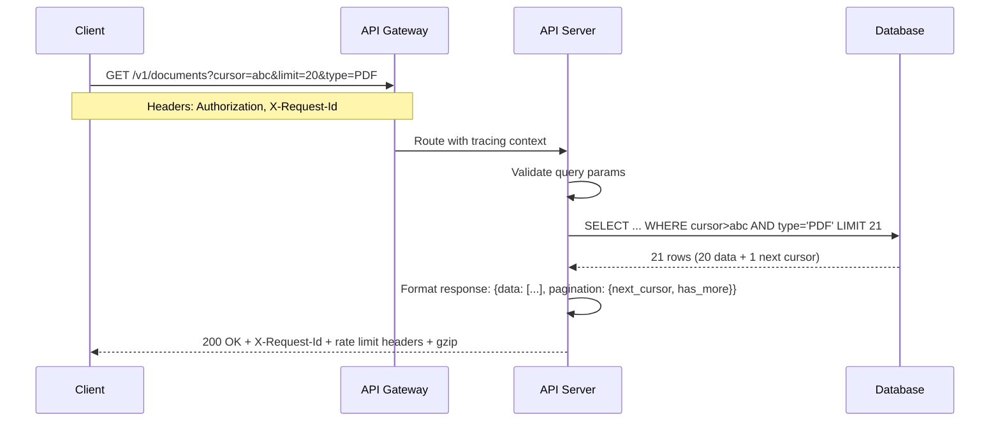

# REST Standards

> **Purpose:** Define REST API standards and conventions for Vaeloom
> **Status:** ✅ Upgraded to enterprise quality
> **Owner:** Backend Team
> **Last Updated:** 2026-07-13

## REST API Architecture

```mermaid
graph TD
    classDef url fill:#e3f2fd,stroke:#1565c0,color:#000,stroke-width:2px
    classDef req fill:#e8f5e9,stroke:#2e7d32,color:#000,stroke-width:1.5px
    classDef code fill:#fff3e0,stroke:#e65100,color:#000,stroke-width:1.5px

    subgraph Conventions["📐 URL Conventions"]
        C1["Plural nouns: /documents"]
        C2["Lowercase hyphens: /memory-graph"]
        C3["Nested resources: /workspaces/{id}/docs/{id}"]
        C4["Actions as verbs: /documents/{id}/archive"]
    end

    subgraph Patterns["📋 Request/Response Patterns"]
        P1["Pagination: ?page=2&limit=20<br/>Response: data[] + meta{page,limit,total}"]
        P2["Filtering: ?type=PDF&status=processed<br/>Query: ?q=resume<br/>Date: ?created_after=2026-01-01"]
        P3["Sorting: ?sort=created_at:desc<br/>Multi: ?sort=name:asc,created_at:desc"]
    end

    subgraph Headers["🔧 Standard Headers"]
        H1["Authorization: Bearer &lt;token&gt; -- Always"]
        H2["Content-Type: application/json -- POST/PUT"]
        H3["X-Request-Id: Trace ID -- Always"]
        H4["X-Workspace-Id: Workspace context -- Resource requests"]
    end

    subgraph StatusCodes["📊 HTTP Status Codes"]
        S1["200: GET/PATCH success<br/>201: POST created<br/>204: DELETE success"]
        S2["400: Bad request<br/>401: Unauthenticated<br/>403: Unauthorized<br/>404: Not found"]
        S3["409: Conflict<br/>429: Rate limited<br/>500: Server error"]
    end

    Conventions --> Patterns --> Headers --> StatusCodes

    class C1,C2,C3,C4 url
    class P1,P2,P3 req
    class H1,H2,H3,H4 headers
    class S1,S2,S3 code
```



> **Diagram:** REST standards — **URL conventions** (plural, lowercase, nested, verbs), **request/response patterns** (pagination, filtering, sorting), **standard headers** (Auth, Content-Type, Request-Id, Workspace-Id), **HTTP status codes** (success 200/201/204, client errors 400-429, server error 500).

---

## URL Conventions

- Plural nouns for resources: `/documents`, `/applications`
- Lowercase with hyphens: `/memory-graph`
- Nested for sub-resources: `/workspaces/{id}/documents/{id}`
- Actions as verbs: `/documents/{id}/archive`

## Request/Response Patterns

### Pagination

```json
GET /documents?page=2&limit=20
→ {
    "data": [...],
    "meta": {
      "page": 2,
      "limit": 20,
      "total": 142,
      "total_pages": 8
    }
  }
```

### Filtering

```text
GET /documents?type=PDF&status=processed
GET /documents?q=resume
GET /documents?created_after=2026-01-01
```

### Sorting

```text
GET /documents?sort=created_at:desc
GET /documents?sort=name:asc,created_at:desc
```

## Standard Headers

| Header | When | Example |
|--------|------|---------|
| `Authorization` | Always | `Bearer <token>` |
| `Content-Type` | POST/PUT | `application/json` |
| `X-Request-Id` | Always | Trace ID for debugging |
| `X-Workspace-Id` | All resource requests | Workspace context |

## HTTP Status Codes

| Code | When |
|------|------|
| 200 | Successful GET, PATCH |
| 201 | Successful POST (created) |
| 204 | Successful DELETE |
| 400 | Bad request / validation error |
| 401 | Unauthenticated |
| 403 | Unauthorized (permission denied) |
| 404 | Resource not found |
| 409 | Conflict (duplicate, version conflict) |
| 429 | Rate limited |
| 500 | Internal server error |

## Common Mistakes

| Mistake | Consequence |
|---------|-------------|
| Using verbs in URL paths | `/createDocument` and `/deleteDocument` instead of `POST /documents` and `DELETE /documents/{id}` — breaks REST conventions and prevents HTTP method caching |
| Returning 200 for all responses with error codes in the body | Clients can't distinguish success from failure without parsing the body — use HTTP status codes correctly (201 for created, 400 for bad request) |
| Inconsistent pagination format across endpoints | Some endpoints return `{data, total}`, others `{items, count}` — every client must handle multiple formats |
| Nesting resources too deeply | `/workspaces/{id}/documents/{id}/versions/{id}/comments/{id}` creates URLs that are hard to maintain — flatten after 2 levels or use query parameters |

## Best Practices

| Practice | Why |
|----------|-----|
| Plural nouns, lowercase, hyphens for multi-word | `/memory-graph` not `/memoryGraph` or `/memory_graph` — consistency across all endpoints reduces cognitive load |
| Use standard HTTP methods for CRUD | GET (read), POST (create), PATCH (partial update), DELETE (remove) — this maps cleanly to HTTP semantics and intermediary caching |
| Include pagination metadata in every list response | `{data: [], meta: {page, limit, total, total_pages}}` — clients need page info to build navigation without guessing |
| Return structured error responses with error codes | `{error: {code, message, details}}` — error codes let clients handle specific errors programmatically instead of parsing message strings |

## Security

| Concern | Mitigation |
|---------|------------|
| Mass assignment via unexpected fields | An API client sending extra fields (e.g., `role: admin` in a user creation request) can escalate privileges if the server accepts all fields — use DTOs with explicit allow-lists, never pass raw request bodies to services |
| Insecure direct object references (IDOR) | Exposing internal IDs in URLs (`/documents/123`) lets an attacker enumerate resources by incrementing the ID — use UUIDs and enforce ownership checks on every resource access |
| Rate limit evasion through HTTP method variation | If rate limiting only applies to POST requests, an attacker can use PATCH or PUT to bypass limits — apply rate limits uniformly across all mutation methods for the same resource |

## Performance

| Concern | Mitigation |
|---------|------------|
| Pagination overhead on large datasets | Offset-based pagination (`page=1000&limit=20`) forces the database to scan and discard rows — use cursor-based pagination for large datasets or set a maximum page offset |
| JSON serialization cost for list endpoints | Serializing 20 nested resources with full object graphs can take 50ms+ — implement sparse field selection (`?fields=id,name,type`) so clients request only what they need |
| Uncompressed response payloads | Large list responses (1MB+) without compression consume bandwidth and increase latency — enable gzip/brotli compression at the API gateway for all text-based responses |

---

## Goals

1. **Consistent API design** — Establish a single set of REST conventions (URL format, pagination, filtering, sorting, headers, status codes) used by every Vaeloom endpoint
2. **Developer-friendly DX** — Make the API intuitive for both human developers and AI agents, with predictable patterns across all resources
3. **Interoperable with tooling** — Follow OpenAPI 3.1 standards so Postman, Insomnia, and SDK generators work without custom configuration
4. **Cacheable and performant** — Use HTTP semantics (ETags, status codes, compression) that work with CDNs and client-side caching

---

## Scope

### In Scope

- URL conventions: plural nouns, lowercase hyphens, nested resources, action verbs
- Pagination: cursor-based with `cursor` and `limit` parameters
- Filtering: query parameters for field matching, text search, date ranges
- Sorting: `?sort=field:direction` with multi-column support
- Standard headers: Authorization, Content-Type, X-Request-Id, X-Workspace-Id
- HTTP status codes: 200, 201, 204, 400, 401, 403, 404, 409, 429, 500
- Error response format: structured `{error: {code, message, details}}`

### Out of Scope

- API authentication strategy (covered in Authentication.md)
- Rate limiting implementation (covered in Rate-Limiting.md)
- GraphQL query patterns (covered in GraphQL.md)
- WebSocket or streaming API patterns

---

## Functional Requirements

| ID | Requirement | Priority |
|----|-------------|----------|
| F-001 | All endpoints SHALL use plural nouns for resource names (e.g., `/documents`, `/workspaces`) | P0 |
| F-002 | All list endpoints SHALL support cursor-based pagination with `cursor` and `limit` parameters | P0 |
| F-003 | All endpoints SHALL return the standard error format `{error: {code, message, details}}` on failure | P0 |
| F-004 | All endpoints SHALL accept `X-Request-Id` header for request tracing | P0 |
| F-005 | All endpoints SHALL return appropriate HTTP status codes for success and error conditions | P0 |
| F-006 | All mutation endpoints SHALL accept `Idempotency-Key` header | P1 |

---

## Non-Functional Requirements

| ID | Requirement | Target |
|----|-------------|--------|
| NF-001 | Response format consistency | 100% of endpoints follow the same response envelope |
| NF-002 | Pagination performance (cursor-based) | O(1) pagination cost regardless of offset depth |
| NF-003 | JSON response compression | gzip/brotli enabled for all responses > 1KB |
| NF-004 | Standard header presence | 100% of responses include X-Request-Id |
| NF-005 | Status code accuracy | 100% of error conditions map to correct HTTP status code |

---

## Sequence Diagrams



> **Diagram:** Standard REST request — Client sends paginated GET with cursor, limit, and filter. API adds +1 to limit for cursor detection, formats standard response with pagination metadata, and returns with proper headers.

---

## Data Flow

```text
1. Client constructs URL following REST conventions (plural noun, lowercase, nested if needed)
2. Client adds required headers: Authorization (Bearer JWT), X-Request-Id (trace ID), X-Workspace-Id
3. API Gateway validates JWT and extracts user context
4. Gateway routes to controller matching the resource path
5. Controller validates query parameters against expected schema
6. Service layer executes business logic with validated parameters
7. Response formatted in standard envelope: data + pagination meta (for lists) or data (for single)
8. On error: global exception filter catches and formats as {error: {code, message, details}}
9. Response headers added: X-Request-Id, rate limit headers, Content-Type, Cache-Control
10. Response compressed with gzip/brotli if Accept-Encoding header present
```

---

## APIs

| Convention | Standard | Example |
|------------|----------|---------|
| Resource naming | Plural nouns | `/documents`, `/workspaces`, `/agents` |
| Multi-word resources | Lowercase hyphens | `/memory-graph`, `/audit-logs` |
| Nested resources | 2 levels max | `/workspaces/{id}/documents/{id}` |
| Actions as verbs | POST with verb suffix | `/documents/{id}/archive` |
| Pagination | cursor + limit | `?cursor=abc&limit=20` |
| Filtering | query params | `?type=PDF&status=processed` |
| Sorting | `field:direction` | `?sort=created_at:desc` |
| Error responses | structured object | `{error: {code, message, details}}` |

---

## Database

| Table | Purpose | Key Columns |
|-------|---------|-------------|
| `api_endpoints` | Endpoint registry for standards compliance checks | path, method, resource_type, supports_pagination, supports_filtering, created_at |
| `api_response_cache` | ETag response cache for GET endpoints | url_hash, etag, response_body (jsonb), expires_at |

---

## Scalability

| Dimension | Current Limit | 10x Strategy | 100x Strategy |
|-----------|---------------|--------------|---------------|
| Endpoint count | 35 endpoints | Modular controllers per domain | Dynamic route registration with service mesh |
| Pagination depth | 10K pages | Cursor-based (O(1) per page) | Distributed cursor with shard-aware pagination |
| Response compression | gzip enabled | Brotli for API responses | Edge compression at CDN level |
| Request tracing | X-Request-Id per request | Distributed trace context propagation | OpenTelemetry with sampling |

---

## Error Handling

| Scenario | Detection | Mitigation | Recovery |
|----------|-----------|------------|----------|
| Invalid request body | class-validator rejection | Return 400 with field-level details | Client fixes based on error details array |
| Unauthenticated request | Missing/invalid JWT | Return 401 | Client re-authenticates |
| Unauthorized request | Permission Engine denies | Return 403 | Client requests access or different resource |
| Resource not found | ID doesn't exist in DB | Return 404 | Client checks resource ID |
| Rate limit exceeded | Token bucket empty | Return 429 with Retry-After | Client respects Retry-After header |

---

## Monitoring

| Metric | Alert Threshold | Severity | Dashboard |
|--------|-----------------|----------|-----------|
| Non-standard response format | > 1% of responses deviate from envelope | Critical | REST Standards > Compliance |
| Missing required headers | > 0.1% of responses missing X-Request-Id | Warning | REST Standards > Headers |
| Incorrect status code usage | > 0.5% of 5xx should be 4xx | Warning | REST Standards > Status Codes |
| Pagination errors | > 0.1% of paginated requests fail | Info | REST Standards > Pagination |

---

## Deployment

| Environment | Method | Trigger | Verification |
|-------------|--------|---------|--------------|
| Development | Enforced via ESLint rules + code review | Git push | Lint: endpoint follows naming conventions |
| Staging | Automated API spec compliance tests | PR merged to main | Tests: all endpoints match OpenAPI spec |
| Production | OpenAPI spec validation in CI/CD | Tagged release | Audit: automatic scan for non-compliant endpoints |

---

## Configuration

| Variable | Purpose | Default | Required |
|----------|---------|---------|----------|
| `REST_PAGINATION_DEFAULT_LIMIT` | Default items per page | 20 | Yes |
| `REST_PAGINATION_MAX_LIMIT` | Maximum items per page | 100 | Yes |
| `REST_COMPRESSION_ENABLED` | Enable gzip/brotli compression | true | No |
| `REST_REQUEST_TIMEOUT` | Default request timeout | 30000ms | Yes |
| `REST_MAX_NESTING_DEPTH` | Max URL nesting depth | 2 | Yes |

---

## Limitations

| Limitation | Impact | Workaround | Future Resolution |
|------------|--------|------------|-------------------|
| Cursor-based pagination doesn't support random page access | Users cannot jump to page N directly | Use search with filters instead of pagination | Add offset-based pagination (with performance warning) |
| No partial response support (fields parameter) | Clients always receive full object | Use sparse field sets at the service level | Add `?fields=id,name,type` parameter |
| No bulk operations (batch GET/POST) | Clients make N requests for N items | Use cursor pagination with large limit | Add batch endpoint for common bulk operations |

---

## Examples

```typescript
// Paginated document listing (following Vaeloom REST conventions)
const { data, pagination } = await Vaeloom.get('/documents', {
  params: { page: 2, per_page: 25, sort: '-created_at' },
});
console.log(pagination); // { page: 2, per_page: 25, total: 142, pages: 6 }
```

```python
# Standard error response handling
import httpx

resp = httpx.get("https://api.Vaeloom.ai/v1/documents/invalid")
if resp.status_code == 422:
    error = resp.json()
    print(f"{error['code']}: {error['message']}")
    for field in error['details']:
        print(f"  {field['field']}: {field['issue']}")
```

```bash
# Create resource with proper status codes
curl -s -o /dev/null -w "%{http_code}" -X POST "https://api.Vaeloom.ai/v1/documents" \
  -H "X-API-Key: $Vaeloom_API_KEY" \
  -H "Content-Type: application/json" \
  -d '{"title": "Test"}'
# Returns 201 on success
```

## Future Improvements

| Improvement | Priority | Complexity | Timeline |
|-------------|----------|------------|----------|
| Partial response support with `?fields` parameter | High | Low | Q3 2026 |
| Batch GET and batch POST endpoints | Medium | Medium | Q4 2026 |
| OpenAPI 3.1 spec auto-generated from TypeScript types | High | Low | Q3 2026 |
| HTTP/2 server push for resource relationships | Low | High | Q2 2027 |

---

## Related Documents

- [API Architecture.md](./API-Architecture.md)
- [Validation.md](./Validation.md)
- [API Reference.md](./API-Reference.md)
- [Authentication.md](./Authentication.md)
