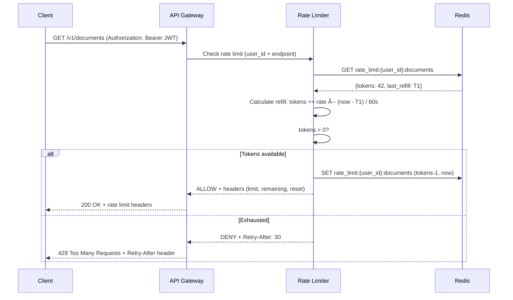

# Rate Limiting

> **Purpose:** Define rate limiting strategy for Vaeloom API

## Rate Limit Architecture

```mermaid
graph TD
    classDef tiers fill:#e3f2fd,stroke:#1565c0,color:#000,stroke-width:1.5px
    classDef endpoint fill:#e8f5e9,stroke:#2e7d32,color:#000,stroke-width:1.5px
    classDef impl fill:#fff3e0,stroke:#e65100,color:#000,stroke-width:1.5px
    classDef response fill:#f3e5f5,stroke:#6a1b9a,color:#000,stroke-width:1.5px

    subgraph Tiers["🎯 Rate Limit Tiers"]
        direction TB
        FREE["Free<br/>60 req/min<br/>Burst: 100"]
        PRO["Pro<br/>300 req/min<br/>Burst: 500"]
        ENT["Enterprise<br/>1000 req/min<br/>Burst: 2000"]
        INT["Internal<br/>5000 req/min<br/>Burst: 10000"]
    end

    subgraph Endpoints["📌 Endpoint-Specific Limits"]
        direction TB
        E1["POST /chat/message<br/>20/min<br/>Reason: AI inference cost"]
        E2["POST /documents<br/>10/min<br/>Reason: Ingestion capacity"]
        E3["GET /memory/search<br/>30/min<br/>Reason: Vector search cost"]
        E4["POST /auth/login<br/>5/min<br/>Reason: Brute force prevention"]
    end

    subgraph Implementation["⚙️ Token Bucket Algorithm"]
        direction TB
        I1["Request arrives<br/>with user_id / workspace_id"]
        I2["Redis: GET tokens_remaining<br/>+ last_refill for key"]
        I3["Calculate refill:<br/>tokens += rate * (now - last) / 60s"]
        I4{"tokens > 0?"}
        I5["✅ Consume 1 token<br/>Set last_refill = now<br/>Allow request through"]
        I6["❌ No tokens remaining<br/>Return 429 + Retry-After"]
    end

    subgraph Response["📋 Rate Limit Headers"]
        direction TB
        R1["X-RateLimit-Limit: 60"]
        R2["X-RateLimit-Remaining: 42"]
        R3["X-RateLimit-Reset: 1626075600"]
        R4["Retry-After: 30"]
    end

    FREE & PRO & ENT & INT --> I1
    E1 & E2 & E3 & E4 --> I1
    I1 --> I2 --> I3 --> I4
    I4 -->|Yes| I5
    I4 -->|No| I6
    I5 -.->|Set headers| R1 & R2 & R3
    I6 -.->|Set headers| R1 & R2 & R3 & R4

    class FREE,PRO,ENT,INT tiers
    class E1,E2,E3,E4 endpoint
    class I1,I2,I3,I4,I5,I6 impl
    class R1,R2,R3,R4 response

```



> **Diagram:** Rate limiting uses a Redis-backed **token bucket** algorithm per user/workspace. Each request checks the token count, refills at the configured rate, and either allows (consuming a token) or returns **429 Too Many Requests** with `Retry-After`. Tier limits apply across all endpoints; specific endpoints have tighter limits (e.g., `POST /chat/message` at 20/min). Rate limit headers are returned on every response.

---

## Rate Limit Tiers

| Tier | Requests/minute | Burst | Applied To |
|------|----------------|-------|------------|
| Free | 60 | 100 | All API endpoints |
| Pro | 300 | 500 | All API endpoints |
| Enterprise | 1000 | 2000 | All API endpoints |
| Internal | 5000 | 10000 | Service-to-service calls |

## Specific Endpoint Limits

| Endpoint | Limit | Rationale |
|----------|-------|-----------|
| `POST /chat/message` | 20/min | AI inference cost |
| `POST /documents` | 10/min | Ingestion pipeline capacity |
| `GET /memory/search` | 30/min | Vector search cost |
| `POST /auth/login` | 5/min | Brute force prevention |

## Rate Limit Headers

```http
X-RateLimit-Limit: 60
X-RateLimit-Remaining: 42
X-RateLimit-Reset: 1626075600
```

## Exceeded Response

```json
// HTTP 429
{
  "error": {
    "code": "RATE_LIMITED",
    "message": "Too many requests. Try again in 30 seconds.",
    "retry_after": 30
  }
}
```

## Implementation

- Token bucket algorithm per user/workspace
- Redis-backed for distributed rate limiting
- Configurable per-environment (staging: double limits)

## Common Mistakes

| Mistake | Consequence |
|---------|-------------|
| Using IP-based rate limiting for authenticated endpoints | Users behind a shared NAT (office, campus) all share one IP — one user hitting the limit blocks everyone else. Rate limit by user_id, not IP |
| Not distinguishing read vs. write limits | Writes (create, update, delete) are more expensive and dangerous than reads — apply tighter limits to mutation endpoints |
| Forgetting to rate limit internal service calls | Internal RPC between api and ai-service without rate limits can cascade failures — apply internal burst limits for cross-service calls |
| Using a single rate limit for all endpoints | AI inference endpoints (chat, search) cost more than CRUD — a single limit means either CRUD is too restrictive or AI endpoints are too permissive |

## Best Practices

| Practice | Why |
|----------|-----|
| Use token bucket algorithm with per-user keys | Token bucket allows natural bursts while enforcing average rate — store tokens in Redis for distributed consistency |
| Apply tighter limits to expensive endpoints | POST /chat/message (20/min) costs AI inference — keep it low. GET /documents (300/min) is cheap — keep it high |
| Return consistent rate limit headers on every response | X-RateLimit-Limit, X-RateLimit-Remaining, and X-RateLimit-Reset let clients self-regulate — without them, clients retry blindly |
| Use separate limit tiers for read vs. write operations | Reads can typically handle 10x the rate of writes — apply different token buckets per HTTP method |

## Security

| Concern | Mitigation |
|---------|------------|
| Rate limit bypass through header spoofing | If rate limiting keys on `X-Forwarded-For`, an attacker can rotate IP headers to bypass limits — always key rate limits on authenticated user_id for authenticated endpoints, not IP-derived values |
| Distributed denial of service through multi-account attacks | An attacker with 100 accounts each getting 60 req/min can generate 6K total requests without triggering per-user limits — implement aggregate rate limits per workspace and per IP range |
| Token bucket exhaustion blocking legitimate traffic | A sharp traffic spike from a legitimate batch job can exhaust the token bucket and block the user — use separate rate limit tiers for interactive (user-facing) and batch (background job) traffic |

## Performance

| Concern | Mitigation |
|---------|------------|
| Redis round-trip latency on every request | Every API request incurs a Redis call to check and consume a rate limit token — batch rate limit checks using Redis pipeline or use local in-memory token buckets with periodic Redis sync |
| Token refill calculation overhead under high concurrency | Recalculating token refills for thousands of concurrent users adds CPU overhead — use Redis sorted sets for sliding window algorithms that amortize the cost across requests |
| Rate limit header generation on every response | Computing and serializing rate limit headers (limit, remaining, reset) for every response adds 1-2ms — skip header generation for internal service calls and generate only on rate-limited responses for efficiency |

---

## Goals

1. **Protect system resources** — Prevent any single user, workspace, or API key from overwhelming the API or exhausting AI inference capacity
2. **Fair resource allocation** — Ensure Free tier users get predictable capacity while Pro and Enterprise users receive proportional allocations
3. **Self-regulating clients** — Return consistent rate limit headers so clients can throttle themselves without hitting 429s
4. **Defense against abuse** — Apply tighter limits to expensive endpoints (chat, document upload) and auth endpoints to prevent brute force and cost exhaustion

---

## Scope

### In Scope

- Per-tier rate limits: Free (60/min), Pro (300/min), Enterprise (1000/min), Internal (5000/min)
- Endpoint-specific tighter limits: chat (20/min), document upload (10/min), memory search (30/min), login (5/min)
- Redis-backed token bucket algorithm for distributed rate limiting
- Rate limit headers on every response (X-RateLimit-Limit, X-RateLimit-Remaining, X-RateLimit-Reset)
- Separate read vs. write rate limit buckets per endpoint

### Out of Scope

- Per-IP rate limiting for unauthenticated endpoints (not needed — all endpoints authenticated)
- Global rate limits across all tenants (use per-tenant buckets)
- Adaptive rate limiting based on system load (planned future improvement)
- Rate limiting for internal service-to-service calls (uses separate internal tier)

---

## Functional Requirements

| ID | Requirement | Priority |
|----|-------------|----------|
| F-001 | System SHALL enforce per-user/workspace rate limits using token bucket algorithm backed by Redis | P0 |
| F-002 | System SHALL support 4 rate limit tiers: Free (60/min), Pro (300/min), Enterprise (1000/min), Internal (5000/min) | P0 |
| F-003 | System SHALL apply tighter endpoint-specific limits (chat: 20/min, documents: 10/min, search: 30/min, login: 5/min) | P0 |
| F-004 | System SHALL return X-RateLimit-* headers on every response | P0 |
| F-005 | System SHALL return 429 status with Retry-After header when limit exceeded | P0 |
| F-006 | System SHALL support separate rate limit buckets for read vs. write operations | P1 |

---

## Non-Functional Requirements

| ID | Requirement | Target |
|----|-------------|--------|
| NF-001 | Rate limit check latency | < 3ms p95 (including Redis round trip) |
| NF-002 | Rate limit accuracy | Within 2% of configured limit under burst |
| NF-003 | Token refill precision | ±1 token per minute of configured rate |
| NF-004 | Redis rate limit key TTL cleanup | Keys auto-expire after window + 60s grace |
| NF-005 | Rate limit bypass detection | < 1% false negatives on header spoofing |

---

## Sequence Diagrams



> **Diagram:** Rate limit flow — Gateway checks rate limit for each request against Redis-backed token bucket. Token refill calculated based on elapsed time. Under limit: allow with headers; over limit: return 429 with Retry-After.

---

## Data Flow

```text
1. Request arrives at API Gateway
2. Gateway identifies rate limit key: {user_id}:{endpoint_group}:{method}
3. Key format: user_id extracted from JWT (not IP — prevents header spoofing)
4. Rate limiter queries Redis: GET rate_limit:{key} → {tokens, last_refill}
5. If key doesn't exist: create with full tokens bucket, set TTL to window + 60s
6. Calculate refill: tokens += rate × (now - last_refill) / window_seconds
7. Cap tokens at burst limit (never exceed configured maximum)
8. If tokens >= 1: consume one token, update Redis with remaining count
9. If tokens < 1: return 429 Too Many Requests with Retry-After header
10. Rate limit headers attached to every response regardless of result
```

---

## APIs

| Endpoint | Method | Description |
|----------|--------|-------------|
| `/v1/admin/rate-limits` | GET | View current rate limit configurations per tier |
| `/v1/admin/rate-limits/tiers` | PUT | Update rate limit tier configuration (admin only) |
| `/v1/admin/rate-limits/:userId` | GET | View current rate limit state for a specific user |
| `/v1/admin/rate-limits/:userId/reset` | POST | Reset rate limit counter for a specific user |

---

## Database

| Storage | Key Pattern | Purpose | TTL |
|---------|-------------|---------|-----|
| Redis | `rate_limit:{user_id}:{endpoint}` | Token bucket state (tokens, last_refill) | Window + 60s |
| Redis | `rate_limit:{api_key_id}:{endpoint}` | API key rate limit state | Window + 60s |
| PostgreSQL | `rate_limit_config` | Rate limit tier configurations | Persistent |
| PostgreSQL | `rate_limit_violations` | Rate limit violation history | 90 days retention |

---

## Scalability

| Dimension | Current Limit | 10x Strategy | 100x Strategy |
|-----------|---------------|--------------|---------------|
| Rate limit keys in Redis | 100K active keys | Redis cluster with key sharding by user_id hash | Local token bucket with periodic Redis sync |
| Rate limit checks per second | 5K/s on single Redis | Redis read replicas for token checks | Distributed token bucket with gossip protocol |
| Rate limit configuration entries | 50 tier/endpoint combinations | Configurable via admin API with DB storage | Dynamic rate limit templates per tenant |

---

## Error Handling

| Scenario | Detection | Mitigation | Recovery |
|----------|-----------|------------|----------|
| Redis unavailable | Connection timeout on rate limit check | Allow request (fail open) but log warning | Reconnect with exponential backoff; alert on-call |
| Rate limit key expired prematurely | Key TTL expires before window ends | Next request recreates key with full bucket | Acceptable — user gets one free request |
| Clock skew between API nodes | Token refill calculation inconsistent | Use Redis server time (TIME command) for refill | Synchronize API node clocks via NTP |
| Concurrent token consumption | Race condition on token decrement | Use Redis Lua script for atomic GET + SET | Atomic operation prevents race by design |

---

## Monitoring

| Metric | Alert Threshold | Severity | Dashboard |
|--------|-----------------|----------|-----------|
| 429 rate per endpoint | > 100/min total | Warning | Rate Limits > 429 Rate |
| Rate limit Redis latency | > 10ms p95 | Warning | Rate Limits > Redis Latency |
| Rate limit key count | > 90% of Redis memory budget | Warning | Rate Limits > Key Count |
| Rate limit bypass attempts | IP-User mismatch detected | Critical | Rate Limits > Security |
| Per-user 429 spike | > 50/min for single user | Info | Rate Limits > Per User |

---

## Deployment

| Environment | Method | Trigger | Verification |
|-------------|--------|---------|--------------|
| Development | In-memory rate limiter (no Redis dependency) | Git push | Unit test: send requests at 1.5x rate limit → expect 429s |
| Staging | Redis-backed rate limiter (shared Redis) | PR merged to main | Load test: verify rate limit accuracy within 5% |
| Production | Redis-backed rate limiter (dedicated Redis cluster) | Tagged release via CI/CD | Canary: verify rate limit headers match expected values |

---

## Configuration

| Variable | Purpose | Default | Required |
|----------|---------|---------|----------|
| `RATE_LIMIT_REDIS_URL` | Redis connection string | redis://localhost:6379 | Yes |
| `RATE_LIMIT_DEFAULT_TIER` | Default tier for new users | free | Yes |
| `RATE_LIMIT_FREE_RATE` | Free tier requests per minute | 60 | Yes |
| `RATE_LIMIT_FREE_BURST` | Free tier burst limit | 100 | Yes |
| `RATE_LIMIT_PRO_RATE` | Pro tier requests per minute | 300 | Yes |
| `RATE_LIMIT_ENT_RATE` | Enterprise tier requests per minute | 1000 | Yes |

---

## Limitations

| Limitation | Impact | Workaround | Future Resolution |
|------------|--------|------------|-------------------|
| No adaptive rate limiting based on system load | Rate limits are static regardless of current system capacity | Monitor system load separately and reduce limits manually | Implement adaptive rate limiting that reduces limits under load |
| Rate limits applied per-endpoint-group, not per-resource | A user accessing 100 different documents counts as 100 read requests | No workaround needed for typical use | Per-resource rate limiting with sliding windows |
| No rate limit pre-warming for batch jobs | Batch jobs hit 429s if they exceed burst limit | Submit batch jobs to internal queue (bypasses external rate limits) | Separate burst pool for batch API key type |

---

## Examples

```typescript
// Configure rate limit for an endpoint
import { rateLimit } from '@vaeloom/middleware';

app.use('/api/documents', rateLimit({
  windowMs: 60 * 1000,  // 1 minute
  max: 100,             // 100 requests per window
  keyGenerator: (req) => req.headers['x-api-key'],
}));
```

```python
# Check remaining rate limit
import httpx

resp = httpx.get("https://api.Vaeloom.ai/v1/documents", headers={"X-API-Key": "..."})
print(f"Remaining: {resp.headers['X-RateLimit-Remaining']}")
print(f"Reset at: {resp.headers['X-RateLimit-Reset']}")
```

```bash
# View current rate limit configuration
Vaeloom rate-limit get --endpoint /documents
Vaeloom rate-limit set --endpoint /documents --max 200 --window 60s
```

## Future Improvements

| Improvement | Priority | Complexity | Timeline |
|-------------|----------|------------|----------|
| Adaptive rate limiting based on system load | Medium | High | Q1 2027 |
| Per-resource rate limiting with sliding windows | Low | Medium | Q2 2027 |
| Rate limit analytics dashboard for workspace admins | Low | Low | Q3 2026 |
| API key-specific rate limit overrides | Medium | Low | Q3 2026 |
| Rate limit pre-warming with burst pool for batch operations | Low | Low | Q4 2026 |

---

## Related Documents

- [API Architecture.md](./API-Architecture.md)
- [Backend Architecture.md](./Backend-Architecture.md)
- [Authentication.md](./Authentication.md)
- [Security Architecture](../Security/Security-Architecture.md)
