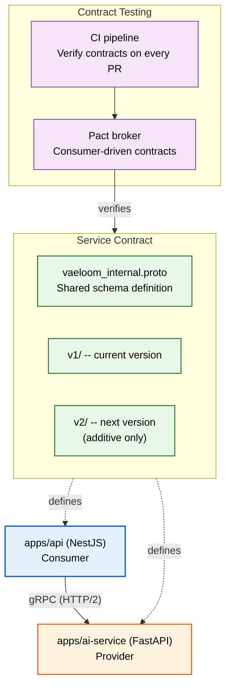

# Service Contracts

> **Purpose:** Define the formal service contract between apps/api (NestJS) and apps/ai-service (FastAPI), including the RPC protocol, shared schema, interface definitions, versioning, and contract testing
> **Status:** 🆕 New
> **Owner:** Architecture Team
> **Version:** 1.0
> **Last Updated:** 2026-07-16
> **Dependencies:** [`API-Architecture.md`](./API-Architecture.md), [`../Architecture/C4-Architecture.md`](../Architecture/C4-Architecture.md), [`../Architecture/Event-Flow.md`](../Architecture/Event-Flow.md), [`Workers.md`](./Workers.md)
> **Implementation Status:** 📋 Spec Only

## Overview

Vaeloom's backend is split into two services that communicate over an internal RPC: `apps/api` (NestJS, TypeScript) handles auth, CRUD, permissions, and tenant management; `apps/ai-service` (FastAPI, Python) handles agents, memory, RAG, and inference. The service contract is the formal agreement between these two services — the message formats, error codes, versioning rules, and testing strategy that ensure they can evolve independently without breaking each other.

This document is the single source of truth for the internal API. Every change to the contract must go through this document first; every deployment must verify contract compatibility.

## Goals

- Define the RPC protocol (gRPC over HTTP/2 with protobuf)
- Specify the shared contract schema for all RPC methods
- Define versioning rules for backward compatibility
- Establish contract testing strategy (consumer-driven)
- Document circuit breaker and fallback behavior

## Scope

### In Scope

- RPC protocol and transport
- Interface definitions (SubmitAgentTask, GetTaskResult, StreamAgentResponse, etc.)
- Shared schema (request/response types)
- Versioning and backward compatibility
- Contract testing
- Circuit breaker between services

### Out of Scope

- Public API (see [`API-Reference.md`](./API-Reference.md))
- Event-driven communication (see [`../Architecture/Event-Flow.md`](../Architecture/Event-Flow.md))
- LLM provider APIs (see [`../AI/LLM-Architecture.md`](../AI/LLM-Architecture.md))

## Architecture



> **Diagram:** Service contract architecture. The protobuf schema defines the RPC methods. Pact verifies consumer expectations against provider implementations on every CI run.

## RPC Protocol

| Decision | Choice | Rationale |
|----------|--------|-----------|
| Transport | gRPC over HTTP/2 | Binary protocol; lower latency than REST for internal calls; strong typing via protobuf |
| Schema language | Protocol Buffers v3 | Cross-language (TypeScript consumer, Python provider); compact binary encoding |
| Serialization | Protobuf binary | Efficient; schema-evolution friendly (add fields without breaking) |
| Timeout | 30s default; 120s for long inference tasks | Prevents hung connections; configurable per method |
| Authentication | mTLS + service account token | Services authenticate each other; no JWT passthrough |

## Interface Definitions

### SubmitAgentTask

```protobuf
// vaeloom/internal/v1/agent_service.proto
service AgentService {
  // Submit a task for agent execution (async)
  rpc SubmitAgentTask(SubmitAgentTaskRequest) returns (SubmitAgentTaskResponse);
  
  // Get the result of a completed task
  rpc GetTaskResult(GetTaskResultRequest) returns (GetTaskResultResponse);
  
  // Stream agent responses in real-time (server-streaming)
  rpc StreamAgentResponse(StreamAgentRequest) returns (stream AgentStreamChunk);
  
  // Cancel a running task
  rpc CancelTask(CancelTaskRequest) returns (CancelTaskResponse);
  
  // Health check
  rpc HealthCheck(HealthCheckRequest) returns (HealthCheckResponse);
}

message SubmitAgentTaskRequest {
  string task_id = 1;         // UUID, generated by API service
  string user_id = 2;          // from JWT
  string tenant_id = 3;        // from JWT
  string agent_type = 4;       // "resume" | "ats" | "job_search" | "organization" | "gmail" | "scheduler" | "application"
  string mission = 5;           // natural language task description
  map<string, string> context = 6; // additional context (document_id, job_id, etc.)
  string autonomy_level = 7;   // "suggest" | "execute" | "auto"
  repeated string memory_scopes = 8; // ["career", "skills", "documents"]
  int32 timeout_seconds = 9;    // max execution time (default: 120)
}

message SubmitAgentTaskResponse {
  string task_id = 1;
  string status = 2;           // "queued" | "running" | "completed" | "failed" | "cancelled"
  int64 estimated_duration_ms = 3;
}
```

### StreamAgentResponse (Server-Streaming)

```protobuf
message StreamAgentRequest {
  string task_id = 1;
  string user_id = 2;
  string tenant_id = 3;
}

message AgentStreamChunk {
  string task_id = 1;
  string chunk_type = 2;      // "thinking" | "tool_call" | "tool_result" | "text" | "memory_write" | "error"
  string content = 3;           // chunk content (markdown text, tool JSON, etc.)
  int64 tokens_used = 4;       // cumulative token count
  int32 chunk_index = 5;        // ordering index
  bool is_final = 6;            // true on the last chunk
  string trace_id = 7;          // distributed trace ID for observability
}
```

### GetTaskResult

```protobuf
message GetTaskResultRequest {
  string task_id = 1;
}

message GetTaskResultResponse {
  string task_id = 1;
  string status = 2;
  string result = 3;            // final result content (if completed)
  string error = 4;             // error message (if failed)
  map<string, string> metadata = 5; // tokens_used, duration_ms, model_used
  repeated MemoryWrite memory_writes = 6; // memory writes made during execution
}

message MemoryWrite {
  string memory_type = 1;       // "graph" | "vector" | "long_term"
  string entity_id = 2;
  string operation = 3;         // "created" | "updated" | "linked"
}
```

## Versioning

| Rule | Detail |
|------|--------|
| Version format | `v1/`, `v2/` prefix on protobuf package |
| Backward compatibility | Only additive changes allowed: new fields (with defaults), new methods. Never remove or rename. |
| Deprecation | Old method marked `deprecated = true`; consumer given 90 days to migrate |
| Dual-support period | Both v1 and v2 methods available simultaneously for 90 days |
| Version negotiation | Client sends `x-api-version: v2` header; server routes to correct handler |
| Sunset | After 90 days + 30-day notice, old version handler is removed |

## Contract Testing

```text
Contract testing strategy (consumer-driven via Pact):

  1. API service (consumer) defines expectations:
     - "When I call SubmitAgentTask with these fields, AI service returns this shape"
     - Written as Pact interactions in TypeScript

  2. AI service (provider) verifies against those expectations:
     - Runs FastAPI + Pact provider verification in CI
     - Fails if any consumer expectation is unmet

  3. CI pipeline:
     - Consumer tests run on every API PR → generates Pact files
     - Provider tests run on every AI PR → verifies against all Pact files
     - Either side failing blocks the PR

  4. Pact broker stores the latest verified contracts.
```

## Circuit Breaker

| State | Condition | Behavior |
|-------|-----------|----------|
| **Closed** (normal) | Error rate < 10% in 60s window | All requests routed normally |
| **Open** (failing) | Error rate ≥ 50% in 60s window | All requests immediately return fallback; no calls to AI service |
| **Half-Open** (probing) | After 30s in Open state | Allow 1 test request; if succeeds → Closed; if fails → Open |

Fallback behavior when circuit is open:

- `SubmitAgentTask` → return HTTP 503 with `x-circuit-breaker: open` header and retry-after: 60
- `StreamAgentResponse` → return a single error chunk
- `GetTaskResult` → return last known result from cache (if available), else 503

## Error Codes

| Code | Meaning | Consumer Action |
|------|---------|----------------|
| `TASK_NOT_FOUND` | Unknown task_id | Return 404 to user |
| `TASK_ALREADY_RUNNING` | Duplicate submit for same task_id | Return existing task status |
| `AGENT_NOT_AVAILABLE` | Agent type is disabled or not installed | Return 400 with suggestion to use alternative |
| `MODEL_UNAVAILABLE` | LLM provider is down or rate-limited | Retry with exponential backoff; fallback model |
| `CONTEXT_TOO_LARGE` | Input exceeds model context window | Truncate input and retry |
| `GUARDRAIL_BLOCKED` | Output failed safety check | Return blocked result with explanation |
| `TENANT_POLICY_DENIED` | Tenant policy blocks this agent/action | Return 403 with policy reference |
| `TIMEOUT` | Task exceeded timeout_seconds | Mark as failed; return partial result if available |

## Security

| Concern | Mitigation |
|---------|-----------|
| Service impersonation | mTLS between services; service account tokens scoped to internal endpoints |
| Task submission forgery | `task_id` generated server-side; `user_id`/`tenant_id` from verified JWT, not request body |
| Response injection | Responses validated against protobuf schema; unexpected fields rejected |
| Trace ID propagation | `trace_id` in every request/response; propagated to LLM providers and back |

## Performance

| Concern | Budget | Measurement |
|---------|--------|-------------|
| gRPC call latency (non-inference) | <50ms | RPC timing metrics |
| gRPC call latency (inference) | <5s (model-dependent) | RPC timing + model gateway metrics |
| Streaming chunk interval | <2s per chunk | Stream timing |
| Contract test suite duration | <30s | CI pipeline timing |

## Best Practices

| # | Practice | Rationale |
|---|----------|-----------|
| 1 | Never pass user JWT between services | Use service account tokens; pass user_id/tenant_id as fields in the proto |
| 2 | Make every RPC method idempotent | Retries from the consumer side must be safe |
| 3 | Version the contract, not the transport | gRPC stays stable; protobuf package versioning handles evolution |
| 4 | Run contract tests on every PR | Catches breaking changes before they reach staging |

## Future Improvements

| Improvement | Priority | Complexity | Timeline |
|-------------|----------|------------|----------|
| Bidirectional streaming for interactive agent sessions | High | High | Q1 2027 |
| Protobuf-to-OpenAPI bridge for unified API docs | Medium | Medium | Q2 2027 |
| Contract testing as a service (self-service for new microservices) | Low | Medium | Q3 2027 |

## Related Documents

- [`API-Architecture.md`](./API-Architecture.md) — public API architecture
- [`../Architecture/C4-Architecture.md`](../Architecture/C4-Architecture.md) — system container diagram
- [`../Architecture/Event-Flow.md`](../Architecture/Event-Flow.md) — event-driven patterns
- [`Workers.md`](./Workers.md) — background workers
- [`REST-Standards.md`](./REST-Standards.md) — REST conventions (public API)
