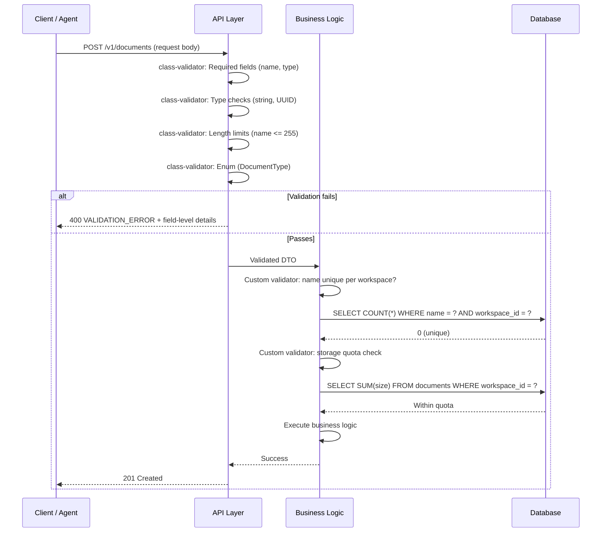

# Validation

> **Purpose:** Define input validation standards for Vaeloom's API
> **Status:** 🆕 New

## Validation Pipeline

```mermaid
graph TD
    classDef api fill:#e3f2fd,stroke:#1565c0,color:#000,stroke-width:1.5px
    classDef biz fill:#e8f5e9,stroke:#2e7d32,color:#000,stroke-width:1.5px
    classDef ai fill:#fff3e0,stroke:#e65100,color:#000,stroke-width:1.5px
    classDef error fill:#ffebee,stroke:#c62828,color:#000,stroke-width:1.5px

    subgraph APILayer["🔌 API Layer (class-validator / NestJS)"]
        direction TB
        A1["Request body arrives"]
        A2["Check required fields<br/>@IsNotEmpty()"]
        A3["Validate types<br/>@IsString, @IsInt"]
        A4["Check formats<br/>@IsEmail, @IsUrl, @IsUUID"]
        A5["Enforce lengths<br/>@MaxLength(1000)"]
        A6["Validate enums<br/>@IsEnum(DocumentType)"]
        A7["Check ranges<br/>@Min(0), @Max(100)"]
    end

    subgraph Business["📋 Business Logic Layer (Custom Validators)"]
        direction TB
        B1["Domain rule 1:<br/>Document name unique per workspace"]
        B2["Domain rule 2:<br/>Connector per user type limit"]
        B3["Domain rule 3:<br/>Workspace storage quota check"]
    end

    subgraph AIAgent["ðŸ¤- AI Agent Input (Pydantic / FastAPI)"]
        direction TB
        P1["Memory Extract Input:<br/>document_id ∈ doc_[a-z0-9]+<br/>content ≤ 100K chars<br/>source_type ∈ {pdf,docx,email,code}"]
        P2["Agent Action Input:<br/>action ∈ allowed list<br/>params match tool schema"]
    end

    subgraph ErrorResponse["📤 Error Response Format"]
        direction TB
        E1["{
  error: {
    code: "VALIDATION_ERROR",
    details: [{field, code, message}]
  }
}"]
    end

    A1 --> A2 --> A3 --> A4 --> A5 --> A6 --> A7
    A7 -->|Pass| B1 --> B2 --> B3
    B3 -->|Pass| P1 & P2

    A2 -->|Fail| E1
    A3 -->|Fail| E1
    A4 -->|Fail| E1
    A5 -->|Fail| E1
    A6 -->|Fail| E1
    A7 -->|Fail| E1
    B1 -->|Fail| E1
    B2 -->|Fail| E1
    B3 -->|Fail| E1
    P1 -->|Fail| E1
    P2 -->|Fail| E1

    class A1,A2,A3,A4,A5,A6,A7 api
    class B1,B2,B3 biz
    class P1,P2 ai
    class E1 error

```

> **Diagram:** Validation runs across three layers. **API Layer** checks input shape with class-validator decorators (required, type, format, length, enum, range). **Business Logic Layer** applies domain rules (uniqueness, quotas, limits). **AI Agent Input** validates agent-specific schemas with Pydantic. Any failure at any layer returns a structured **VALIDATION_ERROR** response with field-level details.

---

## Validation Framework

| Layer | Tool | Responsibility |
|-------|------|---------------|
| API request | class-validator (NestJS) | Input shape validation |
| Business logic | Custom validators | Domain rules |
| AI agent input | Pydantic (FastAPI) | Agent input schemas |

## Validation Rules

| Rule | Implementation | Error Code |
|------|---------------|------------|
| Required fields | `@IsNotEmpty()` | `REQUIRED_FIELD` |
| Type validation | `@IsString()`, `@IsInt()` | `INVALID_TYPE` |
| Length limits | `@MaxLength(1000)` | `MAX_LENGTH_EXCEEDED` |
| Enum validation | `@IsEnum(DocumentType)` | `INVALID_ENUM` |
| Format validation | `@IsEmail()`, `@IsUrl()` | `INVALID_FORMAT` |
| Range validation | `@Min(0)`, `@Max(100)` | `OUT_OF_RANGE` |
| Custom rules | Custom decorators | `VALIDATION_FAILED` |

## Example

```typescript
class CreateDocumentDto {
  @IsNotEmpty()
  @IsString()
  @MaxLength(255)
  name: string;

  @IsOptional()
  @IsEnum(DocumentType)
  type?: DocumentType;

  @IsOptional()
  @IsUUID()
  parentFolderId?: string;
}
```

## Validation Error Response

```json
{
  "error": {
    "code": "VALIDATION_ERROR",
    "message": "Invalid request body",
    "details": [
      {
        "field": "name",
        "code": "REQUIRED_FIELD",
        "message": "name is required"
      }
    ]
  }
}
```

## Agent Input Validation

All AI agent inputs are validated using Pydantic models:

```python
class MemoryExtractInput(BaseModel):
    document_id: str = Field(..., pattern=r'^doc_[a-z0-9]+$')
    content: str = Field(..., max_length=100000)
    source_type: Literal['pdf', 'docx', 'email', 'code']
```

## Common Mistakes

| Mistake | Consequence |
|---------|-------------|
| Validating only at the API layer | Validation at the controller catches malformed HTTP input but doesn't protect against invalid RPC calls or event bus messages — validate at every service boundary |
| Returning different error formats for different validation failures | Some endpoints return `{errors: [...]}`, others return `{message: "..."}` — clients can't handle validation errors consistently |
| Using only client-side validation | Client-side validation is for UX, not security — an attacker can bypass the browser and send any payload. Server-side validation is mandatory |
| Not validating AI agent inputs | Agent actions produce structured inputs (entity extractions, file moves) that must be validated before execution — malformed agent input can corrupt data |

## Best Practices

| Practice | Why |
|----------|-----|
| Validate at every service boundary | API gateway, service-to-service RPC, event bus consumers, and agent tool calls must each validate their input independently |
| Use a consistent validation error format across all layers | Same structure: `{error: {code, message, details: [{field, code, message}]}}` — clients write one error handler for the entire system |
| Apply validation rules to AI agent inputs with Pydantic | Agent inputs are as dangerous as user inputs — validate schema, ranges, and allowed values before executing any agent action |
| Validate early, fail fast | Catch validation errors in middleware before they reach business logic — expensive operations (LLM calls, database writes) should never execute on invalid input |

## Security

| Concern | Mitigation |
|---------|------------|
| Validation bypass through alternate content types | Validation that only checks `application/json` bodies misses attacks via other content types (form data, XML) — enforce a allow-list of content types at the API gateway and reject everything else |
| ReDoS attacks via malicious regex validators | A complex regex in a validation rule (`^([a-z]+)+$`) can cause catastrophic backtracking on crafted input — use simple regex patterns with bounded quantifiers and set a regex timeout in validators |
| Injection attacks through insufficient input sanitization | Input that passes type validation but contains SQL or NoSQL injection payloads can still be dangerous — string validation must check for injection patterns, not just format and length |

## Performance

| Concern | Mitigation |
|---------|------------|
| Validation overhead on large request bodies | Validating a 1MB JSON body with 1000+ fields using class-validator can take 50-100ms — use partial validation (validate only the fields the handler needs) and skip full validation for trusted internal requests |
| Custom validator calling external services | A validator that checks uniqueness by querying the database adds 5-10ms per validation call — batch uniqueness checks at the transaction level instead of per-field validators |
| Regex compilation overhead in hot paths | Creating new RegExp objects for every validation (instead of reusing compiled patterns) wastes CPU — pre-compile all validation regex patterns during application startup |

---

## Goals

1. **Defense-in-depth validation** — Validate input at every service boundary (API, RPC, event bus, agent tool calls) — never trust any input source
2. **Consistent error responses** — Return the same structured validation error format from all layers so clients write one error handler
3. **Fail-fast validation at API layer** — Catch invalid input in middleware before it reaches expensive business logic (LLM calls, database writes)
4. **Agent input safety** — Apply the same validation rigor to AI agent inputs as user inputs — agent actions can corrupt data just like malicious API calls

---

## Scope

### In Scope

- 3-layer validation pipeline: API layer (class-validator), Business Logic (custom validators), AI Agent (Pydantic)
- Validation rules: required fields, type checking, length limits, enum validation, format validation, range validation, custom domain rules
- Consistent error response format with field-level details
- AI agent input validation using Pydantic models with regex, length, and literal constraints

### Out of Scope

- Client-side validation (UX concern, not security — client validation is never sufficient)
- SQL injection prevention (handled by ORM parameterized queries)
- XSS sanitization (handled by output encoding, not input validation)
- Business logic validation that requires external service calls (handled by service layer)

---

## Functional Requirements

| ID | Requirement | Priority |
|----|-------------|----------|
| F-001 | System SHALL validate all API inputs using class-validator decorators (required, type, length, enum, format, range) | P0 |
| F-002 | System SHALL validate input at every service boundary (API, RPC, event bus, queue consumer) | P0 |
| F-003 | System SHALL return validation errors in consistent format `{error: {code, message, details: [{field, code, message}]}}` | P0 |
| F-004 | System SHALL validate AI agent inputs using Pydantic models with field constraints | P0 |
| F-005 | System SHALL enforce business logic validation (uniqueness, quotas, limits) at the service layer | P0 |

---

## Non-Functional Requirements

| ID | Requirement | Target |
|----|-------------|--------|
| NF-001 | API layer validation latency | < 5ms for typical request body |
| NF-002 | Validation error format consistency | 100% of validation failures return the same structure |
| NF-003 | Custom validator execution time | < 20ms per validator |
| NF-004 | Regex validation timeout | < 100ms (circuit breaker for ReDoS) |
| NF-005 | Pydantic model validation for agent inputs | < 10ms for typical payload |

---

## Sequence Diagrams



> **Diagram:** Validation pipeline — API layer validates input shape with class-validator (required, type, length, enum). On pass, Business Logic layer applies domain rules (uniqueness, quotas). Failure at any layer returns the same structured error format with field-level details.

---

## Data Flow

```text
1. Request body arrives at API controller
2. class-validator decorators check: required fields present, correct types, length limits, valid enums, format patterns, numeric ranges
3. If any check fails: return 400 with {error: {code: "VALIDATION_ERROR", details: [{field, code, message}]}}
4. If API validation passes: validated DTO passed to Service layer
5. Service layer calls custom validators for domain rules:
   a. Uniqueness checks (e.g., document name unique per workspace)
   b. Quota checks (e.g., workspace storage limit, connector per-user limit)
   c. State transition validation (e.g., cannot archive already-archived document)
6. If domain validation fails: return 422 with {error: {code: "VALIDATION_ERROR", details}}
7. If all validation passes: execute business logic
8. For AI agent inputs: validate via Pydantic schema before execution
9. Validation errors at agent layer return structured error to the agent runtime
```

---

## APIs

| Endpoint | Method | Description |
|----------|--------|-------------|
| `/v1/schema/endpoints` | GET | List validation schemas for all API endpoints |
| `/v1/schema/endpoints/:path` | GET | Get validation schema for a specific endpoint |
| `/v1/schema/agent-inputs` | GET | List agent input validation schemas |

---

## Database

| Table | Purpose | Key Columns |
|-------|---------|-------------|
| `validation_rules` | Dynamic validation rule registry (for configurable rules) | id, endpoint_pattern, field, rule_type, rule_config (jsonb), enabled |
| `validation_errors` | Validation error aggregation for monitoring | id, endpoint, field, error_code, count, last_occurrence |

---

## Scalability

| Dimension | Current Limit | 10x Strategy | 100x Strategy |
|-----------|---------------|--------------|---------------|
| Validation rules per endpoint | 15 decorators | No scaling concern (rules are in-memory) | Dynamic rule registry with hot reload |
| Custom validator throughput | 500/s | Custom validators are stateless — horizontal scale | Distributed uniqueness checks with Redis |
| Regex pattern compilation | 50 patterns | Pre-compile on startup | Pattern cache with LRU eviction |
| Pydantic model validation | 1000/s | Stateless — scales horizontally | Compiled Pydantic v2 models for 10x throughput |

---

## Error Handling

| Scenario | Detection | Mitigation | Recovery |
|----------|-----------|------------|----------|
| ReDoS attack via complex regex | Regex execution timeout exceeded | Circuit breaker stops regex; return 400 | Log attack attempt; alert security team |
| Validation bypass via content type switch | Non-JSON content type used | Gateway rejects non-allowlisted content types | Client sends valid JSON |
| Custom validator CRUD service unavailable | Uniqueness check DB timeout | Fail validation with 503; don't allow unsafe bypass | Retry with backoff |
| Pydantic model mismatch | Agent input doesn't match schema | Return structured error to agent; agent retries with corrected input | Agent developer fixes input generation |

---

## Monitoring

| Metric | Alert Threshold | Severity | Dashboard |
|--------|-----------------|----------|-----------|
| Validation failure rate | > 10% of requests | Warning | Validation > Failure Rate |
| Custom validator latency (p95) | > 50ms | Warning | Validation > Custom Validators |
| Regex validation timeout count | > 1/min | Critical | Validation > Security |
| Most common validation errors | Top-5 by count | Info | Validation > Error Distribution |
| Validation bypass attempts | Content type mismatch | Critical | Validation > Security |

---

## Deployment

| Environment | Method | Trigger | Verification |
|-------------|--------|---------|--------------|
| Development | class-validator decorators + custom validator classes | Git push | Unit tests: each validator tested with valid + invalid inputs |
| Staging | Same as production | PR merged to main | Integration test: all endpoints tested with invalid payloads |
| Production | Deployed with API service | Tagged release via CI/CD | Canary: verify validation error rate doesn't increase (bad validation shouldn't break valid requests) |

---

## Configuration

| Variable | Purpose | Default | Required |
|----------|---------|---------|----------|
| `VALIDATION_STRICT_MODE` | Reject unknown fields in request body | true | Yes |
| `VALIDATION_REGEX_TIMEOUT` | Regex execution timeout in ms | 100 | Yes |
| `VALIDATION_MAX_BODY_SIZE` | Max validation body size in bytes | 10485760 (10MB) | Yes |
| `VALIDATION_CONTENT_TYPES` | Allowlisted content types | application/json, multipart/form-data | Yes |
| `VALIDATION_CUSTOM_TIMEOUT` | Custom validator timeout in ms | 500 | No |

---

## Limitations

| Limitation | Impact | Workaround | Future Resolution |
|------------|--------|------------|-------------------|
| No schema versioning for validation rules | Changing a validation rule may break existing clients | Maintain backward-compatible validation; add new rules, never remove | Validation schema versioning with sunset headers |
| Custom validators are synchronous | External-service-based validators (uniqueness checks) block the request | Use cached uniqueness results with short TTL | Async validation pipeline with parallel execution |
| No dynamic validation rule configuration | Changing a rule threshold requires code deploy | Use environment variables for configurable limits | Dynamic rule registry with runtime updates |

---

## Examples

```typescript
// Schema validation for document upload
import { validate } from '@vaeloom/validation';

const schema = {
  title: { type: 'string', required: true, maxLength: 256 },
  tags: { type: 'array', items: { type: 'string' }, maxItems: 20 },
  fileSize: { type: 'number', min: 1, max: 50 * 1024 * 1024 },
};

const errors = validate(schema, input);
if (errors.length) throw new ValidationError(errors);
```

```python
# Vaeloom input sanitizer

### The AI Operating System for Autonomous Career and Education Management
from Vaeloom.validation import Sanitizer

sanitizer = Sanitizer()
cleaned = sanitizer.sanitize({
    "title": "<script>alert('xss')</script>Resume",
    "email": " USER@EXAMPLE.COM ",
})
print(cleaned)
# {"title": "Resume", "email": "user@example.com"}
```

```bash
# Validate a document against schema
Vaeloom validate document --file ./resume.pdf --schema document_upload
```

## Future Improvements

| Improvement | Priority | Complexity | Timeline |
|-------------|----------|------------|----------|
| Async validation pipeline with parallel custom validators | Medium | Medium | Q4 2026 |
| Dynamic validation rule registry with runtime updates | High | Medium | Q3 2026 |
| Validation schema versioning with migration support | Medium | Medium | Q1 2027 |
| Auto-generated client-side validation from API schema | Low | Low | Q3 2026 |
| AI agent input generation guardrails (auto-fix common validation errors) | Low | High | Q2 2027 |

---

## Related Documents

- [API Architecture.md](./API-Architecture.md)
- [REST Standards.md](./REST-Standards.md)
- [`AI/Guardrails.md`](../AI/Guardrails.md)
