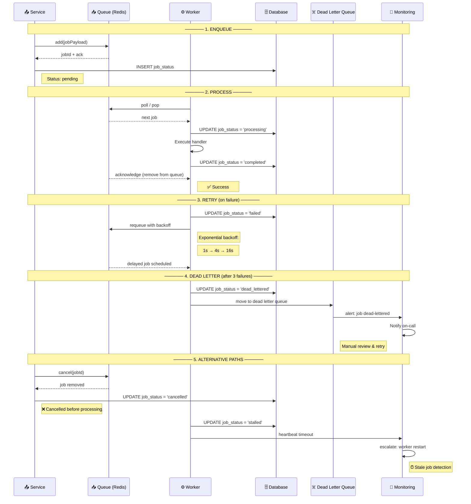
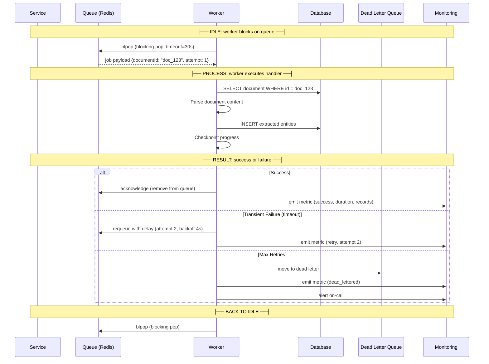

# Workers

> **Purpose:** Define the background worker architecture for Meridian
> **Status:** 🆕 New

## Worker Queue Lifecycle

Every job in the Meridian worker system follows a standardized lifecycle through enqueue, processing, retry, and—if all attempts fail—dead-lettering. The sequence diagram below traces a job end-to-end.



The lifecycle has five distinct paths:

| Path | Outcome | DB Status |
|------|---------|-----------|
| **Happy path** | Job processed and acknowledged | `completed` |
| **Retry** | Transient failure → exponential backoff | `failed` → `pending` (retry) |
| **Dead letter** | Max retries exceeded → manual review | `dead_lettered` |
| **Cancellation** | Job removed before processing | `cancelled` |
| **Stall** | Worker heartbeat lost → restart | `stalled` (auto-restart) |

---

## Worker Types

| Worker | Queue | Concurrency | Purpose |
|--------|-------|-------------|---------|
| Ingestion Worker | `ingestion` | 3 | Parse, OCR, extract documents |
| Memory Worker | `memory_extraction` | 2 | Entity extraction, graph updates |
| Organization Worker | `organization` | 2 | Organization Agent proposals |
| Gmail Worker | `gmail_scan` | 1 | Gmail scanning and classification |
| Resume Worker | `resume_generation` | 1 | Resume variant generation |
| Search Worker | `job_search` | 1 | Background opportunity search |

## Worker Implementation

```typescript
// apps/api/src/workers/ingestion.worker.ts
@Processor('ingestion')
export class IngestionWorker {
  @Process({ concurrency: 3 })
  async processDocument(job: Job<DocumentPayload>) {
    const { documentId } = job.data;
    
    // Stage 1: Parse document
    await this.parserService.parse(documentId);
    
    // Stage 2: OCR (if needed)
    if (await this.ocrService.needsOcr(documentId)) {
      await this.ocrService.process(documentId);
    }
    
    // Stage 3: Extract content
    const extracted = await this.extractionService.extract(documentId);
    
    // Stage 4: Queue memory extraction
    await this.memoryQueue.add({ documentId, extracted });
    
    return { status: 'completed', documentId };
  }
}
```

## Worker Retry Policy

| Failure Type | Retries | Backoff | Notes |
|-------------|---------|---------|-------|
| Transient error | 3 | Exponential (1s, 4s, 16s) | Network, timeout |
| Validation error | 0 | — | Don't retry bad input |
| Rate limit | 2 | Respect Retry-After | Connector throttling |
| Dead letter | After 3 | — | Manual review needed |

## Worker Monitoring

| Metric | Severity | Notes |
|--------|----------|-------|
| Queue depth > 1000 | 🔴 Critical | Depth exceeds safe buffer |
| Job age > 15 min | 🔴 Critical | Job stuck or worker stalled |
| Failure rate > 10% | 🔴 Critical | Systemic issue — alert on-call |
| Worker stopped | 🔴 Critical | Process crashed or OOM |

> **Note:** Monitoring thresholds are defined in [`Architecture/Queue.md`](../Architecture/Queue.md). Worker-level alerts follow the same severities for consistency.

## Common Mistakes

| Mistake | Consequence |
|---------|-------------|
| Workers that are not idempotent | If a worker crashes after processing but before acknowledging the job, the job is retried — non-idempotent handlers cause duplicate operations |
| Missing dead letter queue handling | Jobs that fail all retries are lost without trace — dead letter queues preserve failed jobs for manual inspection and replay |
| No heartbeat check on long-running jobs | A worker that hangs (memory leak, deadlock) holds the job for the visibility timeout — other workers can't pick it up until the timeout expires |
| Mixing validation errors with transient failures in retry logic | Invalid payloads will never succeed on retry — retrying them wastes resources and delays legitimate retries |

## Best Practices

| Practice | Why |
|----------|-----|
| Implement idempotent job handlers | Use a deduplication key (unique across payloads) — if the same key is processed twice, the second attempt is a no-op |
| Separate transient failures from permanent failures | Validation errors → don't retry (move to dead letter). Network timeouts → retry with backoff. Rate limits → retry after Retry-After |
| Export queue metrics (depth, age, failure rate) | Without these metrics, you won't know a worker is failing until users report missing data |
| Set worker concurrency to match downstream capacity | A worker that calls an external API should limit concurrency to the API's rate limit, not the server's CPU cores |

## Security

| Concern | Mitigation |
|---------|------------|
| Untrusted job payloads executed by workers | A worker that processes data from external connectors without validation can execute SQL injection payloads or trigger unauthorized actions — validate all job payloads at the worker boundary before executing |
| Permission escalation in worker context | A worker running with elevated privileges (cron jobs, maintenance) can access data it shouldn't — run each worker pool with the minimum required database role and service permissions |
| Sensitive data in worker logs | Workers processing documents or emails often log payload content for debugging — sanitize log output to remove PII, tokens, and sensitive fields before writing to log aggregation systems |

## Performance

| Concern | Mitigation |
|---------|------------|
| Worker concurrency exceeding downstream capacity | 10 concurrent workers each making API calls to a rate-limited external service (20 req/min) will hit 429 responses instantly — limit worker concurrency to match the external rate limit, not CPU cores |
| Job batching inefficiency for high-volume queues | Processing 500 ingestion jobs one at a time with per-job overhead (dequeue, deserialize, acknowledge) wastes resources — batch jobs with similar payloads into a single handler invocation |
| Queue polling overhead with idle workers | Workers polling an empty queue every 100ms create 10 req/s of Redis overhead per idle worker — use blocking pop operations or exponential backoff polling when the queue is consistently empty |

---

## Goals

1. **Reliable background processing** — Execute document ingestion, memory extraction, connector sync, and other async tasks reliably with retry and dead-letter handling
2. **Clear worker lifecycle** — Every job follows a standardized path: enqueue → process → acknowledge (success) / retry (transient failure) / dead letter (permanent failure)
3. **Efficient resource utilization** — Match worker concurrency to downstream capacity (external API rate limits, database connection pool size)
4. **Observable worker health** — Monitor queue depth, job age, failure rate, and worker saturation to detect issues before users are affected

---

## Scope

### In Scope

- 6 worker types: Ingestion (concurrency 3), Memory (concurrency 2), Organization (concurrency 2), Gmail (concurrency 1), Resume (concurrency 1), Search (concurrency 1)
- Job lifecycle: enqueue → process → retry (max 3, exponential backoff) → dead letter
- Idempotent job handlers with deduplication keys
- Worker monitoring: queue depth, job age, failure rate, stall detection
- Heartbeat timeout detection for stalled workers

### Out of Scope

- Worker process management (handled by PM2 / Kubernetes)
- Queue infrastructure (handled by Redis + BullMQ — see Queue.md)
- Workflow orchestration with DAG dependencies (separate system if needed)
- Real-time message streaming (WebSocket/SSE for frontend push)

---

## Functional Requirements

| ID | Requirement | Priority |
|----|-------------|----------|
| F-001 | Workers SHALL process jobs from their assigned queue with configurable concurrency | P0 |
| F-002 | Workers SHALL acknowledge jobs on success and remove from queue | P0 |
| F-003 | Workers SHALL requeue jobs on transient failure with exponential backoff (1s → 4s → 16s) | P0 |
| F-004 | Workers SHALL move jobs to dead letter queue after max retries (3) | P0 |
| F-005 | Workers SHALL emit heartbeat signals to detect stalls | P1 |
| F-006 | Workers SHALL support cancellation of in-progress jobs | P1 |

---

## Non-Functional Requirements

| ID | Requirement | Target |
|----|-------------|--------|
| NF-001 | Job processing latency (time from enqueue to start) | < 1s for high-priority queues |
| NF-002 | Worker throughput (all workers combined) | > 200 jobs/min |
| NF-003 | Worker heartbeat interval | 30s |
| NF-004 | Stall detection latency | < 60s (2 missed heartbeats) |
| NF-005 | Job deduplication accuracy | 100% (same dedup key = second attempt is no-op) |

---

## Sequence Diagrams


> **Diagram:** Worker lifecycle — Worker blocks on queue with blocking pop. On job receipt, it processes (parse, extract, persist). On success: acknowledge. On transient failure: requeue with exponential backoff. After max retries: move to dead letter and alert.

---

## Data Flow

```text
1. Worker starts and subscribes to its assigned queue(s) via blocking pop
2. When job arrives, worker deserializes payload and validates schema
3. Worker checks deduplication key — if already processed, acknowledge without executing
4. Worker executes job handler:
   a. Fetch any additional data needed (DB queries, external API calls)
   b. Process data according to job type (parse, classify, extract, generate)
   c. Persist results to database
   d. Update job status to 'completed' in job_status table
5. On success: acknowledge job (removed from Redis queue)
6. On transient failure (network timeout, rate limit):
   a. Check attempt count
   b. If < max retries: requeue with exponential backoff delay
   c. Update job_status to 'failed' with error details
7. On permanent failure (max retries exceeded):
   a. Move to dead letter queue
   b. Update job_status to 'dead_lettered'
   c. Trigger alert for manual review
8. Worker sends heartbeat every 30s — if 2 heartbeats missed, worker is presumed stalled
9. Metrics emitted after each job: duration, records_processed, success/fail, queue_name
```

---

## APIs

| Endpoint | Method | Description |
|----------|--------|-------------|
| `/v1/admin/workers` | GET | List all active workers and their current status |
| `/v1/admin/workers/:id` | GET | Get specific worker details and job history |
| `/v1/admin/workers/:id/health` | GET | Get worker health (heartbeat, memory, uptime) |
| `/v1/admin/workers/dead-letter` | GET | List dead-lettered jobs requiring manual retry |
| `/v1/admin/workers/dead-letter/:id/retry` | POST | Re-enqueue a dead-lettered job for retry |

---

## Database

| Table | Purpose | Key Columns |
|-------|---------|-------------|
| `worker_registry` | Worker instance tracking and health | id, worker_type, queue_name, status (active/stalled/stopped), last_heartbeat, started_at, hostname |
| `job_status` | Persistent job status for all processed jobs | id, job_id, queue_name, status (pending/processing/completed/failed/dead_lettered), attempts, error_message, started_at, completed_at |
| `job_dedup_keys` | Deduplication key registry | id, dedup_key, job_id, processed_at, ttl (auto-expire) |

---

## Scalability

| Dimension | Current Limit | 10x Strategy | 100x Strategy |
|-----------|---------------|--------------|---------------|
| Worker instances per queue | 3 (ingestion), 2 (memory), 1 (others) | Auto-scale workers based on queue depth | Dedicated worker fleet per queue type |
| Job throughput | 200 jobs/min | Horizontal scaling of stateless workers | Worker sharding by resource type |
| Dead letter queue size | 1000 | Automatic cleanup after 30 days | Dead letter with manual resolution workflow |
| Worker heartbeat registry | 100 workers | Heartbeat in Redis with TTL | Distributed worker registry with etcd |

---

## Error Handling

| Scenario | Detection | Mitigation | Recovery |
|----------|-----------|------------|----------|
| Worker crashed | Heartbeat timeout (60s no heartbeat) | Job marked as stalled; reassigned to another worker | Worker auto-restart via process manager |
| Job handler unhandled exception | try/catch catches at top level | Check attempt count; retry or dead letter | Log full error with stack trace |
| Out of memory | OOM killed by OS | Worker auto-restart via process manager | Reduce worker concurrency; increase memory limit |
| Database connection failure | Query timeout/connection refused | Retry with backoff; if persists, dead letter | Alert on-call; database recovery |
| External API rate limit | 429 response | Retry with Retry-After header respect | Log rate limit hit for connector health |

---

## Monitoring

| Metric | Alert Threshold | Severity | Dashboard |
|--------|-----------------|----------|-----------|
| Worker heartbeat | Any worker with no heartbeat > 60s | Critical | Workers > Health |
| Job failure rate (rolling 1h) | > 10% | Critical | Workers > Failure Rate |
| Job processing time (p95) | > 5 min | Warning | Workers > Processing Time |
| Worker concurrency utilization | > 90% for > 5 min | Warning | Workers > Concurrency |
| Dead-lettered jobs count | > 10 | Warning | Workers > Dead Letter |
| Stalled job count | > 0 | Critical | Workers > Stalls |

---

## Deployment

| Environment | Method | Trigger | Verification |
|-------------|--------|---------|--------------|
| Development | Worker process spawned alongside API (Docker) | Git push | Unit tests: job handler with mocked queue |
| Staging | Worker deployment in Kubernetes (1-2 replicas per type) | PR merged to main | Integration test: enqueue → process → verify DB updated |
| Production | Worker deployment with auto-scaling (2-4 replicas) | Tagged release via CI/CD | Canary: verify no increase in dead-letter rate after deploy |

---

## Configuration

| Variable | Purpose | Default | Required |
|----------|---------|---------|----------|
| `WORKER_CONCURRENCY_INGESTION` | Ingestion worker concurrency | 3 | Yes |
| `WORKER_CONCURRENCY_MEMORY` | Memory extraction concurrency | 2 | Yes |
| `WORKER_HEARTBEAT_INTERVAL` | Heartbeat emission interval | 30000ms | Yes |
| `WORKER_STALL_TIMEOUT` | Timeout before worker declared stalled | 60000ms | Yes |
| `WORKER_JOB_TIMEOUT` | Max job execution time | 300000ms (5 min) | Yes |
| `WORKER_DEDUP_TTL` | Deduplication key TTL | 86400s (24h) | No |

---

## Limitations

| Limitation | Impact | Workaround | Future Resolution |
|------------|--------|------------|-------------------|
| No job checkpoints/resumability | A job that processes 1000 items and fails at item 950 must restart from 0 | Process in smaller batches per job | Add checkpoint markers with progress tracking |
| Fixed concurrency per worker type | Cannot dynamically adjust concurrency based on system load | Over-provision slightly (3 instead of 2.5) | Dynamic concurrency based on resource monitoring |
| No priority queue preemption | High-priority job waits behind earlier low-priority jobs | Separate queue per priority level | Priority queue with preemption capability |

---

## Examples

```typescript
// Register and start a background worker
import { Worker } from '@meridian/worker';

const worker = new Worker('ocr-worker', {
  concurrency: 5,
  pollIntervalMs: 1000,
});

worker.register('ocr.process', async (job) => {
  const result = await performOCR(job.data.documentId);
  return result;
});

worker.start();
```

```python
# Worker with health check endpoint
from meridian.worker import BaseWorker

class EmbeddingWorker(BaseWorker):
    async def process(self, task):
        embedding = await self.model.encode(task["text"])
        await self.store.save(task["doc_id"], embedding)

worker = EmbeddingWorker(queue="embeddings")
worker.run()
```

```bash
# Scale workers via CLI
meridian workers scale ocr-worker --count 10
meridian workers list --status running
```

## Future Improvements

| Improvement | Priority | Complexity | Timeline |
|-------------|----------|------------|----------|
| Job checkpoint/resume for long-running operations | High | Medium | Q1 2027 |
| Dynamic worker concurrency based on system resources | Medium | Medium | Q4 2026 |
| Priority queue with preemption for urgent jobs | Medium | High | Q2 2027 |
| Worker process dashboard (live view of running jobs) | Low | Medium | Q3 2026 |
| Job replay from archived dead letter queue | Low | Low | Q4 2026 |

---

## Related Documents

- [Queue.md](../Architecture/Queue.md)
- [Cron Jobs.md](./Cron-Jobs.md)
- [`DevOps/Monitoring.md`](../DevOps/Monitoring.md)
