# Build Prompts

> **Purpose:** Reference to agentic coding build prompts for Claude Code / Cursor
> **Status:** Active
> **Owner:** Engineering Team
> **Last Updated:** 2026-07-13

## Overview

The Build Prompts directory indexes agentic coding build prompts for Claude Code and Cursor, organized by implementation phase. These prompts guide the incremental construction of the Vaeloom platform from foundation infrastructure through deployment.

Sixteen MVP build prompts cover the complete implementation sequence: foundation infra, database schema, ingestion pipeline, memory system, agent harness, RAG retrieval, MCP tools, specialist agents, AI gateway, evaluation framework, guardrails, observability, API backend, frontend, security, and deployment. An additional 17 enterprise build prompts provide enterprise upgrade deltas.

Each build prompt corresponds to a numbered implementation step with documented dependencies, ensuring the system is built in the correct order. The prompts themselves live in their canonical locations under `/Documents/build-prompts/`.

## What's here

This folder does not contain the build prompts themselves — they live in their canonical locations. This folder indexes and references them.

| Prompt Set | Location | Count | For |
|------------|----------|-------|-----|
| MVP Build Prompts | [`/Documents/build-prompts/mvp/`](../../Documents/build-prompts/mvp/) | 16 files | Implementation steps 01–16 |
| Enterprise Build Prompts | [`/Documents/build-prompts/enterprise/`](../../Documents/build-prompts/enterprise/) | 17 files | Enterprise upgrade deltas |
| Implementation Files | [`/Docs/Engineering/Implementation/`](../../Docs/Engineering/Implementation/) | 16 files | Same content, different structure |

```mermaid
graph LR
    subgraph Foundation["🏗️ Foundation"]
        F1["01 · Foundation Infra"]
        F2["02 · Database Schema"]
    end
    subgraph Core["⚙️ Core System"]
        C1["03 · Ingestion Pipeline"]
        C2["04 · Memory System"]
        C3["05 · Agent Harness"]
        C4["06 · RAG Retrieval"]
        C5["07 · MCP Tools"]
    end
    subgraph Agents["🤖 Agent Layer"]
        A1["08 · Specialist Agents"]
        A2["09 · AI Gateway"]
    end
    subgraph Quality["✅ Quality & Safety"]
        Q1["10 · Evaluation"]
        Q2["11 · Guardrails"]
        Q3["12 · Observability"]
    end
    subgraph Delivery["🚀 Delivery"]
        D1["13 · API Backend"]
        D2["14 · Frontend"]
        D3["15 · Security"]
        D4["16 · Deployment"]
    end

    F1 --> F2 --> C1 --> C2 --> C3 --> C4 --> C5
    C5 --> A1 --> A2
    A2 --> Q1 --> Q2 --> Q3
    Q3 --> D1 --> D2 --> D3 --> D4

    classDef foundation fill:#e3f2fd,stroke:#1565c0
    classDef core fill:#e8f5e9,stroke:#2e7d32
    classDef agent fill:#fff3e0,stroke:#e65100
    classDef quality fill:#f3e5f5,stroke:#7b1fa2
    classDef delivery fill:#e0f2f1,stroke:#00695c

    class F1,F2 foundation
    class C1,C2,C3,C4,C5 core
    class A1,A2 agent
    class Q1,Q2,Q3 quality
    class D1,D2,D3,D4 delivery
```



## Build order (MVP)

Run these in order — each depends on the ones before it:

1. `00-master-build-order.md` — Read this first
2. `01-foundation-infra.md` — Repo scaffold, CI, auth
3. `02-database-schema.md` — Postgres schema, migrations
4. `03-ingestion-pipeline.md` — File parsing, OCR, extraction
5. `04-memory-system.md` — Memory Agent, graph, vector store
6. `05-agent-harness-orchestration.md` — Shared agent runtime, Orchestrator
7. `06-rag-retrieval.md` — Agentic RAG hybrid retrieval
8. `07-mcp-tool-ecosystem.md` — MCP-shaped connectors
9. `08-specialist-agents.md` — All 8 MVP agents
10. `09-ai-gateway-model-routing.md` — Model router
11. `10-evaluation-framework.md` — Golden datasets, eval runner
12. `11-guardrails-safety.md` — Input validation, QA gate
13. `12-observability-tracing.md` — Tracing, audit log
14. `13-api-backend.md` — Core REST API, permission engine
15. `14-frontend-workspace.md` — All MVP screens
16. `15-security-compliance.md` — Encryption, secrets
17. `16-deployment-infrastructure.md` — Containers, CI/CD

**Definition of "MVP done":** A user can sign up, connect a source, upload a resume, see it organized in an always-current master resume, search for and (with approval) apply to a role, and see relevant deadlines surfaced — with zero manual team intervention.

## Goals

- Index all MVP and enterprise build prompts for easy discovery and ordering
- Document the correct build sequence with dependencies between phases
- Define the "MVP done" completion criteria
- Provide navigation to implementation files and related documentation
- Enable both directed (sequential) and reference (topical) usage patterns

---

## Scope

### In Scope
- MVP build prompt index and dependency ordering
- Enterprise build prompt index
- Implementation file references and navigation
- Build phase categorization (foundation, core, agent, quality, delivery)

### Out of Scope
- Build prompt content itself (located in canonical document directories)
- Implementation guide content (located in Engineering docs)
- Architecture decision records
- Deployment instructions (covered in DevOps docs)

---

## Examples

```bash
# Build prompts for Vaeloom
Vaeloom build prompt --template agent-system
Vaeloom build prompt --output ./prompts/assistant.md --vars role=assistant,tone=professional

# Validate prompt
Vaeloom build validate --file ./prompts/assistant.md --check-length --check-tokens
```

```bash
# Prompt versioning and diff
Vaeloom build version list --name assistant
Vaeloom build version diff --name assistant --v1 1.0 --v2 1.1
```

```bash
# Prompt deployment
Vaeloom build deploy --name assistant --version 1.1 --environment production
```

## Future Improvements

| Improvement | Priority | Complexity | Timeline |
|-------------|----------|------------|----------|
| Build prompt auto-generation from architecture docs | High | Medium | Q2 2027 |
| Prompt execution tracking dashboard | Medium | Low | Q1 2027 |
| Multi-agent parallel build orchestration | Low | High | Q3 2027 |

## Related categories

- [`Engineering/`](../Engineering/) — Engineering implementation guides
- [`Project/README.md`](../Project/README.md) — Project overview
- [`Enterprise/`](../Enterprise/) — Enterprise build prompts and architecture
- [`Architecture/`](../Architecture/) — System architecture being implemented

## Related Documents

- [Engineering Implementation](../Engineering/README.md) — Implementation guides
- [Project Overview](../Project/README.md) — Project vision and scope
- [Architecture Overview](../Architecture/README.md) — System architecture being built
