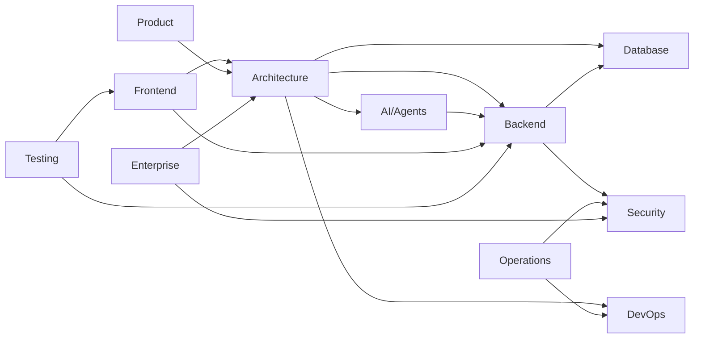

# Documentation Map

> **Purpose:** Complete map of all documentation with status, ownership, and relationships

## Category Summary

| Category | Directory | Files | Owner | Maturity |
|---|---|---|---|---|
| Architecture | `docs/Architecture/` | 18 | Platform | ✅ Stable |
| AI / Agents | `docs/AI/` | 23 | AI Team | ✅ Stable |
| Backend | `docs/Backend/` | 21 | Backend | ✅ Stable |
| Database | `docs/Database/` | 10 | Backend | ✅ Stable |
| DevOps | `docs/DevOps/` | 12 | DevOps | ✅ Stable |
| Engineering | `docs/Engineering/` | 11 | Engineering | ✅ Stable |
| Enterprise | `docs/Enterprise/` | 9 | Enterprise | ✅ Stable |
| Frontend | `docs/Frontend/` | 17 | Frontend | ✅ Stable |
| Operations | `docs/Operations/` | 16 | DevOps | ✅ Stable |
| Product | `docs/Product/` | 22 | Product | ✅ Stable |
| Security | `docs/Security/` | 14 | Security | ✅ Stable |
| Testing | `docs/Testing/` | 12 | QA | ✅ Stable |
| API | `docs/API/` | 1 (index) | Platform | 🔄 Needs Work |
| Guides | `docs/Guides/` | 1 (index) | Platform | 🔄 Needs Work |
| Contributing | `docs/Contributing/` | 1 (index) | Engineering | 🔄 Needs Work |
| **Total** | **15 categories** | **178** | — | — |

## Dependency Graph

## Related Documents

- [Master Index](./README.md)
- [Usage Guide](./USAGE-GUIDE.md)
- [Document Template](./TEMPLATE.md)
