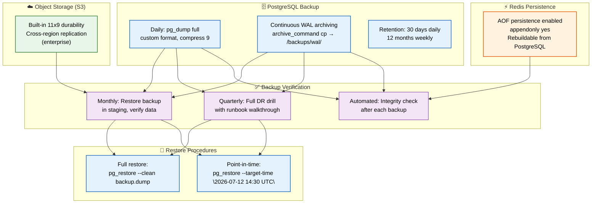
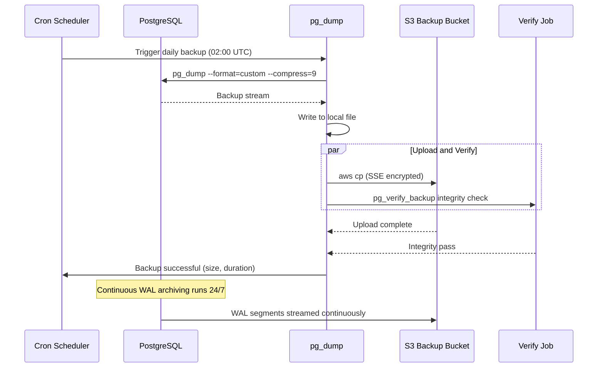

# Database Backups

> **Purpose:** Define the backup strategy for Meridian's database
> **Status:** 🆕 New

## Overview

The database backup strategy is Meridian's last line of defense against data loss — ensuring that every byte of user data can be recovered within defined recovery time objectives (RTO) and recovery point objectives (RPO). The strategy combines daily full PostgreSQL backups with continuous WAL archiving for point-in-time recovery, S3's built-in durability (11x9s) with cross-region replication for object storage, and Redis AOF persistence for cache recoverability. Every backup must be tested: monthly staging restores validate the backup chain, and quarterly disaster recovery drills exercise the full runbook.

This document defines the backup schedule, commands, verification procedures, and restore workflows for all Meridian data stores. It is intended for database administrators, SRE engineers, and on-call engineers responsible for data recovery. A backup that has never been restored is a hope, not a backup — verification is an integral part of the backup strategy, not an afterthought.

## Goals

- Maintain daily full PostgreSQL backups with 30-day retention and weekly backups retained for 12 months
- Enable point-in-time recovery to any second through continuous WAL archiving
- Achieve full database restore within 4 hours (RTO) and maximum 1-hour data loss (RPO)
- Verify backup integrity monthly through staging restore tests and quarterly through full DR drills
- Encrypt all backups at rest (S3 SSE) and in transit (TLS) meeting enterprise compliance requirements

## Scope

**In Scope:**
- PostgreSQL daily full backups via pg_dump custom format
- Continuous WAL archiving for point-in-time recovery
- S3 object storage backup with cross-region replication (Enterprise)
- Redis AOF persistence configuration
- Monthly staging restore verification
- Quarterly disaster recovery drills
- Automated integrity checks after each backup

**Out of Scope:**
- Incremental or differential backup strategies (future improvement)
- Third-party backup tools (pgBackrest, WAL-G) — currently using native pg_dump
- Backup of ephemeral or transient data (session caches, working memory)
- Multi-region active-active backup topology
- Self-service restore UI for end users

---

## Backup Pipeline



> **Diagram:** Backup pipeline covers PostgreSQL (daily full + continuous WAL), S3 (built-in durability + cross-region replication), and Redis (AOF persistence). **Verification** runs monthly (staging restore), quarterly (full DR drill), and automated (integrity checks). **Restore** supports both full recovery and point-in-time recovery with `--target-time`.

---

## Backup Schedule

| Data | Frequency | Retention | Method |
|------|-----------|-----------|--------|
| PostgreSQL | Daily full + continuous WAL | 30 days daily, 12 months weekly | pg_dump + WAL archiving |
| Object storage (S3) | Built-in durability | As long as user has account | Cross-region replication (enterprise) |
| Redis | AOF persistence | Rebuildable from PG | appendonly yes |

## Backup Commands

```bash
# Full backup
pg_dump -h localhost -U meridian -d meridian_db \
  --format=custom --compress=9 \
  --file=backup_$(date +%Y%m%d).dump

# WAL archiving (postgresql.conf)
archive_mode = on
archive_command = 'cp %p /backups/wal/%f'
```

## Restore Commands

```bash
# Full restore
pg_restore -h localhost -U meridian -d meridian_db \
  --clean --if-exists backup_20260712.dump

# Point-in-time recovery
pg_restore -h localhost -U meridian -d meridian_db \
  --clean --if-exists \
  --target-time "2026-07-12 14:30:00 UTC" \
  backup_20260712.dump
```

## Verification

- **Monthly:** Verify one backup restore in staging
- **Quarterly:** Full disaster recovery drill
- **Automated:** Backup integrity check after each backup

## Common Mistakes

| Mistake | Consequence |
|---------|-------------|
| Never testing restores | A backup that has never been restored is a hope, not a backup — the first restore attempt often fails due to corruption or version mismatch |
| Relying on a single backup method | Daily full backup without WAL archiving means up to 24 hours of data loss on failure — always pair full backups with continuous WAL |
| Storing backups in the same region as the database | A region-level outage destroys both the database and its backups — WAL archives must be in a separate region |
| Ignoring backup compression | Uncompressed backups consume 3-5x more storage and take longer to transfer — use pg_dump's custom format with compression level 9 |

## Best Practices

| Practice | Why |
|----------|-----|
| Test restores monthly in staging | A successful restore in an isolated environment proves the backup chain works before a real disaster |
| Use WAL archiving for point-in-time recovery | Continuous WAL allows recovery to any second, not just the last full backup — critical for data corruption scenarios |
| Encrypt backups at rest and in transit | Backup files contain all database data — use S3 server-side encryption and TLS for transfers |
| Automate backup integrity checks | Run `pg_verify_backup` or custom checksum validation immediately after each backup completes |

## Security Considerations

| Consideration | Mitigation |
|--------------|-----------|
| Backup file access | Backup storage must have stricter access control than the database itself — stolen backups bypass all database-level auth |
| Encryption key management | If backups are encrypted, key loss = data loss — use a managed KMS with key rotation, not static passphrases |
| Long-term retention exposure | Archived backups (12-month retention) contain historical data that may include PII — apply the same data governance policies |

## Performance Considerations

| Consideration | Approach |
|--------------|----------|
| Backup window impact | Schedule full backups during lowest traffic periods — WAL archiving has negligible overhead and runs continuously |
| Compression trade-off | Higher compression (level 9) reduces storage but increases CPU during backup — acceptable for daily jobs, not for continuous WAL shipping |
| Parallel restore | Use pg_restore with `--jobs` flag to parallelize restore on multi-core systems — significantly reduces recovery time |

---

## Database

| Table | Purpose | Backup Relevance |
|-------|---------|-----------------|
| `pg_dump_history` | Tracks each backup run (start, duration, size, status) | Used to verify backup cadence and detect failures |
| `wal_archive_status` | Tracks WAL segment archival progress | Ensures continuous WAL chain for PITR |
| `restore_verification_log` | Records staging restore test results | Documents monthly restore verification |
| `backup_retention_policy` | Per-table/custom backup retention rules | Allows different retention for different data types |

---

## Scalability

| Dimension | Current Limit | 10x Strategy | 100x Strategy |
|-----------|---------------|--------------|---------------|
| Backup size | 50 GB full dump | Parallel pg_dump with `--jobs` (4 workers) | pg_dump with directory format and 16 parallel workers |
| WAL generation rate | 100 MB/min | Archive WAL to S3 with compression | Separate WAL archive endpoint on replica |
| Backup window | 2 hours (daily) | Incremental backup instead of full daily | Continuous archiving with minimal full backup cadence |
| Restore time (full) | 4 hours | Parallel pg_restore with `--jobs` | Physical standby promotion (seconds, not hours) |

---

## Error Handling

| Scenario | Detection | Mitigation | Recovery |
|----------|-----------|------------|----------|
| Backup failure (disk full) | pg_dump exits with error code | Alert on-call immediately; do not overwrite existing backup | Free disk space or increase volume; re-run backup |
| WAL archiving failure | WAL file not copied to archive | Queue WAL locally; retry with backoff (5s, 30s, 5min) | If queue fills 50% disk, alert; manual intervention |
| Backup corruption | pg_verify_backup checksum mismatch | Delete corrupted backup; alert | Re-run backup from last known good checkpoint |
| Restore failure | pg_restore error during verification | Log error details; alert on-call | Try alternative restore method (PITR vs full); escalate |

---

## Monitoring

| Metric | Alert Threshold | Severity | Dashboard |
|--------|-----------------|----------|-----------|
| Backup success/failure | Any failure | Critical | Backups > Status |
| Backup duration | > 3 hours | Warning | Backups > Duration |
| WAL archive lag | > 5 min since last archived WAL | Warning | Backups > WAL Archiving |
| Backup age since last success | > 30 hours | Critical | Backups > Age |
| Staging restore test | Last test > 45 days ago | Warning | Backups > Verification |
| Backup storage utilization | > 80% of allocated | Warning | Backups > Storage |

---

## Limitations

| Limitation | Impact | Workaround | Future Resolution |
|------------|--------|------------|-------------------|
| Full backup every 24h causes 2h write slowdown | Heavy I/O during backup window degrades query performance | Schedule during lowest traffic; use low-priority I/O | Implement incremental backup with minimal I/O impact |
| Point-in-time recovery requires continuous WAL | WAL gaps prevent recovery to specific timestamp | Monitor WAL archival health; alert on gaps | Multi-region WAL archive with automatic failover |
| Restore not tested automatically in production | Manual monthly restore in staging only | Add automated weekly restore test in staging | Automated production restore drill with canary validation |

---

## Examples

### Example 1: Automated Backup Script

```bash
#!/bin/bash
# Daily full backup with WAL archiving
TIMESTAMP=$(date +%Y%m%d_%H%M%S)
BACKUP_DIR="/backups/postgres"

# Full backup
pg_dump -h localhost -U meridian -d meridian_db \
  --format=custom --compress=9 \
  --file="${BACKUP_DIR}/full_${TIMESTAMP}.dump"

# Verify integrity
pg_verify_backup "${BACKUP_DIR}/full_${TIMESTAMP}.dump"

# Upload to S3 with encryption
aws s3 cp "${BACKUP_DIR}/full_${TIMESTAMP}.dump" \
  "s3://meridian-backups/production/postgres/" \
  --sse AES256

# Retention cleanup (keep 30 daily, 12 weekly)
find "${BACKUP_DIR}" -name "full_*.dump" -mtime +30 -delete
```

### Example 2: Point-in-Time Restore

```bash
# Restore database to specific timestamp
pg_restore -h localhost -U meridian -d meridian_db \
  --clean --if-exists \
  --target-time "2026-07-12 14:30:00 UTC" \
  /backups/postgres/full_20260712.dump

# Verify restore
psql -h localhost -U meridian -d meridian_db \
  -c "SELECT COUNT(*) FROM users;"
psql -h localhost -U meridian -d meridian_db \
  -c "SELECT COUNT(*) FROM agent_actions;"
```

---

## Sequence Diagrams



> **Diagram:** Daily backup workflow — cron triggers pg_dump at 02:00 UTC, backup is written locally then uploaded to S3 with SSE encryption while integrity verification runs in parallel. Continuous WAL archiving runs independently 24/7 for point-in-time recovery.

---

## Future Improvements

| Improvement | Priority | Complexity | Timeline |
|-------------|----------|------------|----------|
| Incremental backup (pgBackrest or WAL-G) | High | Medium | Q4 2026 |
| Automated weekly restore test in staging | High | Low | Q3 2026 |
| Cross-region WAL archive automatic failover | Medium | High | Q1 2027 |
| Backup storage tiering (hot → cold → archive) | Low | Medium | Q2 2027 |
| Point-in-time recovery UI for self-service restore | Low | High | Q2 2027 |

---

## Related Documents

- [Migrations.md](./Migrations.md)
- [Disaster Recovery](../Architecture/Disaster-Recovery.md)
- [Operations/Runbooks.md](../Operations/01-operations-runbook.md)
