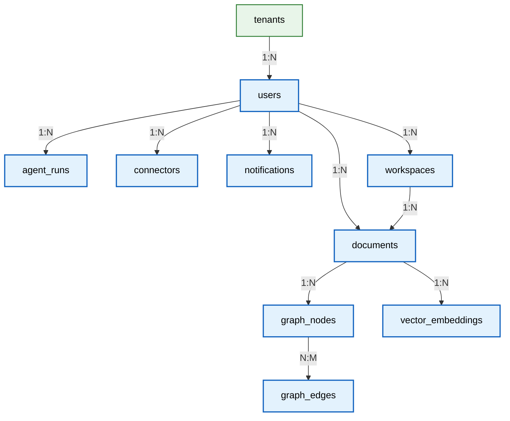

# Data Dictionary

> **Purpose:** Provide the authoritative field-level data dictionary for every table and column in the Vaeloom database schema
> **Status:** 🆕 New
> **Owner:** Architecture Team
> **Version:** 1.0
> **Last Updated:** 2026-07-16
> **Dependencies:** [`Schema.md`](./Schema.md), [`ER-Diagram.md`](./ER-Diagram.md), [`Indexes.md`](./Indexes.md), [`../Architecture/Data-Flow.md`](../Architecture/Data-Flow.md)
> **Implementation Status:** 📋 Spec Only

## Overview

A data dictionary is the authoritative reference for every table, column, type, constraint, and relationship in the database. While [`Schema.md`](./Schema.md) describes the schema at a design level and [`ER-Diagram.md`](./ER-Diagram.md) shows relationships visually, this document is the field-by-field reference engineers consult when writing queries, building migrations, or debugging data issues. If a column is not in this dictionary, it should not be queried.

## Goals

- Document every table and column with type, constraints, and description
- Define all enum types and their allowed values
- Document relationships between tables
- Enable automated schema validation against this dictionary

## Scope

### In Scope

- All core tables (users, tenants, documents, memories, agents, connectors, audit)
- All enum types
- Column-level constraints and defaults
- Table relationships

### Out of Scope

- Index strategy (see [`Indexes.md`](./Indexes.md))
- Migration history (see [`Migrations.md`](./Migrations.md))

## Core Tables

### users

| Column | Type | Nullable | Default | Constraints | Description |
|--------|------|----------|---------|-------------|-------------|
| `id` | UUID | No | `gen_random_uuid()` | PK | Unique user identifier |
| `email` | VARCHAR(255) | No | — | UNIQUE, NOT NULL | User email (login) |
| `password_hash` | VARCHAR(255) | Yes | NULL | — | Argon2 hash (NULL for SSO-only) |
| `name` | VARCHAR(100) | No | — | NOT NULL | Display name |
| `tenant_id` | UUID | No | — | FK → tenants.id | Tenant this user belongs to |
| `role` | user_role | No | `'member'` | NOT NULL | System role |
| `status` | user_status | No | `'active'` | NOT NULL | Account status |
| `mfa_enabled` | BOOLEAN | No | `false` | — | MFA on/off |
| `preferences` | JSONB | No | `'{}'` | — | User preferences |
| `created_at` | TIMESTAMPTZ | No | `now()` | — | Registration time |
| `updated_at` | TIMESTAMPTZ | No | `now()` | — | Last update |
| `last_login_at` | TIMESTAMPTZ | Yes | NULL | — | Last login |

### tenants

| Column | Type | Nullable | Default | Constraints | Description |
|--------|------|----------|---------|-------------|-------------|
| `id` | UUID | No | `gen_random_uuid()` | PK | Unique tenant identifier |
| `name` | VARCHAR(200) | No | — | NOT NULL | Tenant display name |
| `domain` | VARCHAR(255) | Yes | NULL | UNIQUE | Email domain for auto-provisioning |
| `plan` | tenant_plan | No | `'free'` | NOT NULL | Subscription plan |
| `isolation_mode` | isolation_mode | No | `'rls'` | NOT NULL | Pool/silo/hybrid |
| `region` | VARCHAR(20) | No | `'us-east-1'` | — | Deployment region |
| `status` | tenant_status | No | `'active'` | NOT NULL | Tenant lifecycle status |
| `seat_limit` | INTEGER | No | `1` | — | Max users (contract) |
| `stripe_customer_id` | VARCHAR(255) | Yes | NULL | — | Stripe customer reference |
| `created_at` | TIMESTAMPTZ | No | `now()` | — | Provisioning time |

### documents

| Column | Type | Nullable | Default | Constraints | Description |
|--------|------|----------|---------|-------------|-------------|
| `id` | UUID | No | `gen_random_uuid()` | PK | Document identifier |
| `tenant_id` | UUID | No | — | FK, RLS | Tenant scoping |
| `user_id` | UUID | No | — | FK → users.id | Owner |
| `workspace_id` | UUID | Yes | NULL | FK → workspaces.id | Workspace (nullable = personal) |
| `filename` | VARCHAR(255) | No | — | NOT NULL | Original filename |
| `mime_type` | VARCHAR(100) | No | — | — | MIME type |
| `size_bytes` | BIGINT | No | — | — | File size |
| `storage_key` | VARCHAR(500) | No | — | — | S3 object key |
| `status` | document_status | No | `'uploaded'` | NOT NULL | Processing state |
| `parsed_text` | TEXT | Yes | NULL | — | Extracted text content |
| `metadata` | JSONB | No | `'{}'` | — | Page count, language, etc. |
| `pii_detected` | BOOLEAN | No | `false` | — | PII scan result |
| `created_at` | TIMESTAMPTZ | No | `now()` | — | Upload time |
| `deleted_at` | TIMESTAMPTZ | Yes | NULL | — | Soft-delete timestamp |

### graph_nodes (Knowledge Graph — Apache AGE)

| Column | Type | Nullable | Default | Constraints | Description |
|--------|------|----------|---------|-------------|-------------|
| `id` | agtype (AGE) | No | — | PK | AGE internal ID |
| `tenant_id` | UUID | No | — | RLS | Tenant scoping |
| `user_id` | UUID | No | — | — | Owner |
| `entity_type` | VARCHAR(50) | No | — | — | "skill", "company", "achievement", etc. |
| `entity_name` | VARCHAR(255) | No | — | — | Entity label |
| `properties` | JSONB | No | `'{}'` | — | Entity-specific attributes |
| `confidence` | FLOAT | No | `0.5` | — | Extraction confidence (0-1) |
| `importance` | FLOAT | No | `0.5` | — | Importance score (0-1) |
| `source_document_id` | UUID | Yes | NULL | FK → documents.id | Where this was extracted from |
| `created_at` | TIMESTAMPTZ | No | `now()` | — | Creation time |

### graph_edges (Knowledge Graph relationships)

| Column | Type | Nullable | Default | Constraints | Description |
|--------|------|----------|---------|-------------|-------------|
| `id` | agtype (AGE) | No | — | PK | AGE internal ID |
| `source_node_id` | agtype | No | — | — | From node |
| `target_node_id` | agtype | No | — | — | To node |
| `relationship_type` | VARCHAR(50) | No | — | — | "has_skill", "worked_at", "achieved" |
| `properties` | JSONB | No | `'{}'` | — | Edge attributes |
| `created_at` | TIMESTAMPTZ | No | `now()` | — | Creation time |

### vector_embeddings (pgvector)

| Column | Type | Nullable | Default | Constraints | Description |
|--------|------|----------|---------|-------------|-------------|
| `id` | UUID | No | `gen_random_uuid()` | PK | Embedding identifier |
| `tenant_id` | UUID | No | — | RLS | Tenant scoping |
| `user_id` | UUID | No | — | — | Owner |
| `document_id` | UUID | Yes | NULL | FK → documents.id | Source document |
| `chunk_text` | TEXT | No | — | — | The text chunk that was embedded |
| `chunk_index` | INTEGER | No | — | — | Order within document |
| `embedding` | VECTOR(1536) | No | — | — | Embedding vector (text-embedding-3-small) |
| `model_version` | VARCHAR(50) | No | — | — | Embedding model used |
| `created_at` | TIMESTAMPTZ | No | `now()` | — | Creation time |

### agent_runs

| Column | Type | Nullable | Default | Constraints | Description |
|--------|------|----------|---------|-------------|-------------|
| `id` | UUID | No | `gen_random_uuid()` | PK | Run identifier |
| `tenant_id` | UUID | No | — | RLS | Tenant scoping |
| `user_id` | UUID | No | — | FK → users.id | Requesting user |
| `agent_type` | VARCHAR(50) | No | — | — | "resume", "ats", "job_search", etc. |
| `mission` | TEXT | No | — | — | Task description |
| `status` | agent_run_status | No | `'queued'` | NOT NULL | Run state |
| `result` | JSONB | Yes | NULL | — | Output (if completed) |
| `error` | TEXT | Yes | NULL | — | Error message (if failed) |
| `tokens_input` | INTEGER | Yes | NULL | — | Input tokens consumed |
| `tokens_output` | INTEGER | Yes | NULL | — | Output tokens consumed |
| `model_used` | VARCHAR(100) | Yes | NULL | — | LLM model |
| `duration_ms` | INTEGER | Yes | NULL | — | Execution time |
| `guardrail_pass` | BOOLEAN | Yes | NULL | — | QA gate result |
| `autonomy_level` | VARCHAR(20) | No | `'suggest'` | — | suggest/execute/auto |
| `trace_id` | VARCHAR(100) | No | — | — | Distributed trace ID |
| `created_at` | TIMESTAMPTZ | No | `now()` | — | Start time |
| `completed_at` | TIMESTAMPTZ | Yes | NULL | — | Completion time |

### connectors

| Column | Type | Nullable | Default | Constraints | Description |
|--------|------|----------|---------|-------------|-------------|
| `id` | UUID | No | `gen_random_uuid()` | PK | Connector identifier |
| `tenant_id` | UUID | No | — | RLS | Tenant scoping |
| `user_id` | UUID | No | — | FK → users.id | Owner |
| `connector_type` | VARCHAR(50) | No | — | — | "gmail", "github", "drive", "slack" |
| `status` | connector_status | No | `'disconnected'` | — | Connection state |
| `access_token_encrypted` | BYTEA | Yes | NULL | — | AES-256 encrypted OAuth token |
| `refresh_token_encrypted` | BYTEA | Yes | NULL | — | AES-256 encrypted refresh token |
| `token_expires_at` | TIMESTAMPTZ | Yes | NULL | — | Token expiry |
| `last_synced_at` | TIMESTAMPTZ | Yes | NULL | — | Last successful sync |
| `scopes` | TEXT[] | No | `'{}'` | — | Granted OAuth scopes |
| `created_at` | TIMESTAMPTZ | No | `now()` | — | Connection time |

### audit_events

| Column | Type | Nullable | Default | Constraints | Description |
|--------|------|----------|---------|-------------|-------------|
| `id` | UUID | No | `gen_random_uuid()` | PK | Event identifier |
| `tenant_id` | UUID | No | — | — | Tenant scoping |
| `user_id` | UUID | Yes | NULL | — | Acting user (NULL for system) |
| `event_type` | VARCHAR(100) | No | — | — | "document.deleted", "user.login", etc. |
| `resource_type` | VARCHAR(50) | No | — | — | "document", "user", "tenant" |
| `resource_id` | VARCHAR(100) | Yes | NULL | — | Affected resource ID |
| `action` | VARCHAR(50) | No | — | — | "create", "read", "update", "delete" |
| `severity` | audit_severity | No | `'info'` | — | critical/high/medium/low/info |
| `ip_address` | INET | Yes | NULL | — | Request source IP |
| `user_agent` | TEXT | Yes | NULL | — | Request user agent |
| `details` | JSONB | No | `'{}'` | — | Event-specific payload |
| `prev_hash` | VARCHAR(64) | No | — | — | Hash chain (previous event) |
| `event_hash` | VARCHAR(64) | No | — | — | Hash chain (this event) |
| `created_at` | TIMESTAMPTZ | No | `now()` | — | Event time |

### workspaces

| Column | Type | Nullable | Default | Constraints | Description |
|--------|------|----------|---------|-------------|-------------|
| `id` | UUID | No | `gen_random_uuid()` | PK | Workspace identifier |
| `tenant_id` | UUID | No | — | RLS | Tenant scoping |
| `name` | VARCHAR(100) | No | — | NOT NULL | Workspace name |
| `owner_id` | UUID | No | — | FK → users.id | Creator |
| `org_id` | UUID | Yes | NULL | FK → organizations.id | Org scope (enterprise) |
| `created_at` | TIMESTAMPTZ | No | `now()` | — | Creation time |

### notifications

| Column | Type | Nullable | Default | Constraints | Description |
|--------|------|----------|---------|-------------|-------------|
| `id` | UUID | No | `gen_random_uuid()` | PK | Notification identifier |
| `tenant_id` | UUID | No | — | RLS | Tenant scoping |
| `user_id` | UUID | No | — | FK → users.id | Recipient |
| `type` | VARCHAR(50) | No | — | — | "agent_complete", "deadline", etc. |
| `title` | VARCHAR(200) | No | — | — | Notification title |
| `body` | TEXT | Yes | NULL | — | Notification body |
| `read_at` | TIMESTAMPTZ | Yes | NULL | — | Read timestamp (NULL = unread) |
| `created_at` | TIMESTAMPTZ | No | `now()` | — | Creation time |

## Enum Types

| Enum | Values |
|------|--------|
| `user_role` | `platform_admin`, `tenant_admin`, `org_admin`, `member`, `viewer` |
| `user_status` | `active`, `suspended`, `offboarded`, `deleted` |
| `tenant_plan` | `free`, `pro`, `team`, `enterprise` |
| `tenant_status` | `provisioning`, `active`, `suspended`, `offboarding`, `archived` |
| `isolation_mode` | `rls`, `silo`, `hybrid` |
| `document_status` | `uploaded`, `parsing`, `parsed`, `embedding`, `indexed`, `failed`, `deleted` |
| `agent_run_status` | `queued`, `running`, `completed`, `failed`, `cancelled` |
| `connector_status` | `connected`, `disconnected`, `error`, `token_expired` |
| `audit_severity` | `critical`, `high`, `medium`, `low`, `info` |

## Relationships Summary

> **Diagram:** Core table relationships. Every tenant-scoped table has `tenant_id` for RLS (not all shown).

## Best Practices

| # | Practice | Rationale |
|---|----------|-----------|
| 1 | Every tenant-scoped table must have `tenant_id` as first index column | RLS performance |
| 2 | Use soft-delete (`deleted_at`) for user data | Enables recovery; GDPR compliance |
| 3 | Never store plaintext OAuth tokens | AES-256 encrypt at column level |
| 4 | Document every column here before adding it to a migration | Prevents undocumented schema drift |

## Related Documents

- [`Schema.md`](./Schema.md) — schema design
- [`ER-Diagram.md`](./ER-Diagram.md) — entity relationships
- [`Indexes.md`](./Indexes.md) — index strategy
- [`../Architecture/Data-Flow.md`](../Architecture/Data-Flow.md) — data flow
- [`../Backend/Module-Specs.md`](../Backend/Module-Specs.md) — modules owning each table
