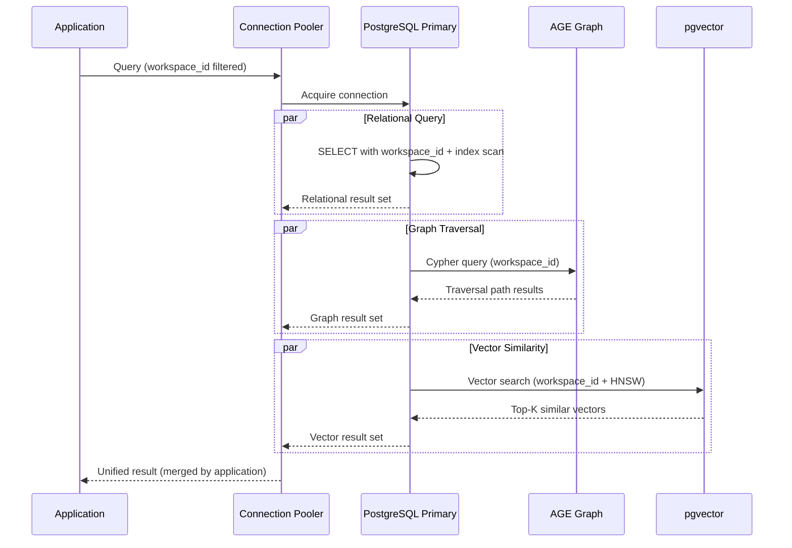

# Database Design

> **Purpose:** Define the database architecture for Vaeloom
> **Status:** ✅ Upgraded to enterprise quality
> **Owner:** Database Team
> **Last Updated:** 2026-07-13
> **Canonical source:** [`/docs/Vaeloom-Complete-Documentation.md#11-database-design`](../../docs/Vaeloom-Complete-Documentation.md#11-database-design)

## Overview

Vaeloom's database architecture uses a three-store design unified by workspace_id scoping: PostgreSQL for relational data (users, workspaces, documents, memory records, audit log), Apache AGE (MVP) or Neo4j (Enterprise) for graph entity relationships, and pgvector (MVP) or Qdrant (Enterprise) for semantic embedding storage. This coordinated multi-store approach enables each query pattern to use the optimal storage engine — ACID transactions for relational data, Cypher traversal for graph queries, and vector similarity search for semantic retrieval — all scoped by the same workspace_id for tenant isolation.

This document defines the storage architecture, core table design, cross-store consistency patterns, and the unified workspace_id scoping strategy. It is intended for database engineers, backend developers writing data access code, and infrastructure engineers planning storage scaling. The architecture prioritizes data integrity (foreign keys, NOT NULL constraints, soft deletes), query performance (index strategies, vector indexes, graph traversal limits), and tenant isolation (workspace_id on every table).

---

## Storage Architecture

```mermaid
graph TD
    classDef rel fill:#e3f2fd,stroke:#1565c0,color:#000,stroke-width:2px
    classDef graph fill:#e8f5e9,stroke:#2e7d32,color:#000,stroke-width:1.5px
    classDef vector fill:#fff3e0,stroke:#e65100,color:#000,stroke-width:1.5px
    classDef table fill:#f3e5f5,stroke:#6a1b9a,color:#000,stroke-width:1px

    subgraph Relational["🗄️ Relational Store (PostgreSQL)"]
        direction TB
        R1["users<br/>Account identity"]
        R2["workspaces<br/>Memory namespace"]
        R3["documents<br/>File metadata + versions"]
        R4["memory_records<br/>Structured memory (JSONB)"]
        R5["entities<br/>Knowledge graph nodes"]
        R6["relationships<br/>Knowledge graph edges"]
        R7["applications<br/>Career data"]
        R8["agent_actions<br/>Append-only audit log"]
    end

    subgraph Graph["🔗 Graph Store (Apache AGE / Neo4j)"]
        G1["Entity Relationships<br/>Traversal queries<br/>Path analysis"]
    end

    subgraph Vector["📐 Vector Store (pgvector / Qdrant)"]
        V1["Semantic Embeddings<br/>1536 dimensions<br/>text-embedding-3-small"]
    end

    subgraph Unified["🔑 Unified by workspace_id"]
        U1["All three stores scope<br/>queries by workspace_id<br/>Cross-store consistency"]
    end

    R1 & R2 & R3 & R4 & R5 & R6 & R7 & R8 --> U1
    G1 --> U1
    V1 --> U1

    class R1,R2,R3,R4,R5,R6,R7,R8 table
    class G1 graph
    class V1 vector
    class U1 rel

```

> **Diagram:** Three coordinated stores unified by shared `workspace_id` scoping. **PostgreSQL** stores all relational data (8 core tables). **Apache AGE** (MVP) or **Neo4j** (Enterprise) handles graph traversal queries. **pgvector** (MVP) or **Qdrant** (Enterprise) stores semantic embeddings. Every query across all three stores is scoped by `workspace_id` for tenant isolation.

---

## Storage Architecture

| Store | MVP Technology | Enterprise | Purpose |
|-------|---------------|------------|---------|
| Relational | PostgreSQL | PostgreSQL + replicas | Durable source of truth |
| Graph | Apache AGE (PG extension) | Neo4j | Entity relationships |
| Vector | pgvector (PG extension) | Qdrant | Semantic embeddings |

## Core Tables

| Table | Purpose | Key Columns |
|-------|---------|-------------|
| `users` | Account identity | `id, email, auth_provider, created_at` |
| `workspaces` | Memory namespace | `id, user_id, created_at` |
| `documents` | Ingested file metadata | `id, workspace_id, path, type, summary` |
| `document_versions` | Version chain | `id, document_id, version_number, superseded_by` |
| `memory_records` | Structured memory | `id, workspace_id, type, content(jsonb), confidence` |
| `entities` | Knowledge graph nodes | `id, workspace_id, type, canonical_name, aliases[]` |
| `relationships` | Knowledge graph edges | `id, from_entity_id, to_entity_id, relation_type` |
| `applications` | Career data | `id, workspace_id, status, submitted_at` |
| `agent_actions` | Audit log | `id, workspace_id, agent_name, action_type, status` |

## Common Mistakes

| Mistake | Consequence |
|---------|-------------|
| Designing for the final schema before understanding query patterns | A schema designed without knowing the queries it serves results in slow JOINs, missing indexes, and frequent migrations |
| Using JSONB as a catch-all for anything unstructured | JSONB is convenient but lacks type safety, indexing flexibility, and referential integrity — structured columns should be the default |
| Ignoring workspace_id in the schema design | Every table must have workspace_id — retrofitting tenant isolation later requires rewriting queries and adding indexes across millions of rows |
| Using UUIDs as primary keys without considering index bloat | UUID v4 is random — it causes index fragmentation and insert performance degradation on large tables. Use sequential UUIDs (v7) or ULIDs |

## Best Practices

| Practice | Why |
|----------|-----|
| Design schema around query patterns, not entity relationships | The ER diagram shows what data exists — the schema design should optimize for the most frequent and expensive queries first |
| Keep the 3-store architecture (relational, graph, vector) unified by workspace_id | Cross-store queries are scoped by workspace_id — this is the tenant isolation boundary and should be the primary access pattern |
| Use JSONB for semi-structured memory data only | Memory records vary by type — JSONB content is appropriate here. Do not use JSONB for entities, relationships, or audit data |
| Add NOT NULL constraints and foreign keys from the start | Soft schemas lead to data quality issues — constraints enforce integrity at the database level and prevent application bugs from corrupting data |

## Security Considerations

| Consideration | Mitigation |
|--------------|-----------|
| workspace_id as the security boundary | Every query must be scoped by workspace_id — a query without a WHERE workspace_id clause is a cross-tenant data leak vulnerability |
| Foreign key relationships across stores | Graph and vector stores do not enforce referential integrity — application-level validation must ensure entity IDs exist before creating relationships |
| Soft deletes over hard deletes | Use a `deleted_at` timestamp column — hard deletes remove audit trail and make recovery impossible |

## Performance Considerations

| Consideration | Approach |
|--------------|----------|
| pgvector query performance | Vector similarity search is O(n) — use vector indexes for sub-100ms queries on embeddings up to 1M rows |
| Graph traversal depth | Limit graph traversal to 5 levels deep — deeper traversals degrade exponentially and often indicate a schema design issue |
| JSONB indexing | JSONB queries should use GIN indexes on paths that appear in WHERE clauses — scanning all rows because JSONB access lacks an index |

## Goals

- Maintain data integrity and consistency across three coordinated stores (relational, graph, vector)
- Achieve sub-100ms query response time for 95% of read operations
- Ensure tenant isolation through workspace_id scoping on all queries
- Support efficient graph traversal up to 5 levels deep for entity relationship queries
- Enable vector similarity search on embeddings with sub-200ms latency for up to 1M vectors

## Scope

**In Scope:**

- PostgreSQL as the primary relational store with 8 core tables
- Apache AGE (PostgreSQL extension) for graph store in MVP
- pgvector (PostgreSQL extension) for vector store in MVP
- Soft deletes with deleted_at timestamps for auditability
- UUID v7 primary keys to avoid index fragmentation
- JSONB for semi-structured memory record content
- Index strategies including GIN for JSONB and HNSW for vectors

**Out of Scope:**

- Database sharding or partitioning by tenant
- Cross-region replication or multi-master setups
- Real-time change data capture (CDC) streams
- Custom stored procedures or triggers
- ORM-generated schema management (managed via migrations)

## Functional Requirements

| ID | Requirement | Priority |
|----|-------------|----------|
| FR-001 | All tables shall include workspace_id for tenant isolation | Critical |
| FR-002 | All mutations shall be scoped by workspace_id | Critical |
| FR-003 | Soft deletes shall use deleted_at timestamp instead of hard deletes | Critical |
| FR-004 | Vector embeddings shall support 1536-dimension similarity search | High |
| FR-005 | Graph store shall support traversal queries up to 5 levels deep | High |
| FR-006 | System shall support entity alias resolution across multiple names | High |
| FR-007 | Document versions shall maintain a version chain with superseded_by references | Medium |
| FR-008 | Audit log shall be append-only with no update or delete operations | Medium |

## Non-Functional Requirements

| ID | Requirement | Target | Measurement |
|----|-------------|--------|-------------|
| NFR-001 | 95% of read queries shall complete within 100ms | p95 < 100ms | Query execution time |
| NFR-002 | 99% of write operations shall complete within 50ms | p99 < 50ms | Write operation duration |
| NFR-003 | Vector similarity search shall complete within 200ms for up to 1M vectors | p95 < 200ms | Vector search latency |
| NFR-004 | Graph traversal up to 5 levels shall complete within 500ms | p95 < 500ms | Traversal query duration |
| NFR-005 | Database shall support 500 concurrent connections | Active connections | Connection pool utilization |
| NFR-006 | Backup recovery shall complete within 4 hours for full database | < 4 hours | Recovery time |

## Components

| Component | Responsibility | Technology | Scale Strategy |
|-----------|---------------|------------|----------------|
| PostgreSQL Instance | Relational data, ACID transactions | PostgreSQL 16 | Primary + read replicas |
| Apache AGE | Graph entity relationship traversal | Apache AGE (PG extension) | In-process PG extension, scales with PG |
| pgvector | Semantic embedding similarity search | pgvector (PG extension) | HNSW index for sub-100ms search up to 1M |
| Connection Pooler | Manage database connections | PgBouncer | Multiple pooler instances with routing |
| Migration Runner | Schema version management | TypeORM migrations / Alembic | Run as CI step, idempotent |
| Backup Manager | Automated backup and recovery | pg_dump + WAL archiving | Point-in-time recovery, daily full backup |

## Data Flow

1. **Write Request** — Application sends INSERT/UPDATE query with workspace_id scoping, connection pooler assigns connection, query executes within transaction boundary with NOT NULL and FK constraint validation
2. **Read Query** — Application sends SELECT query scoped by workspace_id, connection pooler routes to read replica (if configured), executor uses index scan for primary access patterns (workspace_id + id composite)
3. **Vector Search** — Application sends vector similarity query with workspace_id filter, pgvector uses HNSW index to find nearest neighbors, returns top-K results with distance scores within 200ms
4. **Graph Traversal** — Application sends recursive graph query with workspace_id scoping, AGE extension executes traversal with configurable max depth (default 5), returns path results with relationship metadata
5. **Audit Log Write** — Application writes append-only audit entry with workspace_id, agent_id, action_type, and timestamp to agent_actions table using unlogged table optimization for write throughput

## Scalability

| Dimension | Current Limit | 10x Strategy | 100x Strategy |
|-----------|---------------|--------------|---------------|
| Database size | 100GB | 1TB with read replicas | 10TB with partitioning + replicas |
| Concurrent connections | 500 | 5000 with multiple PgBouncer instances | 50000 with proxy + read replica fleet |
| Vector index size | 1M embeddings (1536d) | 10M with IVFFlat index tuning | 100M with Qdrant dedicated vector store |
| Graph traversal depth | 5 levels | 10 levels with indexed graph | 20 levels with Neo4j dedicated graph store |
| Write throughput | 1000 writes/s | 10000 writes/s with batch inserts | 100000 writes/s with partitioning |

## Error Handling

| Error Scenario | Detection | Mitigation | Recovery |
|----------------|-----------|------------|----------|
| Connection pool exhaustion | Connection timeout, pool full metric | Queue requests, reject non-critical operations | Scale connection pool, add read replicas |
| Query deadlock | PostgreSQL deadlock detection | Abort one transaction, retry with backoff | Application-level retry with exponential backoff |
| Replication lag | Standby lag > threshold | Route read queries to primary | Investigate replication bottleneck, tune WAL config |
| Index corruption | Query plan using seq scan on large table | Rebuild index concurrently | Run REINDEX CONCURRENTLY during maintenance window |
| Disk space exhaustion | Disk usage > 85% | Alert, archive old partitions | Add storage, run VACUUM, archive audit partitions |

## Monitoring

| Metric | Alert Threshold | Severity | Dashboard |
|--------|----------------|----------|-----------|
| Query p95 latency | > 500ms for 5 minutes | Critical | Database Performance Dashboard |
| Connection pool utilization | > 80% for 5 minutes | Critical | Connection Pool Dashboard |
| Replication lag | > 10 seconds for 5 minutes | Warning | Replication Dashboard |
| Disk usage | > 85% capacity | Warning | Storage Dashboard |
| Deadlock rate | > 1 per minute | Warning | Lock Contention Dashboard |
| Index scan ratio | < 90% index scans for 10 minutes | Info | Query Efficiency Dashboard |

## Configuration

| Variable | Purpose | Default | Required |
|----------|---------|---------|----------|
| DATABASE_URL | Primary database connection | postgresql://localhost:5432/Vaeloom | Yes |
| DATABASE_READER_URL | Read replica connection | Same as DATABASE_URL | No |
| POOL_MIN | Minimum connection pool size | 5 | No |
| POOL_MAX | Maximum connection pool size | 25 | No |
| POOL_IDLE_TIMEOUT | Idle connection timeout in ms | 30000 | No |
| VECTOR_INDEX_TYPE | Index type for vector search | ivfflat | No |
| VECTOR_LISTS | Number of IVF lists (index quality) | 100 | No |
| GRAPH_MAX_DEPTH | Maximum graph traversal depth | 5 | No |
| ENABLE_SOFT_DELETE | Enable soft delete behavior | true | No |

## Risks

| Risk | Likelihood | Impact | Mitigation |
|------|------------|--------|------------|
| Schema migration conflicts across teams | Medium | High | Version-controlled migrations, CI validation |
| Index bloat from UUID v4 primary keys | Medium | Medium | Use UUID v7 (time-ordered) for primary keys |
| Cross-tenant data leak via missing workspace_id | Low | Critical | Mandatory workspace_id in every WHERE clause, integration tests |
| JSONB schema drift leading to query errors | Medium | Medium | JSONB schema validation at application level |
| Vector index rebuild taking too long | Low | Medium | CONCURRENTLY rebuild, scheduled maintenance window |

## Limitations

| Limitation | Impact | Workaround | Future Resolution |
|------------|--------|------------|-------------------|
| No native graph store in MVP (AGE extension) | Limited graph query performance for deep traversals | Limit traversal depth to 5 levels | Migrate to Neo4j for Enterprise |
| pgvector limited to 2000 dimensions | Cannot use higher-dimension embedding models | Use 1536d embeddings (text-embedding-3-small) | Migrate to Qdrant for Enterprise |
| No table partitioning by default | Slower queries on very large tables | Composite indexes on query patterns | Implement range partitioning by date |
| No automatic vacuum tuning | Table bloat over time | Scheduled VACUUM ANALYZE | Configure autovacuum with tuned thresholds |

## Examples

### Example 1: Cross-Store Query Pattern

```sql
-- Find all documents related to a skill (cross-store)
-- 1. Relational: find skill entity
SELECT id FROM entities 
WHERE workspace_id = 'ws_abc' AND type = 'skill' AND canonical_name = 'React';

-- 2. Graph: traverse relationships from entity
SELECT target_id FROM relationships
WHERE from_entity_id = 'ent_123' AND relation_type = 'requires_skill';

-- 3. Vector: semantic similarity search
SELECT source_id, 1 - (embedding <=> query_embedding) AS similarity
FROM embeddings
WHERE workspace_id = 'ws_abc' AND source_type = 'document'
ORDER BY embedding <=> query_embedding LIMIT 5;
```

### Example 2: Connection Pool Configuration

```typescript
import { Pool } from 'pg';

// Primary pool for write operations
const primaryPool = new Pool({
  host: 'primary.db.Vaeloom.dev',
  database: 'Vaeloom',
  max: 20,
  idleTimeoutMillis: 30000,
  connectionTimeoutMillis: 5000,
});

// Read pool for query offload
const replicaPool = new Pool({
  host: 'replica.db.Vaeloom.dev',
  database: 'Vaeloom',
  max: 30,
  idleTimeoutMillis: 30000,
});

export async function query(sql: string, params: any[], readOnly = false) {
  const pool = readOnly ? replicaPool : primaryPool;
  return pool.query(sql, params);
}
```

---

## Sequence Diagrams



> **Diagram:** Cross-store query pattern — application sends a single request that fans out to all three stores (relational, graph, vector) in parallel via the connection pooler. Results are merged by the application layer.

---

## Future Improvements

| Improvement | Priority | Complexity | Timeline |
|-------------|----------|------------|----------|
| Neo4j dedicated graph store for Enterprise | High | High | Q4 2026 |
| Qdrant dedicated vector store for Enterprise | High | Medium | Q3 2026 |
| Table partitioning by workspace_id or date | Medium | Medium | Q3 2026 |
| Automatic vacuum tuning with monitoring | Medium | Low | Q2 2026 |
| CDC stream for real-time data synchronization | Low | High | Q1 2027 |

## Related Documents

- [Schema.md](./Schema.md)
- [Indexes.md](./Indexes.md)
- [`/docs/Vaeloom-Complete-Documentation.md#11-database-design`](../../docs/Vaeloom-Complete-Documentation.md#11-database-design)
