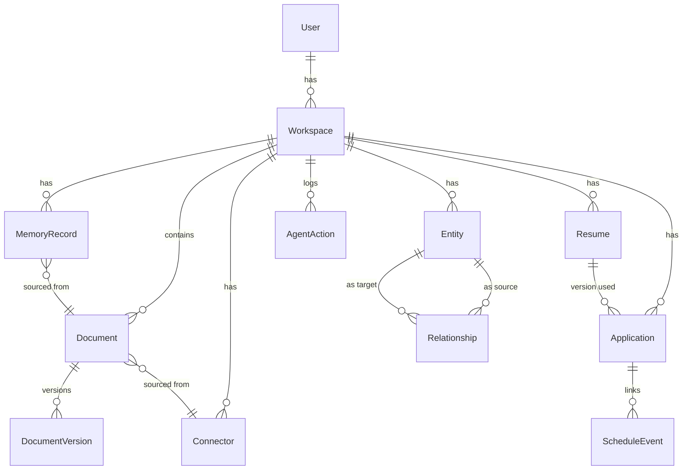
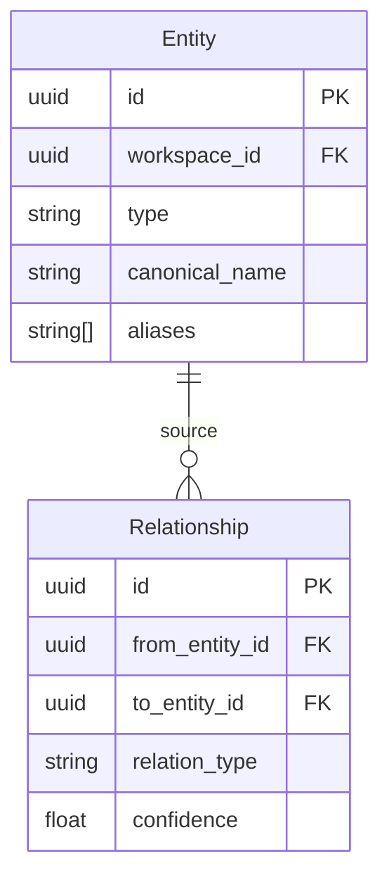

# Entity-Relationship Diagram

> **Purpose:** Define the entity-relationship model for Meridian's database
> **Canonical source:** [`/Docs/Meridian-Complete-Documentation.md#11-database-design`](../../Docs/Meridian-Complete-Documentation.md#11-database-design)

## Overview

The Entity-Relationship (ER) diagram documents the logical data model underlying Meridian's relational store — showing the 9 core entities (users, workspaces, documents, document_versions, memory_records, entities, relationships, applications, agent_actions) and the relationships between them. The root hierarchy flows from users → workspaces → all other entities, with workspace_id as the universal tenant isolation key present on every data table. Understanding this ER model is essential for anyone writing database queries, designing new features, or migrating the schema.

This document defines the core entities, their attributes, the relationship types between them, and the cardinality constraints. It serves as the reference for database engineers, backend developers, and data analysts who need to understand Meridian's data model. The ER diagram is complemented by physical schema definitions in Schema.md and indexing strategies in Indexes.md.

## Goals

- Document all 9 core entities and their inter-relationships in a single authoritative ER diagram
- Establish workspace_id as the universal tenant isolation key across all data entities
- Define explicit relationship types with clear source/target direction and cardinality
- Maintain the ER diagram as a version-controlled asset updated alongside schema migrations
- Support entity relationship queries up to 5 levels deep with clearly defined traversal paths

## Scope

**In Scope:**
- 9 core entities: users, workspaces, documents, document_versions, memory_records, entities, relationships, applications, agent_actions
- Entity attributes, primary keys, and foreign key relationships
- Cardinality and optionality for all relationships (1:1, 1:N, M:N)
- Source → target direction for graph entity relationships
- Workspace_id scoping across all tenant entities

**Out of Scope:**
- Physical schema implementation details (see Schema.md)
- Index strategies and query optimization (see Indexes.md)
- Partitioning and replication considerations (see Partitioning.md, Replication.md)
- Non-relational stores (graph store, vector store) entity models
- Denormalized views or materialized query tables

---

## Core Entities



## Entity Descriptions

| Entity | Description | Key Attributes |
|--------|-------------|---------------|
| User | Account identity | id, email, auth_provider, created_at |
| Workspace | Memory namespace | id, user_id, created_at |
| Document | File metadata | id, path, type, summary, raw_storage_key |
| Connector | External service link | id, type, scopes, status, last_synced_at |
| MemoryRecord | Structured memory | id, type, content(jsonb), confidence, importance |
| Entity | Knowledge graph node | id, type, canonical_name, aliases |
| Relationship | Graph edge | id, from_entity_id, to_entity_id, relation_type |
| Resume | Resume document | id, variant_type, content(jsonb), version |
| Application | Job application | id, status, submitted_at, outcome |
| AgentAction | Audit log entry | id, agent_name, action_type, status |

## Relationships



## Common Mistakes

| Mistake | Consequence |
|---------|-------------|
| Adding too many relationships that aren't queried | Every relationship in the ER diagram implies a JOIN path — relationships that aren't used in queries add complexity without value |
| Confusing ER diagram with schema design | The ER diagram shows logical entities and their relationships — it is not a substitute for physical schema decisions like partitioning, indexing, or storage types |
| Using generic relationship types | A relationship like "related_to" without a specific type forces application-level filtering — relationship types must be semantically meaningful |
| Missing cascade directions in the diagram | Bidirectional relationships without clear source/target create ambiguity for developers and ORMs — every relationship needs an explicit direction |

## Best Practices

| Practice | Why |
|----------|-----|
| Keep the ER diagram focused on core entities | 9 core tables (users through agent_actions) cover the product — adding every join table or denormalized view to the ER diagram makes it unreadable |
| Define relationship types as an explicit enumeration | Relationship types like "works_at", "studied_at", "authored" should be documented — preventing ad-hoc types that fragment the graph |
| Include cardinality and optionality in the diagram | Knowing whether a relationship is 1:1, 1:N, or M:N — and whether it's required or optional — drives schema decisions |
| Version-control the ER diagram alongside schema migrations | When the schema changes, the ER diagram must change too — otherwise it becomes misleading documentation |

## Security Considerations

| Consideration | Mitigation |
|--------------|-----------|
| Entity visibility by workspace | All entities are scoped to a workspace — the ER diagram should not imply that entities from different workspaces can relate to each other |
| Relationship traversal limits | Graph traversal queries should enforce a maximum depth to prevent a single query from exposing an unexpectedly large subgraph |

## Performance Considerations

| Consideration | Approach |
|--------------|----------|
| Entity relationship fan-out | A single entity with thousands of incoming relationships creates hot spots in graph traversal — monitor entity degree and consider sharding high-degree nodes |
| Bidirectional relationship storage | Storing relationships twice (once in each direction) doubles write cost — query with direction, store once with the source entity as the authoritative direction |

---

## Database

| Table | Entity Role | Key ER Attributes |
|-------|-------------|-------------------|
| `users` | Root entity — owns workspaces | id (PK), email (UK), auth_provider |
| `workspaces` | Tenant-scoped container | id (PK), user_id (FK) |
| `documents` | Content entity with version chain | id (PK), workspace_id (FK), path, type |
| `memory_records` | Structured knowledge artifact | id (PK), workspace_id (FK), type, content (jsonb) |
| `entities` | Knowledge graph node | id (PK), workspace_id (FK), type, canonical_name |
| `relationships` | Knowledge graph edge | id (PK), from_entity_id (FK), to_entity_id (FK), relation_type |
| `agent_actions` | Audit log entry | id (PK), workspace_id (FK), agent_name, action_type, status |

---

## Scalability

| Dimension | Current Limit | 10x Strategy | 100x Strategy |
|-----------|---------------|--------------|---------------|
| Entity count per workspace | 50K | Composite index on (workspace_id, type) | Hash partition entities by workspace_id |
| Relationship count per entity | 1K incoming | Index on from_entity_id + to_entity_id | Limit graph traversal depth at query level |
| Document version chain length | 100 versions | Archive versions > 50 to cold storage | Separate version_archive table |
| Memory record count per workspace | 500K | Partition by type; composite index (type, workspace_id) | Time-based partition by freshness_at |

---

## Error Handling

| Scenario | Detection | Mitigation | Recovery |
|----------|-----------|------------|----------|
| Orphaned entity (no workspace) | FK violation on query | Application-level check before insert; DB enforces FK | Background job cleans orphans monthly |
| Circular relationship graph | Entity references itself through chain | Limit graph traversal to max depth (10) | Detect and alert on circular paths at write time |
| Duplicate canonical name | UNIQUE constraint violation | Application-level dedup check before insert | Merge duplicate entities via admin tool |
| Relationship with missing target entity | FK constraint violation | Validate both entity IDs exist before insert | Orphaned relationship logged; soft-deleted |

---

## Monitoring

| Metric | Alert Threshold | Severity | Dashboard |
|--------|-----------------|----------|-----------|
| Entity count growth rate | > 10% week-over-week | Info | ER > Entity Growth |
| Relationship fan-out (max edges per entity) | > 1000 | Warning | ER > Relationship Fan-out |
| Orphaned records detected | > 0 | Warning | ER > Data Integrity |
| Graph traversal query latency (p95) | > 500ms | Warning | ER > Query Performance |
| Document version chain depth (max) | > 50 | Info | ER > Version Depth |

---

## Limitations

| Limitation | Impact | Workaround | Future Resolution |
|------------|--------|------------|-------------------|
| No polymorphic entity types | Entities cannot reference different table types as targets | Store target type + ID as tuple | Add polymorphic entity references |
| Relationship direction is fixed | Queries must know direction; reverse lookups are expensive | Create complementary index on (to_entity_id) | Bidirectional index support in query layer |
| No temporal entity versioning | Entity's canonical name/aliases change over time with no history | Store current values only | Add entity version log for historical queries |

---

## Examples

### Example 1: Entity Relationship Query

```sql
-- Find all skills connected to a person through projects
SELECT DISTINCT e.canonical_name AS skill_name
FROM entities e
JOIN relationships r1 ON e.id = r1.to_entity_id
JOIN relationships r2 ON r1.from_entity_id = r2.from_entity_id
WHERE r2.to_entity_id = 'ent_person_123'
  AND r2.relation_type = 'worked_on'
  AND r1.relation_type = 'requires_skill'
  AND e.workspace_id = 'ws_abc'
  AND e.type = 'skill';
-- Returns: ["Python", "React", "TensorFlow", "Machine Learning"]
```

### Example 2: Entity Creation with Relationships

```python
# Create a new entity with relationships
entity_id = await graph.create_entity(
    workspace_id="ws_abc",
    entity_type="project",
    canonical_name="HackX 2026",
    aliases=["HackX", "Hackathon 2026 Project"]
)

# Link to existing person
await graph.create_relationship(
    from_entity_id=entity_id,
    to_entity_id="ent_person_123",
    relation_type="involves",
    workspace_id="ws_abc"
)

# Link to existing skills
for skill_id in ["ent_skill_python", "ent_skill_react"]:
    await graph.create_relationship(
        from_entity_id=entity_id,
        to_entity_id=skill_id,
        relation_type="requires_skill",
        workspace_id="ws_abc"
    )
```

---

## Future Improvements

| Improvement | Priority | Complexity | Timeline |
|-------------|----------|------------|----------|
| Entity versioning with temporal history | High | Medium | Q1 2027 |
| Polymorphic entity references for cross-type relationships | Medium | Medium | Q2 2027 |
| Automated graph cycle detection and alerting | Low | Low | Q3 2026 |
| Entity-relationship visualization in admin UI | Low | Medium | Q4 2026 |

---

## Related Documents

- [Database Design.md](./Database-Design.md)
- [Schema.md](./Schema.md)
- [`/Docs/Meridian-Complete-Documentation.md#11-database-design`](../../Docs/Meridian-Complete-Documentation.md#11-database-design)
