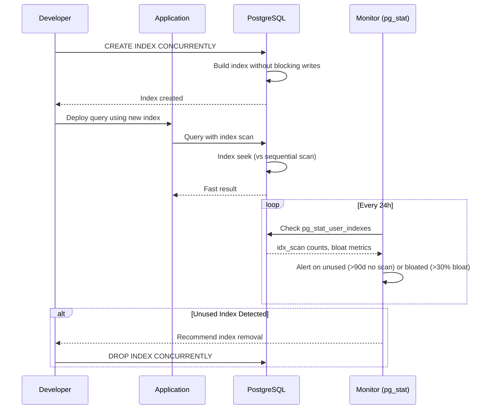

# Database Indexes

> **Purpose:** Define the indexing strategy for Meridian's PostgreSQL database
> **Status:** 🆕 New

## Overview

Database indexes are the primary mechanism for maintaining query performance as Meridian's data grows — transforming table scans into index seeks for the most frequent and expensive query patterns. The indexing strategy covers three index types: B-tree for tenant-scoped queries (workspace_id), composite indexes for multi-column query patterns (type + workspace_id, workspace_id + created_at), and GIN indexes for full-text search and array containment. Every index is documented with its purpose and monitored via pg_stat_user_indexes to detect unused indexes and track bloat.

This document defines the indexing architecture, index definitions, maintenance schedule, and usage monitoring for all Meridian database tables. It is intended for database engineers and backend developers who need to understand existing query optimization or add new indexes for emerging query patterns. Over-indexing is as harmful as under-indexing — each additional index slows writes by 10-30%, so every index must justify its existence through measured query usage.

## Goals

- Index workspace_id on every tenant-scoped table as the single most impactful optimization for multi-tenant queries
- Maintain composite indexes for the top 5 most frequent query patterns (type-scoped retrieval, time-range audit, connector sync)
- Detect and remove unused indexes quarterly through pg_stat_user_indexes analysis
- Keep index bloat under 30% through scheduled REINDEX operations (monthly for high-churn tables, quarterly for read-heavy tables)
- Support full-text search with GIN indexes and entity name search with GIN on aliases arrays

## Scope

**In Scope:**
- B-tree indexes on workspace_id for all tenant-scoped tables
- Composite indexes for multi-column query patterns (type + workspace_id, workspace_id + created_at DESC)
- GIN indexes for full-text search (documents.content_tsvector) and array containment (entities.aliases)
- Relationship traversal indexes (from_entity_id, to_entity_id, relation_type)
- Index maintenance via REINDEX CONCURRENTLY with scheduled cadence
- Usage monitoring via pg_stat_user_indexes

**Out of Scope:**
- Partial or conditional indexes (future improvement)
- Expression indexes or functional indexes
- BRIN indexes for time-series data (considered but not implemented)
- Vector indexes (HNSW/IVFFlat) — covered in Embeddings.md
- Index recommendations from pg_stat_statements analysis (future improvement)

---

## Index Architecture

```mermaid
graph TD
    classDef btree fill:#e3f2fd,stroke:#1565c0,color:#000,stroke-width:1.5px
    classDef composite fill:#e8f5e9,stroke:#2e7d32,color:#000,stroke-width:1.5px
    classDef gin fill:#fff3e0,stroke:#e65100,color:#000,stroke-width:1.5px
    classDef maint fill:#f3e5f5,stroke:#6a1b9a,color:#000,stroke-width:1px

    subgraph BTree["🌲 B-tree Indexes"]
        direction TB
        BT1["documents(workspace_id)<br/>Tenant-scoped queries"]
        BT2["entities(workspace_id)<br/>Tenant-scoped queries"]
        BT3["entities(canonical_name)<br/>Name lookups"]
        BT4["documents(source_connector_id)<br/>Connector sync"]
        BT5["relationships(from_entity_id)<br/>Graph traversal"]
        BT6["relationships(to_entity_id)<br/>Graph traversal"]
        BT7["relationships(relation_type)<br/>Type-filtered queries"]
    end

    subgraph Composite["🔗 Composite Indexes"]
        CP1["memory_records(type, workspace_id)<br/>Type-scoped retrieval"]
        CP2["agent_actions(workspace_id, created_at DESC)<br/>Time-range audit queries"]
    end

    subgraph GIN["🔍 GIN Indexes"]
        G1["entities USING GIN(aliases)<br/>Entity name search"]
        G2["documents USING GIN(content_tsvector)<br/>Full-text search"]
    end

    subgraph Maintenance["🛠️ Index Maintenance"]
        M1["workspace_id indexes<br/>Bloat: Low<br/>REINDEX quarterly"]
        M2["created_at indexes<br/>Bloat: Medium<br/>REINDEX monthly"]
        M3["GIN indexes<br/>Bloat: Low<br/>Auto-maintained"]
    end

    subgraph Monitoring["📊 Usage Monitoring"]
        MON1["pg_stat_user_indexes<br/>idx_scan = 0 → Unused"]
        MON2["pg_relation_size<br/>Track index bloat"]
    end

    BT1 & BT2 & BT3 & BT4 & BT5 & BT6 & BT7 --> M1
    CP1 & CP2 --> M2
    G1 & G2 --> M3
    M1 & M2 & M3 --> MON1 & MON2

    class BT1,BT2,BT3,BT4,BT5,BT6,BT7 btree
    class CP1,CP2 composite
    class G1,G2 gin
    class M1,M2,M3 maint
    class MON1,MON2 maint

```



> **Diagram:** Three index types serve different query patterns. **B-tree** indexes handle tenant-scoped queries, name lookups, and graph traversal. **Composite indexes** support type-scoped retrieval and time-range audit queries. **GIN indexes** enable entity name search and full-text search. All indexes are monitored via `pg_stat_user_indexes` to detect unused indexes and track bloat.

---

## Indexing Strategy

| Pattern | Index Type | Rationale |
|---------|------------|-----------|
| Tenant-scoped queries | B-tree on `workspace_id` | Every table has workspace_id |
| Type-scoped retrieval | Composite on `(type, workspace_id)` | Memory records by type |
| Time-range queries | B-tree on `(workspace_id, created_at)` | Audit log queries |
| Connector sync | B-tree on `source_connector_id` | Connector-scoped operations |
| Entity name search | GIN on `aliases[]` | Name matching |
| Full-text search | GIN on `content_tsvector` | Document content search |

## Index Definitions

```sql
-- Primary tenant-scoped indexes
CREATE INDEX idx_documents_workspace ON documents(workspace_id);
CREATE INDEX idx_memory_workspace_type ON memory_records(workspace_id, type);
CREATE INDEX idx_entities_workspace ON entities(workspace_id);
CREATE INDEX idx_agent_actions_workspace_time ON agent_actions(workspace_id, created_at DESC);

-- Query-specific indexes
CREATE INDEX idx_documents_connector ON documents(source_connector_id);
CREATE INDEX idx_entity_aliases ON entities USING GIN(aliases);
CREATE INDEX idx_entity_name ON entities(canonical_name);

-- Relationship traversal indexes
CREATE INDEX idx_relationships_from ON relationships(from_entity_id);
CREATE INDEX idx_relationships_to ON relationships(to_entity_id);
CREATE INDEX idx_relationships_type ON relationships(relation_type);
```

## Index Maintenance

| Index | Bloat Risk | Maintenance |
|-------|------------|-------------|
| workspace_id indexes | Low | Reindex quarterly |
| created_at indexes | Medium (time-series) | Reindex monthly |
| GIN indexes | Low | Auto-maintained |

## Monitoring

```sql
-- Check index usage
SELECT schemaname, tablename, indexname, idx_scan
FROM pg_stat_user_indexes
WHERE idx_scan = 0  -- Unused indexes
ORDER BY tablename;

-- Check index size
SELECT indexrelid::regclass, pg_size_pretty(pg_relation_size(indexrelid))
FROM pg_stat_user_indexes
ORDER BY pg_relation_size(indexrelid) DESC;
```

## Common Mistakes

| Mistake | Consequence |
|---------|-------------|
| Over-indexing — adding indexes on every column | Each additional index slows writes (INSERT/UPDATE/DELETE) by 10-30% — index only columns that appear in WHERE, JOIN, or ORDER BY clauses |
| Not monitoring index usage | Indexes that are never scanned waste storage and write performance — `pg_stat_user_indexes` with `idx_scan = 0` identifies unused indexes |
| Using B-tree for everything | B-tree indexes are optimal for equality and range queries but useless for full-text search (use GIN) or array containment (use GIN) |
| Forgetting composite indexes for multi-column queries | Two separate indexes on `(workspace_id)` and `(created_at)` are not used together efficiently — a composite index `(workspace_id, created_at)` is needed for time-scoped queries |

## Best Practices

| Practice | Why |
|----------|-----|
| Index workspace_id on every tenant-scoped table | Every query filters by workspace_id — a B-tree index on this column is the single most impactful index in the entire database |
| Use composite indexes for common query patterns | Queries that filter by `(type, workspace_id)` or `(workspace_id, created_at DESC)` should have matching composite indexes — PostgreSQL can use a single composite index more efficiently than two separate indexes |
| Monitor and remove unused indexes quarterly | Run `pg_stat_user_indexes` analysis quarterly — removing unused indexes improves write performance and reduces storage |
| Use GIN indexes for array and full-text search | GIN indexes handle array containment (`@>`) and full-text search (`to_tsvector`) — B-tree cannot support these operations efficiently |

## Security Considerations

| Consideration | Mitigation |
|--------------|-----------|
| Partial indexes exposing data patterns | Partial indexes (e.g., `WHERE status = 'active'`) may reveal business logic patterns — document their purpose and review for information leakage |
| Index-only scans and column permissions | Index-only scans can return column data without touching the table — ensure column-level permissions are enforced regardless of index coverage |

## Performance Considerations

| Consideration | Approach |
|--------------|----------|
| Index bloat from UUID v4 primary keys | Random UUIDs cause index page splits — use sequential UUIDs (v7) or ULIDs for high-write tables like `agent_actions` and `memory_records` |
| B-tree index bloat from frequent updates | Tables with high churn (memory_records, agent_actions) need more frequent index maintenance — schedule it monthly for these tables |
| GIN index maintenance | GIN indexes are faster to build than B-tree but have slower updates — batch inserts into GIN-indexed columns rather than single-row inserts |

---

## Database

| Index | Table | Column(s) | Type | Purpose |
|-------|-------|-----------|------|---------|
| `idx_documents_workspace` | documents | workspace_id | B-tree | Tenant-scoped document queries |
| `idx_memory_workspace_type` | memory_records | workspace_id, type | Composite B-tree | Type-scoped memory retrieval |
| `idx_entities_workspace` | entities | workspace_id | B-tree | Tenant-scoped entity queries |
| `idx_entity_aliases` | entities | aliases | GIN | Entity name search |
| `idx_entity_name` | entities | canonical_name | B-tree | Exact name lookups |
| `idx_relationships_from` | relationships | from_entity_id | B-tree | Graph traversal (outgoing) |
| `idx_relationships_to` | relationships | to_entity_id | B-tree | Graph traversal (incoming) |
| `idx_agent_actions_time` | agent_actions | workspace_id, created_at DESC | Composite B-tree | Time-range audit queries |
| `idx_documents_connector` | documents | source_connector_id | B-tree | Connector-scoped operations |
| `idx_documents_fts` | documents | content_tsvector | GIN | Full-text search |

---

## Scalability

| Dimension | Current Limit | 10x Strategy | 100x Strategy |
|-----------|---------------|--------------|---------------|
| Index size relative to table | 30% of table size (10 indexes) | Remove unused indexes (pg_stat_user_indexes) | Partial indexes for active data subsets |
| Write impact from indexes | 15% slower INSERT | Batch inserts to reduce index page splits | Remove indexes before bulk load; recreate after |
| Bloat from UUID v4 PK indexes | 20% index bloat after 1M rows | REINDEX CONCURRENTLY monthly | Migrate to UUID v7 (sequential) |
| GIN index build time | 5 min for 1M entity rows | Batch inserts instead of single-row | Maintain GIN with autovacuum tuning |

---

## Error Handling

| Scenario | Detection | Mitigation | Recovery |
|----------|-----------|------------|----------|
| Index corruption | Query returns wrong results or error | REINDEX CONCURRENTLY on affected index | Verify index consistency with pg_amcheck |
| Index bloat causing slow queries | Seq scan on indexed column detected | REINDEX CONCURRENTLY during maintenance window | Tune autovacuum to prevent future bloat |
| Concurrent index creation blocking writes | CREATE INDEX on busy table | Use CREATE INDEX CONCURRENTLY | Monitor lock waits before creating indexes on large tables |
| Missing index causing full table scan | Sequential scan on large table in pg_stat_statements | Analyze query patterns; add missing index | Monitor pg_stat_user_indexes for scan types |

---

## Monitoring

| Metric | Alert Threshold | Severity | Dashboard |
|--------|-----------------|----------|-----------|
| Unused indexes (idx_scan = 0) | > 3 unused indexes | Warning | Indexes > Usage |
| Index bloat (pg_relation_size vs estimated) | > 30% bloat | Warning | Indexes > Bloat |
| Sequential scans on tables > 10K rows | > 10/min | Warning | Indexes > Missing Indexes |
| Index creation duration | > 30 min | Info | Indexes > Maintenance |
| REINDEX last run date | > 90 days ago | Warning | Indexes > Maintenance |

---

## Limitations

| Limitation | Impact | Workaround | Future Resolution |
|------------|--------|------------|-------------------|
| GIN indexes are slower to update | INSERT/UPDATE on GIN-indexed columns (aliases) is 3x slower | Batch inserts; update aliases infrequently | Use trigram indexes (pg_trgm) for faster updates |
| Composite indexes can only use leftmost columns | Index on (a, b, c) does not benefit queries filtering only on (b, c) | Create separate indexes on frequently-used non-prefix columns | Use pg_hint_plan for manual index selection |
| Index-only scans depend on visibility map | Heavy UPDATE/DELETE traffic reduces visibility map efficiency | Aggressive vacuum on high-churn tables | Use UNLOGGED tables for ephemeral data (with trade-offs) |

---

## Examples

### Example 1: Creating Indexes Concurrently

```sql
-- Safe index creation on production tables
CREATE INDEX CONCURRENTLY idx_memory_workspace_type
ON memory_records(workspace_id, type);

-- GIN index for full-text search (safe for production)
CREATE INDEX CONCURRENTLY idx_documents_fts
ON documents USING GIN(to_tsvector('english', summary));

-- Partial index for active documents
CREATE INDEX CONCURRENTLY idx_documents_active
ON documents(workspace_id, created_at)
WHERE deleted_at IS NULL;
```

### Example 2: Index Monitoring Script

```sql
-- Find unused indexes (idx_scan = 0)
SELECT schemaname, tablename, indexname, idx_scan
FROM pg_stat_user_indexes
WHERE idx_scan = 0
  AND schemaname = 'public'
ORDER BY tablename;

-- Find bloated indexes
SELECT indexrelid::regclass AS index_name,
       pg_size_pretty(pg_relation_size(indexrelid)) AS size
FROM pg_stat_user_indexes
ORDER BY pg_relation_size(indexrelid) DESC;

-- Reindex bloated indexes safely
REINDEX INDEX CONCURRENTLY idx_agent_actions_time;
```

---

## Sequence Diagrams



> **Diagram:** Index creation and monitoring lifecycle — concurrent index creation avoids blocking writes, the application benefits from faster queries, and daily monitoring via pg_stat_user_indexes detects unused or bloated indexes for cleanup.

---

## Future Improvements

| Improvement | Priority | Complexity | Timeline |
|-------------|----------|------------|----------|
| UUID v7 migration for sequential primary keys | High | Medium | Q4 2026 |
| Partial indexes for active data subsets (e.g., unarchived documents only) | Medium | Low | Q3 2026 |
| pg_trigram indexes for fuzzy entity name matching | Medium | Low | Q3 2026 |
| Automated index recommendation based on pg_stat_statements analysis | Low | High | Q1 2027 |

---

## Related Documents

- [Database Design.md](./Database-Design.md)
- [Schema.md](./Schema.md)
- [Optimization.md](./Optimization.md)
