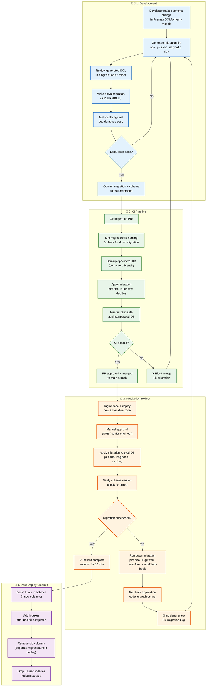
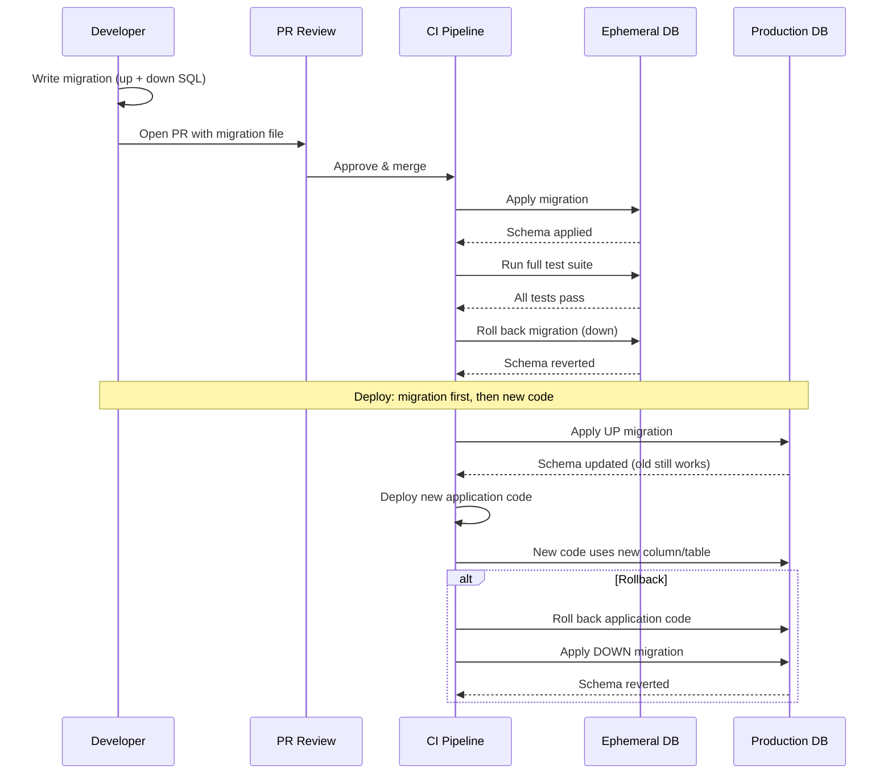

# Database Migrations

> **Purpose:** Define the migration strategy for Meridian's database
> **Status:** 🆕 New

## Overview

Database migrations are the controlled mechanism for evolving Meridian's schema across development, staging, and production environments — ensuring that schema changes are reviewed, tested, reversible, and deployed without downtime. Every migration follows a four-phase lifecycle: development (generate, review, test locally), CI pipeline (lint, apply to ephemeral database, run full test suite), production rollout (approve, apply, verify or roll back), and post-deploy cleanup (backfill data, add indexes, remove old columns). Every migration must have a reversible down migration.

This document defines the migration framework, conventions, zero-downtime patterns, rollback procedures, and environment-specific strategies. It serves all developers making schema changes, SRE engineers approving and applying production migrations, and platform engineers maintaining the migration pipeline. The golden rule: always apply the migration before deploying new application code that depends on the new schema.

## Goals

- Ensure every migration is reversible with a tested down migration before production deployment
- Achieve zero-downtime schema changes at Enterprise scale through progressive rollout patterns (add → backfill → constrain → drop)
- Validate every migration against an ephemeral database with the full test suite in CI before merging
- Complete production migration rollback within 5 minutes using prepared down migrations
- Maintain a clean migration history with squashed baselines quarterly to keep deployment times fast

## Scope

**In Scope:**
- Migration framework selection (Prisma Migrate for TypeScript, Alembic for Python)
- Migration file naming convention: `YYYYMMDD_HHMMSS_description.sql`
- Reversible migration requirement — every up migration must have a corresponding down migration
- CI pipeline validation: lint, ephemeral database, apply, test, merge gate
- Zero-downtime pattern: add column → backfill → add constraint → drop old column
- Rollback procedures and migration audit logging

**Out of Scope:**
- Online schema change tools (gh-ost, pt-online-schema-change) — future improvement
- Database branching or schema diff tools beyond the ORM migration framework
- Migration of non-PostgreSQL stores (AGE graph, pgvector, Qdrant)
- Automated schema drift detection and resolution
- Multi-region schema synchronization

---

## Migration Lifecycle



> **Diagram:** The migration lifecycle flows through four phases. **Development:** model change → generate → review → test locally. **CI Pipeline:** lint → ephemeral DB → apply → test → merge. **Production Rollout:** deploy code → approve → apply → verify or rollback → incident review. **Post-Deploy:** backfill → add indexes → remove old columns → reclaim space. Every failure path loops back to development for a fix.

---

## Migration Framework

| Environment | Tool | Strategy |
|-------------|------|----------|
| Development | Prisma Migrate (TypeScript) or Alembic (Python) | Auto-generated from schema |
| Staging | Same | Applied automatically in CI |
| Production | Same | Manual approval, applied via CI |

## Migration Conventions

| Convention | Standard |
|------------|----------|
| File naming | `YYYYMMDD_HHMMSS_description.sql` |
| Naming style | snake_case, descriptive: `add_memory_confidence_column` |
| Atomicity | One logical change per migration |
| Reversibility | Every migration must have a down migration |

## Migration Process

### MVP

```bash
# Generate migration
npx prisma migrate dev --name add_memory_confidence

# Apply in production
npx prisma migrate deploy
```

### Enterprise

- Zero-downtime migrations using progressive rollout:
  1. Add new columns/tables (no NOT NULL constraints)
  2. Backfill data in batches
  3. Add constraints/indexes
  4. Remove old columns (separate migration)

## Rollback

```bash
# Revert last migration
npx prisma migrate reset

# Revert to specific version
npx prisma migrate resolve --rolled-back "20260712_add_memory_confidence"
```

## Common Mistakes

| Mistake | Consequence |
|---------|-------------|
| Migrations without a down migration | If a production migration fails, there is no way to revert — the database is stuck in an inconsistent state until a manual fix is developed |
| Adding NOT NULL constraints to existing columns without a backfill | A column added as NOT NULL to a table with existing NULL rows causes the migration to fail on production — always backfill data first, then add constraints |
| Running migrations as part of application startup | If the application starts before the migration completes, two instances race to migrate — use explicit `migrate deploy` commands, not auto-migration on boot |
| Creating indexes on large tables during peak traffic | A sequential index scan blocks writes — create indexes CONCURRENTLY on tables larger than 1M rows or schedule during maintenance windows |

## Best Practices

| Practice | Why |
|----------|-----|
| Every migration must be reversible | A down migration should be written alongside the up migration and tested — production rollbacks are not the time to write a down migration from scratch |
| Use zero-downtime patterns for enterprise | Add columns without NOT NULL → backfill → add constraints → remove old columns in a separate release — each step is a reversible, independent deployment |
| Test migrations against a production-sized copy | A migration that runs in 2 seconds on a development database may take 20 minutes on production — test against realistic data volumes in staging |
| Run migrations before deploying application code | The new application code expects the new schema — apply the migration first, then deploy the code that uses it. This avoids errors from code running against old schemas |

## Security Considerations

| Consideration | Mitigation |
|--------------|-----------|
| Migration script access | Migration files execute arbitrary SQL including DROP and DELETE — access to migration files and the ability to run them must be restricted to senior engineers |
| Data exposure in migration logs | Migrations that SELECT or UPDATE user data may log sensitive information — ensure migration logging redacts PII |
| Rollback of destructive migrations | A migration that drops a column or table cannot recover data unless a backup exists — always take a backup before destructive migrations |

## Performance Considerations

| Consideration | Approach |
|--------------|----------|
| Index creation during migrations | Use `CREATE INDEX CONCURRENTLY` for tables with active writes — standard CREATE INDEX blocks writes on the table |
| Data backfill batches | Backfilling millions of rows in a single transaction ties up connection pool and transaction log — backfill in batches of 1,000-10,000 rows with progress logging |
| Foreign key validation | Adding a foreign key to a large table validates all existing rows — use `NOT VALID` then `VALIDATE CONCURRENTLY` to avoid blocking writes |

---

## Database

| Table | Purpose | Migration Relevance |
|-------|---------|---------------------|
| `_migrations` | Framework-managed migration tracking | Records all applied migrations with checksums |
| `schema_versions` | Custom schema version registry | Tracks deployed schema version per environment |
| `migration_audit` | Audit log of all migration executions | id, migration_name, status, started_at, completed_at, executed_by |

---

## Scalability

| Dimension | Current Limit | 10x Strategy | 100x Strategy |
|-----------|---------------|--------------|---------------|
| Migration file count | 100 migrations per year | Squash migrations quarterly into baseline | Versioned baseline migrations per release train |
| Tables affected per migration | 1-3 tables | Zero-downtime patterns (add → backfill → constraint) | Parallel migration execution for independent schema changes |
| Rollback complexity | One-off rollback per migration | Every migration has reversible down migration | Automated rollback testing in CI/CD |

---

## Error Handling

| Scenario | Detection | Mitigation | Recovery |
|----------|-----------|------------|----------|
| Migration fails mid-execution | SQL error returned | Migration framework rolls back transaction; marks as failed | Fix migration file; re-run from failed point |
| Schema drift (manual DB change) | Migration checksum mismatch | Block deployment; alert on-call | Resolve drift manually or reset checksum |
| Down migration not tested | Rollback produces error | Manual database fix required | Test down migrations in staging before production |
| Data loss from destructive migration | DROP COLUMN or DROP TABLE removes data | Restore from backup taken before migration | Apply backup; re-run migration with data preservation |

---

## Monitoring

| Metric | Alert Threshold | Severity | Dashboard |
|--------|-----------------|----------|-----------|
| Migration execution duration | > 30 min | Warning | Migrations > Duration |
| Pending migrations count | > 5 | Info | Migrations > Pending |
| Failed migrations (any environment) | > 0 | Critical | Migrations > Failures |
| Schema drift detected | Any drift | Critical | Migrations > Schema Drift |
| Migration-to-deploy lag | Migration applied > 1h before code deploy | Warning | Migrations > Deploy Sync |

---

## Limitations

| Limitation | Impact | Workaround | Future Resolution |
|------------|--------|------------|-------------------|
| No online schema change support (gh-ost, pt-online) | ALTER TABLE on large tables locks writes | Use zero-downtime pattern (add → backfill → swap → drop) | Integrate gh-ost for online schema changes |
| Migration squashing is manual | 100+ migration files slow down fresh DB setup | Manual quarterly squash into baseline | Automated migration squash tool |
| Rollback is not always reversible | Some changes (DROP COLUMN, data transformation) cannot be rolled back cleanly | Never perform destructive changes without backup | Immutable migration patterns with forward-only approach |

---

## Examples

### Example 1: Add Column with Zero Downtime

```sql
-- Migration: add_preference_language_column
-- Up: Add column, backfill, then add NOT NULL
ALTER TABLE users ADD COLUMN preference_language VARCHAR(10);

-- Backfill: application code writes language on next request
-- After backfill verified (>99% populated):
ALTER TABLE users ALTER COLUMN preference_language SET NOT NULL;
ALTER TABLE users ALTER COLUMN preference_language SET DEFAULT 'en';

-- Down:
ALTER TABLE users DROP COLUMN preference_language;
```

### Example 2: Migration Verification Script

```bash
#!/bin/bash
# CI pipeline migration verification
set -euo pipefail

# 1. Lint migration SQL
npx prisma validate

# 2. Apply migration to ephemeral database
npx prisma migrate deploy

# 3. Run full test suite
npm run test -- --runInBand

# 4. Verify rollback
npx prisma migrate reset --force

# 5. Re-apply and confirm tests pass again
npx prisma migrate deploy
npm run test -- --runInBand

echo "Migration verified: up, down, and re-up all pass"
```

---

## Sequence Diagrams



> **Diagram:** Migration lifecycle — a developer writes a reversible migration, CI validates it against an ephemeral database (apply → test → rollback → re-apply), then the migration is applied to production before the new code that depends on it. The golden rule: migration first, code second.

---

## Future Improvements

| Improvement | Priority | Complexity | Timeline |
|-------------|----------|------------|----------|
| Automated migration squash tool | Medium | Medium | Q4 2026 |
| gh-ost integration for online schema changes | High | High | Q2 2027 |
| Automated rollback testing in CI/CD pipeline | Medium | Medium | Q1 2027 |
| Migration impact analysis (preview locks and duration) | Low | High | Q2 2027 |

---

## Related Documents

- [Database Design.md](./Database-Design.md)
- [Backups.md](./Backups.md)
- [`/Docs/Engineering/Implementation/02-database-schema.md`](../../Docs/Engineering/Implementation/02-database-schema.md)
