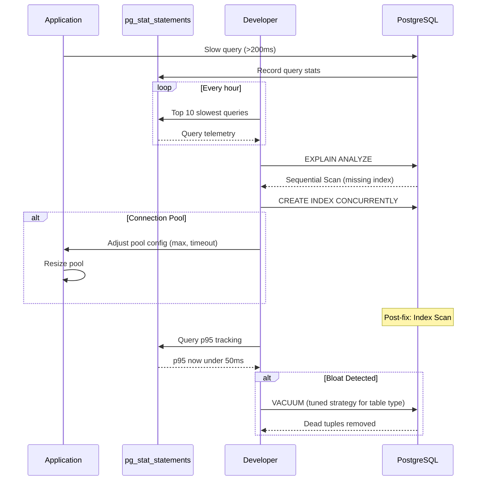

# Database Optimization

> **Purpose:** Define database optimization strategies for Vaeloom
> **Status:** 🆕 New

## Overview

Database optimization at Vaeloom follows a data-driven approach: identify slow queries through pg_stat_statements, diagnose the root cause (missing index, N+1 pattern, over-fetching, JSONB abuse), apply the appropriate fix, and verify the improvement. Optimization priorities are determined by query frequency and impact — a query that runs 10,000 times per day at 100ms costs 1,000 seconds of cumulative latency, while a query that runs once per day at 10 seconds costs only 10 seconds. Connection pooling, vacuum strategy, and batch operations complete the optimization picture.

This document defines the optimization detection pipeline, common query anti-patterns, connection pool sizing per service tier, vacuum strategy for different table types, and batch operation sizes. It is intended for backend developers writing database queries, SRE engineers troubleshooting performance issues, and database engineers planning capacity. The guiding principle: measure before optimizing — every optimization must be backed by pg_stat_statements data.

## Goals

- Identify and resolve the top 20 slowest queries monthly through pg_stat_statements analysis
- Maintain p95 query latency under 200ms for 95% of all database operations
- Keep connection pool utilization under 80% with per-service-tier pool sizing (API: max 20, AI Service: max 10, Workers: max 5)
- Prevent table bloat exceeding 30% dead tuple ratio through tuned vacuum strategies
- Eliminate all N+1 query patterns and unnecessary sequential scans on tables larger than 10K rows

## Scope

**In Scope:**
- Slow query detection via pg_stat_statements with p95 > 200ms threshold
- Common optimization patterns: N+1 queries, missing indexes, SELECT * over-fetching, JSONB abuse
- Connection pool sizing per service tier with optimal max/min/idle configuration
- Vacuum strategy differentiated by table churn (aggressive for high-churn, light for read-heavy)
- Batch operation sizing for bulk data processing (ingestion, consolidation, archival)

**Out of Scope:**
- Query optimization for non-PostgreSQL stores (AGE graph queries, vector similarity search)
- Database hardware optimization (CPU, memory, disk I/O configuration)
- Application-level caching strategies (Redis — covered in Infrastructure docs)
- Read replica query routing optimization (covered in Replication.md)
- ORM-level query optimization (Prisma/SQLAlchemy specific patterns)

---

## Optimization Strategy

```mermaid
graph TD
    classDef detect fill:#e3f2fd,stroke:#1565c0,color:#000,stroke-width:1.5px
    classDef pattern fill:#e8f5e9,stroke:#2e7d32,color:#000,stroke-width:1.5px
    classDef pool fill:#fff3e0,stroke:#e65100,color:#000,stroke-width:1.5px
    classDef vacuum fill:#f3e5f5,stroke:#6a1b9a,color:#000,stroke-width:1.5px
    classDef batch fill:#ffebee,stroke:#c62828,color:#000,stroke-width:1px

    subgraph Detection["📡 Slow Query Detection"]
        D1["pg_stat_statements<br/>Queries with p95 > 200ms"]
        D2["Check: mean_time, rows,<br/>shared_blks_hit, shared_blks_read"]
    end

    subgraph Patterns["🔧 Common Optimization Patterns"]
        direction TB
        P1["N+1 Queries<br/>Loading related entities separately<br/>→ Use JOINs or batch loading"]
        P2["Missing Index<br/>Sequential scans on large tables<br/>→ Add appropriate indexes"]
        P3["Over-fetching<br/>SELECT * when 2 cols needed<br/>→ Be selective in queries"]
        P4["JSONB Abuse<br/>Heavy JSON ops in WHERE<br/>→ Extract to indexed columns"]
    end

    subgraph Pooling["🔌 Connection Pooling"]
        direction TB
        C1["apps/api<br/>max: 20, min: 5<br/>idle: 30s"]
        C2["apps/ai-service<br/>max: 10, min: 2<br/>idle: 60s"]
        C3["infra/worker<br/>max: 5, min: 1<br/>idle: 120s"]
    end

    subgraph Vacuum["🧹 Vacuum Strategy"]
        direction TB
        V1["High-churn tables<br/>memory_records, agent_actions<br/>→ VACUUM ANALYZE aggressively"]
        V2["Read-heavy tables<br/>documents, entities<br/>→ VACUUM lighter touch"]
    end

    subgraph Batch["📦 Batch Operations"]
        direction TB
        B1["Document ingestion: 100 files/batch"]
        B2["Memory consolidation: 1K records/weekly"]
        B3["Entity re-embedding: 500 entities/monthly"]
        B4["Data archival: 10K records/quarterly"]
    end

    D1 --> D2
    D2 --> P1 & P2 & P3 & P4
    P1 & P2 & P3 & P4 --> C1 & C2 & C3
    C1 & C2 & C3 --> V1 & V2
    V1 & V2 --> B1 & B2 & B3 & B4

    class D1,D2 detect
    class P1,P2,P3,P4 pattern
    class C1,C2,C3 pool
    class V1,V2 vacuum
    class B1,B2,B3,B4 batch

```



> **Diagram:** Database optimization flows from **detection** (pg_stat_statements identifies slow queries) through **common optimization patterns** (N+1, missing indexes, over-fetching, JSONB abuse), **connection pooling** (sized per service tier), **vacuum strategy** (aggressive for high-churn, light for read-heavy), and **batch operations** (sized per operation type).

---

## Query Optimization

### Slow Query Detection

```sql
-- Find slow queries (p95 > 200ms for MVP)
SELECT query, calls, mean_time * 1000 as mean_ms,
       rows, shared_blks_hit, shared_blks_read
FROM pg_stat_statements
WHERE mean_time * 1000 > 200
ORDER BY mean_time DESC
LIMIT 20;
```

### Common Optimization Patterns

| Pattern | Issue | Fix |
|---------|-------|-----|
| N+1 queries | Loading related entities separately | Use JOINs or batch loading |
| Missing index | Sequential scans on large tables | Add appropriate indexes |
| Over-fetching | SELECT * when 2 columns needed | Be selective in queries |
| JSONB abuse | Heavy JSON operations in WHERE | Extract to indexed columns |

## Connection Pooling

```typescript
// Optimal pool sizing per service
const poolConfig = {
  // apps/api: handles user requests
  api: { max: 20, min: 5, idleTimeoutMillis: 30000 },
  
  // ai-service: handles agent processing
  aiService: { max: 10, min: 2, idleTimeoutMillis: 60000 },
  
  // Workers: batch processing
  worker: { max: 5, min: 1, idleTimeoutMillis: 120000 },
};
```

## Vacuum Strategy

```sql
-- Aggressive vacuum for high-churn tables
VACUUM ANALYZE memory_records;
VACUUM ANALYZE agent_actions;

-- Lighter touch for read-heavy tables
VACUUM ANALYZE documents;
VACUUM ANALYZE entities;
```

## Batch Operations

| Operation | Batch Size | Frequency |
|-----------|------------|-----------|
| Document ingestion | 100 files | Per batch |
| Memory consolidation | 1000 records | Weekly |
| Entity re-embedding | 500 entities | Monthly |
| Old data archival | 10000 records | Quarterly |

## Common Mistakes

| Mistake | Consequence |
|---------|-------------|
| Premature optimization before measuring | Adding indexes or rewriting queries before identifying actual bottlenecks wastes engineering time — always start with `pg_stat_statements` data |
| Tuning for the 99th percentile at the expense of the median | Optimizing a query that runs once a day for 10 users while ignoring a query that runs 1000 times a day for everyone — prioritize high-frequency queries |
| Applying the same vacuum strategy to all tables | High-churn tables (memory_records, agent_actions) need aggressive vacuuming — read-heavy tables (documents, entities) are harmed by unnecessary vacuum overhead |
| Ignoring connection pool saturation as a source of slow queries | A query that normally takes 50ms that takes 5 seconds is often waiting for a connection, not actually executing — monitor pool wait times before blaming the query |

## Best Practices

| Practice | Why |
|----------|-----|
| Measure before optimizing — always use pg_stat_statements | Without data on query frequency, duration, and I/O patterns, optimization is guesswork — pg_stat_statements provides the signal |
| Optimize for the most frequent query patterns first | A query that runs 10,000 times/day at 100ms costs 1000 seconds/day — optimizing it to 10ms saves 900 seconds. A query that runs once at 10 seconds costs 10 seconds |
| Keep connection pool sizes per service tier | API servers need more connections (max 20), workers need fewer (max 5) — a single oversized pool causes contention across all services |
| Use batch operations for bulk data processing | Inserting or updating rows one at a time is 10-100x slower than batch operations — batch sizes of 100-1000 rows provide optimal throughput |

## Security Considerations

| Consideration | Mitigation |
|--------------|-----------|
| pg_stat_statements data exposure | Query statistics may contain sensitive data (PII in WHERE clauses, SQL injection patterns) — restrict access to the pg_stat_statements view to database admins |
| EXPLAIN ANALYZE on production | Running EXPLAIN ANALYZE on production queries executes them and may modify data — use EXPLAIN (no ANALYZE) for SELECT queries, or run on a replica |
| Connection pool credentials | Pool configuration files may contain database credentials — use environment variables or secrets manager, never hardcode connection strings |

## Performance Considerations

| Consideration | Approach |
|--------------|----------|
| Sequential scan detection | A sequential scan on a table >10K rows that runs frequently is the primary optimization target — add an index or restructure the query |
| N+1 query batching | Loading related entities one-at-a-time destroys performance — use JOINs or batch loading (WHERE id IN (...)) for relationship queries |
| JSONB extraction overhead | Accessing JSONB fields in WHERE clauses prevents index usage — extract frequently-queried JSONB paths to indexed columns |

---

## Database

| Table | Optimization Strategy | Key Index | High-Churn? |
|-------|-----------------------|-----------|-------------|
| `documents` | Selective SELECT (no SELECT *), pagination with cursor | idx_documents_workspace | No |
| `memory_records` | Aggressive VACUUM, batch inserts, JSONB extraction | idx_memory_workspace_type | Yes |
| `entities` | GIN on aliases for search, composite index for type queries | idx_entity_aliases (GIN) | No |
| `agent_actions` | Time-range composite index, partition by month | idx_agent_actions_time | Yes |
| `relationships` | Index on from/to for graph traversal | idx_relationships_from, idx_relationships_to | No |

---

## Scalability

| Dimension | Current Limit | 10x Strategy | 100x Strategy |
|-----------|---------------|--------------|---------------|
| Query throughput | 500 qps on single instance | Read replicas for read-heavy queries | Connection pooling with PgBouncer in transaction mode |
| Connection pool size (API) | 20 connections | PgBouncer pooling with 100 connections | Per-service connection pools with query routing |
| Vacuum overhead | 5% CPU sustained | Tune autovacuum per table (scale_factor, threshold) | Partition tables to reduce per-table dead tuple ratio |
| Batch operation throughput | 1K rows/batch | Increase batch size to 10K for bulk inserts | Parallel batch workers with partition-aware inserts |

---

## Error Handling

| Scenario | Detection | Mitigation | Recovery |
|----------|-----------|------------|----------|
| Slow query identified | pg_stat_statements shows p95 > 200ms | Add missing index or rewrite query | Deploy index via migration; verify improvement |
| Connection pool exhaustion | Application receives connection timeout | Immediate: increase pool size; long-term: add PgBouncer | Monitor pool utilization; alert at 80% |
| Autovacuum not keeping up | Table bloat > 30% | Manual VACUUM ANALYZE; tune autovacuum settings | Schedule aggressive vacuum for high-churn tables |
| Deadlock detected | PostgreSQL deadlock error | Retry transaction automatically (up to 3 times) | Log deadlock details; review query order |

---

## Monitoring

| Metric | Alert Threshold | Severity | Dashboard |
|--------|-----------------|----------|-----------|
| Slow query count (p95 > 200ms) | > 10/min | Warning | Optimization > Slow Queries |
| Connection pool utilization | > 80% | Warning | Optimization > Connections |
| Table bloat (dead tuple ratio) | > 20% dead tuples | Warning | Optimization > Bloat |
| Sequential scans on large tables | > 5/min on tables > 10K rows | Warning | Optimization > Missing Indexes |
| Batch operation duration | > 10 min | Info | Optimization > Batch Ops |
| Vacuum frequency vs. dead tuple rate | Dead tuples growing faster than vacuum | Warning | Optimization > Vacuum |

---

## Limitations

| Limitation | Impact | Workaround | Future Resolution |
|------------|--------|------------|-------------------|
| JSONB queries without extracted columns are slow | Filtering on nested JSONB fields scans all rows | Extract frequently-queried JSONB fields to indexed columns | Automatic JSONB column extraction based on query patterns |
| Connection pool per service is static | Cannot dynamically allocate connections during traffic spikes | Over-provision pool by 25% | Dynamic connection pool with backpressure signaling |
| Vacuum cannot keep up with extreme write rates | Dead tuple accumulation slows queries | Partition high-churn tables; increase vacuum frequency | Use table partitioning with partition-level vacuum |

---

## Examples

### Example 1: Slow Query Diagnosis

```sql
-- Find top 10 slowest queries
SELECT queryid, calls, total_exec_time,
       ROUND(mean_exec_time::numeric, 2) AS mean_ms,
       ROUND(total_exec_time / calls::numeric, 2) AS avg_ms,
       query
FROM pg_stat_statements
ORDER BY total_exec_time DESC
LIMIT 10;

-- Sample output:
-- queryid  | calls | total_exec_time | mean_ms | query
-- 1234567  | 50000 |  2500000.00     |  50.00  | SELECT * FROM agent_actions WHERE ...

-- Diagnose: missing index on workspace_id
EXPLAIN ANALYZE SELECT * FROM agent_actions
WHERE workspace_id = 'ws_abc' AND created_at > NOW() - INTERVAL '1 day';
-- Result: Sequential Scan on agent_actions (cost=0.00..85000.00 rows=500)

-- Fix: add index
CREATE INDEX CONCURRENTLY idx_agent_actions_ws_time
ON agent_actions(workspace_id, created_at DESC);

-- Verify improvement
EXPLAIN ANALYZE SELECT * FROM agent_actions
WHERE workspace_id = 'ws_abc' AND created_at > NOW() - INTERVAL '1 day';
-- Result: Index Scan (cost=0.42..8.45 rows=5)
```

### Example 2: Connection Pool Tuning

```typescript
// Per-service connection pool configuration

// API Servers (burst traffic, low latency)
const apiPool = new Pool({
  max: 20,
  idleTimeoutMillis: 10000,
  connectionTimeoutMillis: 3000,
  statement_timeout: 10000,  // 10s query timeout
  allowExitOnIdle: false,
});

// AI Service (long-running RAG queries)
const aiPool = new Pool({
  max: 10,
  idleTimeoutMillis: 60000,
  connectionTimeoutMillis: 15000,
  statement_timeout: 60000,  // 60s for complex vector joins
  allowExitOnIdle: true,
});

// Analytics Workers (batch, infrequent)
const analyticsPool = new Pool({
  max: 5,
  idleTimeoutMillis: 300000,
  connectionTimeoutMillis: 30000,
  statement_timeout: 300000,  // 5min for reporting queries
});
```

---

## Sequence Diagrams



> **Diagram:** Optimization pipeline — slow queries are captured by pg_stat_statements, diagnosed via EXPLAIN ANALYZE, fixed with indexes or pool tuning, and verified through p95 tracking. Vacuum strategies are applied when table bloat is detected.

---

## Future Improvements

| Improvement | Priority | Complexity | Timeline |
|-------------|----------|------------|----------|
| PgBouncer connection pooling for production | High | Medium | Q3 2026 |
| Automatic pg_stat_statements analysis and index recommendations | Medium | High | Q1 2027 |
| Dynamic connection pool with backpressure | Low | High | Q2 2027 |
| Automatic JSONB column extraction from query patterns | Low | Medium | Q2 2027 |

---

## Related Documents

- [Database Design.md](./Database-Design.md)
- [Indexes.md](./Indexes.md)
- [`Architecture/Performance.md`](../Architecture/Performance.md)
