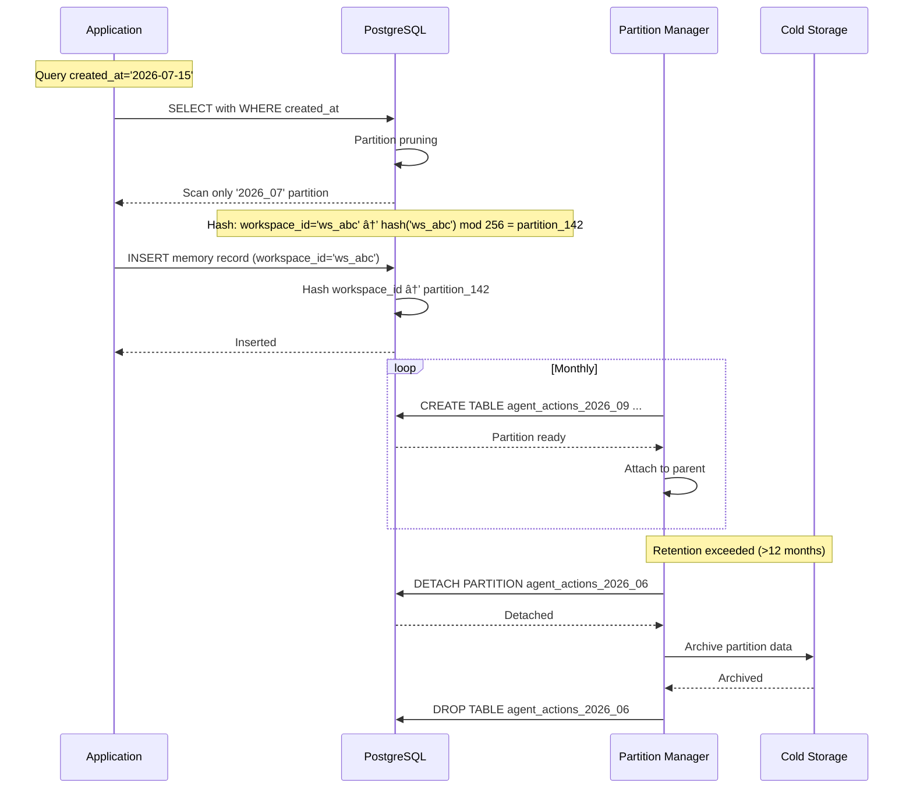

# Database Partitioning

> **Purpose:** Define the partitioning strategy for Vaeloom's database
> **Status:** 🆕 New

## Overview

Database partitioning is Vaeloom's strategy for maintaining query performance and manageability at Enterprise scale — splitting large tables into smaller, independent physical storage units while keeping a single logical table interface. Three tables are candidates for partitioning when they cross defined thresholds: agent_actions (range partition by created_at monthly at 100M+ rows), memory_records (hash partition by workspace_id into 256 partitions at 50M+ rows), and documents (hash partition by workspace_id into 256 partitions at 10M+ rows). Partitioning is not applied at MVP scale — indexes alone are simpler and faster below these thresholds.

This document defines the partitioning triggers, strategy per table, implementation SQL, partition management (automated creation, detach, archive), and monitoring. It is intended for database engineers planning the enterprise scaling roadmap and SRE engineers managing partition lifecycle. The golden rule: partition only when indexes are no longer sufficient — premature partitioning adds complexity without benefit.

## Goals

- Trigger partitioning only when tables cross defined scale thresholds (agent_actions: 100M, memory_records: 50M, documents: 10M)
- Apply range partitioning (by created_at monthly) for time-series audit data to enable efficient archival
- Apply hash partitioning (by workspace_id, 256 partitions) for tenant-scoped data to ensure even distribution
- Automate partition creation via cron job creating next month's partition at least 2 weeks in advance
- Support partition detach and archival to cold storage for data older than retention policy

## Scope

**In Scope:**
- Range partitioning on agent_actions by created_at (monthly, 12 partitions per year)
- Hash partitioning on memory_records and documents by workspace_id (256 partitions each)
- Automated partition creation via cron job (monthly for range, as needed for hash)
- Partition detach and archival workflow for old data
- Partition pruning verification and performance monitoring
- Error handling for missing partitions, imbalance, and archival failures

**Out of Scope:**
- Sub-partitioning (hash + range) — future improvement
- pg_partman integration — future improvement (currently using custom cron)
- Tiered storage with tablespace-per-partition — future improvement
- Partitioning of non-PostgreSQL stores (AGE graph, pgvector, Qdrant)
- Dynamic partition count resizing (hash modulus change requires rebuild)

---

## Partitioning Architecture

```mermaid
graph TD
    classDef trigger fill:#e3f2fd,stroke:#1565c0,color:#000,stroke-width:1.5px
    classDef range fill:#e8f5e9,stroke:#2e7d32,color:#000,stroke-width:1.5px
    classDef hash fill:#fff3e0,stroke:#e65100,color:#000,stroke-width:1.5px
    classDef mgmt fill:#f3e5f5,stroke:#6a1b9a,color:#000,stroke-width:1px

    subgraph Triggers["🚦 Partition Thresholds (Enterprise)"]
        direction TB
        TR1["agent_actions > 100M rows<br/>~10M/1K users/year"]
        TR2["memory_records > 50M rows<br/>~5M/1K users/year"]
        TR3["documents > 10M rows<br/>~1M/1K users/year"]
    end

    subgraph RangePartitions["📅 Range Partitioning (by time)"]
        direction TB
        RP1["Table: agent_actions<br/>Partition key: created_at<br/>Type: RANGE (monthly)"]
        RP2["Partition: agent_actions_2026_07<br/>FOR VALUES FROM ('2026-07-01')<br/>TO ('2026-08-01')"]
        RP3["Partition: agent_actions_2026_08<br/>FOR VALUES FROM ('2026-08-01')<br/>TO ('2026-09-01')"]
        RP4["New partition added monthly via cron"]
    end

    subgraph HashPartitions["🔀 Hash Partitioning (by workspace)"]
        direction TB
        HP1["Table: memory_records<br/>Partition key: workspace_id<br/>Type: HASH (256)"]
        HP2["Table: documents<br/>Partition key: workspace_id<br/>Type: HASH (256)"]
        HP3["Partition: memory_records_0<br/>MODULUS 256, REMAINDER 0"]
        HP4["Partition: memory_records_1<br/>MODULUS 256, REMAINDER 1"]
        HP5["Even distribution across partitions"]
    end

    subgraph Management["🔄 Partition Management"]
        direction TB
        M1["Add new partition:<br/>CREATE TABLE ... PARTITION OF"]
        M2["Detach old partition:<br/>ALTER TABLE DETACH PARTITION"]
        M3["Archive detached partitions<br/>to cold storage"]
    end

    TR1 --> RP1
    TR2 & TR3 --> HP1 & HP2
    RP1 --> RP2 --> RP3 --> RP4
    HP1 & HP2 --> HP3 & HP4 --> HP5
    RP4 --> M1
    HP5 --> M1
    M1 --> M2 --> M3

    class TR1,TR2,TR3 trigger
    class RP1,RP2,RP3,RP4 range
    class HP1,HP2,HP3,HP4,HP5 hash
    class M1,M2,M3 mgmt

```



> **Diagram:** Partitioning is triggered at enterprise scale thresholds. **Range partitioning** splits `agent_actions` by month (12 partitions per year, new one added monthly via cron). **Hash partitioning** splits `memory_records` and `documents` across 256 partitions by `workspace_id` for even distribution. **Management** handles adding new partitions, detaching old ones, and archiving to cold storage.

---

## When to Partition

Partitioning is planned for **enterprise scale** (Phase 7), defined by these thresholds:

| Table | Partition Threshold | Records |
|-------|---------------------|---------|
| `agent_actions` | > 100M rows | ~10M per 1000 users/year |
| `memory_records` | > 50M rows | ~5M per 1000 users/year |
| `documents` | > 10M rows | ~1M per 1000 users/year |

## Partition Strategy

| Table | Partition Key | Type | Partitions |
|-------|---------------|------|------------|
| `agent_actions` | `created_at` | Range (monthly) | 12 per year |
| `memory_records` | `workspace_id` | Hash (256) | Even distribution |
| `documents` | `workspace_id` | Hash (256) | Even distribution |

## Partition Implementation

```sql
-- Time-based partitioning for audit log
CREATE TABLE agent_actions (
  id UUID,
  workspace_id UUID,
  created_at TIMESTAMPTZ,
  -- ... other columns
) PARTITION BY RANGE (created_at);

CREATE TABLE agent_actions_2026_07
  PARTITION OF agent_actions
  FOR VALUES FROM ('2026-07-01') TO ('2026-08-01');

-- Hash partitioning for user data
CREATE TABLE memory_records (
  id UUID,
  workspace_id UUID,
  type TEXT,
  -- ... other columns
) PARTITION BY HASH (workspace_id);

CREATE TABLE memory_records_0
  PARTITION OF memory_records
  FOR VALUES WITH (MODULUS 256, REMAINDER 0);
```

## Partition Management

```sql
-- Add new partition (monthly cron)
CREATE TABLE agent_actions_2026_08
  PARTITION OF agent_actions
  FOR VALUES FROM ('2026-08-01') TO ('2026-09-01');

-- Detach old partition for archival
ALTER TABLE agent_actions DETACH PARTITION agent_actions_2021;
```

## Common Mistakes

| Mistake | Consequence |
|---------|-------------|
| Partitioning too early — before reaching scale thresholds | Partitioning adds complexity to queries, migrations, and maintenance — if a table has fewer than 10M rows, indexes alone are simpler and faster |
| Choosing the wrong partition key | Partitioning by `created_at` for queries that filter by `workspace_id` means every query scans all partitions — the partition key must match the primary query filter |
| Creating too many partitions | 256 hash partitions per table means 256 index scans per query — partition count should balance query performance (fewer is better) with manageability (smaller partitions are easier to archive) |
| Forgetting to add new time partitions proactively | If no cron job adds next month's partition, writes to the parent table fail — automate partition creation at least 1 week before the current partition fills |

## Best Practices

| Practice | Why |
|----------|-----|
| Partition only when indexes are no longer sufficient | Indexes on workspace_id handle queries efficiently up to 10-50M rows — partition only when index size approaches available RAM or maintenance windows become constrained |
| Match partition key to the most frequent query filter | Range partitioning on created_at serves time-range queries (audit log) — hash partitioning on workspace_id serves tenant-scoped queries (memory_records, documents) |
| Automate partition management with a cron job | A monthly cron that creates next month's range partition and detaches partitions older than retention prevents both write failures and storage bloat |
| Use hash partitioning for evenly-distributed data | Hash by workspace_id distributes rows evenly across partitions — range by created_at is only even if data arrives at a constant rate |

## Security Considerations

| Consideration | Mitigation |
|--------------|-----------|
| Cross-partition queries bypassing workspace isolation | A query without a WHERE clause on the partition key scans all partitions — ensure application queries always include the partition key in filters |
| Detached partition data retention | Detached partitions contain historical user data — apply the same access controls and retention policies as the main table before archiving or deleting |

## Performance Considerations

| Consideration | Approach |
|--------------|----------|
| Partition pruning efficiency | PostgreSQL prunes partitions at planning time — the query planner must be able to determine which partitions to scan from the WHERE clause. Avoid functions or CASTs on partition keys |
| Hash partition count trade-off | More partitions = more planner overhead and more open file handles. 256 is a reasonable maximum — 16-64 is sufficient for most workloads |
| Index overhead per partition | Each partition has its own set of indexes — 256 partitions × 3 indexes each = 768 index maintenance operations. Factor this into maintenance window planning |

---

## Database

| Table | Partition Strategy | Partition Key | Partition Count | Trigger Threshold |
|-------|--------------------|---------------|-----------------|-------------------|
| `agent_actions` | Range (monthly) | `created_at` | 12/year | 100M rows |
| `memory_records` | Hash (by workspace) | `workspace_id` | 256 | 50M rows |
| `documents` | Hash (by workspace) | `workspace_id` | 256 | 10M rows |

---

## Scalability

| Dimension | Current Limit | 10x Strategy | 100x Strategy |
|-----------|---------------|--------------|---------------|
| Partitions per table | 256 (hash) | Partition pruning at plan time; 256 is manageable | Sub-partitioning (hash by workspace → range by time) |
| Query performance with partitioning | No benefit until threshold reached | Partition pruning reduces scan by partition count | More partitions = more planner overhead; balance at 256 |
| Partition management operations | Monthly cron for range partitions | Automate with pg_partman extension | Self-managing partition lifecycle with policies |
| Data archival from partitions | Detach → archive to cold storage | Parallel detach of old partitions | Automated tiered storage (tablespace per partition) |

---

## Error Handling

| Scenario | Detection | Mitigation | Recovery |
|----------|-----------|------------|----------|
| Missing partition for next month | INSERT into parent table fails because no partition exists | Cron job creates partitions 2 weeks in advance; alert if creation fails | Manually create partition with CREATE TABLE PARTITION OF |
| Hash partition imbalance | Data skew across 256 partitions | Monitor partition size variance (> 20% = warning) | Re-hash with different modulus; or adjust hash function |
| Detached partition data not archived | Old partition takes storage but is not queryable | Automated archive job after detach; monitor archive completion | Manual export to cold storage; verify data integrity |
| Partition pruning not happening | Query scans all partitions instead of one | Verify WHERE clause includes partition key without functions or casts | Rewrite query to use partition key directly |

---

## Monitoring

| Metric | Alert Threshold | Severity | Dashboard |
|--------|-----------------|----------|-----------|
| Partition count approaching max | > 240 out of 256 | Warning | Partitioning > Capacity |
| Next partition creation due | < 7 days until next month's partition needed | Warning | Partitioning > Schedule |
| Hash partition size variance | > 20% stddev | Warning | Partitioning > Balance |
| Queries not pruning partitions | Seq scan on parent table detected | Warning | Partitioning > Pruning |
| Detached partitions pending archive | > 3 detached not archived | Info | Partitioning > Archival |
| Partition fill rate | > 80% of expected partition capacity | Info | Partitioning > Fill Rate |

---

## Limitations

| Limitation | Impact | Workaround | Future Resolution |
|------------|--------|------------|-------------------|
| No sub-partitioning in MVP | Cannot partition by hash then range within same table structure | Manual dual-partition strategy (hash for isolation, range for archival) | Native sub-partitioning support |
| Partition DDL locks on parent table | Adding a new partition briefly locks the parent | Create partition ahead of schedule (2 weeks) | Use pg_partman for lock-free partition creation |
| Hash partition count is fixed at creation | Changing partition count requires full rebuild | Choose a high modulus (256) from the start; accept some waste | Dynamic hash partition resizing |

---

## Examples

### Example 1: Range Partition on agent_actions

```sql
-- Create monthly range partition parent
CREATE TABLE agent_actions (
    id UUID DEFAULT gen_random_uuid(),
    workspace_id UUID NOT NULL,
    action_type VARCHAR(50) NOT NULL,
    payload JSONB,
    created_at TIMESTAMPTZ NOT NULL DEFAULT NOW(),
    PRIMARY KEY (id, created_at)
) PARTITION BY RANGE (created_at);

-- Create monthly partitions
CREATE TABLE agent_actions_2026_07 PARTITION OF agent_actions
FOR VALUES FROM ('2026-07-01') TO ('2026-08-01');

CREATE TABLE agent_actions_2026_08 PARTITION OF agent_actions
FOR VALUES FROM ('2026-08-01') TO ('2026-09-01');

-- Archive old partition (detach, then drop or move to cold storage)
ALTER TABLE agent_actions DETACH PARTITION agent_actions_2026_01;

-- Verify partition pruning
EXPLAIN SELECT * FROM agent_actions
WHERE created_at >= '2026-07-15' AND created_at < '2026-07-16';
-- Result: only scans agent_actions_2026_07 partition
```

### Example 2: Hash Partition on memory_records

```sql
-- Create hash partition parent (256 partitions)
CREATE TABLE memory_records (
    id UUID DEFAULT gen_random_uuid(),
    workspace_id UUID NOT NULL,
    record_type VARCHAR(50) NOT NULL,
    content JSONB,
    created_at TIMESTAMPTZ NOT NULL DEFAULT NOW(),
    PRIMARY KEY (id, workspace_id)
) PARTITION BY HASH (workspace_id);

-- Create 256 partitions (simplified: first 4 shown)
DO $$
DECLARE
    i INT;
BEGIN
    FOR i IN 0..3 LOOP
        EXECUTE format(
            'CREATE TABLE memory_records_p%s PARTITION OF memory_records
             FOR VALUES WITH (MODULUS 4, REMAINDER %s)',
            i, i
        );
    END LOOP;
END $$;
```

---

## Sequence Diagrams



> **Diagram:** Partition lifecycle — queries benefit from automatic partition pruning (range: date-clause selects only relevant month; hash: workspace_id routes to one partition). The partition manager cron creates future partitions 2 weeks ahead and detaches old partitions for archival after retention is exceeded.

---

## Future Improvements

| Improvement | Priority | Complexity | Timeline |
|-------------|----------|------------|----------|
| pg_partman for automated partition lifecycle management | High | Medium | Q1 2027 |
| Sub-partitioning (hash + range) for time-based archival of tenant data | Medium | High | Q2 2027 |
| Tiered storage with tablespace per partition tier (hot/SSD → warm/HDD → cold/S3) | Low | High | Q3 2027 |
| Partition fill rate prediction and auto-scaling | Low | Medium | Q2 2027 |

---

## Related Documents

- [Database Design.md](./Database-Design.md)
- [Replication.md](./Replication.md)
- [`Architecture/Scalability.md`](../Architecture/Scalability.md)
