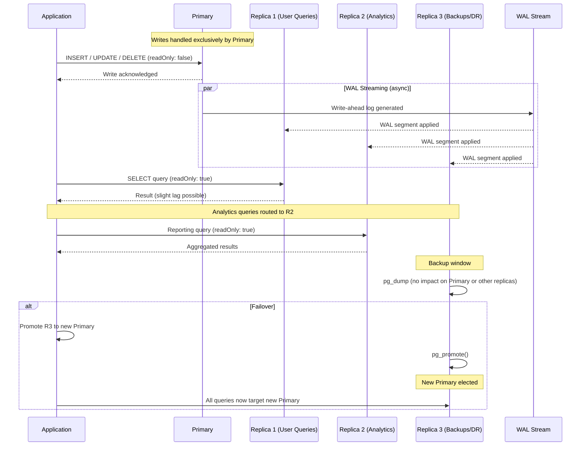

# Database Replication

> **Purpose:** Define the replication strategy for Vaeloom's PostgreSQL database
> **Status:** 🆕 New

## Overview

Database replication provides read capacity scaling, high availability, and disaster recovery for Vaeloom's PostgreSQL database through streaming WAL-based replication from a primary to up to three read replicas. The primary handles all writes and critical reads, while replicas serve user queries (Replica 1), analytics and reporting (Replica 2), and backups with DR failover (Replica 3). Read/write splitting is implemented at the application layer using a { readOnly } query flag that routes SELECT queries to replicas and mutating queries to the primary.

This document defines the replication architecture, scale triggers, replica configuration, read/write splitting implementation, and monitoring for replication lag, replica health, and WAL generation rate. It is intended for infrastructure engineers configuring replication, SRE engineers managing failover procedures, and application developers implementing read/write splitting. Asynchronous replication means lag is inherent — monitoring it is not optional.

## Goals

- Support up to 3 read replicas for query offload, analytics isolation, and backup/DR separation
- Maintain replication lag under 5 seconds during normal operation and under 30 seconds under peak load
- Implement application-layer read/write splitting with explicit { readOnly: true/false } query routing
- Achieve sub-5-minute manual failover with a documented and quarterly-tested runbook
- Add replicas reactively based on metrics: 5,000+ reads/sec or replica CPU > 70%

## Scope

**In Scope:**

- Streaming WAL-based replication from primary to up to 3 read replicas
- Application-layer read/write splitting using { readOnly } query flag
- Scale triggers: read queries > 5,000/sec → add replica, replica CPU > 70% → add another
- Replication monitoring: lag, replica count, WAL generation rate, CPU utilization
- Failover procedures with quarterly DR drills
- Connection pool sizing per replica (API: max 30, Analytics: max 10, Backups: max 5)

**Out of Scope:**

- Synchronous replication for zero-data-loss (future improvement)
- Automated failover with Patroni or pg_auto_failover (future improvement)
- Cascading replica topology — currently star topology from single primary
- Multi-region active-active replication — future improvement
- Logical replication for selective table replication

---

## Replication Architecture



```mermaid
graph TD
    classDef primary fill:#e3f2fd,stroke:#1565c0,color:#000,stroke-width:2px
    classDef replica fill:#e8f5e9,stroke:#2e7d32,color:#000,stroke-width:1.5px
    classDef split fill:#fff3e0,stroke:#e65100,color:#000,stroke-width:1.5px
    classDef monitor fill:#f3e5f5,stroke:#6a1b9a,color:#000,stroke-width:1px

    subgraph ReplicationArch["🔄 Streaming Replication Architecture"]
        direction TB
        PR["( PostgreSQL Primary<br/>Handles writes )"]

        PR -->|Streaming replication<br/>WAL segments| R1["( Read Replica 1<br/>User queries + API )"]
        PR -->|Streaming replication<br/>WAL segments| R2["( Read Replica 2<br/>Analytics + reporting )"]
        PR -->|Streaming replication<br/>WAL segments| R3["( Read Replica 3<br/>Backups + DR )"]
    end

    subgraph Triggers["🚦 Scale Triggers"]
        direction TB
        T1["Read queries > 5,000/sec<br/>→ Add 1st read replica"]
        T2["Replica CPU > 70%<br/>→ Add additional replica"]
        T3["Primary pool > 80%<br/>→ Offload reporting to replica"]
    end

    subgraph ReadWrite["📝 Read/Write Splitting"]
        direction TB
        RW1["Application layer<br/>determines query type"]
        RW2["Query: { readOnly: true }<br/>→ Route to replica"]
        RW3["Query: { readOnly: false }<br/>→ Route to primary"]
        RW4["Pool config:<br/>primary.host: primary.db<br/>replica.host: replica.db"]
    end

    subgraph Monitoring["📊 Replication Monitoring"]
        direction TB
        M1["Replication lag<br/>Warning: > 5s<br/>Critical: > 30s"]
        M2["Replica count<br/>Warning: < 2<br/>Critical: 0"]
        M3["WAL generation rate<br/>Warning: > 100MB/min<br/>Critical: > 500MB/min"]
    end

    T1 & T2 & T3 --> PR
    R1 & R2 & R3 --> RW1
    RW1 --> RW2 & RW3
    RW2 & RW3 --> RW4
    PR & R1 & R2 & R3 -.-> M1 & M2 & M3

    class PR primary
    class R1,R2,R3 replica
    class RW1,RW2,RW3,RW4 split
    class T1,T2,T3,M1,M2,M3 monitor

```

> **Diagram:** Streaming replication from a primary to three read replicas (queries, analytics, backups). **Scale triggers** add replicas based on query volume and CPU utilization. **Read/write splitting** routes queries based on `{ readOnly }` flag at the application layer. **Monitoring** tracks replication lag, replica count, and WAL generation rate with warning/critical thresholds.

---

## Replication Architecture

```text
Primary (writes) → Streaming Replication → Read Replica 1 (queries)
                                       → Read Replica 2 (analytics)
                                       → Read Replica 3 (backups)
```

## When to Add Replicas

| Threshold | Action |
|-----------|--------|
| Read queries > 5000/sec | Add 1st read replica |
| Read replica CPU > 70% | Add additional replica |
| Primary connection pool > 80% | Offload reporting to replica |

## Replica Configuration

```yaml
# docker-compose.yml (staging replica)
services:
  postgres-primary:
    image: postgis/postgis:16
    environment:
      POSTGRES_DB: Vaeloom
    volumes:
      - pg-primary:/var/lib/postgresql/data

  postgres-replica:
    image: postgis/postgis:16
    environment:
      POSTGRES_PRIMARY_HOST: postgres-primary
    depends_on:
      - postgres-primary
```

## Read/Write Splitting

```typescript
// Application-level read/write split
const pool = new Pool({
  // Writes go to primary
  primary: { host: 'primary.db.Vaeloom.dev' },
  // Reads go to replica
  replica: { host: 'replica.db.Vaeloom.dev' }
});

async query(query, params, { readOnly = false } = {}) {
  const target = readOnly ? pool.replica : pool.primary;
  return target.query(query, params);
}
```

## Replication Monitoring

| Metric | Warning | Critical |
|--------|---------|----------|
| Replication lag | > 5s | > 30s |
| Replica count | < 2 | 0 |
| WAL generation rate | > 100MB/min | > 500MB/min |

## Common Mistakes

| Mistake | Consequence |
|---------|-------------|
| Adding replicas before addressing read query performance | A read replica of a poorly-indexed database is just a second copy of a slow database — optimize queries and indexes before adding replicas |
| Not monitoring replication lag | A replica that is 30 seconds behind returns stale data without any error — application users see outdated information with no indication |
| Using replicas for write-heavy workloads | Replicas cannot accept writes — routing a write to a replica causes a silent failure or an error that the application must handle gracefully |
| Uneven read distribution across replicas | If queries are not load-balanced across replicas, one replica handles 90% of reads while others sit idle — use a connection pool with round-robin or least-connections routing |

## Best Practices

| Practice | Why |
|----------|-----|
| Monitor replication lag at all times | Lag > 5s triggers a warning, > 30s triggers an alert — automated failover should not activate if lag exceeds acceptable recovery point objective (RPO) |
| Use read/write splitting at the application layer | The application explicitly marks queries as read-only — this prevents accidental writes to replicas and makes the read path testable |
| Add replicas based on metrics, not time | Add a replica when read query volume exceeds 5,000/sec or replica CPU exceeds 70% — scheduled quarterly capacity reviews prevent reactive scaling |
| Test failover procedures quarterly | A failover that has never been practiced will fail at the worst possible moment — run quarterly DR drills that include promoting a replica to primary |

## Security Considerations

| Consideration | Mitigation |
|--------------|-----------|
| Replica data access | Read replicas contain the same data as the primary — they must have the same access controls, encryption, and audit logging |
| Replica as an attack surface | A compromised replica exposes all data — replicas should not be directly accessible from the public internet, should use the same firewall rules as the primary |
| Cross-region replication compliance | Replicating data across regions may violate data residency requirements — document which data types can be replicated across regional boundaries |

## Performance Considerations

| Consideration | Approach |
|--------------|----------|
| Replication lag under write load | High write volume on the primary increases WAL generation and replication lag — batch writes to reduce transaction frequency and rate-limit bulk operations |
| Replica query performance | Read replicas use the same indexes as the primary — index maintenance (REINDEX, ANALYZE) on the primary propagates to replicas through WAL, causing temporary lag |
| Connection pool sizing per replica | Each replica has its own connection pool — pool size should scale with the number of services reading from that replica (API vs. analytics vs. backups) |

---

## Database

| Replica | Purpose | Connection Pool Size | Reads From |
|---------|---------|----------------------|------------|
| Primary | All writes + critical reads | max 20 | API service |
| Replica 1 | User-facing query offload | max 30 | API service (read-only queries) |
| Replica 2 | Analytics and reporting | max 10 | Analytics service, reporting cron jobs |
| Replica 3 | Backups and DR | max 5 | Backup system, failover target |

---

## Scalability

| Dimension | Current Limit | 10x Strategy | 100x Strategy |
|-----------|---------------|--------------|---------------|
| Read replica count | 3 | Add replicas when read query volume > 5K/s or CPU > 70% | Cascading replicas (replica feeds replica) for read-heavy workloads |
| Replication lag tolerance | 5s warning, 30s critical | Monitor lag per replica; route critical queries to low-lag replica | Synchronous replication for zero-data-loss workloads |
| Failover time | 5 min manual | Automated failover with pg_auto_failover | Multi-region active-active with conflict resolution |
| WAL generation | 100 MB/min | Archive WAL to S3; increase WAL segment size | Separate WAL-only replica for archive offload |

---

## Error Handling

| Scenario | Detection | Mitigation | Recovery |
|----------|-----------|------------|----------|
| Replication lag exceeds threshold | Lag > 30s | Offload read queries from lagging replica to primary or another replica | Investigate cause (write spike, network, replica CPU); apply fix |
| Replica failure (crash) | Heartbeat lost | Route reads to remaining replicas or primary; mark failed replica | Auto-restart replica; re-sync from primary |
| Split-brain (two primaries) | Conflicting WAL positions detected | Manual intervention: identify correct primary, demote other | Use replication management tool (Patroni) to prevent split-brain |
| WAL corruption | Replication stops with error | Rebuild replica from fresh backup | Regular backup verification ensures clean base for rebuild |

---

## Monitoring

| Metric | Alert Threshold | Severity | Dashboard |
|--------|-----------------|----------|-----------|
| Replication lag per replica | > 5s (warning), > 30s (critical) | Warning / Critical | Replication > Lag |
| Replica CPU utilization | > 70% | Warning | Replication > Resources |
| WAL generation rate | > 500 MB/min | Critical | Replication > WAL |
| Replica count (healthy) | < 2 | Critical | Replication > Health |
| Failover last tested | > 90 days ago | Warning | Replication > DR Readiness |
| Query routing correctness | Reads incorrectly routed to primary | Critical | Replication > Query Routing |

---

## Limitations

| Limitation | Impact | Workaround | Future Resolution |
|------------|--------|------------|-------------------|
| Asynchronous replication has lag | Read-after-write inconsistency (user writes then reads from replica) | Route critical read-after-write queries to primary | Synchronous replication for critical data paths |
| Replicas have same indexes as primary | Index bloat affects all replicas equally | Schedule index maintenance during low traffic | Replica-specific partial indexes for read query patterns |
| Manual failover in current setup | Recovery time objective (RTO) is 5-15 min | Document runbook; practice quarterly | Automated failover with Patroni or pg_auto_failover |

---

## Examples

### Example 1: Application-Layer Read/Write Splitting

```typescript
import { Pool } from 'pg';

// Primary pool (writes)
const primaryPool = new Pool({
  host: 'primary.db.Vaeloom.dev',
  max: 20,
});

// Replica pool (reads)
const replicaPool = new Pool({
  host: 'replica-1.db.Vaeloom.dev',
  max: 30,
});

export async function executeQuery<T>(
  sql: string,
  params: any[] = [],
  options: { readOnly?: boolean } = {}
): Promise<T> {
  const pool = options.readOnly ? replicaPool : primaryPool;
  const client = await pool.connect();
  try {
    const result = await client.query(sql, params);
    return result.rows as T;
  } finally {
    client.release();
  }
}

// Usage
const activeUsers = await executeQuery<{ id: string }[]>(
  'SELECT id FROM users WHERE last_active > $1',
  [new Date(Date.now() - 3600000)],
  { readOnly: true }
);
```

### Example 2: Replication Lag Monitoring

```sql
-- Check replication lag across all replicas
SELECT
  client_addr AS replica_ip,
  application_name AS replica_name,
  state,
  pg_wal_lsn_diff(pg_current_wal_flush_lsn(), replay_lsn) / 1024 / 1024 AS lag_mb,
  EXTRACT(EPOCH FROM NOW() - pg_last_xact_replay_timestamp()) AS lag_seconds,
  pg_wal_lsn_diff(pg_current_wal_flush_lsn(), flush_lsn) AS flush_lag_bytes
FROM pg_stat_replication;

-- Alert: lag_seconds > 5 → warning, > 30 → critical
```

---

## Sequence Diagrams



> **Diagram:** Replication topology — Primary handles all writes while 3 replicas stream WAL asynchronously. Replica 1 serves user queries, Replica 2 handles analytics/reporting, Replica 3 isolates backups and serves as DR failover target. Application-layer routing splits read vs write queries via a readOnly flag.

---

## Future Improvements

| Improvement | Priority | Complexity | Timeline |
|-------------|----------|------------|----------|
| Automated failover with Patroni | High | Medium | Q1 2027 |
| Synchronous replication for critical data paths (user profiles, billing) | Medium | Medium | Q1 2027 |
| Cascading replica topology for read-heavy analytics | Low | High | Q2 2027 |
| Multi-region active-active with conflict resolution | Low | High | Q3 2027 |
| Replica-specific partial indexes for optimized read queries | Medium | Medium | Q4 2026 |

---

## Related Documents

- [Database Design.md](./Database-Design.md)
- [Partitioning.md](./Partitioning.md)
- [Backups.md](./Backups.md)
