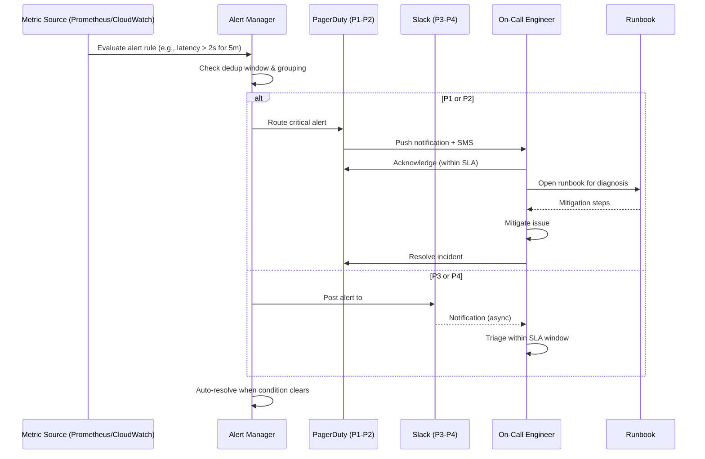

# Alerting

> **Purpose:** Define alerting rules and procedures for Vaeloom
> **Status:** 🆕 New

## Alert Architecture

```mermaid
graph TD
    classDef p1 fill:#ffebee,stroke:#c62828,color:#000,stroke-width:2px
    classDef p2 fill:#fff3e0,stroke:#e65100,color:#000,stroke-width:1.5px
    classDef p3 fill:#e8f5e9,stroke:#2e7d32,color:#000,stroke-width:1.5px
    classDef p4 fill:#e3f2fd,stroke:#1565c0,color:#000,stroke-width:1.5px
    classDef fatigue fill:#f3e5f5,stroke:#6a1b9a,color:#000,stroke-width:1px

    subgraph Tiers["🔔 Alert Tiers"]
        direction TB
        P1_SVC["P1 — Critical<br/>Response: < 15 min<br/>Channel: PagerDuty + SMS"]
        P2_SVC["P2 — High<br/>Response: < 30 min<br/>Channel: Slack #alerts"]
        P3_SVC["P3 — Medium<br/>Response: < 2 hours<br/>Channel: Slack #alerts"]
        P4_SVC["P4 — Low<br/>Response: Next business day<br/>Channel: GitHub issue"]
    end

    subgraph Rules_Avail["📡 Availability Alerts"]
        RA1["API down<br/>health != ok for 1 min → P1"]
        RA2["AI Service down<br/>health != ok for 2 min → P1"]
        RA3["Database unreachable<br/>30s connection failure → P1"]
    end

    subgraph Rules_Perf["âš¡ Performance Alerts"]
        RP1["High API latency<br/>p99 > 2s for 5 min → P2"]
        RP2["High AI latency<br/>p99 > 10s for 5 min → P2"]
        RP3["Queue backlog<br/>depth > 1000 for 10 min → P2"]
    end

    subgraph Rules_Error["❌ Error Rate Alerts"]
        RE1["High error rate<br/>> 5% for 5 min → P2"]
        RE2["Agent failure rate<br/>> 10% for 5 min → P2"]
        RE3["Auth failures spike<br/>> 20% increase → P3"]
    end

    subgraph Rules_Biz["📊 Business Alerts"]
        RB1["Connectors degraded<br/>> 10% degraded → P3"]
        RB2["Ingestion stalled<br/>0 docs for 30 min → P3"]
        RB3["Memory writes stopped<br/>0 for 15 min → P2"]
    end

    subgraph Fatigue["🧠 Alert Fatigue Prevention"]
        F1["Threshold tuning<br/>Review accuracy monthly"]
        F2["Alert grouping<br/>Group during incidents"]
        F3["Auto-resolve<br/>Clear when condition clears"]
        F4["Maintenance windows<br/>Suppress during known maint."]
    end

    RA1 & RA2 & RA3 --> P1_SVC
    RP1 & RP2 & RP3 --> P2_SVC
    RE1 & RE2 --> P2_SVC
    RE3 & RB1 & RB2 --> P3_SVC
    RB3 --> P2_SVC
    P1_SVC & P2_SVC & P3_SVC & P4_SVC --- F1 & F2 & F3 & F4

    class P1_SVC p1
    class P2_SVC,RP1,RP2,RP3,RE1,RE2,RB3 p2
    class RE3,RB1,RB2 p3
    class P4_SVC p4
    class RA1,RA2,RA3 p1
    class F1,F2,F3,F4 fatigue

```



> **Diagram:** Alerting follows a 4-tier severity system. **P1** (Critical) routes to PagerDuty + SMS within 15 minutes for service-down and database-unreachable events. **P2** (High) covers latency, error rate, and queue backlog alerts via Slack within 30 minutes. **P3** (Medium) handles business alerts like connector degradation within 2 hours. **P4** (Low) files GitHub issues for next-business-day review. **Alert fatigue prevention** includes monthly threshold tuning, grouping, auto-resolve, and maintenance windows.

---

## Alert Tiers

| Tier | Response Time | Channel | Example |
|------|---------------|---------|---------|
| P1 - Critical | < 15 min | PagerDuty push + SMS | Service down, data loss |
| P2 - High | < 30 min | Slack #alerts | Feature degraded, high error rate |
| P3 - Medium | < 2 hours | Slack #alerts | Elevated latency, queue backlog |
| P4 - Low | Next business day | GitHub issue | Minor UI bug, slow query |

## Alert Rules

### Availability Alerts

| Rule | Condition | Severity |
|------|-----------|----------|
| API down | `health.status != "ok"` for 1 min | P1 |
| AI service down | `health.status != "ok"` for 2 min | P1 |
| Database unreachable | Connection failures for 30s | P1 |

### Performance Alerts

| Rule | Condition | Severity |
|------|-----------|----------|
| High API latency | p99 > 2s for 5 min | P2 |
| High AI latency | p99 > 10s for 5 min | P2 |
| Queue backlog | depth > 1000 for 10 min | P2 |

### Error Rate Alerts

| Rule | Condition | Severity |
|------|-----------|----------|
| High error rate | > 5% for 5 min | P2 |
| Agent failure rate | > 10% for 5 min | P2 |
| Auth failures spike | > 20% increase | P3 |

### Business Alerts

| Rule | Condition | Severity |
|------|-----------|----------|
| Connector degraded | > 10% of connectors degraded | P3 |
| Ingestion stalled | 0 docs processed for 30 min | P3 |
| Memory write stopped | 0 writes for 15 min | P2 |

## Alert Response Workflow

```text
Alert Fires → Acknowledged (within SLA) → Triage → Mitigate → Resolve → Post-mortem
```

## Alert Fatigue Prevention

| Strategy | Implementation |
|----------|---------------|
| Threshold tuning | Review alert accuracy monthly |
| Alert grouping | Group related alerts during incidents |
| Auto-resolve | Clear alert when condition clears |
| Maintenance windows | Suppress alerts during known maintenance |

## Common Mistakes

| Mistake | Consequence |
|---------|-------------|
| Alerting on symptoms rather than causes | An alert for "high CPU" tells you something is wrong but not what — alert on user-impacting signals (latency, error rate, throughput) and let the runbook guide root cause investigation |
| Alert thresholds that are too sensitive | A p99 latency spike that lasts 30 seconds triggers a PagerDuty call at 3 AM — every alert should have a minimum duration before firing to filter out transient blips. Set evaluation windows of at least 1-5 minutes |
| Alerts without runbooks | An alert that says "high error rate" with no link to a runbook leaves the on-call engineer guessing — every alert rule must have a documented runbook that describes diagnosis and mitigation steps |

## Best Practices

| Practice | Why |
|----------|-----|
| Alert on user-facing signals (latency, errors, availability) not system internals | CPU and memory are internal details — users care about slow pages and errors. Alert on the metrics that directly impact the user experience |
| Every alert must have a documented runbook | An alert without a runbook is noise — the on-call engineer shouldn't have to guess what to do. Link every alert rule to a runbook that contains diagnosis and mitigation procedures |
| Set evaluation windows to filter transient issues | A 30-second latency spike isn't worth a PagerDuty call — require sustained conditions (1-5 minutes) before alerting to distinguish noise from real problems |

## Security

| Concern | Mitigation |
|---------|------------|
| Alerting channels leaking sensitive system information | An alert message that includes database names, internal IPs, or error stack traces in a Slack or PagerDuty notification exposes internals — sanitize alert messages to include only safe metadata |
| Attackers using alert fatigue to hide malicious activity | An attacker generating noise alerts can desensitize the on-call team before a real attack — monitor alert volumes for unusual patterns that may indicate a deliberate fatigue attack |
| Alert handling systems as an attack vector | PagerDuty webhooks, Slack bot tokens, or monitoring API keys that are compromised can be used to manipulate alerts — secure alerting infrastructure with the same rigor as production services |

## Security Considerations

| Concern | Mitigation |
|---------|------------|
| Alerting channels leaking sensitive system information | An alert message that includes database names, internal IPs, or error stack traces in a Slack or PagerDuty notification exposes internals — sanitize alert messages to include only safe metadata |
| Attackers using alert fatigue to hide malicious activity | An attacker generating noise alerts can desensitize the on-call team before a real attack — monitor alert volumes for unusual patterns that may indicate a deliberate fatigue attack |
| Alert handling systems as an attack vector | PagerDuty webhooks, Slack bot tokens, or monitoring API keys that are compromised can be used to manipulate alerts — secure alerting infrastructure with the same rigor as production services |

## Performance Considerations

| Concern | Approach |
|---------|----------|
| Alert rule evaluation overhead at scale | Evaluating hundreds of alert rules against high-frequency metrics can consume significant CPU — use alert rule aggregation that groups similar metrics and evaluates at coarser intervals for non-critical alerts |
| Alert notification storm during cascading failures | A single root cause can trigger dozens of related alerts — implement alert deduplication and grouping to collapse related alerts into a single notification with affected-context |
| PagerDuty webhook latency delaying critical alerts | Webhook delivery can take 30-60 seconds during peak hours — use PagerDuty's Events API v2 with high-urgency for critical alerts and set up a secondary notification channel as backup |

## Components

| Component | Responsibility | Technology | Scale Strategy |
|-----------|---------------|------------|----------------|
| Alert Manager | Rule evaluation, deduplication, routing | Prometheus Alertmanager / AWS CloudWatch | Cluster mode for HA |
| Notification Router | Deliver alerts to correct channel | PagerDuty Events API + Slack webhooks | Regional endpoints |
| Alert Generator | Metric → alert rule evaluation | Prometheus rules / CloudWatch alarms | Per-service alert rules |
| Maintenance Window Manager | Suppress alerts during known maintenance | Config file with time ranges | Automated via calendar integration |

---

## Scalability

| Dimension | Current Limit | 10x Strategy | 100x Strategy |
|-----------|--------------|--------------|---------------|
| Alert rules | 15 rules | 150 rules: per-service + per-metric rules | 1500 rules: auto-generated from SLOs |
| Alert volume | 50 alerts/day | 500 alerts/day: grouping + dedup | 5000 alerts/day: AI filtering + correlation |
| Notification channels | 2 (PagerDuty, Slack) | 5 (add email, SMS, Teams) | 10 (add webhook, OpsGenie, custom) |
| Alert evaluation frequency | Every 1 min | Every 30s for critical rules | Real-time streaming evaluation |

---

## Error Handling

| Scenario | Detection | Mitigation | Recovery |
|----------|-----------|------------|----------|
| Alert doesn't fire for known issue | Post-incident review catches miss | Add missing alert rule | Test new rule against historical data |
| Alert fires but no one responds | Escalation timer expires | Escalate to secondary/manager | Update on-call schedule, fix coverage |
| Alert storm during major incident | 50+ alerts in 5 minutes | Deduplication + grouping | Silence related alerts after root cause identified |
| False alert wakes up on-call | Engineer reports false positive | Tune threshold, add evaluation window | Add runbook for false alert investigation |

---

## Monitoring

| Metric | Alert Threshold | Severity | Dashboard |
|--------|----------------|----------|-----------|
| Alert response time (p95) | > SLA (P1: 15 min) | Critical | Alerting Performance |
| False positive rate | > 10% of alerts | Warning | Alert Quality |
| Alert acknowledgment rate | < 90% within SLA | Critical | Alert Coverage |
| Mean time to acknowledge | > 5 min (P1) | Warning | Alert Response |

---

## Deployment

| Environment | Method | Trigger | Verification |
|-------------|--------|---------|--------------|
| Alert rule update | Terraform / config merge | New metric or service | Test alert fires correctly |
| Notification channel change | Config file update | New communication tool | Test notification delivered |
| Alert threshold tuning | Config file PR | Post-incident false positive/negative | Verify with historical data replay |
| PagerDuty schedule | PagerDuty UI / API | On-call rotation change | Schedule visible, test alert delivered |

---

## Configuration

| Variable | Purpose | Default | Required |
|----------|---------|---------|----------|
| `PAGERDUTY_SERVICE_ID` | PagerDuty integration ID | — | Yes |
| `SLACK_WEBHOOK_URL` | Slack alert channel webhook | — | Yes |
| `ALERT_EVALUATION_INTERVAL` | How often to evaluate rules | `60s` | No |
| `MAINTENANCE_WINDOW_START` | Daily quiet hours start | `03:00` UTC | No |
| `ALERT_DEDUP_WINDOW` | Time window for deduplication | `300s` | No |

---

## Limitations

| Limitation | Impact | Workaround | Future Resolution |
|------------|--------|------------|-------------------|
| Alert fatigue from noisy rules | On-call ignores alerts | Monthly threshold review | AI-powered alert correlation and filtering |
| No alert routing by expertise | Wrong person paged for issue | Manual re-assignment | Role-based alert routing |
| Alert dedup only within same rule | Related alerts from different rules not grouped | Manual grouping during incidents | Topology-based alert correlation |
| No alert suppression for known maintenance | Alerts fire during approved changes | Maintenance window config | Calendar-integrated auto-suppression |

---

## Overview

Vaeloom's alerting system provides tiered, automated notification of service health events across all environments. This document defines the alert severity classifications (P1–P4), rule definitions for availability, performance, error rate, and business metrics, and the response workflows that ensure incidents are addressed within SLA boundaries.

The primary audience includes on-call engineers, SRE team members, and DevOps engineers responsible for maintaining Vaeloom service health. The alerting system integrates with Prometheus Alertmanager and AWS CloudWatch as metric sources, routing through PagerDuty (P1–P2) and Slack (P3–P4) to ensure the right team is notified with the right urgency.

Within the Vaeloom observability stack, alerting is the action layer that follows monitoring and logging — monitoring detects anomalies, logging provides context, and alerting triggers the human response. A well-tuned alerting system distinguishes between transient noise and genuine service degradation, minimizing alert fatigue while ensuring critical issues are never missed.

Reliable alerting is essential for maintaining Vaeloom's SLA commitments. Every alert rule must have a documented runbook, an evaluation window that filters transient spikes, and a post-incident review cadence that continuously improves threshold accuracy and reduces false positives.

---

## Goals

- Classify all alerts into four severity tiers (P1–P4) with defined response times and escalation paths
- Ensure every alert rule has a corresponding runbook with diagnosis and mitigation steps
- Minimize alert fatigue through threshold tuning, deduplication, grouping, and auto-resolve
- Achieve sub-60-second detection-to-notification latency for P1 events
- Provide audit trail of all alert firings, acknowledgments, and resolutions for post-incident review

---

## Scope

### In Scope
- Alert severity definitions: P1 (Critical), P2 (High), P3 (Medium), P4 (Low)
- Alert rules for availability, performance, error rate, and business health
- Notification routing to PagerDuty (P1–P2) and Slack (P3–P4)
- Alert fatigue prevention strategies (threshold tuning, grouping, auto-resolve, maintenance windows)
- Alert response workflow with acknowledgment and escalation
- Alert rule configuration via Terraform and config files

### Out of Scope
- Metric collection and monitoring infrastructure (covered in [Monitoring.md](./Monitoring.md))
- Log-based alerting and log aggregation (covered in [Logging.md](./Logging.md))
- SLO-based burn rate alerting (planned for future)
- AI-powered alert correlation and root cause analysis (planned for future)
- Incident response procedures beyond alert notification (covered in [`Operations/Incident Response.md`](../Operations/02-incident-response.md))

---

## Examples

### Example 1: Defining an Alert Rule in Prometheus

```yaml
# prometheus-rules/api-alerts.yml
groups:
  - name: Vaeloom-api
    rules:
      - alert: HighAPILatency
        expr: histogram_quantile(0.99, rate(api_request_duration_seconds_bucket[5m])) > 2
        for: 5m
        labels:
          severity: P2
        annotations:
          summary: "API p99 latency above 2s for 5 minutes"
          runbook: "https://runbooks.Vaeloom.dev/api/high-latency"
```

### Example 2: Creating a CloudWatch Alarm (AWS CDK)

```typescript
import * as cloudwatch from 'aws-cdk-lib/aws-cloudwatch';
import * as actions from 'aws-cdk-lib/aws-cloudwatch-actions';

const alarm = new cloudwatch.Alarm(this, 'AIServiceDown', {
  metric: new cloudwatch.Metric({
    namespace: 'Vaeloom/AIService',
    metricName: 'HealthCheck',
    statistic: 'min',
    period: Duration.minutes(1),
  }),
  threshold: 1,
  evaluationPeriods: 2,
  comparisonOperator: cloudwatch.ComparisonOperator.LESS_THAN_THRESHOLD,
});
alarm.addAlarmAction(new actions.SnsAction(topic));
```

### Example 3: Acknowledging an Alert (PagerDuty API)

```bash
# Acknowledge a PagerDuty incident
curl -X PUT https://api.pagerduty.com/incidents \
  -H "Authorization: Token token=$PD_API_KEY" \
  -H "Content-Type: application/json" \
  -d '{"incidents":[{"id":"INCIDENT_ID","type":"incident_reference"}],"status":"acknowledged"}'
```

---

## Sequence Diagrams



> **Diagram:** Alert flow from metric evaluation through deduplication and routing to PagerDuty (P1–P2) or Slack (P3–P4), with acknowledgment, runbook-guided mitigation, and auto-resolve on condition clearance.

---

## Future Improvements

| Improvement | Priority | Complexity | Timeline |
|-------------|----------|------------|----------|
| AI-powered alert correlation and root cause suggestion | High | High | Q2 2027 |
| Topology-based alert grouping | High | Medium | Q1 2027 |
| Role-based alert routing by system expertise | Medium | Medium | Q4 2026 |
| Calendar-integrated maintenance window auto-suppression | Medium | Low | Q4 2026 |
| Automated alert threshold tuning from historical data | Low | High | Q3 2027 |

## Related Documents

- [Monitoring.md](./Monitoring.md)
- [`Operations/Incident Response.md`](../Operations/02-incident-response.md)
- [`Operations/SRE.md`](../Operations/SRE.md)
