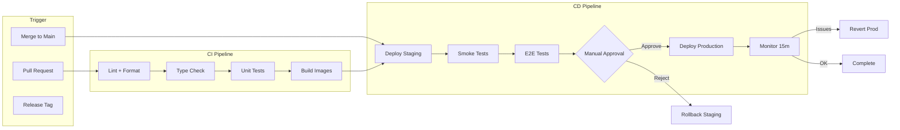
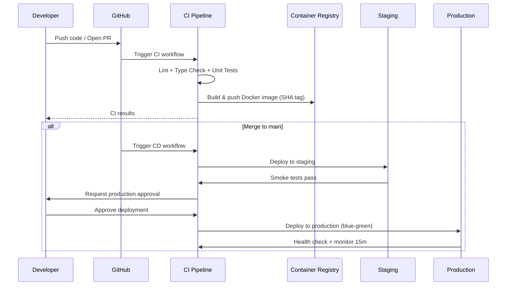

# CI/CD Pipeline

> **Purpose:** Define the continuous integration and continuous deployment pipeline for Vaeloom
> **Status:** ✅ Upgraded to enterprise quality
> **Owner:** DevOps Team
> **Last Updated:** 2026-07-12

---

## Overview

Vaeloom uses **GitHub Actions** for CI/CD across all environments. Every pull request triggers linting, testing, and building. Merges to `main` automatically deploy to staging. Production deploys require manual approval after staging verification.

This document covers the complete pipeline architecture, stage definitions, environment strategies, and operational procedures.

## Pipeline Architecture



## Pipeline Stages

### Stage 1: Lint & Format

```yaml
# .github/workflows/ci.yml
name: CI
on:
  push:
    branches: [main, develop]
  pull_request:
    branches: [main, develop]

jobs:
  lint:
    runs-on: ubuntu-latest
    steps:
      - uses: actions/checkout@v4
      
      - name: Setup Node.js
        uses: actions/setup-node@v4
        with:
          node-version: '20'
          cache: 'npm'
      
      - name: Install dependencies
        run: npm ci
      
      - name: ESLint
        run: npm run lint
        
      - name: Prettier check
        run: npx prettier --check "apps/**/*.ts"
      
      - name: Setup Python
        uses: actions/setup-python@v5
        with:
          python-version: '3.11'
      
      - name: Ruff lint
        run: |
          cd apps/ai-service
          pip install ruff
          ruff check .
      
      - name: mypy type check
        run: |
          cd apps/ai-service
          pip install mypy
          mypy .
```

### Stage 2: Unit & Integration Tests

```yaml
  test:
    needs: [lint]
    runs-on: ubuntu-latest
    services:
      postgres:
        image: postgis/postgis:16
        env:
          POSTGRES_DB: Vaeloom_test
          POSTGRES_USER: test
          POSTGRES_PASSWORD: test
        ports:
          - 5432:5432
      redis:
        image: redis:7-alpine
        ports:
          - 6379:6379
    
    steps:
      - uses: actions/checkout@v4
      
      - name: Setup Node.js
        uses: actions/setup-node@v4
        with:
          node-version: '20'
      
      - name: Install & test (API)
        run: |
          cd apps/api
          npm ci
          npm run test -- --coverage
      
      - name: Install & test (Web)
        run: |
          cd apps/web
          npm ci
          npm run test -- --coverage
      
      - name: Test (AI Service)
        run: |
          cd apps/ai-service
          pip install -r requirements.txt
          pip install -r requirements-dev.txt
          pytest --cov=apps/ai-service --cov-report=term-missing
      
      - name: Upload coverage
        uses: codecov/codecov-action@v3
        with:
          files: ./coverage/lcov.info
```

### Stage 3: Build & Push

```yaml
  build:
    needs: [test]
    runs-on: ubuntu-latest
    steps:
      - uses: actions/checkout@v4
      
      - name: Set up Docker Buildx
        uses: docker/setup-buildx-action@v3
      
      - name: Login to Container Registry
        uses: docker/login-action@v3
        with:
          registry: ghcr.io
          username: ${{ github.actor }}
          password: ${{ secrets.GITHUB_TOKEN }}
      
      - name: Build & Push API
        uses: docker/build-push-action@v5
        with:
          context: apps/api
          push: ${{ github.ref == 'refs/heads/main' }}
          tags: |
            ghcr.io/Vaeloom/api:latest
            ghcr.io/Vaeloom/api:${{ github.sha }}
          cache-from: type=gha
          cache-to: type=gha,mode=max
      
      - name: Build & Push AI Service
        uses: docker/build-push-action@v5
        with:
          context: apps/ai-service
          push: ${{ github.ref == 'refs/heads/main' }}
          tags: |
            ghcr.io/Vaeloom/ai-service:latest
            ghcr.io/Vaeloom/ai-service:${{ github.sha }}
      
      - name: Build & Push Web
        uses: docker/build-push-action@v5
        with:
          context: apps/web
          push: ${{ github.ref == 'refs/heads/main' }}
          tags: |
            ghcr.io/Vaeloom/web:latest
            ghcr.io/Vaeloom/web:${{ github.sha }}
```

### Stage 4: Deploy Staging

```yaml
  deploy-staging:
    if: github.ref == 'refs/heads/main'
    needs: [build]
    runs-on: ubuntu-latest
    environment: staging
    steps:
      - name: Deploy to Fly.io
        run: |
          flyctl deploy apps/web --app Vaeloom-web-staging \
            --image ghcr.io/Vaeloom/web:${{ github.sha }}
          flyctl deploy apps/api --app Vaeloom-api-staging \
            --image ghcr.io/Vaeloom/api:${{ github.sha }}
          flyctl deploy ai-service --app Vaeloom-ai-staging \
            --image ghcr.io/Vaeloom/ai-service:${{ github.sha }}
```

## Deployment Strategy

| Environment | Trigger | Approval | Rollback Method | Zero Downtime |
|-------------|---------|----------|-----------------|---------------|
| Staging | Merge to `main` | Automatic | Re-deploy previous version | ✅ (rolling) |
| Production | Manual after staging | Required (GitHub env) | Revert image tag | ✅ (blue-green) |

## Rollback Procedure

```bash
# Immediate rollback (if deployed < 1 hour ago)
flyctl deploy apps/api --image ghcr.io/Vaeloom/api:$PREVIOUS_SHA

# Git revert + redeploy (if deployed > 1 hour ago)
git revert HEAD
git push origin main
# CI/CD handles staging deploy; manual approval for production

# Verify rollback
curl -f https://api.Vaeloom.dev/v1/health && \
  echo "Rollback successful" || \
  echo "Rollback failed — escalate"
```

## Best Practices

| Practice | Rationale |
|----------|-----------|
| Run CI on every PR, not just merge | Catches issues earlier |
| Cache dependencies between runs | Reduces CI time by 40-60% |
| Fail fast: lint before test | Fail in 30s instead of 5 min for formatting issues |
| Use Docker layer caching | Reduces build time by 50-70% |
| Immutable tags (SHA-based) | Never reuse `:latest` — always SHA for traceability |
| Smoke tests after deploy | Verify deployment before traffic hits it |

## Common Mistakes

| Mistake | Consequence | Fix |
|---------|-------------|-----|
| Long-lived feature branches | Merge conflicts, CI drift | Merge to develop within 3 days |
| Skipping tests for "urgent" fixes | Regression in production | Tests must pass; add test exemption workflow for emergencies |
| Docker `:latest` tags | Unknown what's deployed | Always use SHA tags; `:latest` is an alias, not a deployment target |
| No smoke tests | Successful deploy ≠ working app | Smoke test after every deploy (critical endpoints) |

## Performance Considerations

| Concern | Mitigation |
|---------|------------|
| CI pipeline takes > 15 minutes | Parallel job execution, dependency caching |
| Docker image build time | Layer caching, multi-stage builds |
| Test database setup | Use service containers (Docker-in-Docker) |
| AI golden dataset tests (slow) | Run in parallel, cache results, only re-run on prompt changes |

## Security Considerations

| Concern | Mitigation |
|---------|------------|
| Secrets in CI logs | Mask secrets, never echo env vars |
| Supply chain attacks | Pin action versions by SHA, Dependabot scanning |
| Deployment to wrong environment | GitHub environments with required reviewers |
| Unauthorized production access | `environment: production` with branch protection |

## Goals

- Reduce CI pipeline runtime from commit to deployable artifact to under 10 minutes
- Catch 100% of lint, type, and test failures before staging deployment
- Maintain immutable, traceable deployment artifacts with SHA-based tags
- Achieve automatic staging deployment on every merge to main
- Eliminate deployment failures caused by environment configuration drift

## Scope

**In Scope:**
- GitHub Actions CI pipeline with lint, type check, unit test, integration test, and build stages
- Docker image build and push to container registry with SHA-based immutable tags
- Automated staging deployment on merge to main
- Smoke tests and E2E tests after staging deployment
- Manual production deployment approval gate
- Rollback procedures for both staging and production

**Out of Scope:**
- Cross-repository CI/CD orchestration (monorepo only)
- Third-party CI provider migration
- Mobile app build and deployment
- Infrastructure provisioning via CI (handled by Terraform)
- Performance and load testing in CI (run separately)

## Functional Requirements

| ID | Requirement | Priority |
|----|-------------|----------|
| FR-001 | CI shall run lint, type check, and unit tests on every pull request | Critical |
| FR-002 | CI shall build and push Docker images on merge to main | Critical |
| FR-003 | CD shall deploy to staging automatically after successful build | Critical |
| FR-004 | Production deployment shall require manual approval from designated approvers | Critical |
| FR-005 | All artifacts shall use immutable SHA-based tags for traceability | High |
| FR-006 | CI shall run integration tests with PostgreSQL and Redis service containers | High |
| FR-007 | CD shall run smoke tests after every deployment | High |
| FR-008 | CI shall upload coverage reports and validate coverage thresholds | Medium |

## Non-Functional Requirements

| ID | Requirement | Target | Measurement |
|----|-------------|--------|-------------|
| NFR-001 | CI pipeline (lint, test, build) shall complete within 10 minutes | < 10 min | Pipeline duration |
| NFR-002 | Dependency caching shall reduce CI time by at least 40% | > 40% reduction | Cache hit ratio |
| NFR-003 | Docker image build time shall not exceed 5 minutes per service | < 5 min | Build duration |
| NFR-004 | Smoke test suite shall complete within 30 seconds | < 30s | Smoke test duration |
| NFR-005 | Pipeline shall fail within 30 seconds for lint issues (fail fast) | < 30s | Lint failure detection time |
| NFR-006 | Deployment rollback shall complete within 60 seconds | < 60s | Rollback execution time |

## Components

| Component | Responsibility | Technology | Scale Strategy |
|-----------|---------------|------------|----------------|
| CI Runner | Execute lint, test, build jobs | GitHub Actions Ubuntu | Parallel matrix jobs, auto-scaling runners |
| Dependency Cache | Cache npm, pip, Docker layers between runs | GitHub Actions cache | Save/restore per branch and dependency hash |
| Docker Buildx | Multi-platform container image building | docker/build-push-action | Layer caching (gha cache type), parallel builds |
| Container Registry | Store and serve deployment images | ghcr.io / Docker Hub | Regional replication for pull speed |
| CD Deployer | Execute deployment to Fly.io/K8s | Fly.io CLI / ArgoCD | Stateless, idempotent, rollback-capable |
| Coverage Reporter | Upload and validate test coverage | codecov-action | Per-service coverage tracking |

## Data Flow

1. **PR Trigger** — Developer opens/updates pull request; GitHub Actions triggers CI workflow with checkout, Node.js/Python setup, and dependency installation using cached node_modules
2. **Parallel Stage Execution** — Lint (ESLint, Ruff, Prettier) and Type Check run in parallel; if both pass, test stage starts with PostgreSQL and Redis service containers for integration tests
3. **Build and Push** — On merge to main with all tests passing, Docker multi-stage build creates production images; each image is tagged with commit SHA and pushed to ghcr.io with Cosign signature
4. **Staging Deploy** — CD workflow deploys new images to staging using rolling update; health check probes verify each service instance before routing traffic
5. **Post-Deploy Verification** — Smoke tests run against staging endpoints (health, auth, CRUD); if successful, notification sent via Slack with deployment summary and approval button for production

## Scalability

| Dimension | Current Limit | 10x Strategy | 100x Strategy |
|-----------|---------------|--------------|---------------|
| Parallel CI jobs | 4 jobs | 16 jobs with larger runner pool | 64 jobs with self-hosted runner fleet |
| Docker cache size | 2 GB per service | 10 GB with cache tiering | 50 GB with distributed build cache (BuildKit) |
| Test matrix breadth | 2 Node.js versions | 4 versions across services | 10 versions with selective matrix |
| Artifact storage | 500 MB per build | 5 GB with artifact retention policy | 50 GB with S3 artifact storage |
| Deployment frequency | 10 deploys/day | 100 deploys/day with parallel pipelines | 500 deploys/day with queue management |

## Error Handling

| Error Scenario | Detection | Mitigation | Recovery |
|----------------|-----------|------------|----------|
| CI job timeout | GitHub Actions timeout | Fail job, abort remaining stages | Re-run failed job with increased timeout |
| Dependency installation failure | npm/pip install error | Retry with clean cache | Clear cache and re-run, check dependency health |
| Docker build failure | Buildx build error | Fail pipeline, notify developer | Fix Dockerfile or dependencies, re-trigger |
| Staging deploy failure | Fly.io deployment error | Auto-rollback to previous version | Fix issue, re-merge, re-deploy |
| Smoke test failure | curl assertion failure | Halt CD pipeline, alert team | Investigate, fix, re-run pipeline from deploy stage |
| Coverage below threshold | codecov report below target | Warning notification, optional block | Improve test coverage and re-run |

## Monitoring

| Metric | Alert Threshold | Severity | Dashboard |
|--------|----------------|----------|-----------|
| CI pipeline failure rate | > 5% of runs in 1 hour | Critical | CI Health Dashboard |
| Pipeline duration p95 | > 15 minutes for 5 runs | Warning | Pipeline Performance Dashboard |
| Docker cache hit ratio | < 30% for 10 runs | Warning | Build Cache Dashboard |
| Deployment success rate | < 100% for any deployment | Critical | Deployment Dashboard |
| Test flakiness rate | > 2% flaky tests over 24 hours | Warning | Test Stability Dashboard |
| Coverage regression | Decrease > 1% from baseline | Info | Coverage Trends Dashboard |

## Configuration

| Variable | Purpose | Default | Required |
|----------|---------|---------|----------|
| CI_NODE_VERSION | Node.js version for CI | 20 | Yes |
| CI_PYTHON_VERSION | Python version for CI | 3.11 | Yes |
| DOCKER_REGISTRY | Container registry URL | ghcr.io/Vaeloom | Yes |
| COVERAGE_THRESHOLD | Minimum line coverage percentage | 80 | No |
| TEST_RETRIES | Number of test retries for flaky tests | 2 | No |
| DEPLOY_TIMEOUT | Deployment timeout in minutes | 15 | No |
| SMOKE_TEST_ENDPOINTS | Comma-separated health endpoints | /health,/v1/health | No |
| SLACK_WEBHOOK | Deployment notification channel | — | No |
| CACHE_PREFIX | Cache key prefix for dependency caching | v1 | No |

## Risks

| Risk | Likelihood | Impact | Mitigation |
|------|------------|--------|------------|
| GitHub Actions runner capacity exceeded | Medium | High | Self-hosted runner pool, queue management |
| Dependency supply chain attack | Low | Critical | Pin action versions by SHA, Dependabot scanning, SBOM generation |
| Deployment credential theft from CI | Low | Critical | OIDC-based temporary credentials, never static tokens |
| Test flakiness masking real failures | Medium | Medium | Flaky test detection, quarantine, automatic retry with tracking |
| Docker cache poisoning | Low | Medium | Verify cache integrity, pin base image digests |

## Limitations

| Limitation | Impact | Workaround | Future Resolution |
|------------|--------|------------|-------------------|
| No self-hosted runners in MVP | Shared runner queue delays during peak | GitHub-hosted auto-scaling runners | Self-hosted Kubernetes runner pool |
| No matrix testing across OS | Cannot detect platform-specific issues | Test only on Linux (ubuntu-latest) | Add Windows and macOS matrix runners |
| No parallel deployment environments | Sequential staging, production increases total time | Use separate staging and production workflows | Parallel deployment with environment gating |
| No artifact expiration policy | Storage cost grows with build frequency | Manual cleanup of old artifacts | Automated retention policy (30 days) |

## Examples

### Example 1: Manual Production Approval via GitHub CLI

```bash
# View pending deployment approvals
gh api repos/Vaeloom/Vaeloom/actions/workflows/deploy.yml/runs \
  --jq '.workflow_runs[] | select(.status=="waiting") | {id, head_branch, created_at}'

# Approve a production deployment
gh api repos/Vaeloom/Vaeloom/actions/runs/RUN_ID/approve \
  -X POST
```

### Example 2: Conditional CI Matrix Strategy

```yaml
# .github/workflows/ci.yml (matrix strategy)
jobs:
  test:
    strategy:
      matrix:
        service: [api, web, ai-service]
        include:
          - service: api
            working-dir: apps/api
            test-command: npm run test
          - service: web
            working-dir: apps/web
            test-command: npm run test
          - service: ai-service
            working-dir: apps/ai-service
            test-command: pytest
    steps:
      - uses: actions/checkout@v4
      - run: cd ${{ matrix.working-dir }} && ${{ matrix.test-command }}
```

---

## Sequence Diagrams



> **Diagram:** CI/CD flow from PR/merge through lint-test-build, staging deploy, manual approval, and production blue-green deployment with post-deploy monitoring.

---

## Future Improvements

| Improvement | Priority | Complexity | Timeline |
|-------------|----------|------------|----------|
| Self-hosted Kubernetes runner pool | High | Medium | Q3 2026 |
| OIDC-based temporary deployment credentials | High | Low | Q2 2026 |
| Automated dependency vulnerability scanning | Medium | Low | Q2 2026 |
| Matrix testing across OS (Windows, macOS) | Medium | Medium | Q4 2026 |
| Automatic artifact retention policy | Low | Low | Q2 2026 |

## Related Documents

- [Deployment.md](./Deployment.md)
- [Docker.md](./Docker.md)
- [`Testing/Testing-Strategy.md`](../Testing/Testing-Strategy.md)
- [`Engineering/Release-Process.md`](../Engineering/Release-Process.md)
