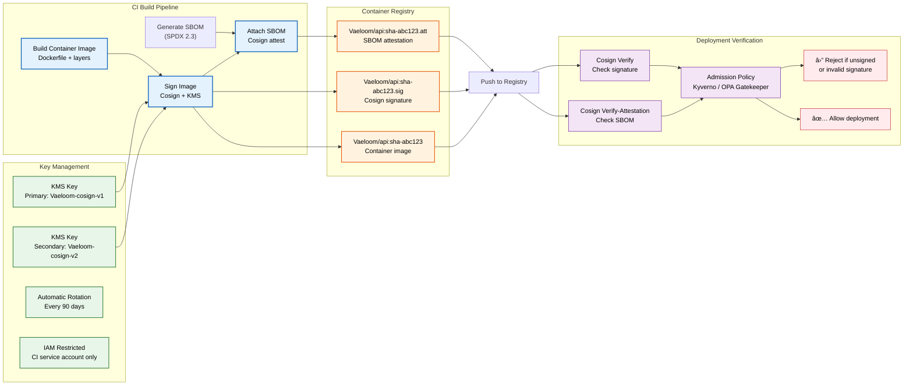
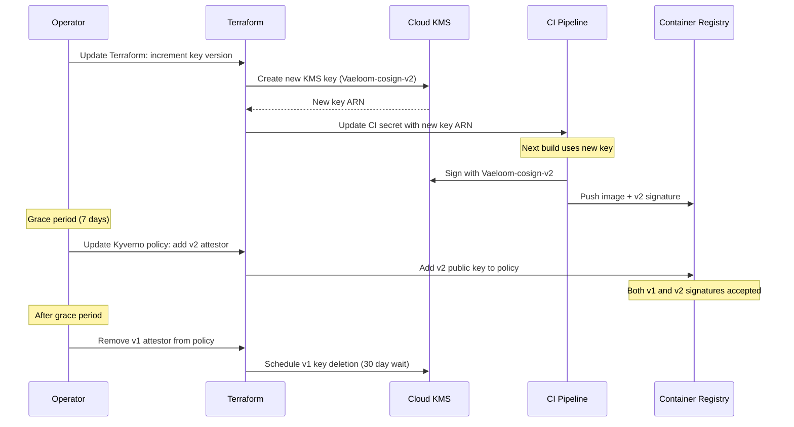

# Container Signing

> **Purpose:** Define the container image signing policy using Cosign, key management via KMS, and verification requirements for Vaeloom
> **Status:** 🆕 New
> **Owner:** DevOps Team
> **Last Updated:** 2026-07-13

## Overview

All Vaeloom container images are signed using **Cosign** (part of the Sigstore project) before being admitted to production. Signatures are generated using keys managed through cloud KMS (AWS KMS or GCP Cloud KMS), with automatic key rotation. Verification is enforced at the deployment pipeline level — unsigned images are rejected before reaching Kubernetes.

This policy covers key generation, signing workflow, verification gates, key rotation, and incident response for compromised keys.

## Signing Architecture



## Key Management

### Key Generation

```bash
# Generate a key pair using KMS
# AWS KMS:
cosign generate-key-pair --kms aws://kms/us-east-1/Vaeloom-cosign-v1

# GCP Cloud KMS:
cosign generate-key-pair --kms gcpkms://projects/Vaeloom/locations/global/keyRings/cosign/cryptoKeys/Vaeloom-cosign-v1
```

### Key Properties

| Property | Value |
|----------|-------|
| Algorithm | ECDSA-P256 (NIST P-256) |
| KMS Provider | AWS KMS (primary) / GCP Cloud KMS (disaster recovery) |
| Key Rotation | Every 90 days (automatic via Terraform) |
| Access Restriction | CI service account only (read + sign) / Operators (verify only) |
| Backup | KMS automatic key backup; cross-region replica |
| Compromise Response | Immediate key revocation + rotation; re-sign all images with new key |

## Signing Workflow

```bash
# 1. Build image
docker build -t Vaeloom/api:sha-abc123 .

# 2. Sign with Cosign using KMS
cosign sign --key aws://kms/us-east-1/Vaeloom-cosign-v1 \
  Vaeloom/api:sha-abc123

# 3. Attach SBOM
cosign attest --key aws://kms/us-east-1/Vaeloom-cosign-v1 \
  --predicate sbom.spdx.json \
  --type spdx \
  Vaeloom/api:sha-abc123

# 4. Push image + signatures
docker push Vaeloom/api:sha-abc123
cosign copy Vaeloom/api:sha-abc123 Vaeloom/api:sha-abc123
```

## Verification (Deployment Gate)

### Kubernetes Admission Policy (Kyverno)

```yaml
apiVersion: kyverno.io/v1
kind: ClusterPolicy
metadata:
  name: verify-image-signature
spec:
  validationFailureAction: enforce
  rules:
    - name: cosign-verify
      match:
        resources:
          kinds:
            - Pod
      verifyImages:
        - imageReferences:
            - "Vaeloom/*"
          attestors:
            - entries:
                - keys:
                    kms: "awskms:///arn:aws:kms:us-east-1:123456789:key/Vaeloom-cosign-v1"
          requiredAttestations:
            - predicateType: "spdx.dev/sbom"
```

## Key Rotation Procedure



## Best Practices

| Practice | Rationale |
|----------|----------|
| Sign images at build time, not deploy time | Deploy-time signing can miss intermediate image mutations; build-time signing ensures the exact artifact is traceable |
| Use KMS-backed keys, not local files | Local keys risk leakage via CI logs or artifact storage; KMS provides audit logging, automatic rotation, and access control |
| Verify signatures in admission control | Client-side verification is bypassable; admission-level enforcement ensures every pod runs only signed images |
| Attach SBOM as Cosign attestation | Binds the SBOM to the signed artifact; prevents SBOM mismatch or tampering after signing |

## Common Mistakes

| Mistake | Consequence | Fix |
|---------|-------------|-----|
| Signing with local key files | Private key stored in CI secrets or builder VM; exposed in logs or artifact cache | Use KMS-backed keys exclusively; never generate or store keys outside KMS |
| No verification in admission control | Signed images are produced but unsigned images can still be deployed if CI is bypassed | Enforce Cosign verification in Kyverno/OPA policies at the Kubernetes admission level |
| Skipping key rotation | Key compromise window grows with time; rotated keys limit blast radius | Automate key rotation via Terraform with 90-day cadence; monitor rotation compliance |
| Signing only production images | Staging and development environments use unsigned images; supply chain attack vector | Sign all images in all environments; staging uses dev key with separate verification policy |

## Security Considerations

| Concern | Mitigation |
|---------|-----------|
| KMS key compromise | KMS automatic key rotation (90 days); CloudTrail logging for all KMS operations; immediate revocation on suspected compromise |
| CI pipeline access to signing key | CI service account scoped to sign-only (not admin); no key export possible from KMS |
| Signature stripping | Cosign signatures stored in the container registry alongside the image; registry IAM prevents unauthorized deletion of signature tags |
| Admission controller bypass | Kyverno policy enforced at cluster level; direct kubelet image pulls blocked; all image pulls go through registry with policy check |
| Key-less signing (keyless mode) | Keyless (Fulcio) evaluated as alternative for open-source components; internal images continue to use KMS keys |

## Performance Considerations

| Concern | Mitigation |
|---------|-----------|
| Cosign signing latency | Signing completes in <2s per image (KMS ECDSA operation); batch signing for multi-architecture images parallelized |
| Admission verification latency | Cosign verification in Kyverno adds ~50ms per pod creation; verification result cached per image digest |
| KMS API rate limits | Signing operations within KMS limits (<100 ops/sec); CI builds serialize image pushes to avoid throttling |
| Key rotation overhead | Rotation is a Terraform apply (no downtime); old key remains valid for 7-day grace period; no service interruption |
| Signature storage in registry | Each signature adds ~1KB to registry storage; negligible cost impact at scale |

## Components

| Component | Responsibility | Technology | Scale Strategy |
|-----------|---------------|------------|----------------|
| Signing Key | Cryptographic identity for images | Cosign + AWS KMS (ECDSA-P256) | Automatic rotation every 90 days |
| Signing Agent | Generate signatures at build time | Cosign CLI in CI pipeline | Parallel signing for multi-arch images |
| Attestation Store | SBOM attachments bound to images | Cosign attestation in container registry | Stored alongside image tags |
| Verification Gate | Enforce signed images in admission | Kyverno ClusterPolicy (K8s) | Distributed verification per cluster |

---

## Scalability

| Dimension | Current Limit | 10x Strategy | 100x Strategy |
|-----------|--------------|--------------|---------------|
| Images signed per day | 10 | 100: parallel signing per image | 1000: batch signing with KMS rate limit mgmt |
| Keys managed | 1 active + 1 rotation | 5: per-environment keys | 20: per-service + per-environment keys |
| Verification latency | ~50ms per pod | ~20ms: cached verification results | ~5ms: sidecar attestation |
| Key rotation | 90 days | 30 days: automated rotation | Continuous: keyless signing (Fulcio) |

---

## Error Handling

| Scenario | Detection | Mitigation | Recovery |
|----------|-----------|------------|----------|
| Signing fails in CI | CI job failure | Retry signing step | Investigate KMS connectivity or key permissions |
| Verification rejects valid image | Admission webhook error | Check key match between sign and verify | Update Kyverno policy with correct key ARN |
| KMS key temporarily unavailable | Signing timeout | Retry with exponential backoff | Failover to secondary KMS region |
| Signature pushed before image | Registry inconsistency | Re-push signature after image | Add image-exists check before signing |

---

## Monitoring

| Metric | Alert Threshold | Severity | Dashboard |
|--------|----------------|----------|-----------|
| Signing success rate | < 99% | Critical | Container Signing |
| Verification rejection rate | > 1% of deploys | Critical | Admission Control |
| Key age (days since rotation) | > 90 days | Critical | Key Management |
| KMS API error rate | > 1% | Warning | KMS Health |

---

## Deployment

| Environment | Method | Trigger | Verification |
|-------------|--------|---------|--------------|
| Key rotation | Terraform apply | 90-day schedule | Old key still accepted for 7-day grace period |
| Signing pipeline update | CI config change | New build process | Test sign-and-verify flow |
| Kyverno policy update | Helm / kubectl apply | New key or verification requirement | Verify admission rejects unsigned images |
| SBOM attestation format change | CI script update | SPDX version upgrade | Verify attestation contains required fields |

---

## Configuration

| Variable | Purpose | Default | Required |
|----------|---------|---------|----------|
| `COSIGN_KEY_ARN` | KMS key ARN for signing | — | Yes |
| `COSIGN_VERIFICATION_KEY` | Public key for admission verification | — | Yes |
| `SIGNING_IMAGE_PATTERN` | Image glob pattern to sign | `Vaeloom/*` | No |
| `KEY_ROTATION_DAYS` | Key rotation interval | `90` | No |
| `GRACE_PERIOD_DAYS` | Old key acceptance period | `7` | No |

---

## Limitations

| Limitation | Impact | Workaround | Future Resolution |
|------------|--------|------------|-------------------|
| KMS key management adds complexity | Additional Terraform and IAM management | Automated via Terraform module | Keyless signing via Sigstore Fulcio |
| Cosign adds ~50ms to pod admission | Slight latency on pod creation | Cache verification results | Sidecar attestation with zero-cost verify |
| Key rotation requires policy update window | 7-day grace period for old keys | Automated policy update in rotation script | Continuous key rotation with Fulcio |
| Only covers container images (not artifacts) | Helm charts, configs not signed | Manual verification | Expand signing to all deployable artifacts |

---

## Goals

- Sign every container image at build time using Cosign with KMS-backed keys
- Enforce signature verification in Kubernetes admission control (Kyverno/OPA)
- Automate key rotation every 90 days with zero-downtime grace period
- Attach SBOM attestations to all signed images for supply chain transparency
- Achieve sub-2-second signing latency and sub-50ms verification latency per pod

---

## Scope

### In Scope
- Cosign-based container image signing with ECDSA-P256 keys stored in cloud KMS (AWS KMS / GCP Cloud KMS)
- Admission-level signature verification via Kyverno ClusterPolicy
- SBOM attestation attachment as Cosign attestations
- Automatic key rotation every 90 days with 7-day grace period
- Signing integration in CI build pipeline (GitHub Actions)

### Out of Scope
- Keyless signing via Sigstore Fulcio (planned for future)
- Signing of non-container artifacts (Helm charts, configs — planned for future)
- Container image vulnerability scanning (covered in [SBOM-Policy.md](./SBOM-Policy.md))
- Container registry management (covered in [Docker.md](./Docker.md))
- Infrastructure key management infrastructure (covered in [Terraform.md](./Terraform.md))

---

## Examples

### Example 1: Verifying an Image Signature Manually

```bash
# Verify a signed image using Cosign with KMS key
cosign verify --key aws://kms/us-east-1/Vaeloom-cosign-v1 \
  ghcr.io/Vaeloom/api:sha-abc123

# Verify SBOM attestation
cosign verify-attestation --key aws://kms/us-east-1/Vaeloom-cosign-v1 \
  --type spdx \
  ghcr.io/Vaeloom/api:sha-abc123
```

### Example 2: Checking Signatures in CI Pipeline

```yaml
# CI step to verify an image before deployment
- name: Verify image signature
  run: |
    cosign verify \
      --key aws://kms/us-east-1/Vaeloom-cosign-v1 \
      ghcr.io/Vaeloom/ai-service:${{ github.sha }} || \
      { echo "Image signature verification failed"; exit 1; }
```

---

## Future Improvements

| Improvement | Priority | Complexity | Timeline |
|-------------|----------|------------|----------|
| Keyless signing via Sigstore Fulcio | High | Medium | Q2 2027 |
| Expand signing to Helm charts and configs | High | Medium | Q1 2027 |
| Automated key rotation with zero-touch | Medium | Low | Q4 2026 |
| Sidecar attestation for zero-cost verification | Medium | High | Q3 2027 |
| Cross-region KMS failover for signing | Low | Low | Q4 2026 |

## Related Documents

- [SBOM Policy.md](./SBOM-Policy.md)
- [CI/CD Pipeline.md](./CI-CD.md)
- [Deployment.md](./Deployment.md)
- [Docker.md](./Docker.md)
- [Kubernetes.md](./Kubernetes.md)
