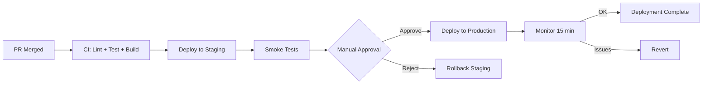
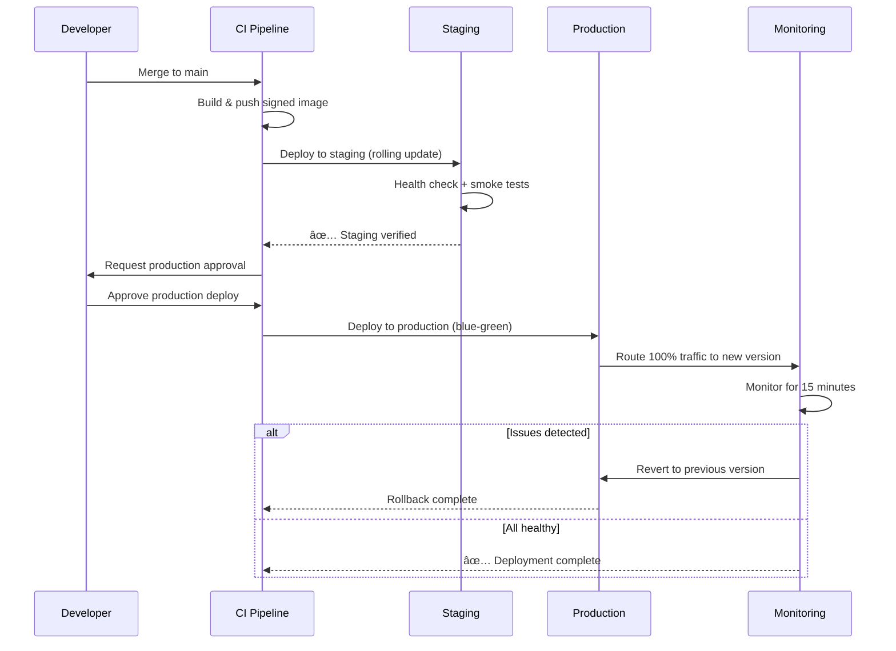

# Deployment

> **Purpose:** Define deployment strategy and procedures for Vaeloom
> **Status:** ✅ Upgraded to enterprise quality
> **Canonical source:** [`/Docs/Engineering/Implementation/16-deployment-infrastructure.md`](../../Docs/Engineering/Implementation/16-deployment-infrastructure.md)

## Network Topology

```mermaid
graph TD
    %% ─── Class Definitions ───
    classDef dev fill:#e3f2fd,stroke:#1565c0,color:#000,stroke-width:1.5px
    classDef staging fill:#e8f5e9,stroke:#2e7d32,color:#000,stroke-width:1.5px
    classDef prod fill:#fff3e0,stroke:#e65100,color:#000,stroke-width:1.5px
    classDef edge fill:#f3e5f5,stroke:#6a1b9a,color:#000,stroke-width:1.5px
    classDef db fill:#ffebee,stroke:#c62828,color:#000,stroke-width:1.5px
    classDef ci fill:#e0f7fa,stroke:#00838f,color:#000,stroke-width:1.5px

    %% ─── Internet / Users ───
    subgraph Internet["🌐 Internet"]
        U1["👤 Browser User"]
        U2["🤖 External API<br/>Gmail / GitHub / Slack"]
        U3["🔄 Webhook Callback"]
    end

    %% ─── Edge Layer ───
    subgraph Edge["🛡️ Edge Layer"]
        direction TB
        DNS["DNS<br/>Cloudflare / Route53"] --> WAF["WAF + CDN<br/>CloudFront / Cloudflare"]
        WAF --> LB["Load Balancer<br/>ALB / Nginx"]
        WAF --> R53["SSL Termination<br/>ACM / Let's Encrypt"]
    end

    %% ─── Production ───
    subgraph Prod["🚀 Production (us-east-1)"]
        direction TB
        PROD_API["API Service<br/>x6 instances<br/>Fly.io / ECS"]
        PROD_WORKER["Background Workers<br/>x4 instances"]
        PROD_CRON["Cron Scheduler<br/>1 instance"]
        PROD_PG[("PostgreSQL<br/>Primary + Standby")]
        PROD_REDIS[("Redis<br/>Cluster 3 nodes")]
        PROD_S3["☁️ Object Storage<br/>S3 / R2"]
        PROD_SM["🔐 Secrets Manager<br/>AWS / GCP"]
        PROD_MON["📊 Monitoring<br/>Datadog / Grafana"]
    end

    %% ─── Staging ───
    subgraph Stage["🧪 Staging (us-east-1)"]
        direction TB
        STG_API["API Service<br/>x2 instances"]
        STG_WORKER["Background Workers<br/>x1 instance"]
        STG_PG[("PostgreSQL<br/>Single instance")]
        STG_REDIS[("Redis<br/>Single instance")]
        STG_S3["☁️ Object Storage<br/>S3 / R2"]
    end

    %% ─── Development ───
    subgraph Dev["💻 Development (Local)"]
        direction TB
        DEV_API["Local API<br/>next dev / nodemon"]
        DEV_PG[("PostgreSQL<br/>Docker:5432")]
        DEV_REDIS[("Redis<br/>Docker:6379")]
        DEV_MINIO["☁️ MinIO<br/>Local S3 mock"]
        DEV_DB_GUI["🛠️ Adminer / pgAdmin<br/>Local:8080"]
    end

    %% ─── CI/CD ───
    subgraph CICD["🔁 CI Pipeline"]
        direction TB
        GIT["GitHub / GitLab"] --> CI["CI Runner<br/>Lint + Test + Build"]
        CI --> REGISTRY["Container Registry<br/>Docker Hub / ECR"]
        REGISTRY --> CD["CD Deploy<br/>Fly.io / ArgoCD"]
    end

    %% ─── Network connections ───
    U1 & U2 & U3 -->|HTTPS:443| DNS
    LB -->|:443| PROD_API & STG_API
    PROD_API -->|:5432| PROD_PG
    PROD_API -->|:6379| PROD_REDIS
    PROD_API -->|:443| PROD_S3
    PROD_API --> PROD_SM
    PROD_API --> PROD_MON
    PROD_WORKER --> PROD_PG & PROD_REDIS & PROD_SM
    PROD_CRON --> PROD_API

    STG_API -->|:5432| STG_PG
    STG_API -->|:6379| STG_REDIS
    STG_API -->|:443| STG_S3
    STG_WORKER --> STG_PG & STG_REDIS

    DEV_API -->|:5432| DEV_PG
    DEV_API -->|:6379| DEV_REDIS
    DEV_API -->|:9000| DEV_MINIO

    CD -->|deploy| PROD_API & PROD_WORKER
    CD -->|deploy| STG_API & STG_WORKER

    PROD_PG -.->|streaming replication| STG_PG

    %% ─── Apply styles ───
    class U1,U2,U3 edge
    class DNS,WAF,LB,R53 edge
    class PROD_API,PROD_WORKER,PROD_CRON prod
    class PROD_PG,PROD_REDIS,PROD_S3,PROD_SM,PROD_MON db
    class STG_API,STG_WORKER staging
    class STG_PG,STG_REDIS,STG_S3 db
    class DEV_API,DEV_PG,DEV_REDIS,DEV_MINIO,DEV_DB_GUI dev
    class GIT,CI,REGISTRY,CD ci
```



> **Diagram:** Network topology spans five zones. **Internet** (🌐) routes through **Edge Layer** (🛡️) — DNS → WAF/CDN → Load Balancer → SSL termination — before reaching **Production** (🚀) or **Staging** (🧪). Production runs 6 API instances + 4 workers + clustered PostgreSQL/Redis. Staging mirrors production at smaller scale. **Development** (💻) uses local Docker containers (PostgreSQL, Redis, MinIO). **CI/CD** (🔁) builds and deploys via container registry.

---

## Deployment Environments

| Environment | URL | Purpose | Deploy Trigger |
|-------------|-----|---------|---------------|
| Development | localhost | Local development | Manual |
| Staging | staging.Vaeloom.dev | Integration testing | Push to main |
| Production | Vaeloom.dev | Live user traffic | Manual release |

## Deployment Strategy

| Strategy | MVP | Enterprise |
|----------|-----|------------|
| Method | Rolling deploy | Blue-green |
| Zero downtime | ✅ (PaaS built-in) | ✅ (K8s) |
| Rollback | Instant (previous version) | Load balancer switch |
| Canary | Manual (staging first) | Automated (%-based traffic) |

## Deployment Flow



## Rollback Procedure

```bash
# Option 1: Revert to previous version
flyctl deploy apps/api --image Vaeloom-api:v1.2.3

# Option 2: Git revert + redeploy
git revert HEAD
git push origin main
# CI/CD deploys automatically to staging
# Manual approval for production
```

## Common Mistakes

| Mistake | Consequence |
|---------|-------------|
| Deploying to production without staging verification | A change that goes directly from dev to production bypasses integration testing — always deploy to staging first, run smoke tests, and only then promote to production with a manual approval gate |
| Rollback procedures that haven't been tested | A rollback that hasn't been rehearsed will fail under pressure — test rollback procedures quarterly by deliberately deploying a bad release to staging and executing the rollback |
| Environment drift between staging and production | Different configuration values, secret versions, or dependency versions between staging and prod cause "it worked in staging" failures — use identical deployment pipelines for both environments with environment-specific variables injected at deploy time |

## Best Practices

| Practice | Why |
|----------|-----|
| Always validate in staging before promoting to production | Staging should mirror production as closely as possible — a staging pass gives confidence that the deployment won't cause production issues. Use the same CI/CD pipeline for both with a manual approval gate for production |
| Test rollback procedures as part of the deployment pipeline | A rollback that works in a drill will work under pressure — include a rollback step in the staging deployment pipeline that runs every time, proving that the rollback path is always functional |
| Keep staging and production environments as identical as possible | Environment drift is the #1 cause of "it worked in staging" failures — use the same Docker images, the same CI pipeline, and the same infrastructure-as-code templates for both environments |

## Security

| Concern | Mitigation |
|---------|------------|
| Deploy credentials stored in CI/CD configuration | A deploy token stored as a plaintext CI/CD variable can be extracted from build logs or exported to vulnerable downstream steps — use temporary credentials with scoped permissions that are generated at deploy time, not stored permanently |
| Production secrets accessible from staging pipelines | A CI/CD pipeline configured to deploy to staging that has access to production secrets can accidentally expose them — separate staging and production environments with different secret stores and different CI/CD credentials |
| Deployment artifacts that aren't signed | An unsigned Docker image deployed to production could be a tampered version — sign container images and verify signatures in the deployment pipeline before allowing them to run in production |

## Performance

| Concern | Mitigation |
|---------|------------|
| Deployment latency slowing feature delivery | A deployment pipeline that takes 30 minutes blocks team velocity — optimize build times with layer caching (Docker), parallel test stages, and deployment streaming that doesn't require full CI completion for staging deploys |
| Rolling deployments causing temporary performance degradation | During a rolling update, both old and new versions serve traffic — if the new version has different performance characteristics (higher latency, more database connections), it can degrade the overall experience. Monitor performance deltas during rolling deployments |
| Blue-green deployment resource costs doubling | Maintaining two full production environments (blue + green) doubles infrastructure costs — use percentage-based canary deploys instead of full blue-green for MVP, reserving blue-green for Enterprise with dedicated budgets |

## Security Considerations

| Concern | Mitigation |
|---------|------------|
| Deploy credentials stored in CI/CD configuration | A deploy token stored as a plaintext CI/CD variable can be extracted from build logs or exported to vulnerable downstream steps — use temporary credentials with scoped permissions that are generated at deploy time, not stored permanently |
| Production secrets accessible from staging pipelines | A CI/CD pipeline configured to deploy to staging that has access to production secrets can accidentally expose them — separate staging and production environments with different secret stores and different CI/CD credentials |
| Deployment artifacts that aren't signed | An unsigned Docker image deployed to production could be a tampered version — sign container images and verify signatures in the deployment pipeline before allowing them to run in production |

## Performance Considerations

| Concern | Approach |
|---------|----------|
| Deployment latency slowing feature delivery | A deployment pipeline that takes 30 minutes blocks team velocity — optimize build times with layer caching (Docker), parallel test stages, and deployment streaming that doesn't require full CI completion for staging deploys |
| Rolling deployments causing temporary performance degradation | During a rolling update, both old and new versions serve traffic — if the new version has different performance characteristics (higher latency, more database connections), it can degrade the overall experience. Monitor performance deltas during rolling deployments |
| Blue-green deployment resource costs doubling | Maintaining two full production environments (blue + green) doubles infrastructure costs — use percentage-based canary deploys instead of full blue-green for MVP, reserving blue-green for Enterprise with dedicated budgets |

## Goals

- Achieve zero-downtime deployments for all environments through rolling updates
- Reduce deployment pipeline time from commit to production to under 15 minutes
- Ensure environment parity between staging and production to eliminate drift-related failures
- Enable instant rollback to previous version within 60 seconds
- Automate deployment verification through smoke tests after every deploy

## Scope

**In Scope:**

- Three deployment environments: Development (local), Staging (integration), Production (live)
- Rolling deployment strategy for MVP, blue-green for Enterprise
- CI/CD pipeline integration with container registry
- Smoke test verification post-deploy
- Manual production approval gate
- Rollback procedures for both staging and production
- Container image signing and verification

**Out of Scope:**

- Canary deployment with percentage-based traffic splitting (Enterprise only)
- Multi-region active-active deployment
- Database schema migration during deployment (handled separately)
- Feature flag management and toggling
- Auto-scaling configuration (managed by cloud provider)

## Functional Requirements

| ID | Requirement | Priority |
|----|-------------|----------|
| FR-001 | Deployments to staging shall be triggered automatically on merge to main | Critical |
| FR-002 | Deployments to production shall require manual approval after staging verification | Critical |
| FR-003 | Every deployment shall run smoke tests against critical endpoints before marking complete | Critical |
| FR-004 | Rollback shall restore the previous version within 60 seconds | High |
| FR-005 | Deployment artifacts shall be signed and verified before deployment | High |
| FR-006 | Environment-specific configuration shall be injected at deploy time, not baked into images | High |
| FR-007 | Deployment pipeline shall be fully automated with no manual steps beyond approval | Medium |
| FR-008 | All deployments shall be logged with commit SHA, image tag, and timestamp | Medium |

## Non-Functional Requirements

| ID | Requirement | Target | Measurement |
|----|-------------|--------|-------------|
| NFR-001 | Full deployment pipeline shall complete within 15 minutes | < 15 min | Commit-to-production time |
| NFR-002 | Zero-downtime deployments shall have no user-facing impact | 0 failed requests | Error rate during deployment window |
| NFR-003 | Rollback shall complete within 60 seconds | < 60s | Rollback execution time |
| NFR-004 | Staging and production environments shall use the same deployment pipeline | 100% identical | Pipeline diff comparison |
| NFR-005 | Container images shall be rebuilt and tested weekly | < 7 days | Image age at deploy time |
| NFR-006 | Smoke tests shall complete within 30 seconds post-deploy | < 30s | Smoke test execution time |

## Components

| Component | Responsibility | Technology | Scale Strategy |
|-----------|---------------|------------|----------------|
| Container Registry | Store and distribute deployment artifacts | Docker Hub / ECR | Regional replication for faster pulls |
| CI Pipeline | Lint, test, build, and push images | GitHub Actions | Parallel job execution, cache optimization |
| CD Deployer | Execute deployment to target environment | Fly.io / ArgoCD | Stateless, idempotent deployment |
| Health Checker | Verify deployed service is healthy | Custom HTTP probes | Per-instance, included in every service |
| Smoke Test Runner | Post-deploy endpoint verification | curl + assertions | Parallel execution across services |
| Rollback Executor | Restore previous version on failure | Fly.io CLI / kubectl | Pre-tested, documented runbook |

## Data Flow

1. **Code Merge** — Developer merges PR to main branch; GitHub webhook triggers CI pipeline which runs lint, type check, unit tests, and integration tests in parallel stages
2. **Image Build and Push** — Successful tests trigger Docker multi-stage build; images are pushed to container registry with immutable SHA tags and signed with Cosign
3. **Staging Deployment** — CD pipeline deploys new images to staging environment using rolling update; health checks verify each instance before proceeding to next
4. **Smoke Tests and Approval** — Post-deploy smoke tests run against staging critical endpoints (health, auth, CRUD); if all pass, notification sent to approver for production gate
5. **Production Deployment** — Approved deployment promoted to production using blue-green strategy; live traffic switched to new version after health verification; old version retained for 1 hour for instant rollback

## Scalability

| Dimension | Current Limit | 10x Strategy | 100x Strategy |
|-----------|---------------|--------------|---------------|
| Concurrent deployments | 1 at a time | 3 concurrent (staging, production, emergency) | 10 concurrent with environment isolation |
| Container image builds | 5 builds/hour | 50 builds/hour with layer caching | 500 builds/hour with distributed build cache |
| Deployment targets | 3 services (api, web, ai-service) | 10 microservices | 50 microservices with dependency graph |
| Smoke test endpoints | 5 endpoints | 50 endpoints with parallel execution | 500 endpoints with service mesh health |
| Rollback time | 60 seconds | 30 seconds with pre-warmed images | 10 seconds with traffic mirroring |

## Error Handling

| Error Scenario | Detection | Mitigation | Recovery |
|----------------|-----------|------------|----------|
| Staging deploy fails | Health check failure, deployment timeout | Rollback staging to previous version automatically | Fix issue in code, re-merge, redeploy |
| Production deploy fails | Blue-green health check failure | Keep old version serving traffic, abort deployment | Investigate issue, fix, re-approve |
| Smoke test failure | Endpoint returns non-200 status | Stop deployment pipeline, alert team | Rollback staging, investigate test failure |
| Container image build failure | Docker build error | Halt pipeline, notify developer | Fix Dockerfile or dependencies, retry |
| Secrets injection failure | Environment variable missing | Halt deployment, alert operator | Verify secret exists in secrets manager, retry |

## Monitoring

| Metric | Alert Threshold | Severity | Dashboard |
|--------|----------------|----------|-----------|
| Deployment failure rate | > 2 consecutive failures | Critical | Deployment Pipeline Dashboard |
| Deployment pipeline duration | > 20 minutes | Warning | Pipeline Duration Dashboard |
| Rollback frequency | > 2 per week | Warning | Deployment Stability Dashboard |
| Environment drift score | Configuration mismatch detected | Warning | Environment Parity Dashboard |
| Image age at deploy | > 7 days since build | Info | Image Freshness Dashboard |
| Smoke test pass rate | < 100% pass rate | Critical | Smoke Test Dashboard |

## Configuration

| Variable | Purpose | Default | Required |
|----------|---------|---------|----------|
| DEPLOY_ENVIRONMENT | Target deployment environment | staging | Yes |
| IMAGE_TAG | Container image tag to deploy | github.sha | Yes |
| HEALTH_CHECK_ENDPOINT | URL for health check probe | /health | Yes |
| ROLLBACK_TIMEOUT | Max rollback wait time in seconds | 120 | No |
| SMOKE_TEST_TIMEOUT | Max smoke test duration in seconds | 60 | No |
| MAX_SURGE | Max extra instances during rolling update | 1 | No |
| MAX_UNAVAILABLE | Max unavailable instances during rolling | 0 | No |
| PRODUCTION_APPROVERS | Required approvers for production gate | team-leads | Yes |
| ENABLE_COSIGN | Enable container image signing | true | No |

## Risks

| Risk | Likelihood | Impact | Mitigation |
|------|------------|--------|------------|
| Environment drift causing staging-pass prod-fail | Medium | High | Infrastructure-as-code, identical pipelines, config validation |
| Rollback procedure untested and failing under pressure | Medium | Critical | Quarterly rollback drills in staging, automated rollback test |
| Deployment credentials leaked via CI logs | Low | Critical | Temporary credentials, secret masking, restricted permissions |
| Blue-green deployment cost doubling | Medium | Medium | Use rolling for MVP, dedicated budget for blue-green Enterprise |
| Long-running deployment blocking hotfix | Low | Medium | Fast-track hotfix pipeline with reduced stages |

## Limitations

| Limitation | Impact | Workaround | Future Resolution |
|------------|--------|------------|-------------------|
| No canary deployment in MVP | Cannot test with real traffic percentage | Manual staging verification | Automated canary with traffic splitting for Enterprise |
| Single-region deployment | No regional failover, higher latency for non-US | CDN for static assets | Multi-region active-active deployment |
| Manual production approval gate | Delays for timezone-offset teams | On-call rotation for approvals | Automated approval with policy engine |
| No database migration in deployment pipeline | Schema changes must be deployed separately | Run migrations before deployment in maintenance window | Integrated migration step in pipeline |

## Overview

Vaeloom's deployment strategy defines how code moves from development through staging to production across the entire service mesh — including the web frontend (Next.js), core API (NestJS), AI service (FastAPI), and supporting infrastructure (PostgreSQL, Redis, RabbitMQ). This document covers the three deployment environments, the rolling and blue-green strategies, CI/CD integration, and rollback procedures.

The primary audience includes DevOps engineers and SRE team members responsible for deploying and operating Vaeloom services. Readers should understand Vaeloom's service architecture and CI/CD pipeline before reading this document.

Within the Vaeloom platform, deployment is the final stage of the CI/CD lifecycle that transforms verified artifacts into running services. A robust deployment strategy with zero-downtime rolling updates, automated smoke tests, and instant rollback capability is essential for maintaining the platform's availability SLAs and enabling rapid, safe feature delivery.

Enterprise-grade deployment requires environment parity between staging and production to eliminate "it worked in staging" failures, immutable SHA-based image tags for traceable deployments, and signed container images that are verified before admission to production clusters.

---

## Examples

### Example 1: Blue-Green Deployment with Load Balancer Switch

```bash
# Deploy new version to green environment
kubectl apply -f k8s/production/green-deployment.yaml

# Wait for green to be healthy
kubectl rollout status deployment/Vaeloom-api-green -n Vaeloom-prod

# Switch traffic to green
kubectl patch service Vaeloom-api -n Vaeloom-prod \
  --patch '{"spec":{"selector":{"version":"green"}}}'

# Monitor for 15 minutes, then delete blue
kubectl delete deployment Vaeloom-api-blue -n Vaeloom-prod
```

### Example 2: Deployment Verification with Health Checks

```bash
# Smoke test critical endpoints after deployment
ENDPOINTS=(
  "https://api.Vaeloom.dev/v1/health"
  "https://api.Vaeloom.dev/v1/health/ready"
  "https://app.Vaeloom.dev/api/health"
)
for ep in "${ENDPOINTS[@]}"; do
  status=$(curl -s -o /dev/null -w "%{http_code}" "$ep")
  if [ "$status" != "200" ]; then
    echo "FAIL: $ep returned $status"
    exit 1
  fi
done
echo "All smoke tests passed"
```

---

## Sequence Diagrams



> **Diagram:** Deployment flow from staging rollout through manual approval gate to production blue-green deploy with 15-minute monitoring window and automatic rollback on issue detection.

---

## Future Improvements

| Improvement | Priority | Complexity | Timeline |
|-------------|----------|------------|----------|
| Automated canary deployment with traffic splitting | High | High | Q4 2026 |
| Multi-region active-active deployment | High | High | Q1 2027 |
| Integrated database migration in deployment pipeline | Medium | Medium | Q3 2026 |
| Automated production approval with policy engine | Medium | Medium | Q3 2026 |
| Pre-warmed rollback images for sub-30 second recovery | Low | Low | Q2 2026 |

## Related Documents

- [`DevOps/CI-CD.md`](./CI-CD.md)
- [`DevOps/Docker.md`](./Docker.md)
- [`Engineering/Release-Process.md`](../Engineering/Release-Process.md)
