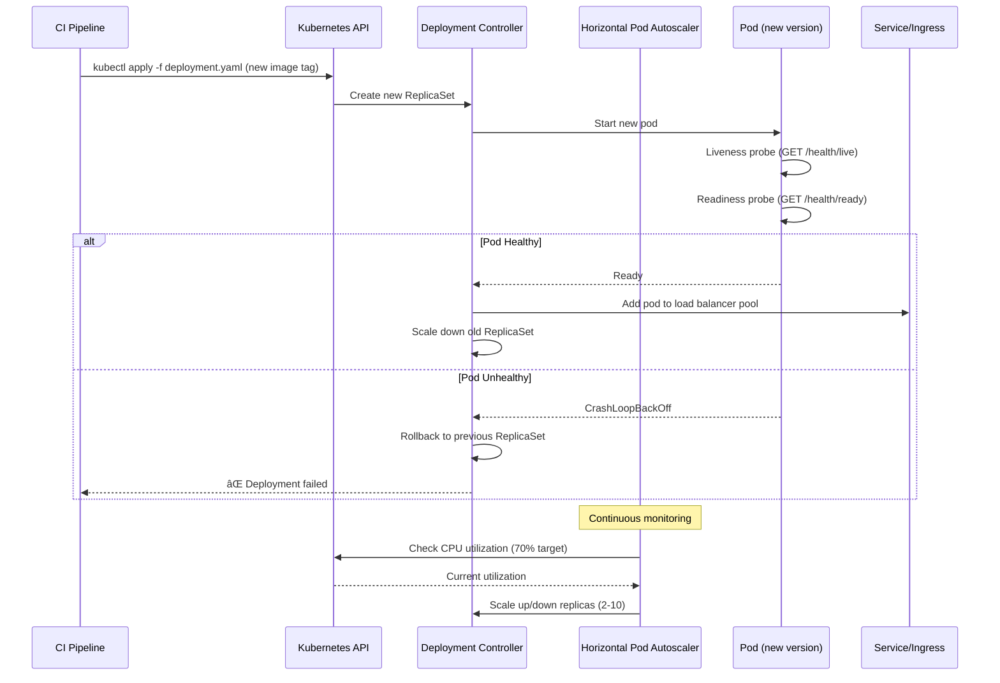

# Kubernetes

> **Purpose:** Define Kubernetes deployment configuration for Vaeloom (Enterprise)
> **Status:** 🆕 New — Enterprise-only. MVP uses PaaS.

## Cluster Architecture

```mermaid
graph TD
    classDef ingress fill:#e3f2fd,stroke:#1565c0,color:#000,stroke-width:2px
    classDef svc fill:#e8f5e9,stroke:#2e7d32,color:#000,stroke-width:1.5px
    classDef hpa fill:#fff3e0,stroke:#e65100,color:#000,stroke-width:1.5px
    classDef data fill:#f3e5f5,stroke:#6a1b9a,color:#000,stroke-width:1.5px
    classDef trigger fill:#ffebee,stroke:#c62828,color:#000,stroke-width:1px

    subgraph Triggers["🚦 When to Move to K8s (Enterprise)"]
        direction TB
        T1["> 5 microservices<br/>Manual mgmt error-prone"]
        T2["PaaS auto-scaling<br/>insufficient"]
        T3["Multi-tenancy<br/>with isolation"]
        T4["> 5 engineers<br/>deploying independently"]
    end

    subgraph Cluster["☸️ Kubernetes Cluster"]
        direction TB
        INGRESS["Ingress NGINX<br/>SSL termination + routing"]

        subgraph Services["Services (HPA)"]
            WEB["apps/web<br/>Replicas: 2-8<br/>CPU: 250m/500m"]
            API["apps/api<br/>Replicas: 2-10<br/>CPU: 250m/500m"]
            AI["apps/ai-service<br/>Replicas: 2-6<br/>CPU: 500m/1"]
        end

        subgraph Infra["Infrastructure"]
            REDIS["( Redis<br/>Helm chart )"]
            PG["( PostgreSQL<br/>Operator managed )"]
        end

        INGRESS --> WEB & API & AI
        WEB & API --> PG & REDIS
        AI --> PG & REDIS
    end

    subgraph HPAConfig["📈 Horizontal Pod Autoscaler"]
        H1["apiVersion: autoscaling/v2<br/>targetCPUUtilization: 70%<br/>minReplicas: 2, maxReplicas: 10"]
    end

    T1 & T2 & T3 & T4 --> Cluster
    WEB & API & AI -.-> H1

    class INGRESS ingress
    class WEB,API,AI svc
    class H1 hpa
    class REDIS,PG data
    class T1,T2,T3,T4 trigger

```



> **Diagram:** Kubernetes cluster architecture for Enterprise deployment. **Ingress NGINX** handles SSL termination and routing to services. **Three services** (web, api, ai-service) each have Horizontal Pod Autoscalers with CPU-based auto-scaling. **Redis** and **PostgreSQL** are deployed via Helm charts and operators. Migration triggers include service count > 5, PaaS insufficiency, multi-tenancy, and team size > 5.

---

## When to Move to Kubernetes

| Trigger | Threshold |
|---------|-----------|
| Service count | > 5 microservices |
| Scaling complexity | PaaS auto-scaling insufficient |
| Multi-tenancy | Enterprise tenants with isolation requirements |
| Team size | > 5 engineers deploying independently |

## Service Deployment

```yaml
# apps/api/k8s/deployment.yaml
apiVersion: apps/v1
kind: Deployment
metadata:
  name: Vaeloom-api
  namespace: Vaeloom
spec:
  replicas: 3
  selector:
    matchLabels:
      app: Vaeloom-api
  template:
    metadata:
      labels:
        app: Vaeloom-api
    spec:
      containers:
      - name: api
        image: Vaeloom/api:latest
        ports:
        - containerPort: 4000
        env:
        - name: DATABASE_URL
          valueFrom:
            secretKeyRef:
              name: Vaeloom-secrets
              key: database_url
        resources:
          requests:
            cpu: 250m
            memory: 256Mi
          limits:
            cpu: 500m
            memory: 512Mi
        livenessProbe:
          httpGet:
            path: /health/live
            port: 4000
        readinessProbe:
          httpGet:
            path: /health/ready
            port: 4000
```

## Horizontal Pod Autoscaler

```yaml
apiVersion: autoscaling/v2
kind: HorizontalPodAutoscaler
metadata:
  name: Vaeloom-api-hpa
spec:
  scaleTargetRef:
    apiVersion: apps/v1
    kind: Deployment
    name: Vaeloom-api
  minReplicas: 2
  maxReplicas: 10
  metrics:
  - type: Resource
    resource:
      name: cpu
      target:
        type: Utilization
        averageUtilization: 70
```

## Common Mistakes

| Mistake | Consequence |
|---------|-------------|
| Over-engineering the cluster before it's needed | Setting up service mesh, sidecar proxies, and custom operators before the team has basic Kubernetes experience creates operational debt — start with minimal manifests (Deployment, Service, Ingress) and add complexity only when the use case demands it |
| Not setting resource requests and limits | A pod without CPU/memory limits can consume all node resources and starve other pods — every container must have resource requests (guaranteed) and limits (maximum) to enable fair scheduling |
| Using latest tag for container images | `image: Vaeloom/api:latest` means you don't know which version is running on which node — pin to semantic versions (`v1.2.3`) or commit SHAs for traceable deployments |

## Best Practices

| Practice | Why |
|----------|-----|
| Start minimal — Deployment, Service, Ingress — and add complexity only when needed | Service meshes, sidecars, and operators add operational overhead that a small team doesn't need — prove basic Kubernetes competence first, then add advanced features only for validated use cases |
| Always set resource requests and limits on every container | Requests guarantee the pod gets that much CPU/memory; limits prevent a pod from consuming all node resources — both are required for the scheduler to make intelligent placement decisions |
| Pin container images to semantic versions or commit SHAs | `latest` is non-deterministic — a new deploy can pull a different image on each node. Use versioned tags and promote images through environments (staging tested → prod) |

## Security

| Concern | Mitigation |
|---------|------------|
| Pods running as root with unrestricted capabilities | A container running as root with `CAP_SYS_ADMIN` can escape the container and compromise the host — enforce `securityContext.runAsNonRoot: true` and drop all capabilities except those explicitly needed |
| Network policies not isolating services | Without NetworkPolicies, any pod can talk to any other pod — a compromised web pod could directly access the database. Apply least-privilege network policies that only allow necessary service-to-service traffic |
| Secrets stored in ConfigMaps instead of Secrets | ConfigMap values are not encrypted at rest — database passwords and API keys stored in ConfigMaps are accessible to anyone with etcd access. Use Secrets (or external secrets operators) for all sensitive values |

## Performance

| Concern | Mitigation |
|---------|------------|
| HPA configuration that causes thrashing | An auto-scaler that reacts to every 2-minute CPU spike creates instability — set stabilization windows (scale-up: 3 min, scale-down: 10 min) to prevent rapid replica count changes |
| Pod startup time delaying autoscaling responsiveness | If a pod takes 60s to start (image pull + init + readiness), auto-scaling can't keep up with sudden traffic spikes — optimize image size, use pod topology spread, and consider pod priority classes for critical services |
| Resource limits that are too tight causing OOM kills | A container with 256Mi memory limit that regularly hits 250Mi gets OOM-killed during traffic spikes — monitor actual resource usage in production (not staging) and set limits based on p95 real utilization with 30% headroom |

## Security Considerations

| Concern | Mitigation |
|---------|------------|
| Pods running as root with unrestricted capabilities | A container running as root with `CAP_SYS_ADMIN` can escape the container and compromise the host — enforce `securityContext.runAsNonRoot: true` and drop all capabilities except those explicitly needed |
| Network policies not isolating services | Without NetworkPolicies, any pod can talk to any other pod — a compromised web pod could directly access the database. Apply least-privilege network policies that only allow necessary service-to-service traffic |
| Secrets stored in ConfigMaps instead of Secrets | ConfigMap values are not encrypted at rest — database passwords and API keys stored in ConfigMaps are accessible to anyone with etcd access. Use Secrets (or external secrets operators) for all sensitive values |

## Performance Considerations

| Concern | Approach |
|---------|----------|
| HPA configuration that causes thrashing | An auto-scaler that reacts to every 2-minute CPU spike creates instability — set stabilization windows (scale-up: 3 min, scale-down: 10 min) to prevent rapid replica count changes |
| Pod startup time delaying autoscaling responsiveness | If a pod takes 60s to start (image pull + init + readiness), auto-scaling can't keep up with sudden traffic spikes — optimize image size, use pod topology spread, and consider pod priority classes for critical services |
| Resource limits that are too tight causing OOM kills | A container with 256Mi memory limit that regularly hits 250Mi gets OOM-killed during traffic spikes — monitor actual resource usage in production (not staging) and set limits based on p95 real utilization with 30% headroom |

## Components

| Component | Responsibility | Technology | Scale Strategy |
|-----------|---------------|------------|----------------|
| Ingress Controller | SSL termination, traffic routing | Ingress NGINX | Multi-replica with HPA |
| Web Service | Next.js frontend hosting | Deployment + Service (NodePort) | HPA: 2-8 replicas, CPU > 70% |
| API Service | NestJS backend hosting | Deployment + Service (ClusterIP) | HPA: 2-10 replicas, CPU > 70% |
| AI Service | FastAPI agent runtime | Deployment + Service (ClusterIP) | HPA: 2-6 replicas, GPU-aware |
| PostgreSQL | Database operator managed | CloudNativePG Operator | Read replicas + connection pooling |
| Redis Cache | In-memory cache + queue | Helm chart (Bitnami) | Cluster mode for HA |

---

## Scalability

| Dimension | Current Limit | 10x Strategy | 100x Strategy |
|-----------|--------------|--------------|---------------|
| Cluster node count | 3 nodes | 10 nodes: node auto-scaling | 50 nodes: multi-cluster federation |
| Pod density | 20 pods/cluster | 200 pods: namespace isolation per team | 2000 pods: service mesh + sidecars |
| HPA responsiveness | 3 min scale-up | 30s: predictive HPA | 5s: event-driven autoscaling (KEDA) |
| Ingress throughput | 1 Gbps | 10 Gbps: multiple ingress controllers | 100 Gbps: global load balancing |

---

## Error Handling

| Scenario | Detection | Mitigation | Recovery |
|----------|-----------|------------|----------|
| Pod crash loop | `CrashLoopBackOff` status | Check logs, rollback deployment | Fix image or config, re-deploy |
| Node failure | `NotReady` status | Pods rescheduled by K8s | Repair or replace node |
| HPA doesn't scale | CPU metric not available | Check metrics server, set resource requests | Manual scale while fixing metrics |
| Persistent volume fills | Disk pressure alert | Expand PVC or add storage | Monitor usage, set size limits |

---

## Monitoring

| Metric | Alert Threshold | Severity | Dashboard |
|--------|----------------|----------|-----------|
| Pod restart count | > 3 in 10 min | Warning | Pod Health |
| Node CPU utilization | > 80% for 10 min | Warning | Cluster Health |
| HPA max replicas reached | Consistently at max | Warning | Auto-scaling |
| Persistent volume usage | > 80% | Warning | Storage Dashboard |

---

## Deployment

| Environment | Method | Trigger | Verification |
|-------------|--------|---------|--------------|
| Development | kubectl apply | Developer push | Pods reachable via port-forward |
| Staging | CI/CD + Helm | Merge to main | Smoke tests in staging namespace |
| Production | CI/CD + Helm + approval | Release tag + manual approval | Health checks + error rate verification |
| Rollback | `kubectl rollout undo` | Post-deploy issue | Previous version pods healthy |

---

## Configuration

| Variable | Purpose | Default | Required |
|----------|---------|---------|----------|
| `NAMESPACE` | Kubernetes namespace | `Vaeloom` | Yes |
| `WEB_REPLICAS_MIN` | Min web pod count | `2` | No |
| `API_REPLICAS_MAX` | Max API pod count | `10` | No |
| `AI_CPU_REQUEST` | AI service CPU request | `500m` | No |
| `INGRESS_CLASS` | Ingress controller class | `nginx` | No |
| `STORAGE_CLASS` | PVC storage class | `gp3` | No |

---

## Limitations

| Limitation | Impact | Workaround | Future Resolution |
|------------|--------|------------|-------------------|
| Kubernetes is enterprise-only (not MVP) | MVP can't use K8s features | PaaS (Fly.io/Render) for MVP | Managed K8s for enterprise tier |
| No service mesh (Istio/Linkerd) | Limited traffic management, observability | Manual Ingress + Service config | Add service mesh for enterprise |
| No pod security policies | Pods could run with elevated privileges | Manual securityContext config | OPA/Gatekeeper policies |
| No cluster auto-scaling (cluster-autoscaler) | Need to manually add nodes | Over-provision nodes for headroom | Cluster auto-scaler on demand |

---

## Overview

Vaeloom's Kubernetes configuration defines the enterprise deployment target for container orchestration, auto-scaling, and service management. While the MVP uses PaaS (Render/Fly.io) with Docker, the Enterprise architecture targets a managed Kubernetes cluster with Horizontal Pod Autoscalers, Ingress NGINX for traffic routing, and Helm-managed infrastructure components (Redis, PostgreSQL).

This document covers the cluster architecture, service deployment manifests, HPA configuration, security policies, and operational runbooks. The primary audience is DevOps engineers and SRE team members planning or operating the Kubernetes migration.

Within the Vaeloom platform, Kubernetes provides the foundation for multi-service orchestration, enabling independent scaling of web, API, and AI service components based on real-time CPU and memory utilization. The migration from PaaS to Kubernetes is driven by service count, scaling complexity, and multi-tenancy requirements.

Enterprise-grade Kubernetes requires careful configuration of resource requests and limits to ensure fair scheduling, pod security contexts to prevent privilege escalation, and network policies to isolate service-to-service traffic. The cluster architecture follows a progressive complexity model — starting minimal and adding service mesh, cluster auto-scaling, and OPA policies only when validated use cases emerge.

---

## Goals

- Provide a production-ready Kubernetes deployment model for all Vaeloom services (web, API, AI service)
- Implement Horizontal Pod Autoscalers with CPU-based scaling (70% target utilization) for each service
- Enforce pod security through non-root user contexts, dropped capabilities, and resource limits
- Achieve zero-downtime rolling deployments with health check probes (liveness + readiness)
- Establish clear migration triggers from PaaS to Kubernetes with documented decision criteria

---

## Scope

### In Scope
- Kubernetes Deployment, Service, and Ingress manifests for web, API, and AI service
- Horizontal Pod Autoscaler configuration with CPU-based scaling (2–10 replicas per service)
- Health check probes (liveness, readiness) for automated pod health management
- Helm-based deployment of infrastructure components (Redis, PostgreSQL operator)
- Pod security context configuration (non-root user, dropped capabilities, resource requests/limits)
- Migration decision framework (service count > 5, PaaS insufficiency, multi-tenancy, team size > 5)

### Out of Scope
- Service mesh (Istio/Linkerd) configuration (planned for enterprise Phase 2)
- Cluster auto-scaling configuration (managed by cloud provider or cluster-autoscaler)
- Multi-cluster federation and global load balancing (planned for enterprise Phase 3)
- Container image building and signing (covered in [Docker.md](./Docker.md) and [Container-Signing.md](./Container-Signing.md))
- Infrastructure provisioning via Terraform (covered in [Terraform.md](./Terraform.md))

---

## Examples

### Example 1: Deploying a New Service Version

```bash
# Build and push new image
docker build -t ghcr.io/Vaeloom/api:v2.1.0 apps/api
docker push ghcr.io/Vaeloom/api:v2.1.0

# Update deployment image
kubectl set image deployment/Vaeloom-api \
  api=ghcr.io/Vaeloom/api:v2.1.0 -n Vaeloom

# Monitor rollout
kubectl rollout status deployment/Vaeloom-api -n Vaeloom

# Rollback if needed
kubectl rollout undo deployment/Vaeloom-api -n Vaeloom
```

### Example 2: Inspecting Pod Health and Resource Usage

```bash
# Check pod status
kubectl get pods -n Vaeloom -o wide

# Describe pod for detailed status
kubectl describe pod Vaeloom-api-7d8f9c -n Vaeloom

# Check resource usage
kubectl top pods -n Vaeloom

# View logs
kubectl logs Vaeloom-api-7d8f9c -n Vaeloom --tail=50
```

---

## Sequence Diagrams



> **Diagram:** Kubernetes deployment flow — CI applies new manifest, deployment controller creates pods with health checks, unhealthy pods trigger automatic rollback, HPA continuously adjusts replica count based on CPU utilization.

---

## Future Improvements

| Improvement | Priority | Complexity | Timeline |
|-------------|----------|------------|----------|
| Event-driven autoscaling (KEDA) | High | Medium | Q1 2027 |
| Service mesh (Istio) for enterprise | High | High | Q2 2027 |
| Cluster auto-scaling for cost optimization | Medium | Medium | Q4 2026 |
| OPA/Gatekeeper security policies | Medium | Medium | Q1 2027 |
| Multi-cluster federation for global deployment | Low | High | Q3 2027 |

## Related Documents

- [Docker.md](./Docker.md)
- [Deployment.md](./Deployment.md)
- [Terraform.md](./Terraform.md)
