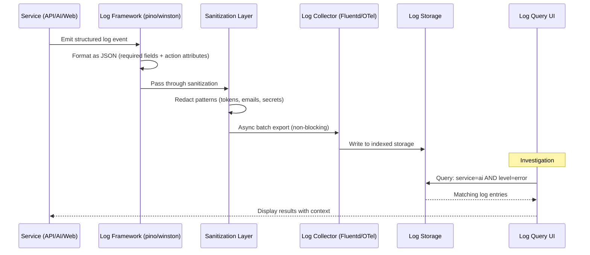

# Logging

> **Purpose:** Define logging standards for Vaeloom
> **Status:** 🆕 New

## Log Pipeline

```mermaid
graph LR
    classDef produce fill:#e3f2fd,stroke:#1565c0,color:#000,stroke-width:1.5px
    classDef format fill:#e8f5e9,stroke:#2e7d32,color:#000,stroke-width:1.5px
    classDef levels fill:#fff3e0,stroke:#e65100,color:#000,stroke-width:1.5px
    classDef rules fill:#f3e5f5,stroke:#6a1b9a,color:#000,stroke-width:1.5px
    classDef store fill:#ffebee,stroke:#c62828,color:#000,stroke-width:1px

    subgraph Producers["📤 Log Producers"]
        direction TB
        P1["apps/web<br/>Next.js → stdout"]
        P2["apps/api<br/>NestJS → stdout"]
        P3["apps/ai-service<br/>FastAPI → stdout"]
        P4["infra/worker<br/>BullMQ → stdout"]
    end

    subgraph Format["📋 Structured JSON Format"]
        F1["{<br/>  level, timestamp, service,<br/>  action, duration_ms,<br/>  trace_id, ...<br/>}"]
    end

    subgraph Levels["📊 Log Levels"]
        L1["DEBUG: Development only"]
        L2["INFO: Normal operations"]
        L3["WARN: Potential issues"]
        L4["ERROR: Operation failures"]
        L5["FATAL: Service failures"]
    end

    subgraph Rules["✅ Log / ❌ Don't Log"]
        R1["✅ Request ID, trace ID"]
        R2["✅ Agent actions, decisions"]
        R3["✅ API status, errors"]
        R4["❌ Passwords, secrets"]
        R5["❌ Personal content"]
        R6["❌ OAuth tokens, API keys"]
    end

    subgraph Aggregation["🏪 Log Aggregation"]
        A1["Dev: Console / tail -f"]
        A2["Staging: Hosted aggregator"]
        A3["Prod: Hosted + long-term archive"]
        A4["Query: grok / log search"<br/>"service=ai AND level=error""]
    end

    P1 & P2 & P3 & P4 --> F1
    F1 --> L1 & L2 & L3 & L4 & L5
    L1 & L2 & L3 & L4 & L5 --> R1 & R2 & R3 & R4 & R5 & R6
    R1 & R2 & R3 & R4 & R5 & R6 --> A1 & A2 & A3 & A4

    class P1,P2,P3,P4 produce
    class F1 format
    class L1,L2,L3,L4,L5 levels
    class R1,R2,R3,R4,R5,R6 rules
    class A1,A2,A3,A4 store

```

> **Diagram:** All services emit structured JSON logs to stdout. The pipeline flows through **format** (standard JSON schema), **log levels** (debug → fatal), **rules** (what to include vs exclude), and **aggregation** (environment-specific: console for dev, hosted aggregator for staging/prod with long-term archive). Logs are queryable via `grok` for debugging and incident response.

---

## Log Format

All services emit structured JSON logs:

```json
{
  "level": "info",
  "timestamp": "2026-07-12T10:30:00.000Z",
  "service": "ai-service",
  "agent": "memory-agent",
  "action": "extract_entities",
  "document_id": "doc_abc123",
  "duration_ms": 342,
  "entities_found": 12,
  "trace_id": "trace_xyz789"
}
```

## Log Levels

| Level | When | Example |
|-------|------|---------|
| `debug` | Development only | Function entry/exit |
| `info` | Normal operation | Request completed, agent action |
| `warn` | Potential issue | Slow query, degraded connector |
| `error` | Operation failure | Agent error, API 500 |
| `fatal` | Service failure | Cannot start, DB connection lost |

## What to Log

| ✅ Log | ❌ Don't Log |
|--------|--------------|
| Request ID and trace ID | Passwords or secrets |
| Agent actions and decisions | Personal document content |
| API endpoint and status code | OAuth tokens |
| Error messages and stack traces | Full request bodies |
| Performance metrics | API keys |

## Log Aggregation

| Environment | Technology |
|-------------|------------|
| Development | Console / `tail -f` |
| Staging | Hosted log aggregator |
| Production | Hosted log aggregator + long-term archive |

## Log Query Examples

```bash
# Find all errors from a specific agent
grok "service=ai-service AND agent=memory-agent AND level=error"

# Trace a specific request
grok "trace_id=trace_xyz789"

# Find slow operations
grok "duration_ms > 5000"
```

## Common Mistakes

| Mistake | Consequence |
|---------|-------------|
| Logging at inconsistent levels across services | If the API logs errors at `error` but the AI service logs the same severity as `warn`, aggregating and filtering logs becomes unreliable — define and enforce a cross-service logging level standard with clear examples of when to use each level |
| Logging sensitive data in production | A `console.log(request.body)` that captures a user's OAuth token or document content creates a compliance violation — implement automated log scrubbing that redacts known patterns (tokens, emails, API keys) before writing to the log store |
| No structured log format across services | If the API logs JSON but the AI service logs plain text, you can't query across services — enforce a single structured JSON schema across all services with required fields (level, timestamp, service, trace_id, message) |

## Best Practices

| Practice | Why |
|----------|-----|
| Define a consistent JSON log schema enforced across all services | A shared schema with required fields (level, timestamp, service, trace_id, message) and optional fields (action, duration_ms, agent) enables cross-service log queries and correlation |
| Automate log scrubbing for sensitive data patterns | Manual redaction is unreliable — use log shippers or collectors that apply regex patterns to mask emails, tokens, API keys, and PII before logs reach the aggregation system |
| Use structured JSON logs, not plain text | JSON logs are machine-parseable and queryable — plain text logs require human reading and can't be automatically correlated across services. Enforce JSON format at the logging framework level |

## Security

| Concern | Mitigation |
|---------|------------|
| Log aggregation stores becoming a data breach target | A log store containing months of structured data is a high-value target for attackers — encrypt logs at rest, apply retention limits per data sensitivity, and audit access to the log aggregation system |
| Log injection attacks exploiting unescaped input | An attacker who injects a crafted string into a log field can manipulate log parsers — escape or sanitize all user-supplied values before including them in log messages |
| Long log retention creating compliance liability | Storing debug-level logs for 2 years creates unnecessary exposure — apply tiered retention: error logs 1 year, info logs 30 days, debug logs 7 days. Implement deletion policies that meet compliance without over-retaining |

## Performance

| Concern | Mitigation |
|---------|------------|
| Synchronous logging blocking the request path | Writing logs synchronously on every request adds latency — use async logging libraries that buffer log entries and flush them in the background without blocking the application thread |
| Log volume growing linearly with traffic | At 1000 req/s with 2KB structured logs per request, log ingestion grows 170GB/day — implement adaptive sampling that reduces log verbosity during high traffic and increases during low traffic to maintain a manageable daily volume |
| Log aggregation queries becoming slow at scale | Querying 90 days of logs at per-second granularity across multiple services can take 30+ seconds — use log aggregation indexes on common query fields (service, level, trace_id) and consider daily index rollover for faster searches |

## Security Considerations

| Concern | Mitigation |
|---------|------------|
| Log aggregation stores becoming a data breach target | A log store containing months of structured data is a high-value target for attackers — encrypt logs at rest, apply retention limits per data sensitivity, and audit access to the log aggregation system |
| Log injection attacks exploiting unescaped input | An attacker who injects a crafted string into a log field can manipulate log parsers — escape or sanitize all user-supplied values before including them in log messages |
| Long log retention creating compliance liability | Storing debug-level logs for 2 years creates unnecessary exposure — apply tiered retention: error logs 1 year, info logs 30 days, debug logs 7 days. Implement deletion policies that meet compliance without over-retaining |

## Performance Considerations

| Concern | Approach |
|---------|----------|
| Synchronous logging blocking the request path | Writing logs synchronously on every request adds latency — use async logging libraries that buffer log entries and flush them in the background without blocking the application thread |
| Log volume growing linearly with traffic | At 1000 req/s with 2KB structured logs per request, log ingestion grows 170GB/day — implement adaptive sampling that reduces log verbosity during high traffic and increases during low traffic to maintain a manageable daily volume |
| Log aggregation queries becoming slow at scale | Querying 90 days of logs at per-second granularity across multiple services can take 30+ seconds — use log aggregation indexes on common query fields (service, level, trace_id) and consider daily index rollover for faster searches |

## Components

| Component | Responsibility | Technology | Scale Strategy |
|-----------|---------------|------------|----------------|
| Log Producer | Emit structured JSON logs | Service-side logging framework (pino/winston) | Async logging, non-blocking |
| Log Collector | Aggregate logs from all sources | OpenTelemetry Collector / Fluentd | Horizontally scalable collectors |
| Log Storage | Store and index log data | Managed log service (Grafana Cloud/Datadog) | Tiered retention (hot/warm/cold) |
| Log Query | Search and analyze logs | Log explorer / Grafana Explore | Indexed search with field filters |

---

## Scalability

| Dimension | Current Limit | 10x Strategy | 100x Strategy |
|-----------|--------------|--------------|---------------|
| Log volume | 10 GB/day | 100 GB/day: adaptive sampling | 1 TB/day: structured extraction + archive |
| Log retention | 30 days | 90 days: tiered storage | 1 year: automated archival |
| Log sources | 4 services | 15 services: per-service log streams | 50 services: auto-discovered log sources |
| Query response time | < 5s for 7d range | < 2s: indexed search | < 1s: pre-aggregated log metrics |

---

## Error Handling

| Scenario | Detection | Mitigation | Recovery |
|----------|-----------|------------|----------|
| Log producer fails to emit | Missing logs in aggregator | Check logging config, restart service | Fix log framework configuration |
| Log collector overwhelmed | Dropped log entries | Scale collector horizontally | Add backpressure + rate limiting |
| Log storage full | Ingestion rejects new logs | Extend retention or add storage | Archive old logs, free space |
| Log injection attack detected | Anomalous log patterns | Sanitize all user input in log messages | Update log sanitization rules |

---

## Monitoring

| Metric | Alert Threshold | Severity | Dashboard |
|--------|----------------|----------|-----------|
| Log ingestion rate | > 80% of quota | Warning | Log Volume |
| Log error rate (% of total) | > 5% | Warning | Log Quality |
| Log collection latency | > 60 seconds | Warning | Log Pipeline Health |
| Query response time (p95) | > 10 seconds | Info | Log Search Performance |

---

## Deployment

| Environment | Method | Trigger | Verification |
|-------------|--------|---------|--------------|
| Log format change | Code update + deploy | New fields needed | Sample log entry has new fields |
| Log retention policy | Config change | Quarterly review or cost need | Old logs archived correctly |
| Log collector scaling | Horizontal pod autoscaling | Log volume > 80% capacity | Collector CPU < 70% after scale |
| Log sanitization rules | Config file update | New sensitive data pattern detected | Test pattern is redacted correctly |

---

## Configuration

| Variable | Purpose | Default | Required |
|----------|---------|---------|----------|
| `LOG_LEVEL` | Minimum log level to emit | `info` | No |
| `LOG_FORMAT` | Log output format | `json` | No |
| `LOG_SAMPLE_RATE` | Sampling rate for debug logs | `1.0` | No |
| `LOG_RETENTION_DAYS` | Days to retain logs | `30` | No |
| `LOG_AGGREGATOR_ENDPOINT` | Log collector endpoint | — | Yes (prod) |

---

## Limitations

| Limitation | Impact | Workaround | Future Resolution |
|------------|--------|------------|-------------------|
| Structured JSON logs are larger than plaintext | Higher storage cost | Compress logs, reduce retention for debug | Adaptive log level by service |
| No centralized log viewer in MVP | Must `tail -f` or use CLI | Hosted log aggregator in staging/prod | Unified observability platform |
| Log injection attacks possible | Malicious input could manipulate log parsers | Escape user input in log messages | Automated log sanitization pipeline |
| Async logging may drop entries under high load | Some logs lost during traffic spikes | Increase buffer size, add backpressure | Reliable log delivery with retry queue |

---

## Overview

Vaeloom's logging system provides a unified, structured logging pipeline across all services — web (Next.js), API (NestJS), AI service (FastAPI), and background workers (BullMQ). Every service emits structured JSON logs to stdout following a shared schema that includes level, timestamp, service name, trace ID, and action-specific attributes.

This document defines the log format, severity levels, data governance rules (what to log and what never to log), aggregation strategy per environment, and query patterns for debugging and incident response. The primary audience is developers instrumenting services and engineers operating the log pipeline.

Within the Vaeloom observability stack, logging provides the detailed, queryable record of individual events that complements monitoring (aggregate metrics) and tracing (request-level spans). A consistent structured log format across all services enables cross-service correlation and rapid root cause analysis during incidents.

Enterprise-grade logging requires a balance between completeness and cost. Structured JSON enables machine parsing and automated analysis, but log volume grows linearly with traffic. Adaptive sampling, tiered retention (debug: 7 days, info: 30 days, error: 1 year), and automated sanitization of sensitive data ensure the logging system remains useful, compliant, and cost-effective.

---

## Goals

- Establish a shared structured JSON log schema enforced across all Vaeloom services
- Define clear log level semantics (debug, info, warn, error, fatal) with consistent usage guidance
- Implement automated log sanitization to prevent PII, tokens, and secrets from reaching log storage
- Achieve sub-10ms async log emission without blocking application request paths
- Maintain 30-day retention for info logs, 7-day for debug, and 1-year for error logs with automated lifecycle management

---

## Scope

### In Scope

- Structured JSON log format with required fields (level, timestamp, service, trace_id, message)
- Log level definitions and usage conventions per service
- Data governance: explicit lists of what to log (request ID, agent actions) and what never to log (passwords, secrets, PII)
- Log aggregation per environment: console (dev), hosted aggregator (staging/prod), long-term archive (prod)
- Log query patterns and tools (grok, log explorer)
- Log retention and lifecycle policies

### Out of Scope

- Log-based alerting (covered in [Alerting.md](./Alerting.md))
- Distributed tracing implementation (covered in [Tracing.md](./Tracing.md))
- Log aggregation infrastructure scaling (covered in [Monitoring.md](./Monitoring.md))
- Compliance-specific log retention requirements (covered in [`../Security/Compliance.md`](../Security/Compliance.md))

---

## Sequence Diagrams



> **Diagram:** Log pipeline — service emits structured JSON, sanitization layer redacts sensitive patterns, async batch export to collector, indexed storage for fast querying.

---

## Examples

```yaml
# Vaeloom structured logging configuration
logging:
  level: info
  format: json
  outputs:
    - type: stdout
    - type: file
      path: /var/log/Vaeloom/app.log
      max_size: 100MB
      max_files: 7
```

```bash
# Tail Vaeloom logs with structured filtering
Vaeloom logs tail --service api-gateway --level error --since 10m

# Export logs for auditing
Vaeloom logs export --from 2025-01-01 --to 2025-01-31 --format json > audit.json
```

```typescript
// Programmatic log access via SDK
import { Logs } from '@vaeloom/sdk';

const logs = await Logs.query({
  service: 'worker',
  level: 'warn',
  startTime: new Date(Date.now() - 3600000),
});

for (const entry of logs) {
  console.log(`[${entry.timestamp}] ${entry.message}`);
}
```

## Future Improvements

| Improvement | Priority | Complexity | Timeline |
|-------------|----------|------------|----------|
| Adaptive log level by service and traffic | High | Medium | Q1 2027 |
| Automated log sanitization pipeline | High | Medium | Q4 2026 |
| Centralized log viewer for all environments | Medium | Low | Q4 2026 |
| Log-based alerting (log → metric → alert) | Medium | Medium | Q1 2027 |
| AI-powered log pattern detection | Low | High | Q2 2027 |

## Related Documents

- [Tracing.md](./Tracing.md)
- [Monitoring.md](./Monitoring.md)
- [`Operations/Observability.md`](../Operations/Observability.md)
