# Monitoring

> **Purpose:** Define the monitoring strategy for Vaeloom
> **Status:** 🆕 New

## Monitoring Stack



```mermaid
graph TD
    classDef sources fill:#e3f2fd,stroke:#1565c0,color:#000,stroke-width:1.5px
    classDef otel fill:#e8f5e9,stroke:#2e7d32,color:#000,stroke-width:1.5px
    classDef viz fill:#fff3e0,stroke:#e65100,color:#000,stroke-width:1.5px
    classDef alert fill:#f3e5f5,stroke:#6a1b9a,color:#000,stroke-width:1.5px
    classDef metric fill:#ffebee,stroke:#c62828,color:#000,stroke-width:1px

    subgraph Sources["📡 Data Sources"]
        direction TB
        S1["apps/web<br/>Next.js metrics"]
        S2["apps/api<br/>NestJS metrics"]
        S3["apps/ai-service<br/>FastAPI metrics"]
        S4["PostgreSQL<br/>pg_stat statements"]
        S5["Redis<br/>Queue + cache metrics"]
    end

    subgraph Otel["🔭 OpenTelemetry Collector"]
        direction TB
        O1["Traces<br/>Distributed tracing"]
        O2["Metrics<br/>Latency, errors, throughput"]
        O3["Logs<br/>Structured JSON"]
    end

    subgraph Visualization["📊 APM + Grafana"]
        V1["Dashboards<br/>API latency, queue depth,\nerror rates, agent health"]
        V2["Health Endpoints<br/>GET /health<br/>GET /health/ready<br/>GET /health/live"]
    end

    subgraph Alerts["🔔 Alerting"]
        A1["PagerDuty / OpsGenie<br/>P1: < 15 min<br/>P2: < 30 min"]
        A2["Slack #alerts<br/>P3: < 2 hours<br/>P4: next business day"]
    end

    subgraph KeyMetrics["📈 Key Metrics & Thresholds"]
        K1["api_request_latency p99<br/>> 2s for 5 min → P2"]
        K2["ai_request_latency p99<br/>> 10s for 5 min → P2"]
        K3["queue_depth<br/>> 1000 for 10 min → P2"]
        K4["agent_error_rate<br/>> 5% for 5 min → P2"]
        K5["db_connections<br/>> 80% for 5 min → P2"]
    end

    S1 & S2 & S3 & S4 & S5 --> O1 & O2 & O3
    O1 & O2 & O3 --> V1
    V1 --> A1 & A2
    V1 -.-> K1 & K2 & K3 & K4 & K5
    K1 & K2 & K3 & K4 & K5 -.->|trigger| A1 & A2

    class S1,S2,S3,S4,S5 sources
    class O1,O2,O3 otel
    class V1,V2 viz
    class A1,A2 alert
    class K1,K2,K3,K4,K5 metric

```

> **Diagram:** Monitoring data flows from 5 sources through OpenTelemetry into APM dashboards and alerting. **Key metrics** track API latency, AI latency, queue depth, error rates, and connection pool usage. Alerts route to PagerDuty (P1-P2) and Slack (P3-P4) based on severity. Health check endpoints (`/health`, `/ready`, `/live`) enable Kubernetes probe integration.

---

## Monitoring Stack

| Component | MVP Technology | Enterprise |
|-----------|---------------|------------|
| Metrics | OpenTelemetry + hosted APM | Same, expanded retention |
| Logging | Structured JSON → log store | Same, longer retention |
| Tracing | OpenTelemetry distributed traces | Same |
| Alerting | PagerDuty / OpsGenie | Same |
| Dashboards | Grafana | Same |

## Key Metrics

| Metric | What It Measures | Alert Threshold |
|--------|-----------------|----------------|
| `api_request_latency` | API response time | > 2s p99 for 5 min |
| `ai_request_latency` | Agent response time | > 10s p99 for 5 min |
| `queue_depth` | BullMQ queue size | > 1000 for 10 min |
| `agent_error_rate` | Agent failure rate | > 5% for 5 min |
| `memory_write_rate` | Memory writes per second | Drop to 0 for 5 min |
| `db_connections` | Postgres connection pool | > 80% for 5 min |

## Health Check Endpoints

| Endpoint | Returns | Purpose |
|----------|---------|---------|
| `GET /health` | `{ status, version, uptime }` | Overall health |
| `GET /health/ready` | `{ status, deps: { db, redis, ai } }` | Readiness probe |
| `GET /health/live` | `{ status }` | Liveness probe |

## Common Mistakes

| Mistake | Consequence |
|---------|-------------|
| Dashboards that show everything and explain nothing | A dashboard with 30 graphs and no labels, thresholds, or context is impossible to interpret under pressure — organize dashboards by question ("is the system healthy?") with the fewest metrics that answer it, each with a clear threshold line |
| Monitoring tool sprawl — using different tools for metrics, logs, and traces | A team that uses Grafana for metrics, Kibana for logs, and Jaeger for traces has to context-switch between tools during an incident — consolidate on a single observability platform (Datadog, Grafana Cloud, SigNoz) that handles all three signals |
| Health check endpoints that don't actually check dependencies | A `/health` endpoint that returns `200 OK` without connecting to the database gives a false sense of health — health checks must validate downstream dependencies (database, Redis, external APIs) and report actual connectivity status |

## Best Practices

| Practice | Why |
|----------|-----|
| Organize dashboards by question, not by data source | A dashboard titled "Is the API healthy?" with request rate, error rate, latency (p50/p95/p99), and saturation is actionable — a dashboard titled "Metrics" with 30 random graphs requires interpretation |
| Consolidate observability tools into a single platform | Jumping between Grafana (metrics), Kibana (logs), and Jaeger (traces) during an incident wastes time — a unified platform (Datadog, Grafana Cloud) lets you pivot from a high-latency dashboard to the specific trace and logs in one click |
| Health checks must validate actual dependencies | A health endpoint that returns `200` without checking the database connection or Redis availability is lying — implement multi-probe health checks (`/health` for deep check, `/ready` for readiness, `/live` for liveness) that each validate the appropriate dependencies |

## Security

| Concern | Mitigation |
|---------|------------|
| Monitoring dashboards exposed without authentication | A publicly accessible Grafana dashboard reveals service names, instance counts, error rates, and request patterns — protect all monitoring tools behind authentication and consider read-only views for external stakeholders |
| Health check endpoints revealing too much system information | A `/health` endpoint that returns database connection strings, Redis hostnames, or internal IPs in its response is an information leak — health check responses should include only status and version metadata |
| Monitoring data retention creating an attacker's timeline | Detailed monitoring data that captures every request can be used by an attacker to learn system behavior patterns — aggregate raw monitoring data after 30 days and apply access controls to detailed query logs |

## Performance

| Concern | Mitigation |
|---------|------------|
| Monitoring infrastructure competing with production for resources | Running monitoring agents alongside with production services on the same host can cause resource contention — run monitoring infrastructure (OpenTelemetry collectors, log shippers) as sidecars with resource limits, or use dedicated monitoring hosts for large deployments |
| High-cardinality metrics overwhelming the monitoring system | A metric like `http_request_duration` with labels for `user_id, document_id, agent_name` creates millions of time series — keep metric cardinality to service-level dimensions (service, endpoint, status_code) and use logs for per-request detail |
| Health check polling overhead at scale | Every instance of every service being probed every 10 seconds by external monitoring generates significant request load — for a cluster of 20 instances, that's 120 health check requests/minute. Increase polling interval to 30 seconds for internal probes and 60 seconds for external |

## Security Considerations

| Concern | Mitigation |
|---------|------------|
| Monitoring dashboards exposed without authentication | A publicly accessible Grafana dashboard reveals service names, instance counts, error rates, and request patterns — protect all monitoring tools behind authentication and consider read-only views for external stakeholders |
| Health check endpoints revealing too much system information | A `/health` endpoint that returns database connection strings, Redis hostnames, or internal IPs in its response is an information leak — health check responses should include only status and version metadata |
| Monitoring data retention creating an attacker's timeline | Detailed monitoring data that captures every request can be used by an attacker to learn system behavior patterns — aggregate raw monitoring data after 30 days and apply access controls to detailed query logs |

## Performance Considerations

| Concern | Approach |
|---------|----------|
| Monitoring infrastructure competing with production for resources | Running monitoring agents alongside with production services on the same host can cause resource contention — run monitoring infrastructure (OpenTelemetry collectors, log shippers) as sidecars with resource limits, or use dedicated monitoring hosts for large deployments |
| High-cardinality metrics overwhelming the monitoring system | A metric like `http_request_duration` with labels for `user_id, document_id, agent_name` creates millions of time series — keep metric cardinality to service-level dimensions (service, endpoint, status_code) and use logs for per-request detail |
| Health check polling overhead at scale | Every instance of every service being probed every 10 seconds by external monitoring generates significant request load — for a cluster of 20 instances, that's 120 health check requests/minute. Increase polling interval to 30 seconds for internal probes and 60 seconds for external |

## Components

| Component | Responsibility | Technology | Scale Strategy |
|-----------|---------------|------------|----------------|
| Metrics Producer | Emit application metrics | OpenTelemetry SDK (per service) | Async export, non-blocking |
| Metrics Collector | Aggregate and forward metrics | OpenTelemetry Collector | Horizontally scalable collectors |
| Metrics Store | Store and query time-series data | Prometheus / Grafana Mimir | Retention tiers + downsampling |
| Visualization | Dashboards and charting | Grafana | Per-service dashboards + global view |
| Health Endpoint | Service health check | HTTP `/health`, `/ready`, `/live` | Lightweight, no dependencies in `/live` |

---

## Scalability

| Dimension | Current Limit | 10x Strategy | 100x Strategy |
|-----------|--------------|--------------|---------------|
| Metrics throughput | 10K series/min | 100K series: dimensional reduction | 1M series: automatic aggregation |
| Dashboard count | 5 | 20: per-service + business dashboards | 100: auto-generated from service metadata |
| Health check probes | 60/min per service | 12/min: reduced probe frequency | 4/min: aggregated health from service mesh |
| Alert evaluation | 15 rules/min | 150 rules: rule grouping | 1500 rules: auto-generated from SLOs |

---

## Error Handling

| Scenario | Detection | Mitigation | Recovery |
|----------|-----------|------------|----------|
| Metrics collection stops | Flatline on dashboard | Restart OpenTelemetry collector | Check collector config, re-deploy |
| Metrics store unreachable | Dashboard shows no data | Failover to secondary metrics store | Restore primary from backup |
| Health check false positive | Service OK but health returns 500 | Add retries, check dependency health | Fix health check logic |
| Dashboard query timeout | Dashboard fails to load | Optimize query, pre-aggregate data | Add query timeout with fallback |

---

## Monitoring

| Metric | Alert Threshold | Severity | Dashboard |
|--------|----------------|----------|-----------|
| Metrics data freshness | No data for > 5 min | Critical | Monitoring Health |
| Dashboard load time | > 10 seconds | Warning | Dashboard Performance |
| Health check pass rate | < 99% | Critical | Service Health |
| Metric cardinality growth | > 20% per month | Info | Metrics Volume |

---

## Deployment

| Environment | Method | Trigger | Verification |
|-------------|--------|---------|--------------|
| New dashboard | Grafana import/dashboard-as-code | New service or metric | Dashboard renders data correctly |
| Alert rule | Terraform / config commit | New metric or SLO | Test alert fires correctly |
| Health endpoint change | Code + deploy | New service version | All probes return correct status |
| Metrics collector scaling | HPA / horizontal scaling | Metrics volume > threshold | Collector CPU < 70% after scale |

---

## Configuration

| Variable | Purpose | Default | Required |
|----------|---------|---------|----------|
| `OTEL_SERVICE_NAME` | Service name for metrics | — | Yes |
| `OTEL_EXPORTER_OTLP_ENDPOINT` | OpenTelemetry collector endpoint | `http://otel-collector:4318` | Yes (prod) |
| `METRICS_COLLECTION_INTERVAL` | How often to collect metrics | `15s` | No |
| `HEALTH_CHECK_PORT` | Health check endpoint port | Same as service port | No |
| `METRICS_RETENTION_DAYS` | Raw metrics retention | `90` | No |

---

## Limitations

| Limitation | Impact | Workaround | Future Resolution |
|------------|--------|------------|-------------------|
| MVP uses hosted APM (no self-hosted) | Limited customization | Use provider's dashboard templates | Self-hosted Prometheus + Grafana for enterprise |
| Health checks are minimal (status only) | Don't reveal root cause | Detailed `/health/ready` for debugging | Structured health check with dependency status |
| No SLO-based alerting in MVP | Error budget not connected to alerts | Manual SLO tracking | Auto-generated alerts from SLO burn rate |
| Metric cardinality can explode costs | High storage cost for high-cardinality | Limit labels to service-level dimensions | Automated cardinality management |

---

## Overview

Vaeloom's monitoring strategy provides real-time visibility into service health, performance, and reliability across all components — web (Next.js), API (NestJS), AI service (FastAPI), PostgreSQL, Redis, and queue infrastructure. Using OpenTelemetry as the unified data collection layer, metrics flow into hosted APM dashboards (Grafana) and trigger alerts based on predefined thresholds.

This document covers the monitoring stack, key metrics (latency, error rates, queue depth, connection pool usage), health check endpoints, dashboard organization principles, and alert routing. The primary audience is SRE and DevOps engineers responsible for maintaining Vaeloom service health.

Within the Vaeloom observability stack, monitoring provides the aggregate signal (dashboards and alerts) that complements logging (individual events) and tracing (request-level spans). Key metrics like `api_request_latency p99`, `queue_depth`, and `agent_error_rate` directly reflect user-facing health and trigger tiered alerts.

Enterprise-grade monitoring requires a single unified observability platform to eliminate context-switching between metrics, logs, and traces during incidents. Dashboards should be organized by question ("Is the system healthy?") rather than by data source, and every metric should have a threshold line showing the alert boundary.

---

## Goals

- Collect and visualize key Vaeloom metrics (API latency, AI latency, queue depth, error rates, DB connections)
- Implement multi-probe health checks (`/health`, `/health/ready`, `/health/live`) on every service
- Provide actionable dashboards organized by service health questions, not raw data sources
- Achieve sub-15-second metric collection latency from emission to dashboard visualization
- Consolidate metrics, logs, and traces in a single observability platform to reduce incident response time

---

## Scope

### In Scope

- Key Vaeloom metrics: API latency (p50/p95/p99), AI latency, queue depth, error rates, DB connection pool usage
- Health check endpoints: `/health` (overall), `/health/ready` (readiness probe), `/health/live` (liveness probe)
- OpenTelemetry-based metric collection from all services
- Grafana dashboards organized by service and health question
- Alert thresholds and severity classification for all key metrics
- Monitoring infrastructure: OpenTelemetry Collector, Prometheus/Grafana Mimir, Grafana

### Out of Scope

- Log aggregation and log-based alerting (covered in [Logging.md](./Logging.md))
- Distributed tracing implementation (covered in [Tracing.md](./Tracing.md))
- Alert routing and notification channels (covered in [Alerting.md](./Alerting.md))
- SLO-based burn rate alerting (planned for future)
- Infrastructure-level monitoring (CPU/memory/disk — managed by cloud provider)

---

## Examples

### Example 1: Instrumenting a Service with OpenTelemetry Metrics

```typescript
import { Counter, Histogram } from '@opentelemetry/api';

// Define metrics
const requestCounter = meter.createCounter('api_requests_total', {
  description: 'Total API requests',
});

const requestLatency = meter.createHistogram('api_request_duration_seconds', {
  description: 'API request duration',
  unit: 'seconds',
});

// Record metrics in middleware
app.use((req, res, next) => {
  const start = Date.now();
  res.on('finish', () => {
    const duration = (Date.now() - start) / 1000;
    requestCounter.add(1, { method: req.method, path: req.route?.path, status: res.statusCode });
    requestLatency.record(duration, { method: req.method, path: req.route?.path });
  });
  next();
});
```

### Example 2: Testing a Health Endpoint

```bash
# Test health endpoints
curl -s https://api.Vaeloom.dev/health | jq .
# Expected: { "status": "ok", "version": "1.2.3", "uptime": 3600 }

curl -s https://api.Vaeloom.dev/health/ready | jq .
# Expected: { "status": "ok", "deps": { "db": "ok", "redis": "ok", "ai": "ok" } }

curl -s https://api.Vaeloom.dev/health/live | jq .
# Expected: { "status": "ok" }
```

---

## Sequence Diagrams

```mermaid
sequenceDiagram
    participant SVC as Application Service
    participant OTel as OpenTelemetry SDK
    participant COL as OTel Collector
    participant PROM as Prometheus/Mimir
    participant GRA as Grafana Dashboard
    participant ALT as Alertmanager

    SVC->>OTel: Record metric (latency, errors, throughput)
    OTel->>COL: Export OTLP (async, batch)
    COL->>PROM: Store time-series data
    PROM-->>GRA: Query metrics for dashboard
    GRA-->>SVC: Visualize real-time health

    PROM->>ALT: Evaluate alert rules
    ALT->>ALT: Fire alert if threshold breached
    ALT-->>SVC: Send to PagerDuty / Slack
```

> **Diagram:** Monitoring flow — service emits metrics via OpenTelemetry SDK, collector forwards to Prometheus/Mimir, Grafana queries for dashboards, and Alertmanager triggers notifications on threshold breaches.

---

## Future Improvements

| Improvement | Priority | Complexity | Timeline |
|-------------|----------|------------|----------|
| SLO-based burn rate alerting | High | Medium | Q4 2026 |
| Self-hosted Prometheus + Grafana for enterprise | High | High | Q2 2027 |
| Automated dashboard creation from service metadata | Medium | Medium | Q1 2027 |
| AI-powered anomaly detection on metrics | Medium | High | Q2 2027 |
| Unified health check framework with dependency status | Low | Medium | Q1 2027 |

## Related Documents

- [Logging.md](./Logging.md)
- [Alerting.md](./Alerting.md)
- [`/Docs/Engineering/Implementation/12-observability-tracing.md`](../../Docs/Engineering/Implementation/12-observability-tracing.md)
