# DevOps

> **Purpose:** Deployment, CI/CD, infrastructure, and observability
> **Status:** Active
> **Owner:** DevOps Team
> **Last Updated:** 2026-07-13

## Overview

The DevOps directory documents Vaeloom's deployment infrastructure, CI/CD pipelines, observability strategy, and infrastructure-as-code approach. It covers both the MVP deployment model using PaaS (Render/Fly.io) with Docker and the enterprise target architecture using managed Kubernetes.

Key documents cover deployment infrastructure, observability and tracing with OpenTelemetry, and the deployment architecture diagram showing how the web app, core API, AI service, Redis, PostgreSQL, and model providers interconnect.

The directory provides guidance on CI/CD security scanning, infrastructure-as-code best practices, container image optimization, and the migration path from MVP to enterprise infrastructure.

## What's here

| Document | Location | Status |
|----------|----------|--------|
| Deployment Infrastructure | [`/Docs/Engineering/Implementation/16-deployment-infrastructure.md`](../../Docs/Engineering/Implementation/16-deployment-infrastructure.md) | ✅ Good |
| Observability & Tracing | [`/Docs/Engineering/Implementation/12-observability-tracing.md`](../../Docs/Engineering/Implementation/12-observability-tracing.md) | ✅ Good |
| Deployment Architecture | [`/Docs/Vaeloom-Complete-Documentation.md#135-deployment-architecture`](../../Docs/Vaeloom-Complete-Documentation.md#135-deployment-architecture) | ✅ Good |

## Deployment overview

```mermaid
graph TD
    CDN["🌐 CDN / Load Balancer"]
    WEB["📱 Web App<br/>Next.js"]
    API["🔗 Core API<br/>NestJS"]
    AI["🤖 AI Service<br/>FastAPI"]
    REDIS["🗄️ Redis<br/>Queue + Cache"]
    DB["🗃️ PostgreSQL<br/>+ AGE Graph + pgvector"]
    MODEL["🧠 Model Provider<br/>Claude API"]

    CDN --> WEB
    WEB <--> API
    API <--> AI
    API <--> REDIS
    API <--> DB
    AI <--> REDIS
    AI <--> DB
    AI <--> MODEL

    classDef infra fill:#e3f2fd,stroke:#1565c0
    classDef app fill:#e8f5e9,stroke:#2e7d32
    classDef data fill:#fff3e0,stroke:#e65100
    classDef model fill:#f3e5f5,stroke:#7b1fa2

    class CDN infra
    class WEB,API,AI app
    class REDIS,DB data
    class MODEL model
```



## Key DevOps decisions

| Decision | MVP | Enterprise |
|----------|-----|------------|
| Deployment | PaaS (Render/Fly.io) with Docker | Managed Kubernetes |
| CI/CD | GitHub Actions | Same, environment promotion pipelines |
| Observability | OpenTelemetry + hosted APM | Same, expanded retention |
| Queue | Redis + BullMQ | Kafka |
| Cache | Redis | Same, dedicated cluster |

## Common Mistakes

| Mistake | Consequence |
|---------|-------------|
| CI/CD pipelines that don't include security scanning | Deploying code without vulnerability scanning (SAST, dependency check) means known CVEs reach production — integrate security scanning into every CI pipeline stage |
| Infrastructure changes made outside of Terraform | A developer who SSHes into a server and changes a configuration creates drift that Terraform can't detect — enforce that all infrastructure changes go through IaC with peer review |
| Monitoring dashboards without alert thresholds | A dashboard that shows "current CPU" but doesn't indicate what "bad" looks like is decoration — every metric should have a static threshold line showing the alert boundary |

## Best Practices

| Practice | Why |
|----------|-----|
| Include security scanning (SAST, dependency check, container scan) in every CI stage | Security vulnerabilities caught in CI cost $50 to fix; the same vulnerability in production costs $5K+ — shift security left by integrating scanning early |
| Treat infrastructure as code with mandatory peer review | An undocumented change to a load balancer or database configuration can cause a production incident — all IaC changes must go through pull request review, just like application code |
| Define alert thresholds alongside every dashboard metric | A metric without an alert threshold is just data — every dashboard graph should have overlaid threshold lines that answer "is this good or bad?" at a glance |

## Security

| Concern | Mitigation |
|---------|------------|
| CI/CD pipeline credentials with overly broad permissions | A CI token that can deploy to staging AND production AND modify DNS can be used to compromise any environment — scope CI credentials to the minimum environment and resource set needed |
| Container images with embedded secrets | A Docker image that contains an API key or database URL in a layer is accessible to anyone who can pull the image — use build-time secrets with multi-stage builds to keep secrets out of final images |
| Infrastructure state files exposing secrets | Terraform state files contain plaintext resource configurations, potentially including database passwords and API keys — store state files in encrypted backends and restrict access |

## Performance

| Concern | Mitigation |
|---------|------------|
| CI pipeline bottlenecks slowing developer velocity | A CI pipeline that takes 30 minutes for every commit blocks team productivity — parallelize test stages, cache dependencies, and use incremental builds for faster feedback |
| Docker image size impacting deployment speed | Unoptimized Docker images (1GB+) take 2-3 minutes to pull on cold starts — use multi-stage builds, Alpine base images, and slim production dependencies to keep images under 500MB |
| Monitoring infrastructure overhead at scale | Running a full observability stack (OpenTelemetry collector, APM, log store, tracing) alongside production services adds 10-20% compute overhead — right-size monitoring infrastructure and separate from production workloads |

## Security Considerations

| Concern | Mitigation |
|---------|------------|
| CI/CD pipeline credentials with overly broad permissions | A CI token that can deploy to staging AND production AND modify DNS can be used to compromise any environment — scope CI credentials to the minimum environment and resource set needed |
| Container images with embedded secrets | A Docker image that contains an API key or database URL in a layer is accessible to anyone who can pull the image — use build-time secrets with multi-stage builds to keep secrets out of final images |
| Infrastructure state files exposing secrets | Terraform state files contain plaintext resource configurations, potentially including database passwords and API keys — store state files in encrypted backends and restrict access |

## Performance Considerations

| Concern | Approach |
|---------|----------|
| CI pipeline bottlenecks slowing developer velocity | A CI pipeline that takes 30 minutes for every commit blocks team productivity — parallelize test stages, cache dependencies, and use incremental builds for faster feedback |
| Docker image size impacting deployment speed | Unoptimized Docker images (1GB+) take 2-3 minutes to pull on cold starts — use multi-stage builds, Alpine base images, and slim production dependencies to keep images under 500MB |
| Monitoring infrastructure overhead at scale | Running a full observability stack (OpenTelemetry collector, APM, log store, tracing) alongside production services adds 10-20% compute overhead — right-size monitoring infrastructure and separate from production workloads |

## Components

| Component | Responsibility | Technology | Scale Strategy |
|-----------|---------------|------------|----------------|
| CI/CD Pipeline | Automated build, test, deploy | GitHub Actions | Parallel jobs + matrix builds |
| Container Runtime | Application packaging and isolation | Docker | Multi-stage builds, distroless images |
| Infrastructure as Code | Cloud resource provisioning | Terraform | Remote state, modular configs |
| Orchestration | Container scheduling and scaling | Kubernetes (Enterprise) / Fly.io (MVP) | HPA + cluster auto-scaling |
| Observability | Metrics, logs, traces | OpenTelemetry + hosted APM | Forward/agent model, sampling |
| Container Registry | Image storage and distribution | Docker Hub / ECR | Geo-replicated, signed images |

---

## Scalability

| Dimension | Current Limit | 10x Strategy | 100x Strategy |
|-----------|--------------|--------------|---------------|
| CI pipeline concurrency | 5 parallel jobs | 20: matrix builds per service | 100: distributed build agents |
| Container build throughput | 50 images/day | 500: layer caching + incremental | 5000: remote build cache |
| Deployment frequency | 5 deploys/day | 50: per-service parallel deploys | 500: blue/green + canary |
| Infrastructure resource count | 50 resources | 500: modular Terraform | 5000: Terragrunt stacks |

---

## Error Handling

| Scenario | Detection | Mitigation | Recovery |
|----------|-----------|------------|----------|
| CI pipeline failure | Build returns non-zero | Notify team, block merge | Fix code, re-run pipeline |
| Container build failure | Docker build error | Check Dockerfile and dependencies | Roll back to last working image |
| Terraform apply failure | Plan differs from state | Manual intervention | Fix config, re-run apply |
| Deployment health check fails | New pods not ready | Rollback to previous version | Investigate deployment config |

---

## Monitoring

| Metric | Alert Threshold | Severity | Dashboard |
|--------|----------------|----------|-----------|
| Pipeline success rate | < 95% | Warning | CI/CD Health |
| Build duration (p95) | > 10 min | Warning | CI/CD Performance |
| Deployment success rate | < 99% | Critical | Deployment Health |
| Rollback frequency | > 1/week | Warning | Release Quality |

---

## Deployment

| Environment | Method | Trigger | Verification |
|-------------|--------|---------|--------------|
| Development | Auto-deploy on push | Commit to feature branch | Smoke tests pass |
| Staging | CI/CD on merge | PR merged to staging branch | Integration + E2E tests |
| Production | CI/CD + manual approval | Release tag + reviewer approval | Canary + health checks |
| Rollback | `kubectl rollout undo` or image rollback | Alert-driven or manual | Previous version verified healthy |

---

## Configuration

| Variable | Purpose | Default | Required |
|----------|---------|---------|----------|
| `CI_CACHE_IMAGE` | Build cache image tag | `latest` | No |
| `DEPLOY_TIMEOUT` | Max deploy wait time | `300` (s) | No |
| `HEALTH_CHECK_PATH` | Health check URL path | `/health` | No |
| `CONTAINER_REGISTRY` | Docker registry URL | `docker.io/Vaeloom` | Yes (prod) |
| `TERRAFORM_STATE_BUCKET` | Terraform state S3 bucket | — | Yes (prod) |

---

## Limitations

| Limitation | Impact | Workaround | Future Resolution |
|------------|--------|------------|-------------------|
| Kubernetes and Terraform are enterprise-only | MVP can't use K8s or Terraform | Fly.io/Render for MVP with Docker Compose | Managed K8s + Terraform Cloud for enterprise |
| No service mesh in MVP | Limited traffic management | Manual ingress + service config | Istio for enterprise |
| No distributed tracing backend in MVP | Can't view full traces | Hosted APM (Datadog/Grafana Cloud) | Self-hosted Tempo for enterprise |
| CI limited to GitHub-hosted runners | Potential throttling at high usage | Self-hosted runners for larger builds | Auto-scaling runner pool |

---

## Goals

- Establish a single source of truth for Vaeloom's deployment infrastructure, CI/CD pipelines, and observability strategy
- Provide clear migration paths from MVP (PaaS + Docker) to Enterprise (Kubernetes + Terraform) for each DevOps domain
- Ensure all infrastructure changes follow Infrastructure-as-Code principles with mandatory peer review
- Achieve sub-15-minute deployment pipeline time from commit to production across all environments
- Maintain environment parity between staging and production to eliminate drift-related deployment failures

---

## Scope

### In Scope
- CI/CD pipeline definitions and best practices (GitHub Actions)
- Container build, signing, and deployment standards (Docker, Cosign)
- Kubernetes cluster architecture and service deployment manifests
- Observability: metrics (OpenTelemetry), logs (structured JSON), traces (distributed tracing)
- Alerting rules and response workflows (P1–P4 severity tiers)
- Infrastructure-as-Code using Terraform for cloud resource provisioning
- SBOM generation and vulnerability scanning for supply chain security
- Configuration management: schema registry, env hierarchy, feature flags, secret management

### Out of Scope
- Application-level business logic and service architecture (covered in `Architecture/`)
- Application performance tuning and optimization (covered in `Engineering/`)
- User-facing feature deployment and release management (covered in `Engineering/`)
- Third-party service configuration not managed by Vaeloom infrastructure
- On-premise infrastructure management (cloud-native only)

---

## Examples

```bash
# Deploy the Vaeloom stack
cd ops/terraform
terraform init
terraform plan -var-file=prod.tfvars
terraform apply -var-file=prod.tfvars

# Check deployment status
Vaeloom deploy status --environment production
```

```yaml
# Kubernetes deployment snippet
apiVersion: apps/v1
kind: Deployment
metadata:
  name: Vaeloom-api
  labels:
    app: Vaeloom
    tier: backend
spec:
  replicas: 3
  selector:
    matchLabels:
      app: Vaeloom-api
  template:
    spec:
      containers:
        - name: api
          image: Vaeloom/api:latest
          ports:
            - containerPort: 8080
```

```bash
# Common DevOps commands
Vaeloom config validate                          # Validate config files
Vaeloom db migrate                               # Run database migrations
Vaeloom health check --service all               # Health check all services
docker compose -f ops/docker-compose.yml up -d    # Start local environment
```

## Future Improvements

| Improvement | Priority | Complexity | Timeline |
|-------------|----------|------------|----------|
| Self-hosted CI runners for build speed | High | Medium | Q4 2026 |
| GitHub Actions matrix builds per service | High | Low | Q4 2026 |
| Istio service mesh for enterprise | High | High | Q2 2027 |
| Self-hosted Grafana Tempo for traces | Medium | High | Q2 2027 |
| Canary deployments with automated rollback | Medium | Medium | Q1 2027 |

## Related categories

- [`Architecture/`](../Architecture/) — Architecture being deployed
- [`Engineering/`](../Engineering/) — Implementation of services
- [`Operations/`](../Operations/) — Runbooks for operating deployed systems

## Related Documents

- [Deployment Infrastructure](../Engineering/Implementation/16-deployment-infrastructure.md) — Deployment architecture
- [Observability & Tracing](../Engineering/Implementation/12-observability-tracing.md) — Observability strategy
- [Operations Overview](../Operations/README.md) — Production runbooks and incident response
