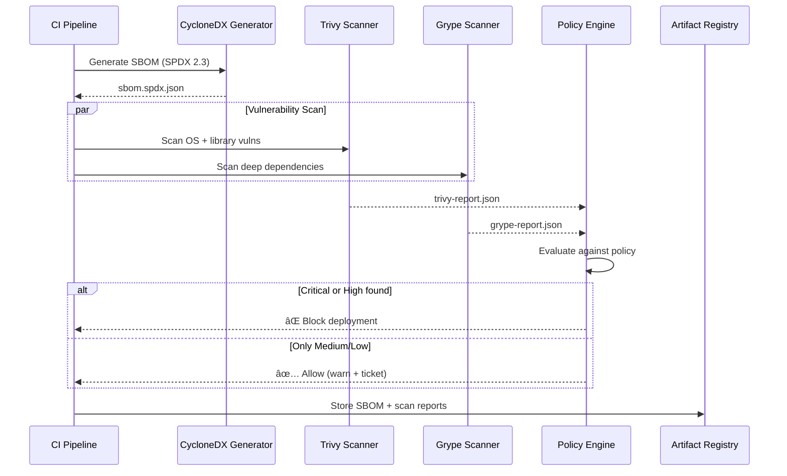

# SBOM Policy

> **Purpose:** Define the Software Bill of Materials generation, storage, vulnerability scanning, and remediation policy for Vaeloom
> **Status:** 🆕 New
> **Owner:** DevOps Team
> **Last Updated:** 2026-07-13

## Overview

Vaeloom generates a Software Bill of Materials (SBOM) in SPDX 2.3 format for every build using the CycloneDX plugin. SBOMs are stored in the artifact registry alongside build artifacts and scanned for vulnerabilities using Trivy and Grype. This policy ensures full supply chain transparency and enables rapid response to newly disclosed vulnerabilities.

The SBOM policy applies to all production deployments, container images, and third-party dependencies. SBOMs are retained for the life of the artifact plus 90 days.

## SBOM Pipeline

```mermaid
graph LR
    classDef source fill:#e3f2fd,stroke:#1565c0,color:#000,stroke-width:2px
    classDef sbom fill:#e8f5e9,stroke:#2e7d32,color:#000,stroke-width:1.5px
    classDef scan fill:#fff3e0,stroke:#e65100,color:#000,stroke-width:1.5px
    classDef policy fill:#f3e5f5,stroke:#6a1b9a,color:#000,stroke-width:1px
    classDef action fill:#ffebee,stroke:#c62828,color:#000,stroke-width:1px

    subgraph Source["Build Triggers"]
        PR["Pull Request"]
        MAIN["Merge to Main"]
        TAG["Release Tag"]
    end

    subgraph SBOM["SBOM Generation (SPDX 2.3)"]
        NPM["npm sbom<br/>CycloneDX plugin"]
        DOCKER["Container SBOM<br/>CycloneDX for Docker"]
        GO["Go module SBOM<br/>syft"]
        AGG["Aggregate SBOM<br/>Merged SPDX document"]
    end

    subgraph Scan["Vulnerability Scanning"]
        TRIVY["Trivy<br/>OS + library vulns"]
        GRYPE["Grype<br/>Deep dependency scan"]
        MERGE["Merged Report<br/>Severity + fix version"]
    end

    subgraph Policy["Policy Engine"]
        CRIT["Critical: Block deployment"]
        HIGH["High: Block deployment"]
        MED["Medium: Warn + 7d SLA"]
        LOW["Low: Informational"]
    end

    subgraph Storage["Artifact Storage"]
        REG["Artifact Registry<br/>SBOM stored alongside image"]
        INDEX["SBOM Index<br/>Searchable by CVE + package"]
        AUDIT["Audit Trail<br/>SBOM per deployment"]
    end

    PR & MAIN & TAG --> NPM & DOCKER & GO --> AGG
    AGG --> TRIVY & GRYPE --> MERGE
    MERGE --> CRIT & HIGH & MED & LOW
    CRIT --> BLOCK["❌ Block Deploy"]
    HIGH --> BLOCK
    MED --> WARN["⚠️ Warn + Ticket"]
    LOW --> INFO["ℹ️ Log"]
    AGG --> REG --> INDEX --> AUDIT

    class PR,MAIN,TAG source
    class NPM,DOCKER,GO,AGG sbom
    class TRIVY,GRYPE,MERGE scan
    class CRIT,HIGH,MED,LOW policy
    class BLOCK,WARN,INFO action
```



## SBOM Format

Every SBOM uses **SPDX 2.3** format with the following required fields:

```json
{
  "spdxVersion": "SPDX-2.3",
  "dataLicense": "CC0-1.0",
  "SPDXID": "SPDXRef-Vaeloom-BUILD-20260713-001",
  "name": "Vaeloom-api",
  "creationInfo": {
    "created": "2026-07-13T10:00:00Z",
    "creators": [
      "Tool: cyclonedx-npm-3.0.0",
      "Organization: Vaeloom"
    ]
  },
  "packages": [
    {
      "SPDXID": "SPDXRef-npm-express-4.18.2",
      "name": "express",
      "versionInfo": "4.18.2",
      "supplier": "NOASSERTION",
      "downloadLocation": "https://registry.npmjs.org/express/-/express-4.18.2.tgz",
      "licenseConcluded": "MIT",
      "externalRefs": [
        {
          "referenceCategory": "PACKAGE-MANAGER",
          "referenceType": "purl",
          "referenceLocator": "pkg:npm/express@4.18.2"
        }
      ]
    }
  ],
  "relationships": [
    {
      "spdxElementId": "SPDXRef-Vaeloom-BUILD-20260713-001",
      "relatedSpdxElement": "SPDXRef-npm-express-4.18.2",
      "relationshipType": "DEPENDS_ON"
    }
  ]
}
```

## Vulnerability Scanning Policy

| Severity | CVSS Range | Action | SLA | Exception Required |
|----------|-----------|--------|-----|-------------------|
| Critical | 9.0–10.0 | Block deployment | Patch within 24h | VP of Engineering |
| High | 7.0–8.9 | Block deployment | Patch within 7d | CTO |
| Medium | 4.0–6.9 | Warn, auto-create ticket | Patch within 30d | Security Team |
| Low | 0.1–3.9 | Log only | Next release | None |

## CI Integration

```yaml
# .github/workflows/sbom.yml (conceptual)
name: SBOM Generation
on:
  push:
    branches: [main, 'release/*']
  release:
    types: [published]

jobs:
  sbom:
    runs-on: ubuntu-latest
    steps:
      - uses: actions/checkout@v4
      - run: npm ci
      - name: Generate SBOM (CycloneDX)
        run: npx @cyclonedx/cyclonedx-npm --output-format JSON --output-file sbom.spdx.json
      - name: Scan with Trivy
        run: trivy sbom sbom.spdx.json --format json --output trivy-report.json
      - name: Scan with Grype
        run: grype sbom:sbom.spdx.json --output json --file grype-report.json
      - name: Upload SBOM to registry
        run: |
          aws s3 cp sbom.spdx.json s3://Vaeloom-sbom/built/${{ github.sha }}.spdx.json
          aws s3 cp trivy-report.json s3://Vaeloom-sbom/scans/${{ github.sha }}-trivy.json
      - name: Fail on critical/high
        run: npx vuln-policy-check --critical-block --high-block --report trivy-report.json
```

## Best Practices

| Practice | Rationale |
|----------|----------|
| Generate SBOM at build time | Post-build SBOM generation misses dependencies introduced during compilation (e.g., Docker layers, Go modules) |
| Store SBOM alongside artifact | Ensures SBOM is available for the entire artifact lifecycle; enables retrospective scanning when new CVEs emerge |
| Scan with multiple engines | Trivy catches OS-level vulnerabilities; Grype provides deeper library matching; cross-reference reduces false negatives |
| Version lock scanning policies | Policy changes require PR review; prevents silent rule changes that block or allow deployments unexpectedly |

## Common Mistakes

| Mistake | Consequence | Fix |
|---------|-------------|-----|
| SBOM generated outside CI | Manual SBOMs are inconsistent, outdated, or missing dependencies | Automate SBOM generation in CI for every build; never generate manually |
| Ignoring transitive dependencies | SBOM only lists direct dependencies; known vulnerabilities in nested packages go undetected | Use CycloneDX with `--flatten` flag to include transitive dependencies in SBOM |
| No SBOM retention policy | Old SBOMs pile up or are deleted prematurely; can't audit past builds | Retain SBOMs for artifact lifetime + 90 days; tag by build SHA and release version |
| Scanning without fix version context | Critical vuln flagged but no fix available — blocking deployment without mitigation plan | Check fix version availability before blocking; create security advisory with workaround |

## Security Considerations

| Concern | Mitigation |
|---------|-----------|
| SBOM tampering | SBOM files signed with Cosign (same key as container images); signature verified before vulnerability scanning |
| SBOM leakage of internal packages | Internal package names use non-descriptive prefixes; SBOMs stored in private artifact registry with IAM controls |
| Malicious dependency detection | All new dependencies scanned against OSS Index and NIST NVD; known malware packages blocked at install time |
| False positive suppression | Suppressed findings require documented rationale + expiration; reviewed in weekly security triage |
| Supply chain attacks on scanners | Trivy and Grype pinned to specific checksum-verified releases; automatic update disabled in CI |

## Performance Considerations

| Concern | Mitigation |
|---------|-----------|
| SBOM generation time | CycloneDX generation completes in <30s for typical Node.js project; parallelized across monorepo packages |
| Vulnerability scan duration | Trivy completes in <2min per SBOM; Grype scan parallelized; total CI addition ~5min |
| SBOM storage growth | Estimated ~50KB per SBOM; compressed storage with S3 lifecycle transitions to Glacier after 90 days |
| Policy engine overhead | Policy evaluation runs as a lightweight Node.js script; negligible CI time impact |
| CVE database freshness | Trivy and Grype update vulnerability DB on each run; configured to check for updates every 2 hours |

## Components

| Component | Responsibility | Technology | Scale Strategy |
|-----------|---------------|------------|----------------|
| SBOM Generator | Generate SPDX 2.3 SBOM per build | CycloneDX plugin (npm/Gradle) | Parallel across monorepo packages |
| Vulnerability Scanner | Scan SBOM against CVE databases | Trivy + Grype | Run in parallel, deduplicate results |
| SBOM Registry | Store and version SBOM artifacts | Artifact storage (S3/Blob) | Lifecycle policies for cost control |
| Policy Engine | Enforce dependency policies | Custom Node.js + Regal (OPA) | Pre-submit checks + CI gate |
| Notification Service | Alert on policy violations | Slack webhooks + PagerDuty | Webhook fan-out per severity |

---

## Scalability

| Dimension | Current Limit | 10x Strategy | 100x Strategy |
|-----------|--------------|--------------|---------------|
| SBOM generation volume | 50 builds/day | 500 builds: incremental SBOM diffing | 5000 builds: dependency graph caching |
| Vulnerability DB updates | Daily | Hourly: streaming CVE feed | Near-real-time: vendor API polling |
| SBOM storage | 50 KB per artifact | 500 KB: compressed + indexed | 5 MB: subset per production image only |
| Policy evaluation time | < 2 min per scan | < 30s: cached baseline scans | < 10s: incremental diff scanning only |

---

## Error Handling

| Scenario | Detection | Mitigation | Recovery |
|----------|-----------|------------|----------|
| SBOM generation fails | CI step returns non-zero | Retry with incremental mode | Check package.json changes since last success |
| Vulnerability scanner times out | Scan exceeds 10 min | Increase timeout, split scan by scope | Reduce scan scope to production deps only |
| False positive CVE | Valid dependency flagged | Add to allowlist in policy config | Submit correction to NVD database |
| SBOM publish fails after build | Missing SBOM in registry | Re-publish manually from CI artifacts | Add SBOM publish retry with backoff |

---

## Monitoring

| Metric | Alert Threshold | Severity | Dashboard |
|--------|----------------|----------|-----------|
| SBOM generation success rate | < 99% | Warning | SBOM Pipeline Health |
| Vulnerability scan duration (p95) | > 5 min | Info | SBOM Pipeline Health |
| Critical vulnerabilities per build | > 1 | Warning | SBOM Vulnerability Count |
| SBOM storage growth rate | > 20% per month | Info | SBOM Storage Usage |

---

## Deployment

| Environment | Method | Trigger | Verification |
|-------------|--------|---------|--------------|
| SBOM format update | Config file change | SPDX spec version update | Example SBOM validates against schema |
| Scanner DB update | CI schedule change | New CVE feed source | Scanner reports correct vulnerability count |
| Policy rule change | Pull request to policy repo | New dependency policy approved | Policy passes on known-good SBOM |
| Scanner tool addition | Tool config commit | New scanner selected | All scanners report same vulnerability set |

---

## Configuration

| Variable | Purpose | Default | Required |
|----------|---------|---------|----------|
| `SBOM_FORMAT` | SBOM output format | `spdx-2.3` | No |
| `SCAN_DEPTH` | Dependency tree depth | `production` | No |
| `POLICY_FILE` | Policy rules file path | `sbom-policy.yaml` | Yes |
| `SBOM_REGISTRY_URL` | SBOM artifact registry endpoint | — | Yes (prod) |
| `ALLOWED_LICENSES` | Comma-separated allowed licenses | `MIT,Apache-2.0,BSD-3-Clause` | No |
| `FAIL_ON_CRITICAL` | Fail build on critical CVE | `true` | No |

---

## Limitations

| Limitation | Impact | Workaround | Future Resolution |
|------------|--------|------------|-------------------|
| SPDX format limited to dependency metadata | Can't express build provenance (SLSA) | Annotate with build attestation in comments | Upgrade to SPDX 3.0 with build profile |
| Vulnerability scan is point-in-time | New CVEs discovered between scans | Schedule daily re-scans of latest SBOMs | Continuous monitoring with live feeds |
| No transitive dependency graph in SPDX | Only direct dependencies listed | Generate full tree in separate step | CycloneDX with dependency graph extension |
| Policy engine is a simple Node.js script | Limited to regex/basic rules | Manual review for complex edge cases | Migrate to OPA/Regal for full policy engine |

---

## Goals

- Generate SPDX 2.3 SBOM for every build using CycloneDX plugin at build time
- Scan every SBOM with Trivy and Grype for OS-level and library-level vulnerabilities
- Block deployments on critical and high-severity CVEs with documented exception process
- Store all SBOMs alongside build artifacts for the artifact lifetime plus 90 days
- Achieve sub-5-minute total CI time addition for SBOM generation and vulnerability scanning

---

## Scope

### In Scope
- SBOM generation in SPDX 2.3 format using CycloneDX plugin for npm, Docker, and Go dependencies
- Vulnerability scanning with Trivy (OS-level) and Grype (deep dependency matching)
- Policy enforcement: block deploy on critical/high CVEs, warn on medium with 7-day SLA
- SBOM storage alongside build artifacts in artifact registry with lifecycle policies
- CI integration for automated generation and scanning on every build

### Out of Scope
- Container image signing and attestation (covered in [Container-Signing.md](./Container-Signing.md))
- Runtime vulnerability scanning in production (covered in [Monitoring.md](./Monitoring.md))
- Dependency license compliance and policy (covered in [Compliance.md](../Security/Compliance.md))
- Build provenance and SLSA attestation (planned for future)
- Third-party SBOM ingestion from upstream dependencies

---

## Examples

### Example 1: Generating and Scanning SBOM Locally

```bash
# Generate SBOM using CycloneDX
npx @cyclonedx/cyclonedx-npm --output-format JSON --output-file sbom.spdx.json

# Scan with Trivy
trivy sbom sbom.spdx.json --format table

# Scan with Grype
grype sbom:sbom.spdx.json

# Check specific CVE
grype sbom:sbom.spdx.json --only-fixed --fail-on critical
```

### Example 2: Policy Check Script

```bash
# Custom policy enforcement (conceptual)
POLICY_VIOLATIONS=$(jq '.results[] | select(.severity == "CRITICAL" or .severity == "HIGH")' trivy-report.json)
if [ -n "$POLICY_VIOLATIONS" ]; then
  echo "Blocking deploy: critical or high vulnerabilities found"
  echo "$POLICY_VIOLATIONS"
  exit 1
fi
echo "All vulnerability checks passed"
```

---

## Sequence Diagrams



> **Diagram:** SBOM pipeline — CI generates SPDX SBOM, runs parallel scans (Trivy + Grype), policy engine blocks deploy on critical/high CVEs, and stores results in artifact registry.

---

## Future Improvements

| Improvement | Priority | Complexity | Timeline |
|-------------|----------|------------|----------|
| OPA/Regal policy engine integration | High | Medium | Q1 2027 |
| Continuous SBOM re-scanning | High | Medium | Q4 2026 |
| Build attestation + SLSA provenance | Medium | High | Q2 2027 |
| Dependency graph visualization in SBOM | Medium | Medium | Q1 2027 |
| Automated CVE false-positive reporting | Low | Low | Q4 2026 |

## Related Documents

- [CI/CD Pipeline.md](./CI-CD.md)
- [Container Signing.md](./Container-Signing.md)
- [Deployment.md](./Deployment.md)
- [Docker.md](./Docker.md)
- [Security Architecture.md](../Security/Security-Architecture.md)
