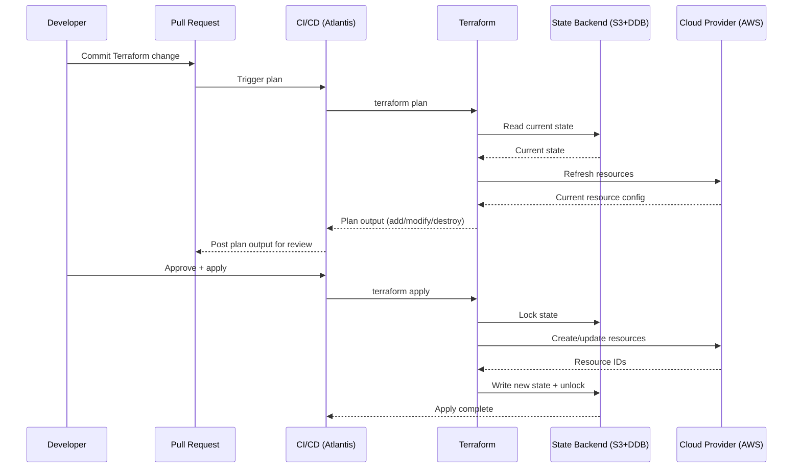

# Terraform

> **Purpose:** Define Infrastructure as Code strategy for Vaeloom (Enterprise)
> **Status:** 🆕 New — Enterprise-only. MVP uses PaaS + Docker Compose.

## Terraform Architecture

```mermaid
graph TD
    classDef trigger fill:#e3f2fd,stroke:#1565c0,color:#000,stroke-width:1.5px
    classDef provider fill:#e8f5e9,stroke:#2e7d32,color:#000,stroke-width:1.5px
    classDef module fill:#fff3e0,stroke:#e65100,color:#000,stroke-width:1.5px
    classDef env fill:#f3e5f5,stroke:#6a1b9a,color:#000,stroke-width:1.5px
    classDef workflow fill:#ffebee,stroke:#c62828,color:#000,stroke-width:1px

    subgraph Triggers["🚦 When to Use Terraform (Enterprise)"]
        direction TB
        T1["Multi-service deployment<br/>Manual mgmt error-prone"]
        T2["Cloud resource mgmt<br/>DBs, caches, networking"]
        T3["Compliance requirements<br/>Audit trail for changes"]
        T4["Team scaling<br/>Consistent environments"]
    end

    subgraph Providers["🔌 Provider Configuration"]
        PR1["aws<br/>hashicorp/aws ~> 5.0<br/>Region: var.aws_region"]
        PR2["kubernetes<br/>hashicorp/kubernetes ~> 2.0"]
    end

    subgraph Modules["📦 Resource Modules"]
        MOD1["database/<br/>Aurora PostgreSQL<br/>Serverless v2 (1-8 ACU)<br/>Backup retention: 30d"]
        MOD2["kubernetes/<br/>EKS cluster config<br/>Node groups + HPA"]
        MOD3["redis/<br/>ElastiCache cluster<br/>Multi-AZ"]
        MOD4["networking/<br/>VPC, subnets,<br/>security groups"]
    end

    subgraph Environments["ðŸ--️ Environment Structure"]
        ENV1["dev/<br/>Terraform config"]
        ENV2["staging/<br/>Terraform config"]
        ENV3["prod/<br/>main.tf + terraform.tfvars<br/>(gitignored -- secrets)"]
    end

    subgraph Workflow["🔄 Terraform Workflow"]
        W1["terraform plan -out=tfplan<br/>Preview changes"]
        W2["terraform apply tfplan<br/>Apply infrastructure"]
        W3["terraform plan -destroy<br/>Teardown (caution)"]
    end

    T1 & T2 & T3 & T4 --> PR1 & PR2
    PR1 & PR2 --> MOD1 & MOD2 & MOD3 & MOD4
    MOD1 & MOD2 & MOD3 & MOD4 --> ENV1 & ENV2 & ENV3
    ENV3 --> W1 --> W2
    W1 --> W3

    class T1,T2,T3,T4 trigger
    class PR1,PR2 provider
    class MOD1,MOD2,MOD3,MOD4 module
    class ENV1,ENV2,ENV3 env
    class W1,W2,W3 workflow

```



> **Diagram:** Terraform infrastructure as code follows a layered architecture — **Providers** (AWS + Kubernetes) → **Modules** (database, kubernetes, redis, networking) → **Environments** (dev/staging/prod). The **workflow** runs plan → apply for changes and plan → apply with destroy for teardown. Production terraform.tfvars is gitignored to keep secrets out of version control.

---

## When to Use Terraform

| Trigger | Reason |
|---------|--------|
| Multi-service deployment | Manual management becomes error-prone |
| Cloud resource management | Databases, caches, storage, networking |
| Compliance requirements | Audit trail for infrastructure changes |
| Team scaling | Multiple engineers need consistent environments |

## Provider Configuration

```hcl
terraform {
  required_version = ">= 1.5"
  required_providers {
    aws = {
      source  = "hashicorp/aws"
      version = "~> 5.0"
    }
    kubernetes = {
      source  = "hashicorp/kubernetes"
      version = "~> 2.0"
    }
  }
}
```

## Resource Modules

```hcl
resource "aws_rds_cluster" "Vaeloom" {
  cluster_identifier = "Vaeloom-${var.environment}"
  engine             = "aurora-postgresql"
  engine_version     = "16.1"
  
  serverlessv2_scaling_configuration {
    min_capacity = 1
    max_capacity = 8
  }
  backup_retention_period = 30
}
```

## Environment Structure

```text
infra/terraform/
├── environments/
│   ├── dev/
│   ├── staging/
│   └── prod/
│       └── terraform.tfvars (gitignored)
├── modules/
│   ├── database/
│   ├── kubernetes/
│   ├── redis/
│   └── networking/
└── main.tf
```

## Terraform Workflow

```bash
cd infra/terraform/environments/prod
terraform plan -out=tfplan
terraform apply tfplan
```

## Common Mistakes

| Mistake | Consequence |
|---------|-------------|
| Storing state files in unencrypted backends | Terraform state contains all resource configurations including database passwords and API keys in plaintext — use encrypted remote state backends (S3 with KMS, Terraform Cloud) with strict access controls |
| Applying Terraform without reviewing the plan | Running `terraform apply` without `plan` means you could accidentally delete production infrastructure — enforce a mandatory `plan` review step in CI/CD that requires a human to approve before apply |
| Hardcoding environment-specific values in modules | A module with hardcoded instance sizes and database tiers can't be reused across dev/staging/prod — use variables with sensible defaults and environment-specific `.tfvars` files |

## Best Practices

| Practice | Why |
|----------|-----|
| Always review `terraform plan` output before applying | The plan shows exactly what will be created, modified, or destroyed — requiring plan review in CI/CD prevents accidental infrastructure deletions and configuration drifts |
| Use remote state with encryption and locking | State files contain sensitive resource configurations — remote backends (S3 + DynamoDB, Terraform Cloud) provide encryption at rest, state locking to prevent concurrent modifications, and version history |
| Parameterize modules with variables and use per-environment `.tfvars` files | A reusable module should accept variables for region, instance size, and environment name — environment-specific values go in `.tfvars` files that are reviewed in pull requests |

## Security

| Concern | Mitigation |
|---------|------------|
| Terraform state exposing infrastructure secrets | State files contain database passwords, API keys, and other resource attributes in plaintext — store state in encrypted backends, enable encryption at rest, and restrict state file access to infrastructure engineers |
| Terraform credentials with excessive cloud permissions | A CI/CD token with `AdministratorAccess` can create, modify, or delete any resource — scope Terraform runner credentials to the minimum IAM permissions needed for the planned resources |
| Unreviewed infrastructure changes bypassing IaC | A manual change made through the cloud console or CLI is invisible to Terraform — implement drift detection that alerts when the actual infrastructure state differs from the Terraform state |

## Performance

| Concern | Mitigation |
|---------|------------|
| Terraform plan execution time slowing CI/CD | A large Terraform configuration with many modules and resources can take 5-10 minutes to plan — use targeted plans for specific modules (`-target=module.database`) in development and full plans only for production |
| State file size growing large enough to slow operations | A state file that tracks hundreds of resources takes longer to read, plan, and apply — use state workspaces (separate state per environment) and break large infrastructures into manageable modules |
| Provider API rate limiting during Terraform operations | Running `terraform apply` for large changes can hit API rate limits on cloud providers — batch changes into smaller groups and use `-parallelism=N` to control concurrency |

## Security Considerations

| Concern | Mitigation |
|---------|------------|
| Terraform state exposing infrastructure secrets | State files contain database passwords, API keys, and other resource attributes in plaintext — store state in encrypted backends, enable encryption at rest, and restrict state file access to infrastructure engineers |
| Terraform credentials with excessive cloud permissions | A CI/CD token with `AdministratorAccess` can create, modify, or delete any resource — scope Terraform runner credentials to the minimum IAM permissions needed for the planned resources |
| Unreviewed infrastructure changes bypassing IaC | A manual change made through the cloud console or CLI is invisible to Terraform — implement drift detection that alerts when the actual infrastructure state differs from the Terraform state |

## Performance Considerations

| Concern | Approach |
|---------|----------|
| Terraform plan execution time slowing CI/CD | A large Terraform configuration with many modules and resources can take 5-10 minutes to plan — use targeted plans for specific modules (`-target=module.database`) in development and full plans only for production |
| State file size growing large enough to slow operations | A state file that tracks hundreds of resources takes longer to read, plan, and apply — use state workspaces (separate state per environment) and break large infrastructures into manageable modules |
| Provider API rate limiting during Terraform operations | Running `terraform apply` for large changes can hit API rate limits on cloud providers — batch changes into smaller groups and use `-parallelism=N` to control concurrency |

## Components

| Component | Responsibility | Technology | Scale Strategy |
|-----------|---------------|------------|----------------|
| Terraform Core | IaC engine for cloud resource provisioning | Terraform (HashiCorp) | Remote state with locking (S3 + DynamoDB) |
| Provider Plugins | Cloud provider API abstraction | AWS / GCP / Azure providers | Version-pinned per environment |
| Module Registry | Reusable infrastructure modules | Terraform Registry / Git submodules | Versioned modules per service |
| State Backend | Store and lock Terraform state | S3 + DynamoDB (remote state) | Separate state per environment |
| CI/CD Runner | Execute Terraform in pipelines | GitHub Actions / Atlantis | Plan-only in PR, apply on merge |

---

## Scalability

| Dimension | Current Limit | 10x Strategy | 100x Strategy |
|-----------|--------------|--------------|---------------|
| Resource count | 50 resources/env | 500 resources: split into modules | 5000 resources: multi-repo stacks |
| Module count | 5 modules | 20 modules: versioned + tested | 100 modules: internal registry |
| State file size | 1 MB | 10 MB: state sharding | 100 MB: Terragrunt + state partitioning |
| Concurrent applies | 1 at a time | 5: per-environment parallel | 50: workspace-level locking |

---

## Error Handling

| Scenario | Detection | Mitigation | Recovery |
|----------|-----------|------------|----------|
| State lock contention | `Error: acquiring state lock` | Cancel other apply, retry | Force unlock with manual verification |
| Provider API rate limit hit | `429 Too Many Requests` | Retry with exponential backoff | Reduce parallelism, batch changes |
| Terraform plan drift | Drift between state and real infra | Import missing resources or re-create | Schedule `terraform plan` as regular alert |
| Invalid resource configuration | Plan fails with validation error | Fix in PR, re-run plan | Add pre-commit Terraform validation hook |

---

## Monitoring

| Metric | Alert Threshold | Severity | Dashboard |
|--------|----------------|----------|-----------|
| Terraform apply success rate | < 99% | Warning | Terraform Pipeline Health |
| Plan execution time (p95) | > 5 min | Warning | Terraform Performance |
| State drift events | Any drift detected | Warning | Terraform State Health |
| Provider API error rate | > 1% | Warning | Terraform API Health |

---

## Deployment

| Environment | Method | Trigger | Verification |
|-------------|--------|---------|--------------|
| Development | `terraform apply -auto-approve` | PR merge to dev branch | `terraform output` shows expected values |
| Staging | `terraform apply` via Atlantis | PR merged to staging branch | Smoke tests against staging resources |
| Production | `terraform apply` via Atlantis + approval | PR merged to main + reviewer approve | Manual validation + rollback plan ready |
| Workspace creation | `terraform workspace new` | New environment needed | State file created with correct workspace |

---

## Configuration

| Variable | Purpose | Default | Required |
|----------|---------|---------|----------|
| `AWS_REGION` | Default AWS region | `us-east-1` | No |
| `TERRAFORM_BACKEND_BUCKET` | S3 bucket for state files | — | Yes |
| `TERRAFORM_BACKEND_KEY` | State file key path | `terraform/{{env}}/terraform.tfstate` | No |
| `TERRAFORM_WORKSPACE` | Target workspace | `default` | No |
| `TF_VAR_environment` | Environment variable | — | Yes (prod) |
| `TF_LOG` | Terraform log level | `WARN` | No |

---

## Limitations

| Limitation | Impact | Workaround | Future Resolution |
|------------|--------|------------|-------------------|
| Terraform is enterprise-only (not MVP) | MVP can't use Terraform | PaaS (Fly.io/Render) with dashboard-based config | Managed Terraform Cloud for enterprise |
| State file contains plaintext secrets | Sensitive data in state | Use `sensitive = true` in outputs, minimal secrets in state | Integrate with Vault for ephemeral secrets |
| No drift detection by default | Infrastructure can drift unnoticed | Scheduled `terraform plan` as cron job (daily) | Automated drift detection with Terragrunt |
| Complex state management for monorepo | One large state per workspace | Split state into per-service states | Use Terraform Cloud workspaces per service |

---

## Overview

Vaeloom uses Terraform as the Infrastructure-as-Code (IaC) engine for provisioning and managing cloud resources in the Enterprise deployment model. While the MVP uses PaaS with Docker Compose, the Enterprise architecture targets Terraform-managed infrastructure across AWS and Kubernetes, with separate environment configurations for dev, staging, and production.

This document defines the Terraform provider configuration, reusable resource modules (database, kubernetes, redis, networking), environment structure, and workflow best practices. The primary audience is DevOps engineers provisioning and managing Vaeloom cloud infrastructure.

Within the Vaeloom platform, Terraform provides deterministic, auditable infrastructure provisioning that eliminates manual configuration drift. All infrastructure changes go through pull request review with mandatory `terraform plan` output review, ensuring that every resource modification is traced and approved.

Enterprise-grade IaC requires encrypted remote state backends with locking, version-pinned provider plugins, and modular configuration that separates reusable infrastructure patterns from environment-specific values. The Terraform workflow follows a strict plan → review → apply cycle in CI/CD, with production requiring additional approval gates.

---

## Goals

- Provision all Vaeloom cloud infrastructure through Terraform with zero manual console changes
- Maintain separate, isolated Terraform state per environment with encrypted remote backends
- Achieve sub-5-minute plan execution and sub-15-minute apply for full infrastructure changes
- Ensure 100% of infrastructure changes go through pull request review with plan output verification
- Enable deterministic rollback to any known-good state through state versioning and modular design

---

## Scope

### In Scope

- Terraform provider configuration (AWS ~> 5.0, Kubernetes ~> 2.0)
- Reusable resource modules: database (Aurora PostgreSQL), kubernetes (EKS), redis (ElastiCache), networking (VPC/subnets)
- Environment structure with per-environment `terraform.tfvars` (dev, staging, production)
- Remote state backend with S3 + DynamoDB locking
- Terraform workflow: plan → review → apply in CI/CD (Atlantis or GitHub Actions)
- Drift detection via scheduled `terraform plan` runs

### Out of Scope

- Container image building and deployment (covered in [Docker.md](./Docker.md) and [Deployment.md](./Deployment.md))
- Kubernetes resource definitions and HPA configuration (covered in [Kubernetes.md](./Kubernetes.md))
- Application configuration management and Secrets (covered in [Configuration-Management.md](./Configuration-Management.md))
- Terragrunt for state partitioning (planned for future)
- Multi-cloud provider management (AWS primary, GCP/Azure as secondary)

---

## Examples

### Example 1: Running Terraform Locally

```bash
# Initialize backend
cd infra/terraform/environments/dev
terraform init

# Plan changes
terraform plan -out=tfplan

# Review plan output manually, then apply
terraform apply tfplan

# Destroy (caution - dev only)
terraform plan -destroy -out=tfplan
terraform apply tfplan
```

### Example 2: Defining a Reusable Module

```hcl
# modules/database/main.tf
variable "environment" {
  description = "Environment name (dev/staging/prod)"
  type        = string
}

variable "instance_class" {
  description = "RDS instance class"
  type        = string
  default     = "db.t3.medium"
}

resource "aws_rds_cluster" "Vaeloom" {
  cluster_identifier = "Vaeloom-${var.environment}"
  engine             = "aurora-postgresql"
  engine_version     = "16.1"
  instance_class     = var.instance_class
  backup_retention_period = 30
}
```

---

## Sequence Diagrams



> **Diagram:** Terraform workflow — PR triggers plan, plan output posted to PR for review, approved applies execute with state locking, changes written to encrypted remote state.

---

## Future Improvements

| Improvement | Priority | Complexity | Timeline |
|-------------|----------|------------|----------|
| Terragrunt for state partitioning and DRY configs | High | Medium | Q1 2027 |
| Atlantis for PR-driven Terraform automation | High | Medium | Q4 2026 |
| Drift detection with automated remediation | Medium | High | Q2 2027 |
| Vault integration for dynamic secrets | Medium | High | Q2 2027 |
| Terraform Cloud migration for enterprise | Low | High | Q3 2027 |

## Related Documents

- [Kubernetes.md](./Kubernetes.md)
- [Docker.md](./Docker.md)
- [Deployment.md](./Deployment.md)
