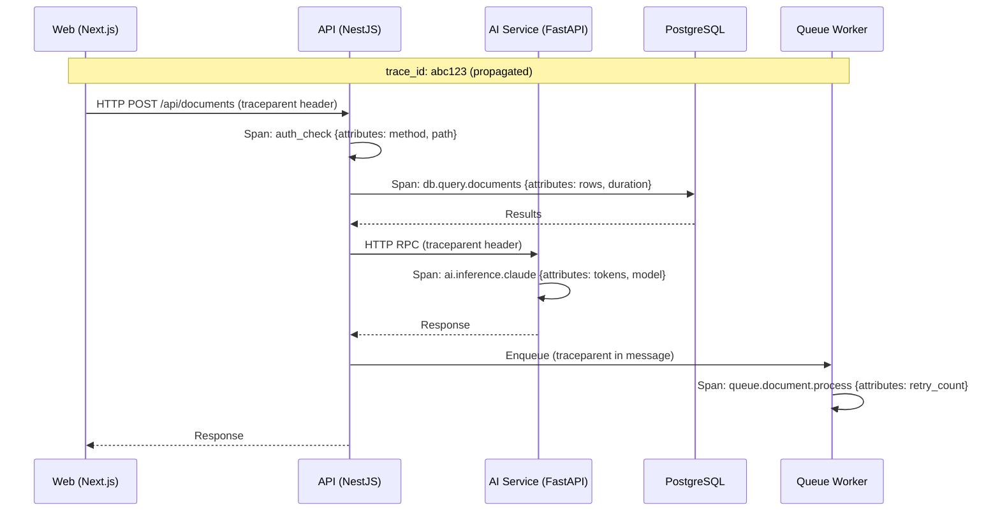

# Distributed Tracing

> **Purpose:** Define distributed tracing standards for Vaeloom
> **Status:** 🆕 New

## Tracing Architecture

```mermaid
graph TD
    classDef request fill:#e3f2fd,stroke:#1565c0,color:#000,stroke-width:2px
    classDef spans fill:#e8f5e9,stroke:#2e7d32,color:#000,stroke-width:1.5px
    classDef types fill:#fff3e0,stroke:#e65100,color:#000,stroke-width:1.5px
    classDef sampling fill:#f3e5f5,stroke:#6a1b9a,color:#000,stroke-width:1px

    subgraph TraceTree["🔍 Example Trace Structure (trace_id: abc123)"]
        direction TB
        ROOT["🌐 User Request<br/>trace: abc123"]

        subgraph API["apps/api Spans"]
            A1["auth_check<br/>Validate JWT"]
            A2["permission_check<br/>Check scopes"]
            A3["document_upload<br/>Route handler"]
            A4["db_insert<br/>PostgreSQL query"]
            A5["event_publish<br/>Emit document.ingested"]
        end

        subgraph Worker["infra/worker Spans"]
            W1["parse_document<br/>Extract content"]
            W2["ocr_process<br/>Image/PDF OCR"]
            W3["extract_entities<br/>Memory Agent call"]
            W4["model_inference<br/>Claude API call"]
        end

        subgraph WS["Real-time Spans"]
            WS1["websocket_push<br/>Push update to client"]
        end

        ROOT --> A1 --> A2 --> A3
        A3 --> A4 & A5
        A5 -.->|enqueues| W1
        W1 --> W2 --> W3 --> W4
        A3 -.->|triggers| WS1
    end

    subgraph SpanTypes["📋 Span Naming Conventions"]
        S1["API: {method} {path}"]
        S2["DB: db.query.{table}"]
        S3["AI: ai.inference.{model}"]
        S4["Agent: agent.{name}.{action}"]
        S5["Queue: queue.{name}.process"]
    end

    subgraph Sampling["🎯 Trace Sampling"]
        SM1["Dev: 100% sampling"]
        SM2["Staging: 100% sampling"]
        SM3["Prod: 10% head-based<br/>100% for error traces"]
    end

    ROOT -.-> S1 & S2 & S3 & S4 & S5
    S1 & S2 & S3 & S4 & S5 -.-> SM1 & SM2 & SM3

    class ROOT request
    class A1,A2,A3,A4,A5,W1,W2,W3,W4,WS1 spans
    class S1,S2,S3,S4,S5 types
    class SM1,SM2,SM3 sampling

```



> **Diagram:** Distributed tracing using OpenTelemetry. A single user request generates spans across **API Gateway** (auth → permission → handler → DB → event), **Queue Worker** (parse → OCR → extract → inference), and **Real-time WebSocket** push. **Span naming conventions** standardize attribute collection. **Sampling** is 100% in dev/staging and 10% head-based in production, with 100% sampling for error traces.

---

## Trace Structure

```text
User Request (trace_id: abc123)
├── API Gateway (span: api_gateway)
│   ├── Auth Middleware (span: auth_check)
│   ├── Permission Engine (span: permission_check)
│   └── Route Handler (span: document_upload)
│       ├── Database (span: db_insert)
│       └── Event Publish (span: event_publish)
│
├── Queue Worker (span: ingestion_worker)
│   ├── Document Parser (span: parse_document)
│   ├── OCR Service (span: ocr_process)
│   └── Memory Extraction (span: extract_entities)
│       └── AI Model (span: model_inference)
│
└── Real-time Update (span: websocket_push)
```

## Spans to Trace

| Operation | Span Name | Attributes |
|-----------|-----------|------------|
| API request | `{method} {path}` | status_code, duration |
| Database query | `db.query.{table}` | rows_affected, duration |
| AI inference | `ai.inference.{model}` | tokens_used, model_name |
| Agent action | `agent.{name}.{action}` | agent_version, confidence |
| Queue job | `queue.{name}.process` | retry_count, priority |

## Trace Sampling

| Environment | Sampling Rate | Notes |
|-------------|---------------|-------|
| Development | 100% | Debug all traces |
| Staging | 100% | Catch issues before production |
| Production | 10% (head-based) | 100% for error traces |

## Common Mistakes

| Mistake | Consequence |
|---------|-------------|
| Not propagating trace context across service boundaries | If the frontend doesn't pass the trace_id to the API, and the API doesn't pass it to the worker, the trace is broken — every inter-service call must propagate trace context headers to maintain end-to-end visibility |
| Tracing everything at production sampling rates | Tracing 100% of requests in production generates terabytes of data and adds 5-15% latency overhead — use head-based sampling (10% in production) with tail-based sampling that captures all error traces |
| Spans that don't include meaningful attributes | A span named "api_request" with no attributes (method, path, status code) is almost useless — every span should include at least the operation name, status, and duration, plus domain-specific attributes |

## Best Practices

| Practice | Why |
|----------|-----|
| Always propagate trace context via headers across service boundaries | Without context propagation, a user request that spans frontend → API → worker → AI model generates disconnected traces — use OpenTelemetry's W3C trace context standard that propagates the trace parent ID header across all services |
| Use head-based sampling in production with tail-based error capture | Head-based sampling (10%) captures a representative sample without overwhelming storage — add tail-based sampling that captures 100% of error traces regardless of the sampling decision |
| Include standardized attributes (method, path, status, duration) on every span | Consistent attributes across all spans let you filter, group, and aggregate traces by any dimension — define a minimum attribute set in the OpenTelemetry configuration shared across all services |

## Security

| Concern | Mitigation |
|---------|------------|
| Traces containing sensitive request data | A trace span that logs the full HTTP request body could capture passwords, tokens, or PII — configure OpenTelemetry to sanitize span attributes and never log request or response bodies |
| Trace data exposing application internals | Detailed span names like `db.query.users` or `ai.inference.claude-sonnet` reveal database structure and model providers — use generic span names in production and map to specific values in a separate metadata system |
| Trace sampling gaps hiding anomaly patterns | An attacker who exploits a vulnerability on a non-sampled request (90% chance) escapes detection — use rule-based sampling that captures all requests to sensitive endpoints (auth, admin, data export) regardless of sampling rate |

## Performance

| Concern | Mitigation |
|---------|------------|
| Trace export overhead at high request rates | Exporting trace data on every request adds latency to the request path — use batch span processors that queue spans in memory and export asynchronously to avoid blocking the application thread |
| Distributed trace storage growing exponentially | Every user request generates spans across multiple services — not all traces are equally valuable. Sample at 10% for production, 100% for error traces, and aggregate trace data to reduce storage by 90% while retaining debugging value |
| Span creation overhead on hot paths | Creating a span for every database query on an endpoint that makes 20 queries adds 20 span allocations per request — use span linking for low-level operations and reserve full parent-child spans for service boundaries |

## Security Considerations

| Concern | Mitigation |
|---------|------------|
| Traces containing sensitive request data | A trace span that logs the full HTTP request body could capture passwords, tokens, or PII — configure OpenTelemetry to sanitize span attributes and never log request or response bodies |
| Trace data exposing application internals | Detailed span names like `db.query.users` or `ai.inference.claude-sonnet` reveal database structure and model providers — use generic span names in production and map to specific values in a separate metadata system |
| Trace sampling gaps hiding anomaly patterns | An attacker who exploits a vulnerability on a non-sampled request (90% chance) escapes detection — use rule-based sampling that captures all requests to sensitive endpoints (auth, admin, data export) regardless of sampling rate |

## Performance Considerations

| Concern | Approach |
|---------|----------|
| Trace export overhead at high request rates | Exporting trace data on every request adds latency to the request path — use batch span processors that queue spans in memory and export asynchronously to avoid blocking the application thread |
| Distributed trace storage growing exponentially | Every user request generates spans across multiple services — not all traces are equally valuable. Sample at 10% for production, 100% for error traces, and aggregate trace data to reduce storage by 90% while retaining debugging value |
| Span creation overhead on hot paths | Creating a span for every database query on an endpoint that makes 20 queries adds 20 span allocations per request — use span linking for low-level operations and reserve full parent-child spans for service boundaries |

## Components

| Component | Responsibility | Technology | Scale Strategy |
|-----------|---------------|------------|----------------|
| Trace Producer | Generate spans in service code | OpenTelemetry SDK (JS/Python) | Async batch export, non-blocking |
| Trace Collector | Aggregate and forward spans | OpenTelemetry Collector | Horizontally scalable, tail-based sampling |
| Trace Backend | Store and query trace data | Jaeger / Grafana Tempo | Object storage backend for long-term |
| Trace Visualizer | Explore and analyze traces | Jaeger UI / Grafana Explore | Standalone query service |
| Sampler | Decide which traces to capture | OTel head + tail sampling | Head (probability) + tail (error/edge rules) |

---

## Scalability

| Dimension | Current Limit | 10x Strategy | 100x Strategy |
|-----------|--------------|--------------|---------------|
| Trace throughput | 100 req/s | 1000 req/s: adaptive sampling | 10K req/s: edge sampling + aggregation |
| Span storage | 10 GB/month | 100 GB: retention tiers | 1 TB: sampling to 1% for non-critical paths |
| Collector capacity | Single instance | 3 collector instances: leader-follower | 10 instances: consistent hashing on trace ID |
| Query latency (7d range) | < 3s | < 1s: indexed span tags | < 500ms: pre-aggregated trace metrics |

---

## Error Handling

| Scenario | Detection | Mitigation | Recovery |
|----------|-----------|------------|----------|
| Trace export fails | Missing spans in backend | Buffer spans locally, retry | Increase exporter batch size and timeout |
| Collector overwhelmed | Dropped spans | Scale collector horizontally | Add rate limiting + backpressure |
| Trace context propagation lost | Broken trace chains | Check W3C traceparent header middleware | Validate propagation with test harness |
| Sampler misconfiguration | Too many/few traces | Adjust sampling rate in config | Add dry-run mode to preview sampling decisions |

---

## Monitoring

| Metric | Alert Threshold | Severity | Dashboard |
|--------|----------------|----------|-----------|
| Trace ingestion rate | > 80% of quota | Warning | Tracing Pipeline |
| Span drop rate (collector) | > 1% | Warning | Tracing Pipeline |
| Trace query latency (p95) | > 5s | Warning | Tracing Performance |
| Error trace capture rate | < 100% of error traces should be captured | Critical | Tracing Quality |

---

## Deployment

| Environment | Method | Trigger | Verification |
|-------------|--------|---------|--------------|
| Trace sampling rule change | Config file update | New service added or traffic change | Sample traces show updated probability |
| Collector deployment | Helm upgrade | Collector version update | Traces appear in backend after deploy |
| Span attribute change | Code update + deploy | New data to trace | Span shows new attribute in UI |
| Backend migration (Jaeger->Tempo) | Export config change | Need for long-term object storage | All old traces still queryable |

---

## Configuration

| Variable | Purpose | Default | Required |
|----------|---------|---------|----------|
| `OTEL_TRACES_EXPORTER` | Trace exporter type | `otlp` | No |
| `OTEL_TRACE_SAMPLE_RATE` | Head sampling probability | `0.1` | No |
| `OTEL_BSP_SCHEDULE_DELAY` | Batch span processor delay | `5000` (ms) | No |
| `TRACING_ENDPOINT` | OTel collector endpoint | `http://otel-collector:4318` | Yes (prod) |
| `TRACE_RETENTION_DAYS` | Trace data retention | `30` | No |

---

## Limitations

| Limitation | Impact | Workaround | Future Resolution |
|------------|--------|------------|-------------------|
| Sampling reduces trace accuracy at scale | Some high-value traces missed | Tail sampling captures all error traces | Adaptive sampling based on ML model |
| Trace storage is expensive | Long retention costs | Retain 30d hot, archive to object storage | Tiered storage with automatic archival |
| No backend in MVP (no Jaeger/Tempo) | Can't view distributed traces | Use hosted APM (Datadog/Grafana Cloud) for prod | Self-hosted Tempo for enterprise |
| Propagation requires framework middleware | Missing spans in un-instrumented libraries | Manually wrap HTTP/fetch calls | OpenTelemetry auto-instrumentation agent |

---

## Overview

Vaeloom's distributed tracing system provides end-to-end visibility into request flows across all services — web (Next.js), API (NestJS), AI service (FastAPI), and background workers (BullMQ). Using OpenTelemetry, every request is instrumented with a unique trace ID that propagates across service boundaries, enabling engineers to trace a single user request from the browser through API authentication, AI inference, and database queries.

This document defines the trace structure, span naming conventions, sampling strategy, and best practices for instrumenting Vaeloom services. The primary audience is developers instrumenting services and SRE engineers debugging cross-service performance issues.

Within the Vaeloom observability stack, tracing provides the request-level view that connects metrics (aggregate trends) and logs (individual events) — a high-latency metric triggers investigation, tracing identifies which specific service and operation caused the slowdown, and logs provide the detailed context.

Enterprise-grade distributed tracing requires careful sampling to balance data completeness with storage cost. Head-based sampling (10% in production) provides a representative sample for trend analysis, while tail-based sampling captures 100% of error traces for debugging. Trace context propagation via W3C traceparent headers is mandatory for all inter-service calls.

---

## Goals

- Instrument all Vaeloom services with OpenTelemetry for distributed trace generation
- Propagate trace context (W3C traceparent) across every inter-service call boundary
- Implement head-based sampling at 10% in production with 100% error trace capture via tail sampling
- Define standardized span naming conventions (method path, db.query.table, ai.inference.model) for consistent querying
- Achieve sub-5ms span creation overhead and zero blocking on the application request path

---

## Scope

### In Scope
- OpenTelemetry SDK instrumentation for all services (TypeScript, Python)
- W3C trace context propagation across HTTP and message queue boundaries
- Span naming conventions: API (`{method} {path}`), DB (`db.query.{table}`), AI (`ai.inference.{model}`), Agent (`agent.{name}.{action}`), Queue (`queue.{name}.process`)
- Sampling strategy: 100% in dev/staging, 10% head-based in production, 100% error trace capture via tail sampling
- Trace export via OpenTelemetry Collector to Jaeger or Grafana Tempo

### Out of Scope
- Metrics collection and monitoring dashboards (covered in [Monitoring.md](./Monitoring.md))
- Log aggregation and structured logging (covered in [Logging.md](./Logging.md))
- Alerting rules based on trace data (covered in [Alerting.md](./Alerting.md))
- AI-powered trace anomaly detection (planned for future)
- Trace-to-metric correlation at query time

---

## Examples

### Example 1: Manual Span Creation in TypeScript

```typescript
import { trace, Span, context } from '@opentelemetry/api';

const tracer = trace.getTracer('Vaeloom-api');

async function processDocument(documentId: string): Promise<void> {
  const span = tracer.startSpan('document.process', {
    attributes: { documentId },
  });

  return await context.with(trace.setSpan(context.active(), span), async () => {
    try {
      await extractEntities(documentId);  // child spans inherit trace context
      await storeMemory(documentId);
    } catch (err) {
      span.recordException(err);
      span.setStatus({ code: SpanStatusCode.ERROR });
      throw err;
    } finally {
      span.end();
    }
  });
}
```

### Example 2: Viewing Traces via CLI

```bash
# Query traces in Jaeger
jaeger-query --service Vaeloom-api --limit 10 --tags 'error=true'

# Export trace data
jaeger-query --trace-id abc123def456 --format json > trace-abc123.json

# Analyze trace duration
cat trace-abc123.json | jq '.spans[] | {operationName, duration: .duration/1000}'
```

---

## Sequence Diagrams



> **Diagram:** Distributed trace flow — a single user request generates spans across web, API, database, AI service, and queue worker. The trace ID propagates via W3C traceparent headers, connecting all spans into a single trace.

---

## Future Improvements

| Improvement | Priority | Complexity | Timeline |
|-------------|----------|------------|----------|
| Tail-based sampling (capture all errors + edge cases) | High | Medium | Q1 2027 |
| Self-hosted Grafana Tempo for enterprise | High | High | Q2 2027 |
| OpenTelemetry auto-instrumentation agent | Medium | Low | Q4 2026 |
| AI-based trace anomaly detection | Medium | High | Q2 2027 |
| Trace-to-log correlation with span IDs in log metadata | Low | Low | Q4 2026 |

## Related Documents

- [Logging.md](./Logging.md)
- [Monitoring.md](./Monitoring.md)
- [`/Docs/Engineering/Implementation/12-observability-tracing.md`](../../Docs/Engineering/Implementation/12-observability-tracing.md)
