# API Examples

> **Purpose:** Common API usage examples for Vaeloom
> **Status:** 🆕 New

## API Endpoints Overview

```mermaid
graph TD
    classDef auth fill:#e3f2fd,stroke:#1565c0,color:#000,stroke-width:2px
    classDef doc fill:#e8f5e9,stroke:#2e7d32,color:#000,stroke-width:1.5px
    classDef resume fill:#fff3e0,stroke:#e65100,color:#000,stroke-width:1.5px
    classDef memory fill:#f3e5f5,stroke:#6a1b9a,color:#000,stroke-width:1px
    classDef chat fill:#ffebee,stroke:#c62828,color:#000,stroke-width:1px

    subgraph Auth["🔑 Authentication"]
        A1["POST /v1/auth/signup<br/>Email + password → Create account"]
        A2["POST /v1/auth/login<br/>Email + password → Token + workspace_id"]
    end

    subgraph Documents["📄 Documents"]
        D1["POST /workspaces/{id}/documents<br/>Upload file → Document created"]
        D2["GET /workspaces/{id}/documents<br/>List with pagination"]
        D3["POST .../organize/approve<br/>Approve agent proposal"]
    end

    subgraph Resume["📝 Resume"]
        R1["GET /workspaces/{id}/resume<br/>Get master resume"]
        R2["POST .../resume/variant<br/>Generate role-specific variant"]
        R3["POST .../resume/score<br/>Score against job description"]
    end

    subgraph Memory["🧠 Memory"]
        M1["GET .../memory/search?q=ml<br/>Search structured memory"]
        M2["GET .../memory/graph<br/>Get knowledge graph"]
    end

    subgraph Chat["💬 Chat"]
        C1["POST .../chat/messages<br/>Send message to specialist agent"]
    end

    Auth --> Documents --> Resume --> Memory --> Chat

    class A1,A2 auth
    class D1,D2,D3 doc
    class R1,R2,R3 resume
    class M1,M2 memory
    class C1 chat
```



> **Diagram:** API endpoint overview — **Authentication** (signup/login), **Documents** (upload/list/approve), **Resume** (get/generate/score), **Memory** (search/graph), **Chat** (agent messages). All endpoints use Bearer token auth and workspace scoping.

---

## Authentication

```bash
# Sign up
curl -X POST https://api.Vaeloom.dev/v1/auth/signup \
  -H "Content-Type: application/json" \
  -d '{"email": "user@example.com", "password": "securepass123"}'

# Login
curl -X POST https://api.Vaeloom.dev/v1/auth/login \
  -H "Content-Type: application/json" \
  -d '{"email": "user@example.com", "password": "securepass123"}'
# Response: { "token": "eyJ...", "workspace_id": "ws_abc123" }
```

## Documents

```bash
# Upload a document
curl -X POST https://api.Vaeloom.dev/v1/workspaces/{id}/documents \
  -H "Authorization: Bearer $TOKEN" \
  -F "file=@resume.pdf"

# List documents
curl -X GET https://api.Vaeloom.dev/v1/workspaces/{id}/documents?page=1&limit=20 \
  -H "Authorization: Bearer $TOKEN"

# Approve organization proposal
curl -X POST https://api.Vaeloom.dev/v1/workspaces/{id}/documents/{doc_id}/organize/approve \
  -H "Authorization: Bearer $TOKEN" \
  -d '{"proposed_name": "Resume_2026.pdf", "folder": "/Career/Resume"}'
```

## Resume

```bash
# Get master resume
curl -X GET https://api.Vaeloom.dev/v1/workspaces/{id}/resume \
  -H "Authorization: Bearer $TOKEN"

# Generate variant
curl -X POST https://api.Vaeloom.dev/v1/workspaces/{id}/resume/variant \
  -H "Authorization: Bearer $TOKEN" \
  -d '{"target_role": "SDE Intern", "company": "Google"}'

# Score against job description
curl -X POST https://api.Vaeloom.dev/v1/workspaces/{id}/resume/score \
  -H "Authorization: Bearer $TOKEN" \
  -d '{"job_description": "Looking for a software engineer intern with experience in React, Python..."}'
```

## Memory

```bash
# Search memory
curl -X GET https://api.Vaeloom.dev/v1/workspaces/{id}/memory/search?q=machine+learning \
  -H "Authorization: Bearer $TOKEN"

# Get knowledge graph
curl -X GET https://api.Vaeloom.dev/v1/workspaces/{id}/memory/graph \
  -H "Authorization: Bearer $TOKEN"
```

## Chat

```bash
# Send message to agent
curl -X POST https://api.Vaeloom.dev/v1/workspaces/{id}/chat/messages \
  -H "Authorization: Bearer $TOKEN" \
  -H "Content-Type: application/json" \
  -d '{"message": "Find me backend internships", "agent": "job_search_agent"}'
```

## Common Mistakes

| Mistake | Consequence |
|---------|-------------|
| Hardcoding workspace IDs in example code | Examples that use literal workspace IDs train developers to hardcode them — workspace IDs must always come from auth context or environment variables |
| Not handling pagination in list endpoints | Examples that omit pagination parameters give the impression that list endpoints return all results — breaks in production when datasets exceed one page |
| Using expired or placeholder tokens in examples | Token examples that aren't clearly labeled as placeholders get copied directly into production code — results in 401 errors and debugging confusion |
| Mixing example code with production patterns | Examples should use simplified patterns — production concerns like retry logic, error handling, and rate limiting belong in a separate reference |

## Best Practices

| Practice | Why |
|----------|-----|
| Use `{workspace_id}` as a clear placeholder | A placeholder that's obviously a placeholder (not a real value) prevents accidental copying — use angle brackets or descriptive variable names |
| Include pagination params in every list example | Every list endpoint example should show `?page=1&limit=20` — developers mirror what they see in examples |
| Show both success and error responses | An example that only shows 200 OK gives no guidance on what happens when things fail — include at least 400, 401, and 403 responses |
| Keep examples runnable with copy-paste | Use `$TOKEN` and `{workspace_id}` so a developer can set variables and run the exact command — reduces friction for getting started |

## Security Considerations

| Consideration | Mitigation |
|--------------|-----------|
| Token exposure in example commands | Examples using `Bearer $TOKEN` with real tokens in shell history are a risk — use environment variables or a dev-only token that expires frequently |
| Example data containing PII | Example responses should use fake data (`user@example.com`, Acme Corp) — real-looking data might be copied into demos that end up in screenshots |

## Error Handling

| Scenario | Detection | Mitigation | Recovery |
|----------|-----------|------------|----------|
| Expired auth token in example | 401 response with `token_expired` code | Include token refresh flow in example | Re-login and retry with new token |
| Rate limit exceeded (429) | `X-RateLimit-Remaining: 0` header | Add exponential backoff to example scripts | Wait for rate limit window reset |
| Workspace ID mismatch | 403 response | Validate workspace ownership before API calls | Use workspace-scoped tokens for multi-workspace users |
| Invalid request body | 400 with validation error details | Include input validation in example error handling | Parse error details and correct the request |

## Risks

| Risk | Likelihood | Impact | Mitigation |
|------|------------|--------|------------|
| Example code copied verbatim into production | High | Medium | Include prominent "example only" disclaimers in code comments and surrounding text |
| Example tokens leaked via shell history | Medium | High | Recommend using environment variables or `$TOKEN` placeholders — never show real tokens in examples |
| Example assumes API version that doesn't exist yet | Low | Medium | Version all example URLs (`/v1/`) and update examples when API versions change |
| Incorrect example parameters cause confusion | Medium | Low | Test every example against the actual API before publishing |

## Limitations

| Limitation | Impact | Workaround | Future Resolution |
|------------|--------|------------|-------------------|
| Examples cover only common use cases | Edge cases (bulk operations, error flows, pagination) are not shown | Link to full API reference documentation for edge cases | Generate examples from OpenAPI spec automatically (v1.5) |
| Examples use curl only | Developers using Postman, Python, or JS SDKs cannot directly use examples | Note that examples can be imported into Postman via OpenAPI spec | Multi-language example generation (Python, TypeScript, curl) (V2) |
| Examples show only successful responses | Error handling examples are minimal | Include error response examples alongside success cases | Error-first example sections with recovery flows (v1.5) |

## Overview

The API Examples document provides ready-to-use curl commands covering Vaeloom's core API surfaces — authentication, documents, resume management, memory/knowledge graph queries, and agent chat interactions. Each example includes request parameters, response structures, and common error patterns to help developers integrate with the Vaeloom API quickly and correctly.

---

## Goals

- Provide copy-paste-ready API examples for all core Vaeloom endpoints
- Demonstrate correct authentication patterns, pagination, and error handling
- Establish consistent example conventions that prevent accidental production misuse
- Cover both success and error response patterns for each endpoint

---

## Scope

### In Scope

- Authentication endpoints (signup, login)
- Document CRUD operations (upload, list, organize)
- Resume management (get, generate variant, score)
- Memory and knowledge graph queries (search, graph)
- Agent chat messaging

### Out of Scope

- Admin panel API endpoints
- Enterprise SSO configuration APIs
- Webhook registration and management
- Bulk and batch operations
- Real-time streaming endpoints

---

## Future Improvements

| Improvement | Priority | Complexity | Timeline |
|-------------|----------|------------|----------|
| Multi-language example generation (Python, TypeScript, curl) | High | Medium | V2 (2027 H2) |
| Auto-generated examples from OpenAPI spec | High | Low | v1.5 (2027 H1) |
| Interactive API playground (try-it-yourself in docs) | Medium | Medium | V2 (2027 H2) |
| Error-first example sections with recovery flows | Medium | Low | v1.5 (2027 H1) |

## Performance Considerations

| Consideration | Approach |
|--------------|----------|
| Example rate limits | Examples should note rate limits for each endpoint (e.g., POST /chat/message at 20/min) — developers running example scripts in loops may hit 429 errors |
| Large payload handling | Document upload examples should show multipart form data for files, not base64-encoded JSON — base64 inflates payload size by 33% |

## Examples

### Upload document with TypeScript

```typescript
async function uploadDocument(workspaceId: string, file: File, token: string) {
  const form = new FormData();
  form.append('file', file);
  const res = await fetch(`/v1/workspaces/${workspaceId}/documents`, {
    method: 'POST',
    headers: { Authorization: `Bearer ${token}` },
    body: form,
  });
  if (!res.ok) throw new Error(`Upload failed: ${res.status}`);
  return res.json();
}
```

### Generate resume variant with Python

```python
import requests

def generate_resume_variant(workspace_id: str, token: str, target_role: str, company: str):
    response = requests.post(
        f"https://api.Vaeloom.dev/v1/workspaces/{workspace_id}/resume/variant",
        headers={"Authorization": f"Bearer {token}"},
        json={"target_role": target_role, "company": company},
    )
    response.raise_for_status()
    return response.json()["resume"]
```

### Search memory with pagination

```typescript
async function searchMemory(workspaceId: string, query: string, token: string, page = 1) {
  const params = new URLSearchParams({ q: query, page: String(page), limit: '20' });
  const res = await fetch(
    `/v1/workspaces/${workspaceId}/memory/search?${params}`,
    { headers: { Authorization: `Bearer ${token}` } }
  );
  return res.json();
}
```

### Approve proposal with error handling

```typescript
async function approveProposal(workspaceId: string, docId: string, token: string) {
  const res = await fetch(
    `/v1/workspaces/${workspaceId}/documents/${docId}/organize/approve`,
    {
      method: 'POST',
      headers: { Authorization: `Bearer ${token}`, 'Content-Type': 'application/json' },
      body: JSON.stringify({ proposed_name: 'Resume_2026.pdf', folder: '/Career/Resume' }),
    }
  );
  if (res.status === 409) throw new Error('Proposal already processed');
  if (!res.ok) throw new Error(`Approval failed: ${res.statusText}`);
  return res.json();
}
```

---

## Related Documents

- [Developer Guide.md](./Developer-Guide.md)
- [Architecture Walkthrough.md](./Architecture-Walkthrough.md)
- [Setup.md](./Setup.md)
- [Debugging.md](./Debugging.md)
- [`Backend/API-Architecture.md`](../Backend/API-Architecture.md)
- [`Backend/REST-Standards.md`](../Backend/REST-Standards.md)
