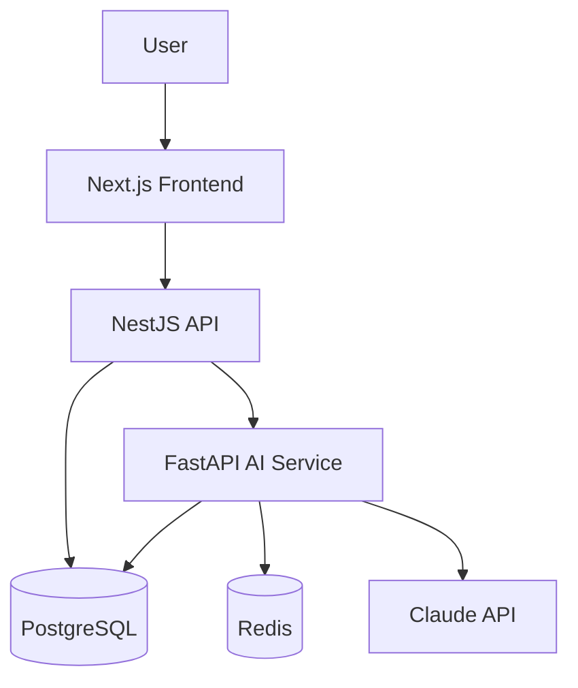

# Architecture Walkthrough

> **Purpose:** Guided walkthrough of Vaeloom's architecture for new developers
> **Status:** 🆕 New

## 5-Minute Architecture Overview



## Service Walkthrough

### 1. Frontend: `apps/web/` (Next.js)

The frontend is a component-driven SPA with SSR for fast initial loads.

**Key files to read first:**

- `app/dashboard/page.tsx` — Landing page
- `app/workspace/page.tsx` — File browser
- `components/ProposalCard.tsx` — Agent proposal UI

### 2. API: `apps/api/` (NestJS)

REST API handling auth, CRUD, permissions, and proxying agent requests.

**Key files to read first:**

- `src/auth/auth.middleware.ts` — Auth flow
- `src/permissions/permission.engine.ts` — Access control
- `src/documents/document.service.ts` — File operations

### 3. AI Service: `apps/ai-service/` (FastAPI)

Agent runtime, memory system, RAG retrieval, and model routing.

**Key files to read first:**

- `agents/memory_agent/handler.py` — Core agent logic
- `retrieval/router.py` — Agentic RAG strategy selection
- `orchestrator/router.py` — Agent request routing

### 4. Database: PostgreSQL + Redis

PostgreSQL stores structured data, graph relationships (AGE), and vectors (pgvector). Redis handles caching and job queues.

## Common Development Flows

### Adding a New API Endpoint

1. Define types in `packages/shared-types/`
2. Create route handler in `apps/api/src/routes/`
3. Add service logic
4. Add to Permission Engine

### Adding a New Agent

1. Create agent directory in `apps/ai-service/agents/`
2. Define `prompt.py`, `tools.py`, `handler.py`, `permissions.py`
3. Register agent in the Orchestrator

## Common Mistakes

| Mistake | Consequence |
|---------|-------------|
| Jumping into code before understanding the 3-tier architecture | New developers who start reading agent code before understanding the API ↔ AI Service boundary often make changes that break the gRPC contract between services |
| Modifying shared types without coordinating across packages | A change to `packages/shared-types` that isn't reflected in both TypeScript and Python definitions causes silent type mismatches in production |
| Running services in the wrong order | Starting the AI Service before the API or database creates connection errors that look like code bugs — the start order is API → DB → AI → Frontend |
| Skipping the architecture walkthrough entirely | Developers who go straight to coding miss the system design decisions that explain *why* the code is structured this way — leads to PRs that fight the architecture |

## Best Practices

| Practice | Why |
|----------|-----|
| Start with the architecture diagram before reading any code | The high-level diagram shows how services communicate — understanding the boundaries prevents changes that violate the service contract |
| Read the 4 key files in the suggested order | Auth middleware → Permission Engine → Document Service → Agent handler — this follows the request lifecycle and builds understanding incrementally |
| Use the 5-minute overview as your mental model | The single diagram of User → Web → API → AI → PG/Redis is the foundation — every feature maps to this flow, and every change must preserve it |
| Check the shared types package before creating new types | If a type already exists in `packages/shared-types`, creating a duplicate in a service causes drift — always reference shared types first |

## Security Considerations

| Consideration | Mitigation |
|--------------|-----------|
| Service boundary trust | The API and AI Service communicate over internal gRPC, but neither should implicitly trust the other — validate all cross-service inputs |
| Frontend-to-API direct calls | The walkthrough shows the frontend calling the API directly — ensure all such calls go through the middleware stack (auth, permission, rate limiting) |

## Performance Considerations

| Consideration | Approach |
|--------------|----------|
| gRPC vs REST for internal communication | gRPC is used between API and AI Service for performance — REST between frontend and API allows caching at the CDN level |
| Database connection pool sizing per service | Each service (API, AI, Workers) has its own pool size — API gets max 20, AI gets max 10, Workers get max 5 to prevent connection exhaustion |

## Error Handling

| Scenario | Detection | Mitigation | Recovery |
|----------|-----------|------------|----------|
| Service startup order violation | Connection refused from dependent service | Document startup order prominently; add health check polling to dev script | `docker compose restart` the dependent service |
| gRPC contract mismatch between services | Type serialization errors in cross-service calls | Shared proto definitions in monorepo; CI checks for proto compatibility | Regenerate stubs from shared proto definitions |
| Database migration fails in prod | Migration script error | Run migrations as pre-deploy step with dry-run support | Rollback migration and fix before retrying |

## Risks

| Risk | Likelihood | Impact | Mitigation |
|------|------------|--------|------------|
| New developers skip architecture walkthrough entirely | High | Medium | Include architecture quiz in onboarding checklist; require walkthrough sign-off before first PR |
| Architecture diagram becomes outdated as system evolves | Medium | High | Diagram stored in draw.io source alongside code; update as part of architecture change PRs |
| gRPC contract changes not reflected in documentation | Medium | Medium | Add proto comment-to-doc generation step in CI pipeline |

## Limitations

| Limitation | Impact | Workaround | Future Resolution |
|------------|--------|------------|-------------------|
| Walkthrough covers only 3 primary services | Background workers, migration service, and CLI tools are excluded | Each service has its own detailed README in its directory | Comprehensive service registry with per-service architecture docs (V2) |
| Architecture diagram shows logical connections only | Physical deployment topology (K8s pods, network policies) is not shown | Link to DevOps architecture docs for deployment topology | Integrated logical + physical architecture view (Enterprise) |

## Overview

The Architecture Walkthrough guides new developers through Vaeloom's three-tier architecture — Next.js frontend, NestJS API, and FastAPI AI service — explaining how each service connects, where key code lives, and how to navigate the codebase. It covers the request lifecycle from user action to database write, common development flows, and service startup dependencies.

---

## Goals

- Provide a 5-minute mental model of Vaeloom's architecture for new developers
- Map the request lifecycle across frontend, API, and AI service tiers
- Identify key files to read first in each service
- Document common development workflows (adding endpoints, agents)
- Prevent architecture violations by establishing service boundary understanding

---

## Scope

### In Scope
- Three-service architecture overview (Web, API, AI Service)
- Key file pointers for each service
- Common development flows (adding API endpoints, adding agents)
- Service startup order and dependencies
- Internal communication patterns (gRPC, REST)

### Out of Scope
- Database schema details (covered in Database documentation)
- Connector/SDK integration patterns (covered in Integration Guide)
- Deployment topology and infrastructure (covered in DevOps docs)
- Detailed agent implementation (covered in Agent documentation)

---

## Future Improvements

| Improvement | Priority | Complexity | Timeline |
|-------------|----------|------------|----------|
| Interactive architecture diagram with drill-down | Medium | Medium | V2 (2027 H2) |
| Architecture decision record (ADR) index | High | Low | v1.5 (2027 H1) |
| Video walkthrough for visual learners | Low | Medium | v1.5 (2027 H1) |

## Examples

### Service health check from frontend

```typescript
// apps/web/lib/api.ts
async function healthCheck(): Promise<boolean> {
  try {
    const res = await fetch('/api/v1/health');
    return res.status === 200;
  } catch {
    return false;
  }
}
```

### Agent handler registration

```python
# apps/ai-service/orchestrator/router.py
from agents.memory_agent.handler import MemoryAgentHandler

orchestrator.register_agent(
    name="memory_agent",
    handler=MemoryAgentHandler(),
    description="Extracts entities and builds knowledge graph",
    permissions=["memory:read", "memory:write"],
)
```

### gRPC service call (API → AI)

```typescript
// apps/api/src/services/ai-gateway.ts
import { AiServiceClient } from '@vaeloom/grpc';

async function processDocument(content: string) {
  const client = new AiServiceClient('ai-service:50051');
  const response = await client.extractEntities({ content, type: 'resume' });
  return response.entities;
}
```

### Permission check middleware

```typescript
// apps/api/src/permissions/permission.engine.ts
function requirePermission(action: string) {
  return (req: Request, res: Response, next: NextFunction) => {
    const userId = req.user.id;
    const workspaceId = req.params.workspaceId;
    if (!permissions.can(userId, workspaceId, action)) {
      return res.status(403).json({ error: 'Forbidden' });
    }
    next();
  };
}
```

---

## Related Documents

- [Developer Guide.md](./Developer-Guide.md)
- [Setup.md](./Setup.md)
- [API Examples.md](./API-Examples.md)
- [Debugging.md](./Debugging.md)
- [Contributing.md](./Contributing.md)
- [`Architecture/System-Design.md`](../Architecture/System-Design.md)
- [`Architecture/README.md`](../Architecture/README.md)
