# CLI Tools

> **Purpose:** Define CLI tools and usage for Vaeloom development
> **Status:** 🆕 New

## CLI Architecture

```mermaid
graph TD
    classDef current fill:#e3f2fd,stroke:#1565c0,color:#000,stroke-width:2px
    classDef planned fill:#e8f5e9,stroke:#2e7d32,color:#000,stroke-width:1.5px
    classDef scripts fill:#fff3e0,stroke:#e65100,color:#000,stroke-width:1.5px

    subgraph Current["âš¡ Current CLI Tools"]
        C1["npm run dev --> Dev servers (FE + API)"]
        C2["npm run build --> Production build"]
        C3["npm run test --> Run tests"]
        C4["npm run lint --> Lint code"]
        C5["pytest --> Python tests (AI)"]
        C6["uvicorn --reload --> AI dev server"]
    end

    subgraph Planned["🚀 Vaeloom CLI (Future)"]
        P1["Auth: Vaeloom login / logout"]
        P2["Workspace: list / switch"]
        P3["Documents: upload / list"]
        P4["Agents: list / status"]
        P5["Dev: Vaeloom dev (all services)"]
        P6["Deploy: Vaeloom deploy &lt;service&gt;"]
        P7["Logs: Vaeloom logs &lt;service&gt;"]
    end

    subgraph Scripts["📁 Scripts/"]
        S1["setup-dev.sh --> Initial setup"]
        S2["reset-db.sh --> Clean DB state"]
        S3["seed-data.sh --> Dev seed data"]
        S4["smoke-test.sh --> Smoke tests"]
    end

    Current --> Planned --> Scripts

    class C1,C2,C3,C4,C5,C6 current
    class P1,P2,P3,P4,P5,P6,P7 planned
    class S1,S2,S3,S4 scripts
```



> **Diagram:** CLI architecture — **current tools** (npm/pytest/uvicorn) → **planned Vaeloom CLI** (auth, workspace, documents, agents, dev, deploy, logs) → **scripts directory** (setup, reset, seed, smoke-test).

---

## Available CLI Tools

| Command | Service | Purpose |
|---------|---------|---------|
| `npm run dev` | Frontend + API | Start development servers |
| `npm run build` | Frontend + API | Production build |
| `npm run test` | Frontend + API | Run tests |
| `npm run lint` | Frontend + API | Lint code |
| `pytest` | AI Service | Run Python tests |
| `uvicorn main:app --reload` | AI Service | Development server |

## Vaeloom CLI (Future)

A dedicated CLI tool `Vaeloom-cli` is planned:

```bash
# Authentication
Vaeloom login
Vaeloom logout

# Workspace management
Vaeloom workspace list
Vaeloom workspace switch <id>

# Document operations
Vaeloom document upload <path>
Vaeloom document list

# Agent interactions
Vaeloom agent list
Vaeloom agent status <name>

# Development
Vaeloom dev               # Start all services
Vaeloom deploy <service>   # Deploy single service
Vaeloom logs <service>     # View logs
```

## Scripts Directory

| Script | Purpose |
|--------|---------|
| `scripts/setup-dev.sh` | Initial development environment setup |
| `scripts/reset-db.sh` | Reset database to clean state |
| `scripts/seed-data.sh` | Load development seed data |
| `scripts/smoke-test.sh` | Run smoke tests against environment |

## Common Mistakes

| Mistake | Consequence |
|---------|-------------|
| Running `npm start` instead of `npm run dev` in development | `npm start` runs the production build — changes aren't reflected without rebuild, leading to confusion about why code edits don't take effect |
| Forgetting to activate the Python virtual environment before running AI Service commands | Running `pytest` or `uvicorn` outside the venv uses the system Python — missing dependencies cause import errors that look like setup failures |
| Using production environment variables in local CLI commands | A `--env production` flag or production `DATABASE_URL` in a local terminal can accidentally modify production data — always verify the active environment |
| Running destructive commands without a dry-run | Commands like `reset-db.sh` drop all data — running without confirming the target environment causes irreversible data loss in staging or production |

## Best Practices

| Practice | Why |
|----------|-----|
| Use `npm run dev` for all local development | Dev mode includes hot reload, debug logging, and double rate limits — it's the only mode suitable for active development |
| Always activate the Python venv before AI Service work | `source .venv/bin/activate` should be the first command in any AI Service terminal session — add it to your shell profile for convenience |
| Prefix environment-specific commands with the target | `STAGING=1 ./scripts/reset-db.sh` or `NODE_ENV=production npm run build` — explicit environment markers prevent cross-environment accidents |
| Add a confirmation prompt to destructive scripts | Scripts that drop databases or delete resources should require `--confirm` or `--force` flags — never run destructive operations without explicit confirmation |

## Security Considerations

| Consideration | Mitigation |
|--------------|-----------|
| CLI tool credential storage | A future Vaeloom CLI will store auth tokens locally — use the system keychain (or encrypted config file), never plaintext config files |
| Script secrets in command history | Commands with inline secrets (`ANTHROPIC_API_KEY=sk-... npm run dev`) are stored in shell history — use `.env` files or secrets manager instead |

## Error Handling

| Scenario | Detection | Mitigation | Recovery |
|----------|-----------|------------|----------|
| npm run dev fails with port conflict | EADDRINUSE error | Default ports documented; check `lsof -i :3000` before starting | Kill existing process or use `--port` flag |
| Python venv not activated | ModuleNotFoundError on import | Check `sys.prefix != sys.base_prefix` in dev health script | Add venv activation check to AI service startup script |
| Database connection refused | SequelizeConnectionError | Docker container not running or port mapped incorrectly | `docker compose up -d postgres redis` and retry |
| Migration state mismatch | P2025 (prisma) or similar migration error | Local schema out of sync with migration history | `npx prisma migrate reset` (with data loss warning) |

## Risks

| Risk | Likelihood | Impact | Mitigation |
|------|------------|--------|------------|
| Destructive script run against wrong environment | Medium | Critical | Add environment confirmation prompt; check `NODE_ENV` before destructive operations |
| CLI tool credentials stored in plaintext | Medium | High | Use system keychain or encrypted config for future `Vaeloom login` |
| Scripts fail silently on errors | High | Medium | Use `set -euo pipefail` in all shell scripts; verify exit codes in CI |

## Limitations

| Limitation | Impact | Workaround | Future Resolution |
|------------|--------|------------|-------------------|
| No dedicated Vaeloom CLI tool (MVP) | Developers use npm/pytest/uvicorn directly with inconsistent flags | Standardize on `npm run dev` and documented scripts for all services | `Vaeloom-cli` with unified commands (v1.5) |
| Shell scripts are platform-specific (bash) | Windows developers cannot run scripts natively | Use Git Bash, WSL, or PowerShell equivalents | Cross-platform scripts or Node.js-based CLI (V2) |

## Overview

The CLI Tools document catalogs all command-line interfaces available for Vaeloom development — npm scripts for the frontend and API, Python/uvicorn commands for the AI service, shell scripts for database operations, and the planned Vaeloom CLI tool. It defines conventions for script safety, environment-aware execution, and cross-platform compatibility.

---

## Goals

- Document all available CLI commands across frontend, API, and AI service
- Define the roadmap for the dedicated Vaeloom CLI tool
- Establish script safety conventions (idempotency, confirmation prompts, error handling)
- Prevent environment-crossing accidents with explicit flags and checks
- Enable Windows development through cross-platform alternatives

---

## Scope

### In Scope

- Current CLI tools (npm, pytest, uvicorn)
- Planned Vaeloom CLI features
- Scripts directory conventions and usage
- Shell script safety best practices
- Environment-specific command patterns

### Out of Scope

- CI/CD pipeline commands (covered in DevOps documentation)
- IDE-specific debugger configurations
- Database migration commands in detail (covered in Database docs)
- Third-party CLI tools for infrastructure management

---

## Future Improvements

| Improvement | Priority | Complexity | Timeline |
|-------------|----------|------------|----------|
| Dedicated `Vaeloom-cli` with unified commands | High | Medium | v1.5 (2027 H1) |
| Cross-platform scripts (PowerShell alternatives) | Medium | Low | V2 (2027 H2) |
| Interactive `Vaeloom dev` with service selection | Medium | Medium | v1.5 (2027 H1) |
| `Vaeloom deploy` for one-command deployments | Low | High | Enterprise (2028) |

## Performance Considerations

| Consideration | Approach |
|--------------|----------|
| CLI startup time | The planned Vaeloom CLI should load in under 500ms — lazy-load subcommands and dependencies rather than importing everything at startup |
| npm run dev memory usage | Running all services (frontend + API + AI + Docker) consumes 2-4GB RAM — provide a `--light` flag to start only the services needed for a specific task |

## Examples

### Starting all services locally

```bash
# Start infrastructure
docker compose up -d postgres redis

# Start API (terminal 1)
cd apps/api && npm run dev

# Start AI Service (terminal 2)
cd apps/ai-service && source .venv/bin/activate && uvicorn main:app --reload --port 8000

# Start Frontend (terminal 3)
cd apps/web && npm run dev
```

### Running tests for a specific service

```bash
# Frontend + API
npm run test -- --testPathPattern=DocumentService

# AI Service
cd apps/ai-service && source .venv/bin/activate && pytest tests/test_memory_agent.py -v
```

### Database reset and seed

```bash
# Reset database (dev only)
./scripts/reset-db.sh --confirm

# Seed test data
./scripts/seed-data.sh --minimal

# Verify
npx prisma studio
```

### AI evaluation runner

```bash
# Run all agent evals
cd apps/ai-service && python -m eval.run_all

# Run single agent eval
python -m eval.run_single memory_agent --document_id=doc_abc123

# Test prompt directly
python -m agents.test_prompt memory_agent --prompt_version=v2
```

---

## Related Documents

- [Setup.md](./Setup.md)
- [Developer Guide.md](./Developer-Guide.md)
- [Scripts.md](./Scripts.md)
- [Environment.md](./Environment.md)
- [Contributing.md](./Contributing.md)
- [API Examples.md](./API-Examples.md)
