# Contributing

> **Purpose:** Guide for contributing to the Vaeloom project
> **Status:** 🆕 New

## Contribution Overview

```mermaid
graph TD
    classDef steps fill:#e3f2fd,stroke:#1565c0,color:#000,stroke-width:2px
    classDef bugs fill:#e8f5e9,stroke:#2e7d32,color:#000,stroke-width:1.5px
    classDef features fill:#fff3e0,stroke:#e65100,color:#000,stroke-width:1.5px
    classDef pr fill:#f3e5f5,stroke:#6a1b9a,color:#000,stroke-width:1px

    subgraph Steps["🚀 Getting Started"]
        S1["1. Read Setup Guide<br/>Get project running locally"]
        S2["2. Read Architecture Walkthrough<br/>Understand the system"]
        S3["3. Check Project Board<br/>Find open issues"]
        S4["4. Join Discord<br/>Ask questions"]
    end

    subgraph Bugs["🐛 Reporting Bugs"]
        B1["Check if already reported"]
        B2["Open issue with:<br/>Title, steps to reproduce,<br/>expected vs actual, screenshots"]
    end

    subgraph Features["💡 Suggesting Features"]
        F1["Check if already planned (Roadmap)"]
        F2["Open discussion for feedback"]
        F3["If approved → feature request issue"]
    end

    subgraph PRs["📤 Pull Requests"]
        P1["Follow Git Workflow"]
        P2["Follow Coding Standards"]
        P3["Include tests"]
        P4["Keep PRs small and focused"]
    end

    Steps --> Bugs & Features & PRs

    class S1,S2,S3,S4 steps
    class B1,B2 bugs
    class F1,F2,F3 features
    class P1,P2,P3,P4 pr
```



> **Diagram:** Contribution workflow — **4 getting started steps** → **3 contribution paths** (bug reports, feature suggestions, pull requests) — each with specific requirements.

---

## Welcome

Thank you for considering contributing to Vaeloom. This document outlines the process for contributing.

## Code of Conduct

All contributors must adhere to our code of conduct: be respectful, assume good intent, and focus on constructive feedback.

## Getting Started

1. Read the [Setup Guide](./Setup.md) to get the project running locally
2. Read the [Architecture Walkthrough](./Architecture-Walkthrough.md) to understand the system
3. Check the [Project Board](https://github.com/org/projects/1) for open issues
4. Join our [Discord](https://discord.gg/vaeloom) for questions

## How to Contribute

### Reporting Bugs

1. Check if the bug is already reported
2. Open an issue with:
   - Clear title and description
   - Steps to reproduce
   - Expected vs actual behavior
   - Screenshots if applicable
   - Environment details

### Suggesting Features

1. Check if the feature is already planned (see [Roadmap](../Product/Roadmap.md))
2. Open a discussion first to gather feedback
3. If approved, open a feature request issue

### Pull Requests

1. Follow the [Git Workflow](../Engineering/Git-Workflow.md)
2. Follow [Coding Standards](../Engineering/Coding-Standards.md)
3. Include tests for new functionality
4. Update documentation if needed
5. Keep PRs small and focused

## Common Mistakes

| Mistake | Consequence |
|---------|-------------|
| Opening a PR without checking the project board first | Multiple contributors independently solving the same issue wastes effort — always comment on the issue to claim it before starting work |
| Skipping the setup guide and architecture walkthrough | PRs from developers who haven't set up the full environment often have configuration issues, missing dependencies, or misunderstand service boundaries |
| PRs that are too large to review effectively | A 2000-line PR is rarely reviewed thoroughly — small, focused PRs get better reviews and merge faster |
| Submitting a feature without an associated discussion | Features that skip the discussion phase may be rejected after implementation — use a feature request discussion for early feedback |

## Best Practices

| Practice | Why |
|----------|-----|
| Claim an issue before starting work | Comment `I'd like to work on this` on the issue — prevents duplicate work and lets maintainers know who's working on what |
| Run the full CI pipeline locally before submitting | `./scripts/ci-local.sh` catches lint, test, and type errors before CI — faster feedback loop than waiting for CI results |
| Keep PRs small and focused on a single concern | A PR should do one thing — fix one bug, add one feature, refactor one module. Multiple concerns in one PR are hard to review and risky to merge |
| Update documentation alongside code changes | A feature that adds a new API endpoint should include the API example — documentation should be part of the PR, not a separate follow-up |

## Security Considerations

| Consideration | Mitigation |
|--------------|-----------|
| Third-party dependency contributions | External contributors may introduce malicious dependencies — all new dependencies must be reviewed by a maintainer and scanned for vulnerabilities |
| Sensitive information in issues | Bug reports may include logs or screenshots containing tokens or PII — remind contributors to redact sensitive information before posting |

## Error Handling

| Scenario | Detection | Mitigation | Recovery |
|----------|-----------|------------|----------|
| CI pipeline fails for unrelated PR change | Flaky test identified | Rerun failed job; quarantine flaky test with issue tracker link | Fix or remove flaky test within same sprint |
| PR merge conflict with main branch | GitHub shows conflict status | Rebase PR on latest main | Resolve conflicts locally with `git rebase main` |
| Contributor submits PR without CLA signing | CI check fails | Block merge until CLA signed; automated reminder in PR comments | Sign CLA and re-trigger CI |

## Risks

| Risk | Likelihood | Impact | Mitigation |
|------|------------|--------|------------|
| External contributor introduces malicious dependency | Low | Critical | All new dependencies reviewed by maintainer; Dependabot alerts enabled; SCA scanning in CI |
| New contributors overwhelmed by contribution complexity | High | Medium | Good first issue labels; mentoring program; paired PR reviews for first-time contributors |
| Maintainer bandwidth cannot keep up with PR volume | Medium | High | Define response time SLA (48h initial review); rotate maintainer duty weekly |

## Limitations

| Limitation | Impact | Workaround | Future Resolution |
|------------|--------|------------|-------------------|
| Contribution process manual and human-reliant | PRs may sit unreviewed for extended periods | Define clear review SLAs; use GitHub actions for auto-labeling and assignment | Automated triage and assignment system (v1.5) |
| No automated CLA signing flow | Contributors must manually sign before PR can merge | GitHub CLA bot integration | Streamlined CLA flow with pre-commit verification |

## Overview

The Contributing guide defines how developers can contribute to the Vaeloom project — reporting bugs, suggesting features, and submitting pull requests. It covers the contribution workflow from discovering issues through merging PRs, including coding standards, testing requirements, and documentation expectations.

---

## Goals

- Define a clear, welcoming contribution process for new and experienced contributors
- Establish quality standards for bug reports, feature suggestions, and pull requests
- Prevent duplicate work through issue claiming and project board coordination
- Ensure all contributions include tests, documentation, and permission checks
- Maintain code quality through CI validation and code review requirements

---

## Scope

### In Scope

- Bug reporting process and template
- Feature suggestion workflow (discussion, approval, implementation)
- Pull request requirements (tests, docs, CI, permissions)
- Coding standards and git workflow references
- Code of conduct expectations

### Out of Scope

- Specific coding standards (referenced from Engineering docs)
- Git workflow details (referenced from Engineering docs)
- Release process and versioning
- Security vulnerability disclosure process (covered in Security docs)

---

## Future Improvements

| Improvement | Priority | Complexity | Timeline |
|-------------|----------|------------|----------|
| Automated PR triage and reviewer assignment | High | Low | v1.5 (2027 H1) |
| Contribution analytics dashboard | Medium | Low | V2 (2027 H2) |
| Open-source issue bounty program | Low | High | Enterprise (2028) |
| Community-contributed connector program | Medium | Medium | V2 (2027 H2) |

## Security Considerations

| Consideration | Approach |
|--------------|----------|
| PR performance regression checks | Every PR that touches a database query or API endpoint must include before/after performance data — prevent accidental regressions from entering main |
| Test suite runtime | A growing test suite that takes >10 minutes to run discourages contributors from running it locally — aim for <5 minute local test run |

## Examples

### PR workflow

```bash
# Create feature branch
git checkout -b feat/add-resume-parser

# Make changes and commit
git add apps/ai-service/agents/resume_agent/
git commit -m "feat(ai): add resume parsing agent"

# Rebase on latest main
git fetch origin
git rebase origin/main

# Push and create PR
git push origin feat/add-resume-parser
gh pr create --title "Add resume parsing agent" --body "Closes #142"
```

### Running CI locally before PR

```bash
# Full CI pipeline
./scripts/ci-local.sh

# Or individual checks
npm run lint
npm run test
npm run build
cd apps/ai-service && source .venv/bin/activate && pytest && ruff check .
```

### Adding a golden dataset test

```python
# apps/ai-service/tests/golden/test_resume_agent.py
GOLDEN_CASES = [
    {
        "input": {"content": "Education: B.Tech CSE, IIT Delhi", "type": "resume"},
        "expected": {"education": [{"degree": "B.Tech CSE"}], "skills": []},
    },
]

@pytest.mark.golden
@pytest.mark.parametrize("case", GOLDEN_CASES)
async def test_resume_golden(agent, case):
    result = await agent.extract_entities(case["input"])
    assert result["education"] == case["expected"]["education"]
```

### Claiming an issue

```bash
# Find an issue to work on
gh issue list --label "good first issue"

# Claim it
gh issue comment 142 --body "I'd like to work on this"
```

---

## Related Documents

- [Setup.md](./Setup.md)
- [Environment.md](./Environment.md)
- [Developer Guide.md](./Developer-Guide.md)
- [Architecture Walkthrough.md](./Architecture-Walkthrough.md)
- [Debugging.md](./Debugging.md)
- [CLI.md](./CLI.md)
- [`/Docs/Vaeloom-Complete-Documentation.md`](../../Docs/Vaeloom-Complete-Documentation.md)
