# Debugging

> **Purpose:** Debugging guide for Vaeloom developers
> **Status:** 🆕 New

## Debugging Architecture

```mermaid
graph TD
    classDef agent fill:#e3f2fd,stroke:#1565c0,color:#000,stroke-width:2px
    classDef db fill:#e8f5e9,stroke:#2e7d32,color:#000,stroke-width:1.5px
    classDef perf fill:#fff3e0,stroke:#e65100,color:#000,stroke-width:1.5px
    classDef frontend fill:#f3e5f5,stroke:#6a1b9a,color:#000,stroke-width:1px

    subgraph Agent["🤖 Agent Debugging"]
        A1["kubectl logs -l agent=memory-agent<br/>Check agent logs"]
        A2["python -m eval.run_single memory_agent<br/>Run eval locally"]
        A3["python -m agents.test_prompt --prompt=v2<br/>Test prompt directly"]
    end

    subgraph Database["🗄️ Database Debugging"]
        D1["SELECT count(*) FROM pg_stat_activity<br/>Check connection count"]
        D2["SELECT query, mean_time FROM pg_stat_statements<br/>Find slow queries"]
        D3["SELECT * FROM pg_locks WHERE granted = false<br/>Find blocking locks"]
    end

    subgraph Performance["âš¡ Performance Debugging"]
        P1["curl -w '%{time_total}' /v1/health<br/>Check API latency"]
        P2["redis-cli LLEN bull:Vaeloom:queue<br/>Check queue depth"]
        P3["redis-cli INFO stats \| grep hit_rate<br/>Check cache hit rate"]
    end

    subgraph Frontend["🌐 Frontend Debugging"]
        F1["npm run lint → React errors"]
        F2["npm run test -- --watch --testPathPattern=Dashboard"]
        F3["npm run analyze → Bundle size"]
    end

    subgraph Tools["🔧 Debugging Tools"]
        T1["curl · redis-cli · psql · kubectl · Chrome DevTools"]
    end

    Agent & Database & Performance & Frontend --> Tools

    class A1,A2,A3 agent
    class D1,D2,D3 db
    class P1,P2,P3 perf
    class F1,F2,F3 frontend
    class T1 tools
```



> **Diagram:** Debugging guide organized by area — **Agent** (logs, eval, prompt testing), **Database** (connections, slow queries, locks), **Performance** (latency, queue depth, cache), **Frontend** (lint, test, bundle). All feed into **5 debugging tools** (curl, redis-cli, psql, kubectl, Chrome DevTools).

---

## Common Debugging Scenarios

### Agent Output Issues

```bash
# Check agent logs
kubectl logs -n Vaeloom -l agent=memory-agent --tail=100

# Run agent evaluation locally
cd apps/ai-service
python -m eval.run_single memory_agent --document_id=doc_abc123

# Test prompt directly
python -m agents.test_prompt memory_agent --prompt_version=v2
```

### Database Issues

```bash
# Check connection count
psql -h localhost -U Vaeloom -d Vaeloom_db \
  -c "SELECT count(*) FROM pg_stat_activity;"

# Find slow queries
psql -h localhost -U Vaeloom -d Vaeloom_db \
  -c "SELECT query, mean_time FROM pg_stat_statements ORDER BY mean_time DESC LIMIT 10;"

# Check for locks
psql -h localhost -U Vaeloom -d Vaeloom_db \
  -c "SELECT * FROM pg_locks WHERE granted = false;"
```

### Performance Issues

```bash
# Check API latency
curl -w "%{time_total}" -o /dev/null -s https://api.Vaeloom.dev/v1/health

# Check queue depth
redis-cli LLEN bull:Vaeloom:queue

# Check Redis cache hit rate
redis-cli INFO stats | grep hit_rate
```

### Frontend Issues

```bash
# Check for React errors
npm run lint

# Run specific test in watch mode
npm run test -- --watch --testPathPattern=Dashboard

# Check bundle size
npm run analyze
```

## Debugging Tools

| Tool | Use Case | Command |
|------|----------|---------|
| `curl` | API testing | `curl -v https://api.Vaeloom.dev/v1/health` |
| `redis-cli` | Queue/cache inspection | `redis-cli MONITOR` |
| `psql` | Database inspection | `psql Vaeloom_db` |
| `kubectl` | K8s debugging | `kubectl exec -it pod-name -- /bin/bash` |
| Chrome DevTools | Frontend debugging | Network, React DevTools |

## Common Mistakes

| Mistake | Consequence |
|---------|-------------|
| Jumping to complex debugging tools before checking logs | Running `kubectl exec` or debuggers when the issue is visible in application logs wastes time — always check `kubectl logs` first |
| Running EXPLAIN ANALYZE on production queries | EXPLAIN ANALYZE executes the query against real data — on production this can lock tables, consume resources, and expose PII in the output |
| Debugging performance issues without baseline metrics | A query that "feels slow" without knowing the normal latency leads to optimizing the wrong thing — always capture baseline metrics before tuning |
| Using `curl` without verbose flags for debugging | A `curl` call that returns an error without `-v` gives no insight into headers, status codes, or response bodies — always use `-v` for debugging |

## Best Practices

| Practice | Why |
|----------|-----|
| Always start with application logs | `kubectl logs`, `docker compose logs`, and application log files contain structured error information — they're faster and safer than attaching debuggers |
| Use EXPLAIN (not ANALYZE) on production | EXPLAIN shows the query plan without executing the query — safe for production use. ANALYZE executes the query and should only run on staging |
| Collect baseline metrics before investigating performance | Capture normal latency, throughput, and error rate before making changes — without a baseline, you can't tell if your fix actually improved things |
| Use curl with -v, -i, or -w for API debugging | `curl -v` shows headers and status, `curl -i` includes response headers, `curl -w` outputs timing data — each provides different diagnostic information |

## Security Considerations

| Consideration | Mitigation |
|--------------|-----------|
| Debug logs containing sensitive data | Application logs may contain tokens, PII, or query parameters with sensitive values — ensure debug logging redacts sensitive fields before output |
| Remote debugging in production | Never attach debuggers or enable remote profiling on production instances — use structured logging and metrics instead |
| kubectl exec access control | `kubectl exec` provides shell access to running containers — restrict to developers who need it and audit its usage |

## Error Handling

| Scenario | Detection | Mitigation | Recovery |
|----------|-----------|------------|----------|
| Agent returns empty response | `kubectl logs` shows empty output | Check LLM provider status; verify prompt template | Retry with previous working prompt version |
| Database deadlock from concurrent agent writes | `pg_locks` shows blocked transactions | Add retry logic with exponential backoff to agent database calls | Kill blocking transaction; retry failed operation |
| Redis cache corruption | Inconsistent cached vs computed values | Flush cache key and recompute; add data validation before cache writes | Invalidate entire cache namespace; warm from primary data |

## Risks

| Risk | Likelihood | Impact | Mitigation |
|------|------------|--------|------------|
| Debugging in production with verbose logging | Medium | High | Production log level stays at `info`; only enable `debug` for targeted, temporary investigations with automatic reversion |
| EXPLAIN ANALYZE run on production database | Medium | Critical | Restrict `EXPLAIN ANALYZE` to staging only; use `EXPLAIN` (without ANALYZE) on production |
| Debug logs contain PII or credentials | High | High | Structured logging with automatic PII redaction; audit log content quarterly |

## Limitations

| Limitation | Impact | Workaround | Future Resolution |
|------------|--------|------------|-------------------|
| Debugging guide is linear (text + commands) | Complex debugging flows with branching conditions are hard to follow | Combine commands into reusable shell scripts with error handling | Interactive debugging wizard that asks questions and suggests commands |
| No distributed tracing in MVP | Cross-service debugging requires manual log correlation | Structured logging with correlation IDs; grep across services for same request ID | OpenTelemetry-based distributed tracing (v1.5) |

## Overview

The Debugging guide provides diagnostic commands and troubleshooting patterns for each layer of the Vaeloom stack — agent execution, database performance, API latency, frontend rendering, and infrastructure health. It covers common failure scenarios with detection commands, mitigation steps, and recovery procedures.

---

## Goals

- Provide structured debugging commands for each service layer (agents, database, API, frontend)
- Establish a logical debugging order (logs first, advanced tools second)
- Prevent production incidents through safe debugging practices (EXPLAIN vs ANALYZE, read replicas for queries)
- Enable root cause identification through correlation IDs and structured logging
- Build a reusable debugging toolkit for common failure patterns

---

## Scope

### In Scope
- Agent debugging (logs, eval, prompt testing)
- Database debugging (connections, slow queries, locks)
- Performance debugging (latency, queue depth, cache)
- Frontend debugging (lint, test, bundle analysis)
- Debugging tools (curl, redis-cli, psql, kubectl)
- Safe production debugging practices

### Out of Scope
- Infrastructure-level debugging (covered in DevOps docs)
- Network debugging and DNS resolution
- Third-party service debugging (LLM provider issues)
- Security incident investigation (covered in Security docs)

---

## Future Improvements

| Improvement | Priority | Complexity | Timeline |
|-------------|----------|------------|----------|
| OpenTelemetry-based distributed tracing | High | High | v1.5 (2027 H1) |
| Interactive debugging wizard | Low | Medium | V2 (2027 H2) |
| Automated root cause analysis for common failures | Medium | High | V3 (2028) |

## Security Considerations

| Consideration | Approach |
|--------------|----------|
| Debug overhead in production | Verbose debug logging can increase latency by 10-20% — keep production log levels at `info` and only enable `debug` for targeted, temporary investigations |
| Query debugging vs query execution | Running debugging queries (pg_stat_activity, pg_locks) on a busy database can itself consume resources — use read replicas for diagnostic queries |

## Examples

### Agent log inspection

```bash
# Check agent logs
kubectl logs -n Vaeloom -l agent=memory-agent --tail=100

# Run agent eval locally
cd apps/ai-service
python -m eval.run_single memory_agent --document_id=doc_abc123

# Test prompt directly
python -m agents.test_prompt memory_agent --prompt_version=v2
```

### Database debugging queries

```bash
# Check connection count
psql -h localhost -U Vaeloom -d Vaeloom_db \
  -c "SELECT count(*) FROM pg_stat_activity;"

# Find slow queries
psql -h localhost -U Vaeloom -d Vaeloom_db \
  -c "SELECT query, mean_time FROM pg_stat_statements ORDER BY mean_time DESC LIMIT 10;"

# Check for blocking locks
psql -h localhost -U Vaeloom -d Vaeloom_db \
  -c "SELECT * FROM pg_locks WHERE granted = false;"
```

### Performance debugging

```bash
# Check API latency
curl -w "%{time_total}" -o /dev/null -s https://api.Vaeloom.dev/v1/health

# Check Redis queue depth
redis-cli LLEN bull:Vaeloom:queue

# Check cache hit rate
redis-cli INFO stats | grep hit_rate
```

### Frontend debugging

```bash
# Check for React errors
npm run lint

# Run specific test in watch mode
npm run test -- --watch --testPathPattern=Dashboard

# Analyze bundle size
npm run analyze
```

---

## Related Documents

- [Developer Guide.md](./Developer-Guide.md)
- [Environment.md](./Environment.md)
- [CLI.md](./CLI.md)
- [Architecture Walkthrough.md](./Architecture-Walkthrough.md)
- [Setup.md](./Setup.md)
- [`DevOps/Monitoring.md`](../DevOps/Monitoring.md)
