# Developer Guide

> **Purpose:** Comprehensive guide for Vaeloom developers
> **Status:** 🆕 New

## Developer Guide Architecture

```mermaid
graph TD
    classDef nav fill:#e3f2fd,stroke:#1565c0,color:#000,stroke-width:2px
    classDef task fill:#e8f5e9,stroke:#2e7d32,color:#000,stroke-width:1.5px
    classDef debug fill:#fff3e0,stroke:#e65100,color:#000,stroke-width:1.5px

    subgraph Navigation["🗺️ Project Navigation"]
        N1["apps/web — Next.js frontend"]
        N2["apps/api — NestJS API (auth/CRUD/permissions)"]
        N3["apps/ai-service — FastAPI AI (agents/memory/RAG)"]
        N4["packages/shared-types + ui-kit"]
        N5["infra/docker + migrations"]
        N6["docs/ — All documentation"]
    end

    subgraph Tasks["📋 Common Tasks"]
        T1["Add API Endpoint<br/>Route → Validation → Service → Perms → Tests"]
        T2["Add New Agent<br/>Directory → prompt/tools/handler/permissions<br/>→ Register in Orchestrator → Eval → Tests"]
        T3["Add Connector<br/>Manifest → OAuth → Sync → Register → Monitor"]
    end

    subgraph Debugging["🔍 Debugging Tips"]
        D1["Agent wrong output: Prompt drift → Check eval tests"]
        D2["Memory write failing: Schema mismatch → Run migrations"]
        D3["API 403: Permission missing → Check Permission Engine"]
        D4["Frontend stale: Cache → Invalidate TanStack Query"]
    end

    Navigation --> Tasks --> Debugging

    class N1,N2,N3,N4,N5,N6 nav
    class T1,T2,T3 task
    class D1,D2,D3,D4 debug
```



> **Diagram:** Developer guide — **project navigation** (6 key directories), **common tasks** (adding API endpoints, agents, connectors with step-by-step flows), **debugging tips** (4 common issues with causes and fixes).

---

## Project Navigation

| Path | What It Contains |
|------|-----------------|
| `apps/web/` | Next.js frontend — all pages and components |
| `apps/api/` | NestJS API — auth, CRUD, permissions |
| `apps/ai-service/` | FastAPI AI service — agents, memory, RAG |
| `packages/shared-types/` | Shared TypeScript + Python type definitions |
| `packages/ui-kit/` | Reusable UI components |
| `infra/docker/` | Docker Compose files for local dev |
| `infra/migrations/` | Database migration files |
| `docs/` | Project documentation |

## Common Tasks

### Adding a New API Endpoint

1. Define the route in `apps/api/src/routes/`
2. Add validation schema
3. Add service logic
4. Add permission checks
5. Add tests

### Adding a New Agent

1. Create agent directory in `apps/ai-service/agents/`
2. Define `prompt.py`, `tools.py`, `handler.py`, `permissions.py`
3. Register agent in the Orchestrator
4. Add agent to evaluation framework
5. Add tests

### Adding a New Connector

1. Define connector manifest (MCP-shaped)
2. Implement OAuth flow
3. Implement data sync logic
4. Register connector in the Connector Agent
5. Add connector health monitoring

## Debugging Tips

| Issue | Likely Cause | Fix |
|-------|-------------|-----|
| Agent returns wrong output | Prompt drift | Check eval tests, regenerate golden dataset |
| Memory write failing | Schema mismatch | Run migrations, check `memory_records` schema |
| API returning 403 | Permission missing | Check Permission Engine, connector scopes |
| Frontend not updating | Stale cache | Invalidate TanStack Query cache |

## Common Mistakes

| Mistake | Consequence |
|---------|-------------|
| Adding logic to controllers instead of services | Controllers should only handle HTTP concerns — logic in controllers is not reusable across different interfaces (REST, events, CLIs) and can't be unit tested independently |
| Creating new agents without registering them in the Orchestrator | An agent that exists in the filesystem but isn't registered in the Orchestrator never receives requests — this silent failure wastes debugging time |
| Forgetting to add permission checks for new API endpoints | A new endpoint that returns data without a permission check exposes user data — every endpoint must go through the Permission Engine |
| Modifying the database schema directly instead of through migrations | Direct schema changes create drift between development and production — the next migration may overwrite the change or fail |

## Best Practices

| Practice | Why |
|----------|-----|
| Follow the Controller → Service → Repository layering | Each layer has one responsibility — controllers route HTTP, services contain business rules, repositories handle data access. This makes code testable and maintainable |
| Register every new agent in the Orchestrator | The Orchestrator routes requests to agents — if an agent isn't registered, it's invisible. Add registration as the last step before testing any new agent |
| Add permission checks and tests for every new endpoint | Every new endpoint should be added to the permission matrix and tested with all roles (owner, admin, member, viewer) — a missing permission check is a security vulnerability |
| Always create a migration for schema changes | Schema drift between environments causes deployment failures — use Prisma/Alembic to generate migrations for every schema change, no matter how small |

## Security Considerations

| Consideration | Mitigation |
|--------------|-----------|
| New endpoint permission gaps | Every new API endpoint must go through the middleware stack (auth → permission → rate limit → validation) — bypassing middleware exposes the endpoint to unauthenticated access |
| Agent action authorization | Agents operate with specific permission scopes — a memory agent should not be able to trigger application submission actions, even if the code path exists |
| Cross-service data access | The AI Service accesses the database directly — ensure database-level permissions restrict the AI Service user to only the tables and operations it needs |

## Performance Considerations

| Consideration | Approach |
|--------------|----------|
| N+1 query prevention | When adding a new API endpoint that returns related data, use JOINs or batch loading — loading related entities one-at-a-time causes N+1 query problems |
| Agent handler timeout limits | Agent handlers that make LLM calls should have explicit timeout limits (default 30s) — an unresponsive LLM call should not block the service handler indefinitely |

## Error Handling

| Scenario | Detection | Mitigation | Recovery |
|----------|-----------|------------|----------|
| New endpoint returns 500 due to unhandled exception | API error log shows stack trace | Add global exception filter that catches all unhandled errors | Fix the exception and add test coverage for the edge case |
| Agent fails to register in Orchestrator | Agent never receives requests | Check Orchestrator registration config; validate agent protocol compliance | Re-register agent and run smoke test |
| Connector OAuth flow fails at redirect | User sees error page after auth redirect | Handle OAuth callback errors gracefully with user-facing message | Retry OAuth flow; if persistent, check provider status |

## Risks

| Risk | Likelihood | Impact | Mitigation |
|------|------------|--------|------------|
| New endpoint lacks permission check | Medium | Critical | Mandatory permission check in code review checklist; automated route-permission mapping test |
| Agent written without evaluation framework | High | Medium | All agents must include eval harness in first PR; no eval = no merge |
| Developer makes direct schema change instead of migration | Medium | High | CI enforces migration-only schema changes; rollback tooling available |

## Limitations

| Limitation | Impact | Workaround | Future Resolution |
|------------|--------|------------|-------------------|
| Guide covers only 3 common task types | Creating new integrations, background workers, and migration scripts not covered | Each area has dedicated docs (Connector SDK, Worker Guide, Migration Guide) | Comprehensive task catalog with templates for each common task |
| No video or interactive tutorials | Text-only guide limits learning styles | Supplement with code walkthrough videos (recorded sprint demos) | Interactive tutorial environment (V2) |

## Overview

The Developer Guide is the central reference for Vaeloom developers, covering project navigation across all services, step-by-step workflows for common development tasks (adding API endpoints, agents, and connectors), and targeted debugging tips for frequent issues. It serves as the starting point before diving into service-specific documentation.

---

## Goals

- Provide a map of the monorepo structure and key directory responsibilities
- Document repeatable workflows for the three most common development tasks
- Establish coding patterns that prevent architecture violations
- Build a shared mental model of service boundaries and layering
- Accelerate new developer onboarding through structured navigation

---

## Scope

### In Scope
- Project navigation (apps, packages, infra directories)
- Adding new API endpoints (route, validation, service, permissions, tests)
- Adding new agents (directory, prompt/tools, orchestrator, eval, tests)
- Adding new connectors (manifest, OAuth, sync, register, monitor)
- Debugging tips for common issues (prompt drift, schema mismatch, permissions, cache)

### Out of Scope
- Detailed API reference (covered in Backend docs)
- Agent implementation patterns (covered in AI docs)
- Connector SDK specifics (covered in Integration Guide)
- Deployment and infrastructure setup (covered in DevOps docs)

---

## Future Improvements

| Improvement | Priority | Complexity | Timeline |
|-------------|----------|------------|----------|
| Task templates for common development patterns | High | Low | v1.5 (2027 H1) |
| Interactive tutorial environment (sandbox) | Medium | High | V2 (2027 H2) |
| Developer onboarding checklist with automatic verification | High | Low | v1.5 (2027 H1) |

## Examples

### Adding a new API endpoint

```typescript
// 1. Route definition
router.get('/workspaces/:id/stats', requirePermission('stats:read'), async (req, res) => {
  const stats = await statsService.getWorkspaceStats(req.params.id);
  res.json(stats);
});

// 2. Service logic
class StatsService {
  async getWorkspaceStats(workspaceId: string) {
    const docs = await docRepo.countByWorkspace(workspaceId);
    const agents = await agentRepo.countByWorkspace(workspaceId);
    return { documents: docs, agents };
  }
}
```

### Adding a new agent

```python
# apps/ai-service/agents/resume_agent/handler.py
class ResumeAgentHandler(BaseAgent):
    async def handle(self, request: AgentRequest) -> AgentResponse:
        entities = await self.extract_entities(request.document)
        return AgentResponse(data=entities)
```

```python
# Register in orchestrator
orchestrator.register_agent(
    name="resume_agent",
    handler=ResumeAgentHandler(),
    permissions=["documents:read"],
)
```

### Adding a new connector

```typescript
// Connector manifest
const githubConnector = {
  name: 'github',
  auth: { type: 'oauth2', authorizeUrl: 'https://github.com/login/oauth/authorize' },
  sync: { type: 'poll', interval: 300_000 },
};
```

### Debugging stale cache

```typescript
// Invalidate TanStack Query cache
queryClient.invalidateQueries({ queryKey: ['documents'] });
queryClient.invalidateQueries({ queryKey: ['dashboard'] });
```

---

## Related Documents

- [Setup.md](./Setup.md)
- [Architecture Walkthrough.md](./Architecture-Walkthrough.md)
- [API Examples.md](./API-Examples.md)
- [Debugging.md](./Debugging.md)
- [CLI.md](./CLI.md)
- [Contributing.md](./Contributing.md)
- [Environment.md](./Environment.md)
