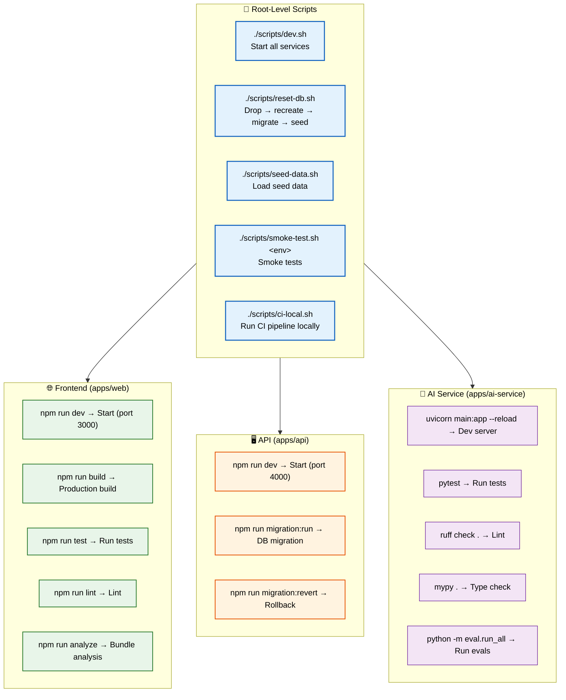

# Scripts

> **Purpose:** Define development scripts for Meridian
> **Status:** 🆕 New

## Script Architecture



> **Diagram:** Script architecture — **root-level scripts** (dev, reset-db, seed, smoke-test, CI) serve **3 services**: **Frontend** (dev/build/test/lint/analyze), **API** (dev/migrations), and **AI Service** (dev/test/lint/typecheck/eval).

---

## Available Scripts

### Root-level scripts

```bash
# Start all services for local development
./scripts/dev.sh

# Reset database (drop, recreate, migrate, seed)
./scripts/reset-db.sh

# Run seed data
./scripts/seed-data.sh

# Run smoke tests against an environment
./scripts/smoke-test.sh staging.meridian.dev

# Run full CI pipeline locally
./scripts/ci-local.sh
```

### Frontend (apps/web)

```bash
npm run dev          # Start dev server (port 3000)
npm run build        # Production build
npm run start        # Start production server
npm run lint         # Lint code
npm run test         # Run tests
npm run test:watch   # Run tests in watch mode
npm run analyze      # Bundle analysis
```

### API (apps/api)

```bash
npm run dev          # Start dev server (port 4000)
npm run build        # Production build
npm run start        # Start production server
npm run lint         # Lint code
npm run test         # Run tests
npm run migration:run     # Run migrations
npm run migration:revert  # Revert last migration
```

### AI Service (apps/ai-service)

```bash
# Start dev server
uvicorn main:app --reload --port 8000

# Run tests
pytest

# Run specific test
pytest tests/test_memory_agent.py -v

# Run evals
python -m eval.run_all

# Lint
ruff check .
mypy .
```

## Script Conventions

- All scripts exit with non-zero code on failure (CI-compatible)
- All scripts are idempotent where possible
- Scripts output structured logs to stdout
- Secrets are never embedded in scripts

## Common Mistakes

| Mistake | Consequence |
|---------|-------------|
| Running `reset-db.sh` without checking the target environment | The script drops and recreates all tables — running it against staging or production destroys all user data. Always check `NODE_ENV` or the database URL before running |
| Hardcoding paths or credentials inside scripts | A script with hardcoded `/Users/name/meridian` paths breaks for every other developer — scripts must use relative paths and environment variables |
| Skipping error handling in CI scripts | A CI script that doesn't `set -e` continues executing after a failure — the next step may run against corrupted state, masking the original error |
| Not making scripts idempotent | A seed script that creates the same data twice causes duplicate keys or constraint violations — scripts should check for existing data before inserting |

## Best Practices

| Practice | Why |
|----------|-----|
| Always use shell safety flags at the top of shell scripts | Exits on errors, catches unset variables, and surfaces pipe failures — prevents silent failures in script pipelines |
| Use relative paths derived from the script's own location | `SCRIPT_DIR="$(cd "$(dirname "${BASH_SOURCE[0]}")" && pwd)"` allows the script to work from any working directory |
| Add a confirmation prompt to destructive operations | `read -p "Reset database? This will delete all data. Type 'yes': " confirm` — a simple prompt prevents the most common script accidents |
| Use `--dry-run` flags for operations that change state | Adding a `--dry-run` flag that logs what would happen without executing it lets developers verify script behavior safely |

## Security Considerations

| Consideration | Mitigation |
|--------------|-----------|
| Secrets in script output | Scripts that run database queries or API calls may output sensitive data — ensure script output is piped through a redaction filter or only shown in debug mode |
| Script execution by untrusted users | Shell scripts run with the user's permissions — a malicious script in the repository could read `.env` files or access credentials. Review scripts as part of PR review |
| CI script credential exposure | CI scripts often have access to deployment keys and tokens — scripts should not log environment variables or pass them as command-line arguments |

## Error Handling

| Scenario | Detection | Mitigation | Recovery |
|----------|-----------|------------|----------|
| Script fails mid-execution | Non-zero exit code before completion | Use `set -euo pipefail` to fail fast on first error | Fix the error cause; rerun script (idempotent where possible) |
| Reset-db.sh run against production | All user data dropped | Environment check at script start; require `--force` flag for non-dev environments | Restore from latest backup; audit what was lost |
| Seed script creates duplicate data | Unique constraint violation | Check for existing data before inserting; use upsert patterns | Remove duplicates and re-run seed script |

## Risks

| Risk | Likelihood | Impact | Mitigation |
|------|------------|--------|------------|
| Destructive script run without confirmation | Medium | Critical | Require `--confirm` flag for all destructive operations; check `ENVIRONMENT` variable |
| Script path hardcoded and breaks for other developers | High | Medium | Use `SCRIPT_DIR` relative path pattern; CI tests scripts on fresh checkout |
| Scripts not updated when infrastructure changes | Medium | Medium | Script tests run in CI; broken scripts caught before merge |

## Limitations

| Limitation | Impact | Workaround | Future Resolution |
|------------|--------|------------|-------------------|
| Shell scripts are Unix-only | Windows developers cannot run scripts without WSL | Provide PowerShell equivalents for critical scripts | Cross-platform Node.js-based script runner (V2) |
| No progress indication for long-running scripts | Developers may interrupt scripts thinking they're stuck | Add `--verbose` flag with step-by-step logging | Progress bars with ETA for long operations (v1.5) |

## Overview

The Scripts document catalogs all development scripts in the Meridian monorepo — root-level shell scripts for service orchestration, npm scripts for frontend and API services, and Python commands for the AI service. It defines conventions for script safety (idempotency, error handling, confirmation prompts) and documents usage patterns for each script.

---

## Goals

- Document every available script and its purpose across all services
- Establish safety conventions for script development (set -euo pipefail, idempotency, confirmation prompts)
- Prevent destructive operations against wrong environments
- Enable consistent developer experience through standardized script interfaces
- Plan cross-platform compatibility for Windows developers

---

## Scope

### In Scope
- Root-level scripts (dev, reset-db, seed-data, smoke-test, CI-local)
- Frontend scripts (dev, build, test, lint, analyze)
- API scripts (dev, build, migrations)
- AI Service scripts (dev server, test, lint, typecheck, eval)
- Script conventions and safety practices

### Out of Scope
- CI/CD pipeline scripts (covered in DevOps docs)
- Deployment scripts
- Database migration scripts (covered in Database docs)
- Third-party tool configuration

---

## Future Improvements

| Improvement | Priority | Complexity | Timeline |
|-------------|----------|------------|----------|
| Cross-platform script runner (Node.js-based) | High | Medium | V2 (2027 H2) |
| Progress bars with ETA for long operations | Medium | Low | v1.5 (2027 H1) |
| Script dependency graph (run only needed scripts) | Low | Medium | V2 (2027 H2) |

## Performance Considerations

| Consideration | Approach |
|--------------|----------|
| Script startup overhead | Shell scripts invoked via npm run can add 200-500ms startup time — for frequently-run scripts, consider using a faster alternative like a direct command alias |
| Seed data script execution time | Loading large seed datasets can take minutes — provide a `--minimal` flag that loads only essential seed data for quick setup |

## Examples

### Running the full dev environment

```bash
# Start all services (infra + API + AI + frontend)
./scripts/dev.sh

# Run smoke tests against staging
./scripts/smoke-test.sh staging.meridian.dev

# Run CI locally before pushing
./scripts/ci-local.sh
```

### Database operations

```bash
# Reset database to clean state
./scripts/reset-db.sh --confirm

# Seed minimal test data
./scripts/seed-data.sh --minimal
```

### Service-specific commands

```bash
# Frontend
cd apps/web && npm run dev      # Start (port 3000)
npm run analyze                 # Bundle analysis

# API
cd apps/api && npm run dev      # Start (port 4000)
npm run migration:run           # Run migrations
npm run migration:revert        # Rollback last migration

# AI Service
cd apps/ai-service
uvicorn main:app --reload --port 8000   # Dev server
pytest tests/test_memory_agent.py -v     # Run specific test
python -m eval.run_all                   # Run all evals
```

### Script safety pattern

```bash
#!/bin/bash
set -euo pipefail
SCRIPT_DIR="$(cd "$(dirname "${BASH_SOURCE[0]}")" && pwd)"

# Require confirmation for destructive operations
if [[ "${1:-}" != "--confirm" ]]; then
  echo "Error: This will delete all data. Use --confirm to proceed."
  exit 1
fi

echo "Running destructive operation..."
```

---

## Related Documents

- [Setup.md](./Setup.md)
- [Developer Guide.md](./Developer-Guide.md)
- [CLI.md](./CLI.md)
- [Environment.md](./Environment.md)
- [Debugging.md](./Debugging.md)
- [Contributing.md](./Contributing.md)
