# Setup Guide

> **Purpose:** Complete setup guide for new Vaeloom developers — from cloning to running all services locally
> **Status:** ✅ Upgraded to enterprise quality
> **Owner:** Engineering Team
> **Last Updated:** 2026-07-12

---

## Overview

```mermaid
graph TD
    classDef step fill:#e3f2fd,stroke:#1565c0,color:#000,stroke-width:2px
    classDef verify fill:#e8f5e9,stroke:#2e7d32,color:#000,stroke-width:1.5px

    subgraph Steps["📋 Setup Steps"]
        S1["1. Clone repo<br/>git clone Vaeloom.git"]
        S2["2. Configure env<br/>cp .env.example .env<br/>Set ANTHROPIC_API_KEY"]
        S3["3. Start infra<br/>docker compose up -d<br/>postgres + redis"]
        S4["4. DB migrations<br/>cd apps/api<br/>npx prisma migrate dev"]
        S5["5. Start API<br/>cd apps/api && npm run dev<br/>Port 4000"]
        S6["6. Start AI Service<br/>cd apps/ai-service<br/>uvicorn main:app --reload<br/>Port 8000"]
        S7["7. Start Frontend<br/>cd apps/web && npm run dev<br/>Port 3000"]
    end

    subgraph Verify["✅ Verification"]
        V1["curl localhost:3000 → 200"]
        V2["curl localhost:4000/v1/health → 200"]
        V3["curl localhost:8000/health → 200"]
        V4["docker compose exec postgres pg_isready"]
        V5["docker compose exec redis redis-cli ping → PONG"]
    end

    S1 --> S2 --> S3 --> S4 --> S5 --> S6 --> S7 --> Verify

    class S1,S2,S3,S4,S5,S6,S7 step
    class V1,V2,V3,V4,V5 verify
```



> **Diagram:** Complete setup workflow — **7 sequential steps** (clone → configure → infra → migrations → API → AI → frontend) → **5 verification checks** (all services returning 200 + DB/Redis reachable).

---

This guide walks through setting up a local Vaeloom development environment. By the end, you'll have all three services running locally: the Next.js frontend, the NestJS API, and the FastAPI AI service, backed by PostgreSQL and Redis.

**Estimated setup time:** 15-30 minutes (depending on download speeds)

## Prerequisites

| Software | Version | Purpose | Check Installation |
|----------|---------|---------|-------------------|
| Node.js | 18+ (recommended: 20 LTS) | Frontend + API runtime | `node --version` |
| npm | 9+ | Package manager | `npm --version` |
| Python | 3.11+ | AI Service runtime | `python --version` |
| Docker | Latest | PostgreSQL, Redis containers | `docker --version` |
| Docker Compose | v2+ | Service orchestration | `docker compose version` |
| Git | Latest | Version control | `git --version` |

### Installing Prerequisites

**Windows (using winget):**

```powershell
winget install OpenJS.NodeJS.LTS
winget install Docker.DockerDesktop
winget install Git.Git
```

**macOS (using Homebrew):**

```bash
brew install node@20
brew install python@3.11
brew install --cask docker
```

**Linux (Ubuntu/Debian):**

```bash
curl -fsSL https://deb.nodesource.com/setup_20.x | sudo -E bash -
sudo apt-get install -y nodejs python3.11 python3.11-venv docker.io docker-compose-v2
```

## Step-by-Step Setup

### Step 1: Clone the Repository

```bash
git clone https://github.com/Vaeloom/Vaeloom.git
cd Vaeloom
```

### Step 2: Configure Environment

```bash
# Copy the example environment file
cp .env.example .env

# For local development, most defaults work out of the box.
# You only need to set the Anthropic API key for AI features:
# Edit .env and set:
ANTHROPIC_API_KEY=sk-ant-your-key-here

# To get an API key:
# 1. Go to https://console.anthropic.com/
# 2. Create an account (free tier available)
# 3. Navigate to API Keys
# 4. Create a new key
# 5. Copy it to .env
```

### Step 3: Start Infrastructure Services

```bash
# Start PostgreSQL and Redis via Docker Compose
docker compose up -d postgres redis

# Verify they're running
docker compose ps
# Output should show both services as "Up"
```

### Step 4: Run Database Migrations

```bash
cd apps/api
npm install
npx prisma migrate dev
# This creates tables: users, workspaces, documents, memory_records, etc.

# Optional: Seed test data
npx prisma db seed
```

### Step 5: Start the API Service

```bash
# In a new terminal, from apps/api/
npm run dev
# API runs on http://localhost:4000
# Verify: curl http://localhost:4000/v1/health
```

### Step 6: Start the AI Service

```bash
# In a new terminal, from apps/ai-service/
python -m venv .venv
source .venv/bin/activate  # On Windows: .venv\Scripts\activate
pip install -r requirements.txt
pip install -r requirements-dev.txt

uvicorn main:app --reload --port 8000
# AI Service runs on http://localhost:8000
# Verify: curl http://localhost:8000/health
```

### Step 7: Start the Frontend

```bash
# In a new terminal, from apps/web/
npm install
npm run dev
# Frontend runs on http://localhost:3000
```

## Verify Everything Works

```bash
# Run the verification script
./scripts/verify-setup.sh

# Or verify manually:
echo "1. Frontend: $(curl -s -o /dev/null -w '%{http_code}' http://localhost:3000)"
echo "2. API: $(curl -s -o /dev/null -w '%{http_code}' http://localhost:4000/v1/health)"
echo "3. AI: $(curl -s -o /dev/null -w '%{http_code}' http://localhost:8000/health)"
echo "4. DB: $(docker compose exec postgres pg_isready -U Vaeloom -d Vaeloom_db)"
echo "5. Redis: $(docker compose exec redis redis-cli ping)"
```

**Expected output:**

```text
1. Frontend: 200
2. API: 200
3. AI: 200
4. DB: /var/run/postgresql:5432 - accepting connections
5. Redis: PONG
```

## Directory Structure

```text
Vaeloom/
├── apps/
│   ├── web/              # Next.js frontend (port 3000)
│   ├── api/              # NestJS API (port 4000)
│   └── ai-service/       # FastAPI AI service (port 8000)
├── packages/
│   ├── shared-types/     # Shared type definitions
│   └── ui-kit/           # Shared UI components
├── infra/
│   ├── docker/           # Docker configuration
│   └── migrations/       # Database migrations
└── docs/                 # Documentation
```

## Troubleshooting

### Common Issues

| Issue | Likely Cause | Solution |
|-------|-------------|----------|
| `docker compose up` fails with port conflict | PostgreSQL or Redis already running | Stop existing instances: `sudo systemctl stop postgresql` |
| `prisma migrate dev` fails | Database not ready | Wait 10s and retry, or check `docker compose logs postgres` |
| `npm install` fails with permissions | Node.js version mismatch | `nvm use 20` or update Node.js |
| `uvicorn` can't find module | Virtual environment not activated | `source .venv/bin/activate` and `pip install -r requirements.txt` |
| AI service returns 401 | Missing API key | Check `ANTHROPIC_API_KEY` in `.env` |
| Frontend shows loading spinner | API not running | Start API: `cd apps/api && npm run dev` |

### Docker Issues

```bash
# Reset Docker state
docker compose down -v  # Removes volumes (data loss!)
docker compose up -d

# View logs
docker compose logs -f postgres
docker compose logs -f redis

# Check resource usage
docker stats
```

## Best Practices

| Practice | Why |
|----------|-----|
| Keep `.env` out of version control | Secrets in git = security incident |
| Run migrations in a separate terminal | See migration output clearly |
| Use `npm run dev` not `npm start` | Dev mode has hot reload |
| Check `docker compose logs` first | Most issues visible in logs |
| Format code before committing | `npm run format` avoids lint failures |

## Common Mistakes

| Mistake | Fix |
|---------|-----|
| Forgetting to activate Python venv | Always `source .venv/bin/activate` when working on AI service |
| Running `npm start` instead of `npm run dev` | `npm start` uses production build |
| Editing `docker-compose.yml` for local changes | Use `docker-compose.override.yml` instead |
| Skipping database migrations | Always run `npx prisma migrate dev` after pulling new code |

## Security Considerations

| Consideration | Mitigation |
|--------------|-----------|
| API key exposure in local development | Store `ANTHROPIC_API_KEY` in `.env` with permissions `600` — never paste API keys directly into terminal commands where they appear in shell history |
| Docker container access | PostgreSQL and Redis containers run without authentication in local dev — don't expose Docker ports to the public internet or use default credentials in production |
| OAuth credentials in source code | Gmail and GitHub OAuth client secrets must never be committed — use `.env.example` with placeholder values and keep real credentials in secrets manager |

## Error Handling

| Scenario | Detection | Mitigation | Recovery |
|----------|-----------|------------|----------|
| Docker port conflict on startup | `docker compose up` fails with port in use error | Document common conflicting services (PostgreSQL, Redis) in troubleshooting table | Stop conflicting service or change mapped port in docker-compose.override.yml |
| npm install fails with dependency conflict | Peer dependency version mismatch | Lock file (`package-lock.json`) should resolve most conflicts | Clear `node_modules` and reinstall; check for major version mismatches |
| Prisma migration fails on first run | Schema validation error or timeout | Run `npx prisma generate` before `migrate dev` | Drop dev database and re-run `migrate dev` (data loss acceptable in dev) |
| Python dependency install fails | pip install exits with error | Use Python 3.11+ virtual environment; check OS-specific package requirements | Activate venv, upgrade pip, retry install |

## Risks

| Risk | Likelihood | Impact | Mitigation |
|------|------------|--------|------------|
| Docker Desktop resource exhaustion slows all services | Medium | Medium | Allocate minimum 4GB RAM to Docker; use `docker stats` to monitor usage |
| API key exposed in terminal history | High | High | Use `.env` file (never inline); add shell history exclusion for `.env` sourcing commands |
| Setup instructions become outdated between releases | Medium | High | Version-specific setup guides tied to release tags; test setup on clean machine before each release |

## Limitations

| Limitation | Impact | Workaround | Future Resolution |
|------------|--------|------------|-------------------|
| Windows setup requires additional steps (WSL2, Git Bash) | Windows developers face higher setup friction | Provide detailed Windows-specific instructions in Appendix | Cross-platform dev container with VS Code Dev Containers (v1.5) |
| Initial setup takes 15-30 minutes | New developers cannot start contributing immediately | Provide pre-built dev environment (GitHub Codespaces config) | One-command setup with dev container (v1.5) |
| AI Service requires Anthropic API key | Some features unavailable without key | Core features (file organization, document viewer) work without AI key | Evaluation-only mode with mock LLM responses (v1.5) |

## Goals

- Enable a new developer to go from zero to running all services locally in under 30 minutes
- Provide clear, copy-paste commands for every setup step across Windows, macOS, and Linux
- Include working verification commands so developers can confirm each service is running
- Anticipate common setup failures and provide troubleshooting guidance
- Establish environment best practices that prevent credential leaks and configuration drift

---

## Scope

### In Scope
- Prerequisites installation (Node.js, Python, Docker, Docker Compose, Git)
- Repository cloning and environment configuration
- Infrastructure startup (PostgreSQL, Redis via Docker Compose)
- Database migration execution
- All three services startup (API, AI Service, Frontend)
- Verification commands and troubleshooting

### Out of Scope
- Production deployment setup (covered in DevOps docs)
- Development container configuration
- IDE and editor configuration
- Advanced debugging and profiling setup
- Connector and integration configuration

---

## Future Improvements

| Improvement | Priority | Complexity | Timeline |
|-------------|----------|------------|----------|
| Dev container (VS Code Dev Containers / GitHub Codespaces) | High | Medium | v1.5 (2027 H1) |
| Pre-built dev environment snapshot | High | Low | v1.5 (2027 H1) |
| Mock LLM mode for offline development | Medium | Medium | v1.5 (2027 H1) |
| Windows native support (PowerShell equivalents) | Low | Low | V2 (2027 H2) |

## Performance Considerations

| Consideration | Approach |
|--------------|----------|
| Docker resource allocation | PostgreSQL and Redis containers share system resources — allocate at least 4GB RAM to Docker for smooth development, or use lightweight alternatives (SQLite for dev) |
| First migration speed | Running `npx prisma migrate dev` for the first time creates all tables at once — this can take 30-60 seconds even on fast machines. Consider a pre-built dev database snapshot for new contributors |
| npm install time | `npm install` in `apps/api` and `apps/web` installs all dependencies — this takes 2-5 minutes depending on network. Use `--prefer-offline` if you've run it before, or use a package manager cache |

## Examples

### Quick verification after setup

```bash
# Verify all services are running
echo "Frontend: $(curl -s -o /dev/null -w '%{http_code}' http://localhost:3000)"
echo "API: $(curl -s -o /dev/null -w '%{http_code}' http://localhost:4000/v1/health)"
echo "AI: $(curl -s -o /dev/null -w '%{http_code}' http://localhost:8000/health)"
echo "DB: $(docker compose exec postgres pg_isready -U Vaeloom -d Vaeloom_db)"
echo "Redis: $(docker compose exec redis redis-cli ping)"
```

### Seeding test data

```typescript
// apps/api/prisma/seed.ts
import { PrismaClient } from '@prisma/client';
const prisma = new PrismaClient();

async function main() {
  const workspace = await prisma.workspace.create({
    data: { name: 'Test Workspace' },
  });
  await prisma.document.create({
    data: { name: 'resume.pdf', workspaceId: workspace.id },
  });
  console.log(`Seeded workspace ${workspace.id}`);
}
main();
```

### Docker troubleshooting

```bash
# Reset Docker state
docker compose down -v
docker compose up -d

# View service logs
docker compose logs -f postgres
docker compose logs -f redis

# Check resource usage
docker stats
```

### Migration management

```bash
# Create new migration
cd apps/api
npx prisma migrate dev --name add_resume_table

# Apply migrations
npx prisma migrate deploy

# Reset and re-migrate (dev only)
npx prisma migrate reset
```

---

## Related Documents

- [Environment.md](./Environment.md)
- [Developer Guide.md](./Developer-Guide.md)
- [Debugging.md](./Debugging.md)
- [CLI.md](./CLI.md)
- [Scripts.md](./Scripts.md)
- [Contributing.md](./Contributing.md)
- [`/Docs/Engineering/Implementation/01-foundation-infra.md`](../../Docs/Engineering/Implementation/01-foundation-infra.md)
