# Branch Strategy

> **Purpose:** Define the Git branch strategy for Vaeloom
> **Status:** 🆕 New

## Branch Architecture

```mermaid
graph TD
    classDef permanent fill:#e3f2fd,stroke:#1565c0,color:#000,stroke-width:2px
    classDef feature fill:#e8f5e9,stroke:#2e7d32,color:#000,stroke-width:1.5px
    classDef fix fill:#fff3e0,stroke:#e65100,color:#000,stroke-width:1.5px
    classDef release fill:#f3e5f5,stroke:#6a1b9a,color:#000,stroke-width:1px

    subgraph Permanent["♾️ Permanent Branches"]
        MAIN["main<br/>Production-ready<br/>Protected — no direct commits"]
        DEV["develop<br/>Integration branch<br/>Protected — no direct commits"]
    end

    subgraph Feature["✨ Feature Branches"]
        F1["feature/document-upload<br/>Base: develop → Merges to: develop<br/>Lifetime: < 1 week"]
        F2["feature/ats-scoring<br/>Base: develop → Merges to: develop"]
    end

    subgraph Fix["🔧 Fix Branches"]
        X1["fix/entity-merge-null<br/>Base: develop → Merges to: develop"]
        X2["hotfix/auth-expiry<br/>Base: main → Merges to: main + develop"]
    end

    subgraph Release["🚀 Release Branches"]
        R1["release/v1.2.0<br/>Base: develop → Merges to: main + develop"]
    end

    DEV --> F1 & F2 & X1
    MAIN --> X2
    DEV --> R1 --> MAIN & DEV

    class MAIN,DEV permanent
    class F1,F2 feature
    class X1,X2 fix
    class R1 release
```



> **Diagram:** Branch strategy showing **permanent** (main, develop — protected), **feature** (short-lived, from develop), **fix** (from develop or main for hotfixes), and **release** (from develop, merges to both main and develop). All branches merge via PR with code review.

---

## Branch Model

```text
main ────●─────────────●────────────●── (production)
          \           /             /
develop ───●──●──●──●──●──●──●────●── (integration)
            \    /  \    /
feature/a───●──●    \    \
                     \    \
feature/b─────────●──●    \
                           \
fix/c─────────────────●──●─●
```

## Branch Types

| Branch | Base | Merges Into | Lifetime |
|--------|------|-------------|----------|
| `main` | — | — | Permanent |
| `develop` | `main` | `main` | Permanent |
| `feature/*` | `develop` | `develop` | Short-lived (< 1 week) |
| `fix/*` | `develop` | `develop` | Short-lived |
| `release/*` | `develop` | `main` + `develop` | Release sprint |
| `hotfix/*` | `main` | `main` + `develop` | Emergency |

## Branch Naming

| Prefix | Purpose | Example |
|--------|---------|---------|
| `feature/` | New feature | `feature/document-upload` |
| `fix/` | Bug fix | `fix/entity-merge-null-error` |
| `release/` | Release prep | `release/v1.2.0` |
| `hotfix/` | Urgent production fix | `hotfix/auth-token-expiry` |
| `chore/` | Maintenance | `chore/update-dependencies` |
| `docs/` | Documentation | `docs/api-architecture` |

## Branch Rules

| Rule | Reason |
|------|--------|
| No direct commits to `main` or `develop` | All changes go through PRs |
| Feature branches from `develop` | Ensures latest integration |
| Keep branches short-lived (< 1 week) | Reduces merge conflicts |
| Delete branch after merge | Clean repository |
| Rebase before merge | Linear history |

## Common Mistakes

| Mistake | Consequence |
|---------|-------------|
| Long-lived feature branches that grow stale | A branch open for 3+ weeks diverges from develop — the merge conflict resolution risks introducing bugs from incorrectly resolved conflicts |
| Creating branches from the wrong base | A feature branch created from `main` instead of `develop` misses upstream changes — creates merge conflicts when the PR targets develop |
| Forgetting to delete branches after merging | Stale branches accumulate and create clutter — developers accidentally start work on old branches instead of creating fresh ones |
| Using the same branch for multiple unrelated changes | A branch meant for one feature that accumulates scope creep makes the PR hard to review and risky to merge |

## Best Practices

| Practice | Why |
|----------|-----|
| Keep feature branches short-lived (< 1 week) | Short-lived branches minimize divergence from develop, reduce merge conflicts, and keep the team's work visible to each other |
| Always branch from develop (except hotfixes from main) | Develop is the integration branch — branching from it ensures your feature starts with the latest changes. Hotfixes branch from main for emergency patches |
| Delete branches immediately after merging | A clean branch list makes it obvious what's in progress — configure GitHub to auto-delete branches after PR merge |
| Use branch naming conventions consistently | `feature/add-upload`, `fix/entity-merge`, `hotfix/auth-expiry` — consistent naming makes branch purpose clear at a glance and enables automation |

## Security Considerations

| Consideration | Mitigation |
|--------------|-----------|
| Protected branch enforcement | Main and develop branches must be protected — no direct commits, require PR approvals, require CI passing. A missing protection rule is a single point of failure for the deployment pipeline |
| Branch deletion after security fixes | After merging a security hotfix, the branch should be deleted immediately — stale hotfix branches could be used to reconstruct the vulnerability |

## Performance Considerations

| Consideration | Approach |
|--------------|----------|
| CI run per branch | Every branch push triggers a CI run — CI costs scale with branch count. Use CI skip flags (`[skip ci]`) for documentation-only or config-only changes |
| Branch count and git operations | Thousands of stale branches slow down `git branch -a` and related operations — archive or delete branches older than 3 months |

## Workflows

1. **Create a new feature branch:** `git checkout -b feature/add-document-upload develop`
2. **Develop and commit locally** using conventional commits
3. **Push branch** `git push origin feature/add-document-upload`
4. **Open PR** against develop with filled template
5. **Pass CI + code review** (1 reviewer for <100 lines, 2 for 500+)
6. **Squash merge to develop** — single clean commit
7. **Delete remote branch** after merge (auto-delete configured)

---

## APIs

| Endpoint | Method | Purpose | Auth |
|----------|--------|---------|------|
| `GET /repos/{owner}/{repo}/branches` | GET | List all branches | GitHub token |
| `POST /repos/{owner}/{repo}/branches/{branch}/protection` | PUT | Set branch protection rules | GitHub token |
| `DELETE /repos/{owner}/{repo}/git/refs/heads/{branch}` | DELETE | Delete branch after merge | GitHub token |
| `POST /repos/{owner}/{repo}/merges` | POST | Perform merge (squash/merge commit) | GitHub token |

---

## Scalability

| Dimension | Current Limit | 10x Strategy | 100x Strategy |
|-----------|--------------|--------------|---------------|
| Team size | 5 engineers | 50 engineers: per-team branches (`team-a/feature/x`) | 500 engineers: monorepo with CODEOWNERS + per-service branching |
| PR throughput | 10 PRs/day | 50 PRs/day: auto-merge for small PRs + stack PRs | 500 PRs/day: bot-assisted review + merge trains |
| Branch count | 20 active branches | 200 branches: auto-delete stale branches (>30d) | 2000 branches: archive to `archive/` namespace |
| CI cost per branch | $0.05/run | $0.50/run: selective CI (skip for docs-only) | $5/run: CI on merge queue only, not per-branch |

---

## Error Handling

| Scenario | Detection | Mitigation | Recovery |
|----------|-----------|------------|----------|
| Failed CI on push | CI status check fails | Block PR merge until CI passes | Fix code and push amendment |
| Merge conflict on PR | GitHub conflict indicator | Require branch rebase on develop | `git rebase develop` + resolve conflicts |
| Stale branch divergence | Rebase required warning | Enforce rebase before merge | `git rebase develop` with conflict resolution |
| Accidental push to protected branch | Branch protection rejects push | Revert force pushes via reflog | `git revert` or `git push --force-with-lease` |

---

## Monitoring

| Metric | Alert Threshold | Severity | Dashboard |
|--------|----------------|----------|-----------|
| PR merge time (open → merged) | > 24 hours | Warning | GitHub Insights |
| Branch age (since last commit) | > 14 days | Info | GitHub Branch Overview |
| CI failure rate per branch | > 20% | Critical | CI Dashboard |
| Merge conflict rate | > 10% of PRs | Warning | GitHub PR Stats |

---

## Limitations

| Limitation | Impact | Workaround | Future Resolution |
|------------|--------|------------|-------------------|
| No Git-flow support for multi-team releases | Team coordination overhead | Manual release branch coordination | Adopt trunk-based development with feature flags |
| Branch protection rules don't enforce code owners | Unreviewed code in reviewed PR | Manual CODEOWNERS file | GitHub auto-request reviewers from CODEOWNERS |
| CI runs on every push to any branch | CI cost scales with branch count | `[skip ci]` flag for non-code changes | Selective CI with path filters |
| No automatic stale branch cleanup | Branch list grows over time | Manual delete after merge | GitHub auto-delete + scheduled branch archive cron job |

---

## Overview

This document defines the Git branch strategy that every Vaeloom engineer follows when creating, managing, and merging branches. It covers the permanent branch hierarchy (main, develop), short-lived branch types (feature, fix, hotfix, release, chore, docs), naming conventions, protection rules, and the merge strategy for each branch transition. Following this strategy ensures a linear, auditable history and predictable release cadence.

The primary audience is all software engineers contributing code to the Vaeloom monorepo. Infrastructure engineers use branch protection rules defined here to configure GitHub repository settings. The strategy follows a GitHub Flow-inspired model with a permanent `develop` integration branch — a pragmatic choice for a team of 5 engineers shipping 2 releases per week.

Within the Vaeloom architecture, branch hygiene directly impacts CI cost (every branch push triggers a pipeline), merge conflict frequency (long-lived branches diverge from develop), and deployment reliability (hotfix branches must be backported to develop). Consistent branch management is a prerequisite for the release process defined in `Release-Process.md`.

## Goals

- Establish a clear, documented branch hierarchy that every engineer follows without exception
- Reduce merge conflicts by enforcing short-lived branches (< 1 week) and daily rebasing on develop
- Enable parallel feature development without blocking the release pipeline
- Ensure hotfixes to main are always backported to develop to prevent regression on the next release
- Automate branch lifecycle — protection rules, auto-delete after merge, and stale branch cleanup

## Scope

### In Scope

- Branch naming conventions for feature, fix, hotfix, release, chore, and docs branches
- Protection rules for main and develop branches (no direct commits, require PR + CI + review)
- Merge strategy per branch type (squash for features, merge commit for develop→main)
- Rebase workflow and conflict resolution guidance
- CI cost management through selective pipeline triggers and skip flags
- Branch cleanup automation (auto-delete on merge, scheduled archive)

### Out of Scope

- Trunk-based development with feature flags (planned for Q2 2027 migration)
- Per-team or per-service branch namespacing (team-a/feature/x — needed at 50+ engineers)
- Git-flow multi-team release coordination (manual coordination suffices at current team size)
- Stacked PRs / stacked-diff workflow (planned for Q4 2026)
- Monorepo CODEOWNERS enforcement for per-path branching rules

---

## Examples

```bash
# Create a feature branch from develop
git checkout -b feature/document-upload develop

# Create a fix branch from develop
git checkout -b fix/entity-merge-null develop

# Create a hotfix branch from main (emergency only)
git checkout -b hotfix/auth-expiry main

# Create a release branch from develop
git checkout -b release/v1.2.0 develop

# Daily rebase to keep the feature branch current
git fetch origin && git rebase origin/develop

# Push branch and open PR against develop
git push origin feature/document-upload

# Delete branch after merge (remote)
git push origin --delete feature/document-upload
```

---

## Future Improvements

| Improvement | Priority | Complexity | Timeline |
|-------------|----------|------------|----------|
| Stacked PRs (stacked-diff workflow) | High | Medium | Q4 2026 |
| Auto-merge for approved small PRs | High | Low | Q3 2026 |
| Branch archive automation (>90d) | Medium | Low | Q4 2026 |
| Per-service CODEOWNERS enforcement | Medium | Medium | Q1 2027 |
| Trunk-based development migration with feature flags | Low | High | Q2 2027 |

## Related Documents

- [Git Workflow.md](./Git-Workflow.md)
- [Commit Convention.md](./Commit-Convention.md)
- [PR Guidelines.md](./PR-Guidelines.md)
