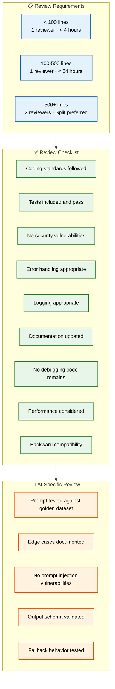

# Code Review

> **Purpose:** Define code review standards for Meridian engineering
> **Status:** 🆕 New

## Review Architecture



> **Diagram:** Code review standards — **3 PR size tiers** (small/medium/large with reviewer count and SLA) → **9-item checklist** (standards, tests, security, error handling, logging, docs, debugging, performance, compatibility) → **5 AI-specific checks** (golden dataset, edge cases, prompt injection, output schema, fallback behavior).

---

## Review Requirements

| PR Size | Mandatory Reviewers | Review Timeframe |
|---------|--------------------|------------------|
| < 100 lines | 1 | < 4 hours |
| 100-500 lines | 1 | < 24 hours |
| 500+ lines | 2 (split into smaller PRs preferred) | < 48 hours |

## Review Checklist

- [ ] Code follows coding standards
- [ ] Tests are included and pass
- [ ] No security vulnerabilities introduced
- [ ] Error handling is appropriate
- [ ] Logging is appropriate
- [ ] Documentation is updated (if needed)
- [ ] No debugging code remains
- [ ] Performance implications considered
- [ ] Backward compatibility maintained

## Review Etiquette

| Role | Guidelines |
|------|------------|
| Author | Keep PRs small (< 500 lines). Provide context in description. Respond to comments within 24 hours |
| Reviewer | Be specific ("Line 42: off-by-one error" not "this is wrong"). Suggest, don't demand. Approve when requirements met |

## AI-Specific Review Guidelines

For agent and prompt changes:

- [ ] Prompt tested against golden dataset
- [ ] Edge cases documented
- [ ] No prompt injection vulnerabilities
- [ ] Output schema validated
- [ ] Fallback behavior tested

## Common Mistakes

| Mistake | Consequence |
|---------|-------------|
| Reviewing for style instead of correctness | Style preferences (formatting, naming) are better handled by linters and formatters — reviewers should focus on logic errors, security issues, and design problems |
| Leaving vague comments without specific line references | Comments like "this doesn't look right" without a line number or suggestion force the author to guess what's wrong — be specific or use the suggestion feature |
| Approving without testing the changes | A reviewer who approves without running the code or checking edge cases misses runtime errors that static analysis can't catch |
| Over-scoping review comments — demanding changes that aren't required | Requesting "nit" changes (preferred but not necessary) slows down delivery — distinguish between required and optional feedback clearly |

## Best Practices

| Practice | Why |
|----------|-----|
| Review the diff, not the person | Focus feedback on the code, not the author. "This condition would miss the null case" not "You forgot to handle null" |
| Run the code locally for non-trivial changes | Static review misses runtime behavior — for logic changes, data migrations, or API changes, run the code to verify behavior |
| Use PR size as a signal, not a rule | A 600-line config change is less risky than a 200-line business logic change — size guidelines prioritize time-to-review, not risk |
| Distinguish blocking vs. non-blocking comments | Prefix with `blocking:` for must-fix and `nit:` or `suggestion:` for optional — the author knows what to action |

## Security Considerations

| Consideration | Mitigation |
|--------------|-----------|
| Reviewing authentication/authorization changes | Every auth or permission change must be reviewed for privilege escalation — a missing check in middleware can expose all user data |
| Third-party dependency review | New dependencies must be checked for known vulnerabilities, license compatibility, and maintenance status before approval |
| Data exposure in API responses | Review new endpoints for over-fetching or exposing sensitive fields — check that response DTOs don't include internal fields |

## Performance Considerations

| Consideration | Approach |
|--------------|----------|
| N+1 query detection during review | When reviewing changes that add related data access, look for loops making database queries — flag them for batch loading or JOIN optimization |
| Reviewing resource cleanup | Every new API endpoint or background job should have a cleanup path — unclosed connections, file handles, or event listeners leak memory |

## Workflows

1. **Author opens PR** with filled template — description, testing notes, related issues
2. **Size classification** — <100 lines (1 reviewer, 4h), 100-500 (1 reviewer, 24h), 500+ (2 reviewers, split recommended)
3. **CI validation** — lint, typecheck, test, build must all pass
4. **Reviewer assigned** — auto-assigned based on CODEOWNERS or manual request
5. **Reviewer performs checklist** — coding standards, tests, security, error handling, logging, docs, debugging, performance, compatibility
6. **AI-specific checks** — golden dataset, edge cases, prompt injection, output schema, fallback
7. **Author addresses feedback** — respond to every comment (fix or explanation)
8. **Approval + merge** — squash merge to develop (feature) or merge commit (main)

---

## APIs

| Endpoint | Method | Purpose | Auth |
|----------|--------|---------|------|
| `POST /repos/{owner}/{repo}/pulls/{pull}/reviews` | POST | Submit review (approve/comment/request changes) | GitHub token |
| `GET /repos/{owner}/{repo}/pulls/{pull}/reviews` | GET | List all reviews on a PR | GitHub token |
| `PUT /repos/{owner}/{repo}/pulls/{pull}/merge` | PUT | Merge approved PR | GitHub token |
| `GET /repos/{owner}/{repo}/pulls/{pull}/checks` | GET | Get CI status for PR | GitHub token |

---

## Scalability

| Dimension | Current Limit | 10x Strategy | 100x Strategy |
|-----------|--------------|--------------|---------------|
| Team size | 5 engineers | 50 engineers: per-team code owners + auto-review routing | 500 engineers: distributed review boards per service |
| PR throughput | 10 PRs/day | 100 PRs/day: auto-merge trivial PRs + reviewer pools | 1000 PRs/day: AI-assisted review triage |
| Reviewer capacity | 1-2 reviews/person/day | 3-5 reviews: focused review blocks | 5-8 reviews: pair review + async commenting |
| Review SLA compliance | Manual tracking | Dashboard with SLA breach alerts | Automated SLA enforcement in CI gate |

---

## Error Handling

| Scenario | Detection | Mitigation | Recovery |
|----------|-----------|------------|----------|
| Reviewer doesn't respond within SLA | Slack reminder bot | Re-assign to secondary reviewer | Escalate to tech lead |
| CI fails after approval | Status check re-runs | Block merge, notify author | Fix code and re-push |
| Conflicting review feedback | Disagreeing reviewer comments | Third reviewer arbitration | Tech lead decision |
| Security issue found post-approval | Late reviewer finding | Block merge, require fix | Security review override protocol |

---

## Monitoring

| Metric | Alert Threshold | Severity | Dashboard |
|--------|----------------|----------|-----------|
| PR review time (p95) | > 24 hours | Warning | GitHub Insights |
| Review feedback cycle count | > 3 cycles | Info | PR Stats Dashboard |
| Reviewer workload (open PRs assigned) | > 5 per reviewer | Warning | Engineering Capacity |
| PR size > 500 lines | Any occurrence | Info | PR Quality Dashboard |

---

## Limitations

| Limitation | Impact | Workaround | Future Resolution |
|------------|--------|------------|-------------------|
| No automated reviewer assignment by expertise | Manual assignment overhead | Request specific reviewer in PR description | CODEOWNERS with skill-based routing |
| AI-specific review checks require manual verification | Slows AI feature PRs | Use golden dataset test in CI as pre-filter | Automated AI prompt validation in CI pipeline |
| Review SLA depends on reviewer availability | PRs stall during PTO | Document backup reviewers per area | Rotating review duty schedule |
| No granular review permissions per code area | Any reviewer can approve any area | Maintain area expertise directory | Per-path review permissions in GitHub |

---

## Overview

The Code Review process is the primary quality gate in the Meridian engineering workflow. Every pull request passes through a structured review with size-based reviewer requirements, a mandatory 9-item checklist, and AI-specific validation for agent and prompt changes. This document defines the review architecture, etiquette, SLA expectations, and escalation paths that all engineers follow.

All Meridian engineers participate as both authors and reviewers. The process scales from a 5-person team to 50+ by routing reviews per CODEOWNERS, splitting large PRs, and automating trivial review approvals. The review SLA (4 hours for small PRs, 24 for medium, 48 for large) ensures feedback velocity matches the bi-weekly release cadence defined in `Release-Process.md`.

Each review enforces the coding standards and naming conventions defined in `Coding-Standards.md` and `Naming-Convention.md`, with AI-specific checks that validate prompts against golden datasets and guard against injection vulnerabilities. The process is designed to catch logic errors and security issues — style is delegated to linters.

## Goals

- Enforce a consistent, size-based review process with defined SLAs for every pull request
- Ensure every change passes the full 9-item checklist before merge
- Provide AI-specific validation for agent prompts, output schemas, and fallback behavior
- Maintain review velocity at or above 10 PRs/day through size discipline and reviewer routing
- Create a culture of specific, constructive feedback that distinguishes blocking from non-blocking comments

## Scope

### In Scope
- PR size classification tiers (< 100, 100-500, 500+ lines) with corresponding reviewer count and SLA
- The 9-item review checklist (standards, tests, security, error handling, logging, docs, debugging, performance, compatibility)
- AI-specific review guidelines for agent and prompt changes
- Reviewer etiquette for both authors and reviewers
- Security review focus areas (auth changes, dependency review, data exposure)
- Performance review focus areas (N+1 queries, resource cleanup)

### Out of Scope
- AI-assisted automated PR review (planned Q1 2027)
- Automated reviewer assignment by expertise and load (planned Q4 2026)
- Review SLA breach auto-escalation (planned Q3 2026)
- Stacked PRs with dependency-aware review (planned Q2 2027)
- Formal code review performance dashboard (planned Q4 2026)

---

## Examples

```typescript
// Example: PR description following the Meridian template

/*
## Description
Adds content-based deduplication to the ingestion pipeline. Before creating a new
documents row, checks for existing documents with matching content hash + filename
similarity. If a match is found, creates a document_versions row instead of a
duplicate document.

## Related Issues
Closes #184

## Testing
- [x] Unit tests added for dedup logic
- [x] Integration test: duplicate upload creates version, not new doc
- [x] Manual testing: uploaded same resume twice, verified single doc + version
*/

// Example: Review comment with blocking/non-blocking distinction
// blocking: getDocumentById returns Document | null but the caller assumes Document
// nit: consider renaming contentHash to documentHash for clarity
```

```python
# Example: AI-specific review — golden dataset validation
# Reviewer checks that the Organization Agent prompt passes its golden dataset
def test_organization_agent_golden_dataset():
    runner = EvalRunner()
    result = runner.run("organization_agent")
    assert result.score >= result.baseline - 0.05  # within 5% of baseline
```

---

## Future Improvements

| Improvement | Priority | Complexity | Timeline |
|-------------|----------|------------|----------|
| AI-assisted PR review (auto-suggest fixes) | High | High | Q1 2027 |
| Automated reviewer assignment by expertise and load | High | Medium | Q4 2026 |
| Review SLA breach auto-escalation | Medium | Low | Q3 2026 |
| Code review performance dashboard for team leads | Medium | Medium | Q4 2026 |
| Stacked PRs with dependency-aware review | Low | High | Q2 2027 |

## Related Documents

- [PR Guidelines.md](./PR-Guidelines.md)
- [Coding Standards.md](./Coding-Standards.md)
- [Testing Strategy](../Testing/Testing-Strategy.md)
