# Coding Standards

> **Purpose:** Define comprehensive coding standards for the Vaeloom engineering team, covering TypeScript, Python, and shared conventions
> **Status:** ✅ Upgraded to enterprise quality
> **Owner:** Engineering Team
> **Last Updated:** 2026-07-12

---

## Overview

Consistent coding standards reduce cognitive overhead, improve code review velocity, and make it easier for team members to work across different parts of the codebase. These standards apply to all code written for Vaeloom.

This document covers language-specific standards, shared conventions, linting rules, and common anti-patterns to avoid.

## Coding Standards Overview

```mermaid
graph TD
    classDef ts fill:#e3f2fd,stroke:#1565c0,color:#000,stroke-width:2px
    classDef py fill:#e8f5e9,stroke:#2e7d32,color:#000,stroke-width:1.5px
    classDef shared fill:#fff3e0,stroke:#e65100,color:#000,stroke-width:1.5px

    subgraph TypeScript["🟦 TypeScript Standards"]
        direction TB
        T1["Version: 5.0+<br/>Strict: true"]
        T2["✅ Named exports, ??, async/await<br/>Branded types for IDs"]
        T3["❌ Default exports, any,<br/>callbacks, mutable state"]
    end

    subgraph Python["🐍 Python Standards"]
        direction TB
        P1["Version: 3.11+<br/>mypy --strict"]
        P2["✅ Type hints, dataclasses,<br/>custom exceptions, async"]
        P3["❌ Bare except, mutable defaults,<br/>missing hints, print() logging"]
    end

    subgraph Shared["📋 Shared Conventions"]
        S1["Line length: 100 chars"]
        S2["Indentation: 2 TS / 4 Python"]
        S3["File naming: kebab / snake"]
        S4["Class: PascalCase (both)"]
        S5["Functions: camel TS / snake Python"]
    end

    subgraph Linting["🔧 Linting Rules"]
        L1["ESLint (TS)<br/>no-console, no-unused-vars,<br/>import ordering"]
        L2["Ruff (Python)<br/>E/F/I/N/W + ANN/ARG/COM"]
    end

    TypeScript & Python --> Shared --> Linting

    class T1,T2,T3 ts
    class P1,P2,P3 py
    class S1,S2,S3,S4,S5 shared
    class L1,L2 lint
```



> **Diagram:** Coding standards organized by language — **TypeScript** (strict mode, good/bad patterns), **Python** (mypy strict, good/bad patterns), **Shared conventions** (line length, indentation, naming). **Linting** enforced via ESLint for TypeScript and Ruff for Python.

---

## Language Standards

| Language | Minimum Version | Compiler/Interpreter | Strictness |
|----------|----------------|---------------------|------------|
| TypeScript | 5.0+ | tsc (strict mode) | `strict: true` |
| Python | 3.11+ | CPython | mypy --strict |

## TypeScript Standards

### Configuration

```jsonc
// tsconfig.json
{
  "compilerOptions": {
    "strict": true,
    "noUncheckedIndexedAccess": true,
    "noImplicitReturns": true,
    "noFallthroughCasesInSwitch": true,
    "exactOptionalPropertyTypes": true,
    "forceConsistentCasingInFileNames": true
  }
}
```

### ✅ Good Patterns

```typescript
// ✅ Named exports (not default)
export function getDocument(id: string): Document { /* ... */ }

// ✅ Null handling with ??
const name = user.displayName ?? user.email;

// ✅ Discriminated unions for state
type DocumentState = 
  | { status: 'pending'; uploadedAt: Date }
  | { status: 'processing'; progress: number }
  | { status: 'completed'; document: Document }
  | { status: 'error'; message: string };

// ✅ Async/await over .then()
async function processDocument(id: string): Promise<Document> {
  const doc = await documentRepo.findById(id);
  return doc;
}

// ✅ Branded types for IDs
type DocumentId = string & { readonly __brand: 'DocumentId' };
function createDocumentId(id: string): DocumentId {
  return id as DocumentId;
}
```

### ❌ Anti-patterns

```typescript
// ❌ Default exports (hard to refactor)
export default DocumentService;

// ❌ Null handling with || (catches falsy values)
const name = user.displayName || user.email; // '' or 0 would be caught

// ❌ any type
async function process(data: any): Promise<any> { /* ... */ }

// ❌ Callback style
function getDocument(id: string, callback: (doc: Document) => void) { /* ... */ }

// ❌ Mutable shared state
let cache: Map<string, Document> = new Map();
```

## Python Standards

### Configuration

```toml
# pyproject.toml
[tool.ruff]
line-length = 100
target-version = "py311"

[tool.ruff.lint]
select = ["E", "F", "I", "N", "W", "ANN", "ARG", "BLE", "COM", "DJ", "DTZ"]

[tool.mypy]
strict = true
disallow_any_unimported = true
no_implicit_optional = true
warn_return_any = true
warn_unused_configs = true
```

### ✅ Good Patterns

```python
# ✅ Type hints everywhere
from dataclasses import dataclass
from typing import Optional

@dataclass
class Document:
    id: str
    name: str
    doc_type: str
    content: Optional[str] = None

# ✅ Google-style docstrings
def extract_entities(
    document: Document,
    model: str = "default"
) -> list[dict]:
    """Extract entities from a document using the specified model.
    
    Args:
        document: The document to analyze.
        model: Name of the extraction model to use.
        
    Returns:
        List of extracted entities with type and confidence.
        
    Raises:
        ExtractionError: If extraction fails.
    """
    # Implementation
    pass

# ✅ Custom exceptions
class ExtractionError(Exception):
    """Raised when entity extraction fails."""
    pass

# ✅ Async for I/O operations
async def process_document(document_id: str) -> Document:
    async with get_db_session() as session:
        return await session.get(Document, document_id)
```

### ❌ Anti-patterns

```python
# ❌ Bare except
try:
    process_document(doc_id)
except:
    pass

# ❌ Mutable default arguments
def process(docs: list = []):  # Shared across calls
    pass

# ❌ Missing type hints
def process_document(doc):
    # What type is doc? What does it return?
    pass

# ❌ print() for logging
print(f"Processing document {doc_id}")
```

## Shared Conventions

| Convention | Standard | Enforcement |
|------------|----------|-------------|
| Line length | 100 characters (TS + Python) | ESLint `max-len`, Ruff `line-length` |
| Indentation | 2 spaces (TS), 4 spaces (Python) | Prettier, Ruff |
| File naming | kebab-case.ts, snake_case.py | Manual review |
| Class naming | PascalCase (TS), PascalCase (Python) | ESLint, Ruff |
| Function naming | camelCase (TS), snake_case (Python) | ESLint, Ruff |
| Variable naming | camelCase (TS), snake_case (Python) | ESLint, Ruff |

## Linting Rules

### TypeScript (ESLint)

```javascript
// eslint.config.js
export default [
  {
    rules: {
      // Error prevention
      'no-console': 'warn',
      'no-unused-vars': ['error', { argsIgnorePattern: '^_' }],
      'prefer-const': 'error',
      'no-var': 'error',
      
      // TypeScript specific
      '@typescript-eslint/no-explicit-any': 'error',
      '@typescript-eslint/no-unnecessary-type-assertion': 'error',
      '@typescript-eslint/prefer-optional-chain': 'error',
      '@typescript-eslint/prefer-nullish-coalescing': 'error',
      
      // Import rules
      'import/order': ['error', {
        groups: ['builtin', 'external', 'internal', 'parent', 'sibling'],
        alphabetize: { order: 'asc' },
      }],
    },
  },
];
```

### Python (Ruff)

```toml
# pyproject.toml
[tool.ruff.lint.per-file-ignores]
"tests/*" = ["ANN"]  # Allow missing annotations in tests
"migrations/*" = ["ALL"]  # Skip all rules for migration files
```

## Best Practices

| Practice | Rationale | Examples |
|----------|-----------|----------|
| Small functions (< 20 lines) | Testable, readable, composable | Extract helper functions |
| Descriptive names over comments | Self-documenting code | `getDocumentById()` not `getDoc()` |
| Fail fast, fail loud | Detect issues early | Validate inputs early, throw specific errors |
| Immutable by default | Predictable, thread-safe | Use `readonly`, `frozen=True`, avoid mutation |
| Prefer composition over inheritance | Flexible, testable | `implements Interface` not `extends BaseClass` |

## Common Mistakes

| Mistake | Consequence | Fix |
|---------|-------------|-----|
| Hiding errors with try/catch + silence | Silent failures, hard to debug | Always log or re-throw |
| Over-engineering early | Wasted time on unused abstractions | YAGNI — build for today, refactor for tomorrow |
| Mixing concerns in one module | Hard to test, hard to reason about | Single Responsibility Principle |
| Skipping type hints (Python) | Runtime type errors | Add type hints, run mypy in CI |
| Magic numbers/strings | Unclear intent, hard to change | Use named constants and enums |

## Security Considerations

| Consideration | Mitigation |
|--------------|-----------|
| Input validation in TypeScript | All user-facing API inputs must use class-validator with explicit schemas — never trust raw `any` types or `JSON.parse` without validation |
| SQL injection in Python | Never use string interpolation for SQL queries — always use parameterized queries via SQLAlchemy or raw `execute()` with `$1`, `$2` placeholders |
| Logging sensitive data | Console.log, print(), and logger.warn calls must never include tokens, passwords, or PII — use structured logging with a redaction filter |
| Dependency supply chain | All third-party dependencies must pass `npm audit` / `pip audit` before merge — a vulnerable dependency can compromise the entire application |

## Performance Considerations

| Consideration | Approach |
|--------------|----------|
| TypeScript strict mode performance | `strict: true` has zero runtime cost — it only affects compile time. The TypeScript compiler should be configured with `--noEmit` for CI to avoid unnecessary output files |
| Python type hints at runtime | Type hints are stripped at runtime by default — use `@dataclass` and `TypedDict` for performance-critical structures that need validation |
| Async patterns for I/O-bound operations | Use `async/await` for all I/O operations (database, API calls, file system) — synchronous I/O blocks the event loop and degrades throughput |
| Avoid runtime type-checking libraries | Libraries like `zod` or `pydantic` add validation overhead — use them only at API boundaries (input validation) not in internal service logic |

## Workflows

1. **Write code following standards:** TypeScript (strict mode, no `any`, async/await) or Python (mypy strict, type hints, dataclasses)
2. **Run linter:** `npx eslint . --fix` (TS) or `ruff check . --fix` (Python)
3. **Run type checker:** `npx tsc --noEmit` (TS) or `mypy .` (Python)
4. **Write tests:** Unit tests for all functions, integration tests for services
5. **Run test suite:** `npm test` or `pytest` — all tests must pass
6. **Commit:** Conventional commit with type and scope matching the language
7. **Open PR:** Code review checks all 9 checklist items including coding standards compliance
8. **Merge:** After review approval and CI passes

---

## APIs

| Endpoint | Method | Purpose | Auth |
|----------|--------|---------|------|
| `POST /api/documents/{id}/process` | POST | Process document through pipeline | JWT |
| `GET /api/workspaces/{id}/memories` | GET | Query memories from knowledge graph | JWT |
| `POST /api/ai/agents/memory/extract` | POST | Extract entities from document | Agent token |
| `POST /api/admin/lint/check` | POST | Run lint check on codebase | Admin token |

---

## Scalability

| Dimension | Current Limit | 10x Strategy | 100x Strategy |
|-----------|--------------|--------------|---------------|
| Codebase size | 50K LOC | 500K LOC: per-service strict mode enforcement | 5M LOC: automated code quality gates per service |
| Language count | 2 (TS + Python) | 3 (add Go for perf-critical services) | 5 (add Rust + Kotlin) with per-language standards doc |
| Lint rules | 25 ESLint + 15 Ruff | 50 ESLint + 30 Ruff: stricter rules | 100+ rules: AI-assisted auto-fix pipeline |
| Developer onboarding | Standards doc | Standards quiz + code review ramp-up | Automated PR review with style enforcement |

---

## Error Handling

| Scenario | Detection | Mitigation | Recovery |
|----------|-----------|------------|----------|
| `any` type used in TypeScript | ESLint `no-explicit-any` rule | Block PR merge | Refactor to proper type |
| Missing type hint in Python | Mypy strict mode violation | Block CI pipeline | Add type annotation |
| Bare `except` in Python | Ruff rule violation | Auto-fix with specific exception | Replace with specific exception type |
| Console.log left in production code | ESLint `no-console` rule | Warn, require removal before merge | Replace with structured logger |

---

## Monitoring

| Metric | Alert Threshold | Severity | Dashboard |
|--------|----------------|----------|-----------|
| Lint violation rate per PR | > 10 violations | Warning | Code Quality Dashboard |
| Mypy strict mode compliance | < 95% of Python files | Warning | Python Quality |
| TypeScript strict mode compliance | < 95% of TS files | Warning | TypeScript Quality |
| New `any` type introductions per sprint | > 3 per sprint | Info | TypeScript Health |

---

## Limitations

| Limitation | Impact | Workaround | Future Resolution |
|------------|--------|------------|-------------------|
| TypeScript strict mode slows initial development | More code needed for proper types | Use `// @ts-expect-error` with documented reason | AI-assisted type generation |
| Mypy strict mode catches valid idioms as errors | Requires type gymnastics for complex patterns | `# type: ignore[arg-type]` with comment | Stricter mypy plugin for business patterns |
| ESLint config maintained manually | Rules may become stale | Periodic config review | Auto-update from shared config package |
| Python and TypeScript have different conventions | Cognitive switching cost | IDE snippets per language | Cross-language convention mapping |

---

## Goals

- Establish strict TypeScript and Python language standards that eliminate entire classes of bugs at compile time
- Ensure every function, class, and module is type-safe with no implicit `any` or missing type hints
- Enforce consistent formatting, naming, and linting across the entire monorepo via automated tooling
- Reduce code review friction by delegating style enforcement to linters and formatters
- Provide clear good/bad pattern examples so new engineers write compliant code from day one

## Scope

### In Scope

- TypeScript standards (strict mode, named exports, branded types, discriminated unions, async/await)
- Python standards (mypy strict, type hints, dataclasses, custom exceptions, async I/O)
- Shared conventions across both languages (line length, indentation, file naming, class/function naming)
- ESLint configuration for TypeScript with import ordering and no-explicit-any enforcement
- Ruff configuration for Python with full rule set (E, F, I, N, W, ANN, ARG, BLE, COM, DJ, DTZ)
- Good/bad pattern examples for both languages with specific anti-patterns to avoid

### Out of Scope

- Pre-commit hooks for lint + type checking (planned Q3 2026)
- AI-assisted automated code review for style compliance (planned Q1 2027)
- Shared ESLint/Ruff config published as npm/PyPI packages (planned Q4 2026)
- Language-agnostic convention linter for cross-language consistency (planned Q2 2027)
- Go, Rust, or Kotlin language standards (added at enterprise scale for perf-critical services)

---

## Examples

```typescript
// TypeScript: Document processing with branded IDs and discriminated unions
type DocumentId = string & { readonly __brand: 'DocumentId' };
type WorkspaceId = string & { readonly __brand: 'WorkspaceId' };

type DocumentState =
  | { status: 'pending'; uploadedAt: Date }
  | { status: 'processing'; progress: number }
  | { status: 'completed'; document: Document }
  | { status: 'error'; message: string };

export async function getDocument(
  workspaceId: WorkspaceId,
  documentId: DocumentId
): Promise<Document> {
  const doc = await documentRepo.findById(workspaceId, documentId);
  return doc;
}
```

```python
# Python: Memory agent entity extraction with dataclasses and strict types
from dataclasses import dataclass
from typing import Optional

@dataclass(frozen=True)
class ExtractedEntity:
    name: str
    entity_type: str  # Skill, Project, Organization, Person, etc.
    confidence: float
    aliases: list[str]
    source_document_id: str

class ExtractionError(Exception):
    """Raised when entity extraction from a document fails."""
    pass

async def extract_entities(
    document: Document,
    model: str = "claude-sonnet-4"
) -> list[ExtractedEntity]:
    if not document.content:
        raise ExtractionError(f"Document {document.id} has no content")
    # Extraction implementation using structured output
    ...
```

```jsonc
// ESLint configuration enforcing Vaeloom TypeScript standards
{
  "rules": {
    "no-console": "warn",
    "@typescript-eslint/no-explicit-any": "error",
    "@typescript-eslint/prefer-nullish-coalescing": "error",
    "@typescript-eslint/prefer-optional-chain": "error",
    "import/order": ["error", {
      "groups": ["builtin", "external", "internal", "parent", "sibling"],
      "alphabetize": { "order": "asc" }
    }]
  }
}
```

---

## Future Improvements

| Improvement | Priority | Complexity | Timeline |
|-------------|----------|------------|----------|
| Pre-commit hooks for lint + type checking | High | Low | Q3 2026 |
| AI-assisted code review for style compliance | High | High | Q1 2027 |
| Shared ESLint/Ruff config published as npm/PyPI package | Medium | Low | Q4 2026 |
| Auto-fix pipeline for common violations | Medium | Medium | Q4 2026 |
| Language-agnostic convention linter | Low | High | Q2 2027 |

## Related Documents

- [Folder Structure.md](./Folder-Structure.md)
- [Naming Convention.md](./Naming-Convention.md)
- [Code Review.md](./Code-Review.md)
- [`/Docs/Engineering/Implementation/00-master-build-order.md`](../../Docs/Engineering/Implementation/00-master-build-order.md)
